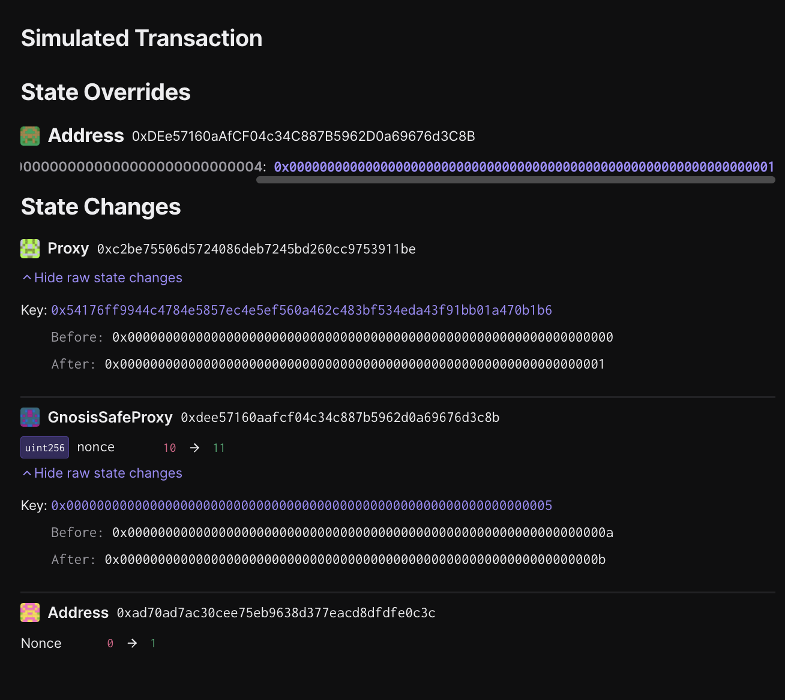

# Superchain Presigned Pause

Status: DRAFT, not ready to sign

## Objective

This task is intended to generate pre-signed transactions to pause
ETH, ERC20, ERC721 withdrawals across the Superchain. Deposits and L2
state progression will not be impacted by the pause, only withdrawals.

The call that will be executed by the Safe contract is defined in a
json file. This will be the standard approach for all transactions.

Note that no onchain actions will be taking place during this
signing. You won’t be submitting a transaction and your address
doesn’t even need to be funded. These are offchain signatures.

A Facilitator will collect the signatures and execute the contract.

## Approving the transaction

### 1. Update repo and move to the appropriate folder for this rehearsal task

In addition to the general tools installed when you clone/update the
repo and run `just install` at the root of the repo, this ceremony
also requires a `presigner` tool, which can be installed by running
the following command at the ceremony folder:

```
cd superchain-ops
git pull
just install
cd tasks/<NETWORK_DIR>/<RUNBOOK_DIR>
just \
   --dotenv-path .env \
   --justfile ../../../presigned-pause.just \
   install
```

### 2. Setup Ledger

Your Ledger needs to be connected and unlocked. The Ethereum
application needs to be opened on Ledger with the message “Application
is ready”.

Check your address is correct by running the following command

```
just \
   --dotenv-path .env \
   --justfile ../../../presigned-pause.just \
   whoami 0
```

Where `0` is the index of the address you want to use in the derivation path.

You should see the output similar to the following:

```
Signer: 0x8C835568fE7Eea01B6DCD79214aB5BCe5E1759B0
```

If this is not the address you are expecting,
you can change the index of the address you want to use, i.e.

```
just \
   --dotenv-path .env \
   --justfile ../../../presigned-pause.just \
   whoami 1
```

### 3. Sign the transactions

The transactions to be signed are inside the `tx` folder named `draft-{nonce}.json`

You can sign them by running the following commands:

```
just \
   --dotenv-path .env \
   --justfile ../../../presigned-pause.just \
   sign
```

The first parameter is the index of the address you want to use in the
derivation path.

For each transaction we will be performing 3 validations
and ensure the domain hash and  message hash are the same
between the Tenderly simulation and your
Ledger:

1. Validate integrity of the simulation.
2. Validate correctness of the state diff.
3. Validate and extract domain hash and message hash to approve.

#### 3.1. Validate integrity of the simulation.

Make sure you are on the "Overview" tab of the tenderly simulation, to
validate integrity of the simulation, we need to

1. "Network": Check the network is the correct one.
2. "Timestamp": Check the simulation is performed on a block with a
   recent timestamp (i.e. close to when you run the script).
3. "Sender": Check the address shown is your signer account. If not,
   you will need to determine which “number” it is in the list of
   addresses on your ledger.

Here is an example screenshot, note that the Timestamp and Sender
might be different in your simulation:


#### 3.2. Validate correctness of the state diff.

Now click on the "State" tab. Verify that:

1. Under address `SuperchainConfig` contract
   address([mainnet](https://github.com/ethereum-optimism/superchain-registry/blob/77a930120ec63dd50c43483c82b1a0a29939ed27/superchain/configs/mainnet/superchain.yaml#L8),
   [sepolia](https://github.com/ethereum-optimism/superchain-registry/blob/77a930120ec63dd50c43483c82b1a0a29939ed27/superchain/configs/sepolia/superchain.yaml#L8)),
   the storage key
   `0x54176ff9944c47845857c4e5ef560a462c483bf534eda43f91bb01a470b1b6`'s
   value is changed from `0x00` to `0x01`. This is indicating that the
   `paused` variable is successfully changed from `false` to `true`.
2. There are no other significant state changes except for 2 nonce
   changes from the Safe and the signer address.
3. You will see a state override (not a state change). This is
   expected and its purpose is to generate a successful Safe execution
   simulation without collecting any signatures.

Here is an example screenshot. Note that the addresses may be
different:



#### 3.3. Extract the domain hash and the message hash to approve.

Now that we have verified the transaction performs the right
operation, we need to extract the domain hash and the message hash to
approve.

Go back to the "Overview" tab, and find the first
`GnosisSafe.domainSeparator` call. This call's return value will be
the domain hash that will show up in your Ledger.

Here is an example screenshot. Note that the hash value may be
different:


Right before the `GnosisSafe.domainSeparator` call, you will see a
call to `GnosisSafe.encodeTransactionData`. Its return value will be a
concatenation of `0x1901`, the domain hash, and the message hash:
`0x1901[domain hash][message hash]`.

Here is an example screenshot. Note that the hash value may be
different:


Note down both the domain hash and the message hash. You will need to
compare them with the ones displayed on the Ledger screen at signing.

### 4. Approve the signature on your ledger

Once the validations are done, approve the transaction in your Ledger.

> [!IMPORTANT] This is the most security critical part of the
> playbook: make sure the domain hash and message hash in the
> following two places match:

1. on your Ledger screen.
2. in the Tenderly simulation. You should use the same Tenderly
   simulation as the one you used to verify the state diffs, instead
   of opening the new one printed in the console.

There is no need to verify anything printed in the console. There is
no need to open the new Tenderly simulation link either.

After verification, sign the transaction. You will see the `Data`,
`Signer` and `Signature` printed in the console. Format should be
something like this:

```
Data:  <DATA>
Signer: <ADDRESS>
Signature: <SIGNATURE>
```

Double check the signer address is the right one.

### 5. Send the output to Facilitator(s)

Nothing has occurred onchain - these are offchain signatures which
will be collected by Facilitators for execution. Execution can occur
by anyone once a threshold of signatures are collected, so a
Facilitator will do the final execution for convenience.

The signed transactions are in the `tx` folder.  They will be named
according to the address used to sign, i.e.
`tx/draft-92.signer-0x8c78B948Cdd64812993398b4B51ed2603b3543A6.json`
was signed by `0x8c78B948Cdd64812993398b4B51ed2603b3543A6`.  Share
these 3 files with the Facilitator, and congrats, you are done!

## [Before Ceremony] Instructions for the facilitator

### 1. Update input files

Update `.env` and `input.json` in the ceremony folder with the right
values.

### 2. Prepare the transactions

```
just \
   --dotenv-path .env \
   --justfile ../../../presigned-pause.just \
   prepare
```

## [After Ceremony] Instructions for the facilitator

The Facilitator will collect the signatures, merge the signatures,
verify, simulate and execute the contract.

### 1. Collect the signatures

The signed transactions are in the `tx` folder.
They will be named according to the address used to sign, i.e.
`tx/draft-92.signer-0x8c78B948Cdd64812993398b4B51ed2603b3543A6.json`
was signed by `0x8c78B948Cdd64812993398b4B51ed2603b3543A6`.

All signatures should be present in the same transaction file before execution,
so next we'll merge them.

### 2. Merge the signatures

To merge the signatures, run the following command:

```
just \
   --dotenv-path .env \
   --justfile ../../../presigned-pause.just \
   merge
```

This will overwrite the original `draft-*.json` files with the all merged signatures.

You can check the file contents with the following command:
```
cat tx/draft-*.json | jq
```

### 3. Verify the signatures

To verify the signatures, run the following command:

```
just
   --dotenv-path .env \
   --justfile ../../../presigned-pause.just \
   verify
```

### 4. Simulate the transaction with signatures

WARNING: do not simulate using public tenderly projects, anyone who
can see the simulation will be able to extract the signature and
execute the pasue!

To simulate the transaction, run the following command:

```
just simulate-all
```

The simulate command will output the Tenderly simulation link and the
oneliner for further execution.

### 5. Store and execute the transaction

Please refer to the internal playbook for how to store the presigned
pause and executed it in emergency situations.
