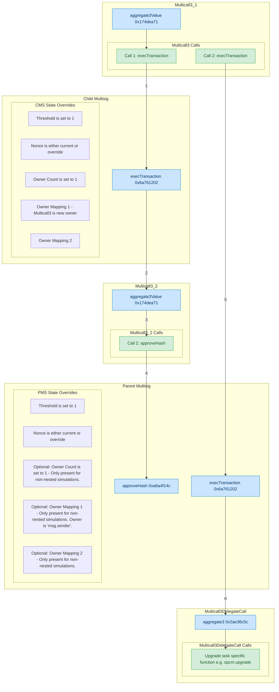

# Validation - Nested Safe

This document describes the generic validation steps for running a Mainnet or Sepolia tasks for any nested 2/2 Safe or 3/3 Safe.

## State Overrides

The following state overrides are related to the nested Safe execution must be present:

### `ProxyAdminSafe` (aka 2/2 `ProxyAdminOwner` or 3/3 Safe)
The simulated role will also be called the **ProxyAdminSafe** in the remaining document.
The `ProxyAdminOwner` has the following address:
- Mainnet: 
    - Superchain (L1PAO): [`0x5a0Aae59D09fccBdDb6C6CcEB07B7279367C3d2A`](https://etherscan.io/address/0x5a0Aae59D09fccBdDb6C6CcEB07B7279367C3d2A)
    - Base/OP (BL1PAO): [0x7bB41C3008B3f03FE483B28b8DB90e19Cf07595c](https://etherscan.io/address/0x7bB41C3008B3f03FE483B28b8DB90e19Cf07595c)
    - Uni/OP (U3): [0x6d5B183F538ABB8572F5cD17109c617b994D5833](https://etherscan.io/address/0x6d5B183F538ABB8572F5cD17109c617b994D5833)
- Sepolia:
  - Superchain(FakeL1PAO): [`0x1Eb2fFc903729a0F03966B917003800b145F56E2`](https://sepolia.etherscan.io/address/0x1Eb2fFc903729a0F03966B917003800b145F56E2)

The Superchain addresses are attested to in the [Optimism Docs](https://docs.optimism.io/chain/security/privileged-roles#addresses).

Enables the simulation by setting the threshold to 1:

- **Key:** `0x0000000000000000000000000000000000000000000000000000000000000004` <br/>
  **Value:** `0x0000000000000000000000000000000000000000000000000000000000000001` \
  **Meaning:** The threshold is set to `1`.

- **Key:** `0x0000000000000000000000000000000000000000000000000000000000000005` <br/>
  **Value:** `<current nonce for the safe>` <br/>
  **Meaning:** The nonce is set to `<current nonce for the safe>`. Note: This is only included in the new superchain-ops flow as of 26th March 2025.

### Safe Signer

Depending on which role the task was simulated for,
you must see the following overrides for the following address:
- Mainnet
    - Security Council Safe: [`0xc2819DC788505Aac350142A7A707BF9D03E3Bd03`](https://etherscan.io/address/0xc2819DC788505Aac350142A7A707BF9D03E3Bd03)
    - Foundation Upgrade Safe: [`0x847B5c174615B1B7fDF770882256e2D3E95b9D92`](https://etherscan.io/address/0x847B5c174615B1B7fDF770882256e2D3E95b9D92)
    - Foundation Operations Safe: [`0x9BA6e03D8B90dE867373Db8cF1A58d2F7F006b3A`](https://etherscan.io/address/0x9BA6e03D8B90dE867373Db8cF1A58d2F7F006b3A)
    - Base Operations Safe: [`0x9855054731540A48b28990B63DcF4f33d8AE46A1`](https://etherscan.io/address/0x9855054731540A48b28990B63DcF4f33d8AE46A1)
    - Uni Operation Safe: [`0xb0c4C487C5cf6d67807Bc2008c66fa7e2cE744EC`](https://etherscan.io/address/0xb0c4C487C5cf6d67807Bc2008c66fa7e2cE744EC)
- Sepolia
    - Fake Security Council Safe: [`0xf64bc17485f0B4Ea5F06A96514182FC4cB561977`](https://sepolia.etherscan.io/address/0xf64bc17485f0B4Ea5F06A96514182FC4cB561977)
    - Fake Foundation Upgrade Safe: [`0xDEe57160aAfCF04c34C887B5962D0a69676d3C8B`](https://sepolia.etherscan.io/address/0xDEe57160aAfCF04c34C887B5962D0a69676d3C8B)

The simulated role will also be called the **Safe Signer** in the remaining document.

These addresses can be verified as the owners of the 2/2 `ProxyAdminOwner` Safe described above.

The Safe Signer will have the following overrides which will set the [Multicall](https://sepolia.etherscan.io/address/0xca11bde05977b3631167028862be2a173976ca11#code) contract as the sole owner of the signing Safe. This allows simulating both the approve hash and the final tx in a single Tenderly tx.

- **Key:** `0x0000000000000000000000000000000000000000000000000000000000000003` <br/>
  **Value:** `0x0000000000000000000000000000000000000000000000000000000000000001` <br/>
  **Meaning:** The number of owners is set to 1.

- **Key:** `0x0000000000000000000000000000000000000000000000000000000000000004` <br/>
  **Value:** `0x0000000000000000000000000000000000000000000000000000000000000001` <br/>
  **Meaning:** The threshold is set to 1.

The following two overrides are modifications to the [`owners` mapping](https://github.com/safe-global/safe-contracts/blob/v1.4.0/contracts/libraries/SafeStorage.sol#L15). For the purpose of calculating the storage, note that this mapping is in slot `2`.
This mapping implements a linked list for iterating through the list of owners. Since we'll only have one owner, `Multicall3` (`0xca11bde05977b3631167028862be2a173976ca11` on [Mainnet](https://etherscan.io/address/0xca11bde05977b3631167028862be2a173976ca11) and [Sepolia](https://sepolia.etherscan.io/address/0xca11bde05977b3631167028862be2a173976ca11)), and the `0x01` address is used as the first and last entry in the linked list, we will see the following overrides:
- `owners[1] -> 0xca11bde05977b3631167028862be2a173976ca11`
- `owners[0xca11bde05977b3631167028862be2a173976ca11] -> 1`

And we do indeed see these entries:

- **Key:** `0x316a0aac0d94f5824f0b66f5bbe94a8c360a17699a1d3a233aafcf7146e9f11c` <br/>
  **Value:** `0x0000000000000000000000000000000000000000000000000000000000000001` <br/>
  **Meaning:** This is `owners[0xca11bde05977b3631167028862be2a173976ca11] -> 1`, so the key can be
    derived from `cast index address 0xca11bde05977b3631167028862be2a173976ca11 2`.

- **Key:** `0xe90b7bceb6e7df5418fb78d8ee546e97c83a08bbccc01a0644d599ccd2a7c2e0` <br/>
  **Value:** `0x000000000000000000000000ca11bde05977b3631167028862be2a173976ca11` <br/>
  **Meaning:** This is `owners[1] -> 0xca11bde05977b3631167028862be2a173976ca11`, so the key can be
    derived from `cast index address 0x0000000000000000000000000000000000000001 2`.

## State Changes

The following state changes related to the nested Safe execution must be seen, either for the
Security Council Safe, or the Foundation Safes or the Chain Governor Safe, depending on which role the simulation was run for:

### `GnosisSafeProxy` - `approvedHashes` mapping update

- **Key:** _Needs to be computed._ <br/>
  **Before:** `0x0000000000000000000000000000000000000000000000000000000000000000`<br/>
  **After:** `0x0000000000000000000000000000000000000000000000000000000000000001` <br/>

#### Key Computation

The GnosisSafe `approvedHashes` mapping is updated to indicate approval of this transaction by the Safe Signer. The correctness of this slot can be verified as follows:
- Since this is a nested mapping, we need to use `cast index` twice to confirm that this is the correct slot. The inputs needed are:
    - The location (`8`) of the `approvedHashes` mapping in the [GnosisSafe storage layout](https://github.com/safe-global/safe-contracts/blob/v1.4.0/contracts/libraries/SafeStorage.sol#L23)
    - The address of the Safe Signer, stored at the env var `$SAFE_SIGNER` in the following cast script command.
    - The safe hash to approve, stored at the env var `$SAFE_HASH` in the following cast script command.
      It's the value after "Nested hash:" (legacy) or **"Parent hashToApprove:"** in the simulation output logs.
- Then using `cast index`, we can compute the key with
    ```shell
      $ cast index bytes32 $SAFE_HASH $(cast index address $SAFE_SIGNER 8)
    ```
    The output of this command must match the key of the state change.

### Liveness Guard

> [!IMPORTANT]
> Security Council Safe or Unichain Operation Safe only

When the Security Council Safe or Unichain Operation Safe executes a transaction, the liveness timestamps are updated for each owner that signed the task.
This is updating at the moment when the transaction is submitted (`block.timestamp`) into the [`lastLive`](https://github.com/ethereum-optimism/optimism/blob/e84868c27776fd04dc77e95176d55c8f6b1cc9a3/packages/contracts-bedrock/src/safe/LivenessGuard.sol#L41) mapping located at the slot `0`. \
Liveness Guard Addresses:
- [Liveness Security Council Safe (0x24424336f04440b1c28685a38303ac33c9d14a25)](https://etherscan.io/address/0x24424336f04440b1c28685a38303ac33c9d14a25)
- [Liveness Unichain Operation Safe (0x9343c452dec3251fe99D9Fd29b74c5b9CD1751a6)](https://etherscan.io/address/0x9343c452dec3251fe99D9Fd29b74c5b9CD1751a6)

### Nonce increments

The only other state changes related to the nested execution are _three_ nonce increments:

- One increment of the *ProxyAdminSafe* Safe nonce, located as storage slot
`0x0000000000000000000000000000000000000000000000000000000000000005` on a
`GnosisSafeProxy`.
- One increment of the **Safe Signer** nonce, located as storage slot
`0x0000000000000000000000000000000000000000000000000000000000000005` on a
`GnosisSafeProxy`.
- One increment of the nonce of the EOA that is the first entry in the owner set of the Safe Signer.

## Visualisation of State Overrides for Nested Execution

The following diagram shows the state overrides for a nested execution. Where appropriate, some state overrides are marked as optional to indicate that they are not present for a single execution.


