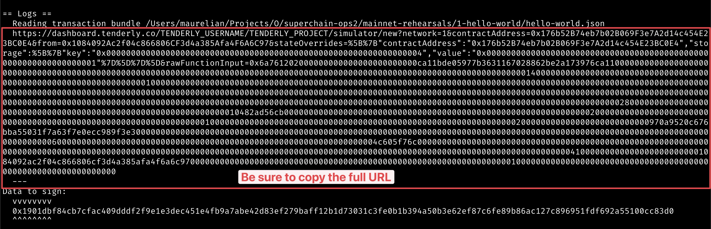

# Add 0x3041 to the 0x2A82 multisig

Status: READY_TO_SIGN

## Objective

This ceremony aims to add
oeth:0x3041BA32f451F5850c147805F5521AC206421623 to the
oeth:0x2A82Ae142b2e62Cb7D10b55E323ACB1Cab663a26 multisig, and bump the
quorum threshold from 2 to 3.

## Approving the transaction

### 1. Move to the appropriate folder for this rehearsal task:

```
cd superchain-ops/eth/1-add-0x3041-to-0x2A82.
```

### 2. Setup Ledger

Your Ledger needs to be connected and unlocked. The Ethereum
application needs to be opened on Ledger with the message “Application
is ready”.

### 3. Initiate the Signing:

Initiate the Signing:


Make sure your ledger is still unlocked and run the following.

``just sign``

You will see the following output.

There are 4 key pieces of information here we’ll use for the
validation process that we’ll walk through in the subsequent steps.


### 4. Validate the address


Verify that the address shown is your signer account. If not, you will
need to determine which “number” it is in the list of addresses on
your ledger. By default the script will assume the derivation path is
m/44'/60'/0'/0/0. By calling the script with just sign 1 it will
derive the address using m/44'/60'/1'/0/0 instead.

### 5. Validate the simulation

Following the previous output, a tenderly simulation link will also be
printed.



Paste this URL in your browser. A prompt may ask you to choose a
project, any project will do. You can create one if necessary.

Click “Simulate Transaction”.

### 6. Items to validate in the Simulation

Now, in order to verify the result of executing this transaction,
you’ll need to validate the following items in the simulation:

#### 6.1. The domain hash

The domain hash (item 4 in the signing output above) should match the Tenderly `domainSeparator`.

For this ceremony, the hash should be 0x462891ca8f7777ee79e5fe4366d0577864fdf00769c59e345303b084bf0cf38d:


#### 6.2. The message hash

The data hash to sign (item 3 in the signing output) should match the
data field when checking the signatures. Example where data is
0xbd19b32a5cbf3cdb557327bd20851b9de8232ab4353f5911bac6b7d95724b700:


#### 6.3. The state changes

Now click on the ‘State’ tab. Verify that the ‘Before’ and ‘After’
values under ‘State Changes’ implements the Objective above and no
other changes are made. Note that it will appear as if the threshold is currently `1`, this is a side effect of the state overrides which are necessary to simulate the transaction. The important thing is that the new threshold matches the updated value of `3`.


If all the validations check out, sign the payload with your ledger.

### 7. Approve the signature on your ledger

Make sure the domain and message hashes on the ledger matches what you
see in Tenderly.


### 8. Send the output to Facilitator(s)

Nothing has occurred onchain - these are offchain signatures which
will be collected by Facilitators for execution. Execution can occur
by anyone once a quorum of signatures are collected, so a Facilitator
will do the final execution for convenience.

Format should be something like this:

```
Data:  <DATA>
Signer: <ADDRESS>
Signature: <SIGNATURE>
```

Congrats, you are done!
