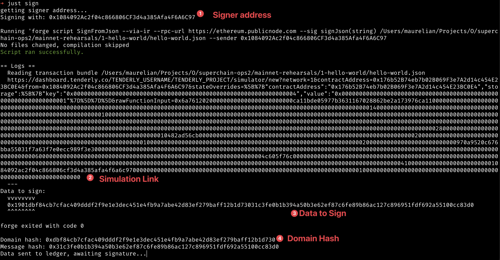
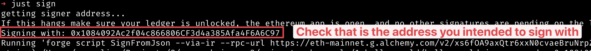
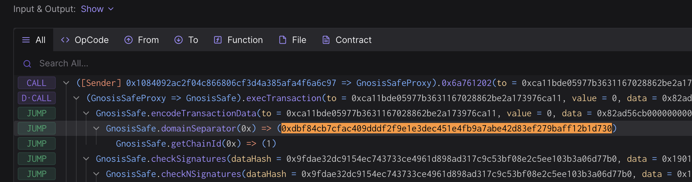
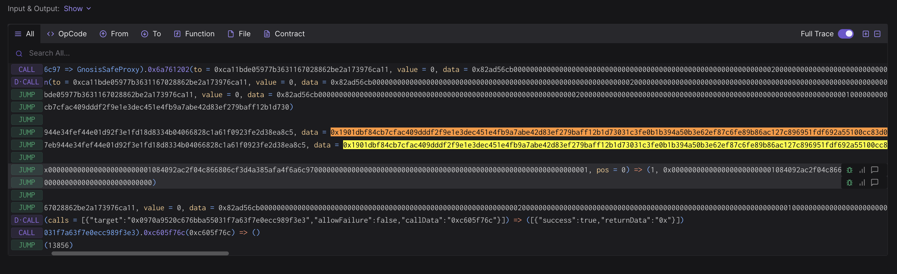
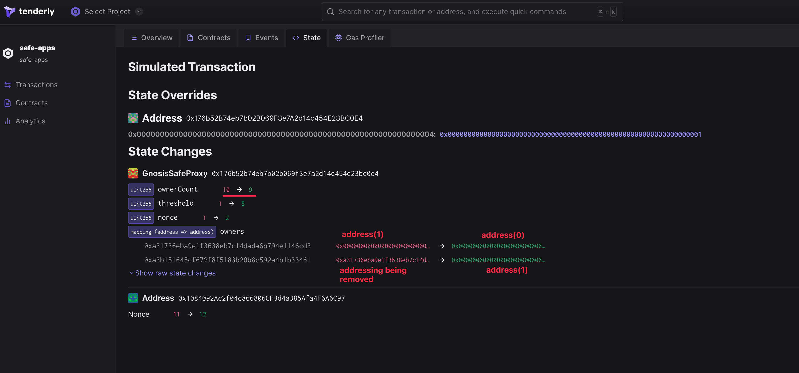
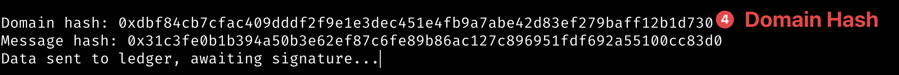
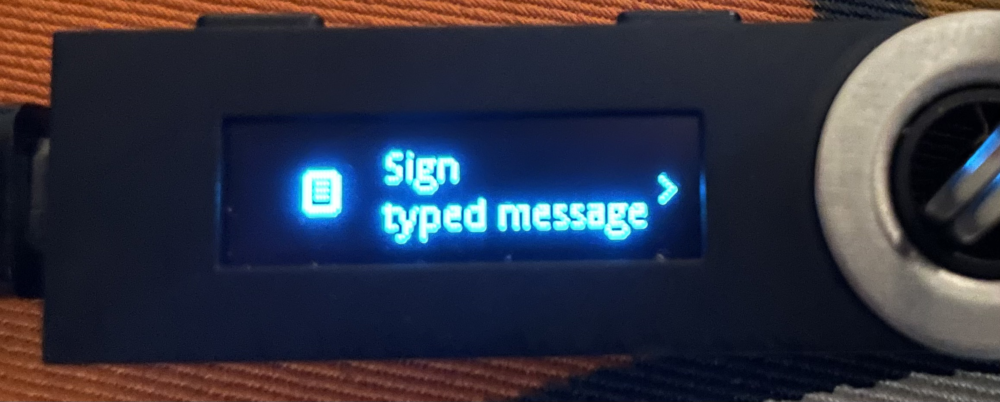
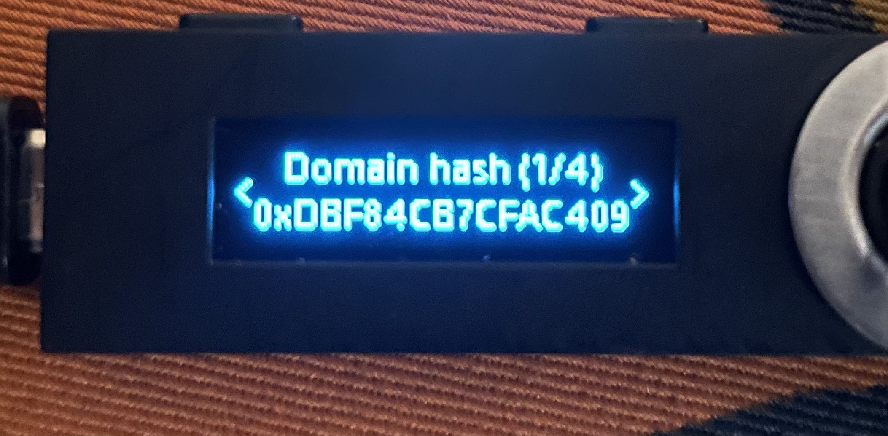
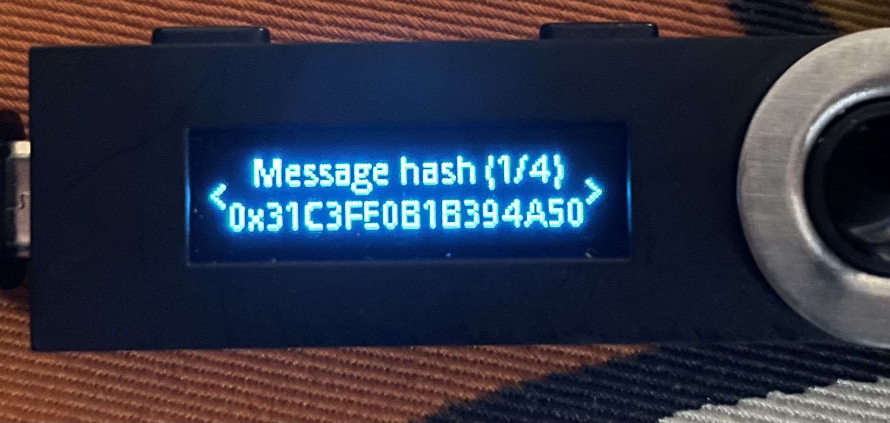

# Rehearsal 2 - Signer Removal

## Objective

In this rehearsal we will be removing one of the owners of the Safe.

Once completed:
- There will be 1 fewer owner
- The threshold should be unchanged

The call that will be executed by the Safe contract is defined in a json file. This will be the standard approach for all transactions.

Note that no onchain actions will be taking place during this signing. You won’t be submitting a transaction and your address doesn’t even need to be funded. These are offchain signatures produced with your wallet which will be collected by a Facilitator will execute the contract, submitting all signatures for its  execution.

Execution can be finalized by anyone once a threshold of signatures are collected, so a Facilitator will do the final execution for convenience.

## Approving the transaction

### 1. Move to the appropriate folder for this rehearsal task:

```
cd superchain-ops/mainnet-rehearsals/2-remove-signer
```

### 2. Setup Ledger

Your Ledger needs to be connected and unlocked. The Ethereum application needs to be opened on Ledger with the message “Application is ready”.

### 3. Initiate the Signing:

Make sure your ledger is still unlocked and run the following.

`just sign`

You will see the following output.

There are 4 key pieces of information here we’ll use for the validation process that we’ll walk through in the subsequent steps.



### 4. Validate the address



Verify that the address shown is your signer account. If not, you will need to determine which “number” it is in the list of addresses on your ledger. By default the script will assume the derivation path is m/44'/60'/0'/0/0. By calling the script with just sign 1 it will derive the address using m/44'/60'/1'/0/0 instead.

### 5. Validate the simulation

A tenderly simulation link was printed in the output above.

Paste this URL in your browser. A prompt may ask you to choose a project, any project will do. You can create one if necessary.

Click “Simulate Transaction”.

### 6. Items to validate in the Simulation

Now, in order to verify the result of executing this transaction, you’ll need to validate the following items in the simulation:

#### 6.1. The domain hash (item 4 in the signing output above) should match the Tenderly `domainSeparator`.

Example where the hash is 0xf347c…:



#### 6.2. The data to sign (item 3 in the signing output) should match the data field when checking the signatures. Example where data is 0x1901f3…:



#### 6.3. The state changes

Now click on the ‘State’ tab. Verify that the ‘Before’ and ‘After’ values under ‘State Changes’ match what is shown below. This change from 0 to 1 is setting the boolean value to true in the HelloWorld contract.



If all the validations check out, sign the payload with your ledger.

### 7. Approve the signature on your ledger

These values should match those shown in item 4:



This is how it will look on your ledger:

<br/>
<br/>


### 8. Send the output to Facilitator(s)

Nothing has occurred onchain - these are offchain signatures which will be collected by Facilitators for execution. Execution can occur by anyone once a threshold of signatures are collected, so a Facilitator will do the final execution for convenience.

Format should be something like this:

```
Data:  <DATA>
Signer: <ADDRESS>
Signature: <SIGNATURE>
```

Congrats, you are done! 🔐

