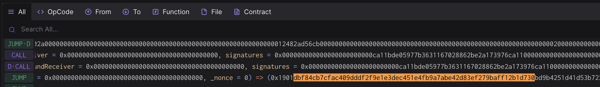

# Rehearsal 4 - Protocol Upgrade via Nested Multisig

## Objective

In this rehearsal we will be performing a protocol upgrade of the
Superchain.

Once Completed:
1. The L1ERC721BridgeProxy contract will be upgraded to a new
   implemenation.
2. The OptimismPortalProxy contract will be upgraded to a new
   implementation and reinitialized.

The call that will be executed by the Safe contract is defined in a
json file. This will be the standard approach for all transactions.

Note that no onchain actions will be taking place during this
signing. You won’t be submitting a transaction and your address
doesn’t even need to be funded. These are offchain signatures produced
with your wallet which will be collected by a Facilitator, who will
submit all signatures and perform the execution onchain.


## Approving the transaction

### 1. Move to the appropriate folder for this rehearsal task:

```
cd superchain-ops/mainnet-rehearsals/4-upgrade-2-of-2
```

### 2. Setup Ledger

Your Ledger needs to be connected and unlocked. The Ethereum
application needs to be opened on Ledger with the message "Application
is ready".

### 3. Simulate and validate the transaction

Make sure your ledger is still unlocked and run the following.

``` shell
just simulate-council
```

You will see a "Simulation link" from the output.

Paste this URL in your browser. A prompt may ask you to choose a
project, any project will do. You can create one if necessary.

Click "Simulate Transaction".

We will be performing 3 validations and extract the domain hash and
message hash to approve on your Ledger:

1. Validate integrity of the simulation.
2. Validate correctness of the state diff.
3. Validate and extract domain hash and message hash to approve.

#### 3.1. Validate integrity of the simulation.

Make sure you are on the "Overview" tab of the tenderly simulation, to
validate integrity of the simulation, we need to

1. "Network": Check the network is Ethereum Mainnet.
2. "Timestamp": Check the simulation is performed on a block with a
   recent timestamp (i.e. close to when you run the script).
3. "Sender": Check the address shown is your signer account. If not,
   you will need to determine which “number” it is in the list of
   addresses on your ledger. By default the script will assume the
   derivation path is m/44'/60'/0'/0/0. By calling the script with
   `just simulate-council 1` it will derive the address using
   m/44'/60'/1'/0/0 instead.


#### 3.2. Validate correctness of the state diff.

Now click on the "State" tab. Verify that

1. The implementation (storage key
    [0x360894a13ba1a3210667c828492db98dca3e2076cc3735a920a3ca505d382bbc](https://github.com/ethereum-optimism/optimism/blob/cb42a6108d780451f6cecceff8182e11aa6a0490/packages/contracts-bedrock/src/libraries/Constants.sol#L27C9-L27C75))
    of the `L1ERC721BridgeProxy` contract
    (0xce479c1299adbe12f34a479f404937151af19d92) is changed to
    0x3311aC7F72bb4108d9f4D5d50E7623B1498A9eC0.
2. The implementation (storage key is the same as above) of the
   `OptimismPortalProxy` contract
   (0xDd3840F548Bd8fA41421050ed7C28753B494734c) is changed to
   0x0A9d47e531825FaaA2863D4d10DC8E5E0B91BfB0.
3. The `OptimismPortalProxy` contract is being reinitialized with

   a. storage slot `0x0` (???) set to `0x2`.
   b. storage slot `0x1` (???) set to `0x000000000117814800000000000000000000000000000000000000003b9aca00`.
   c. storage slot `0x32` (l2Sender) set to `0xdead`.
   d. storage slot `0x35` (l2Oracle) set to `0x0000000000000000000000dfe97868233d1aa22e815a266982f2cf17685a2700`.
   e. storage slot `0x36` (systemConfig) set to `0x000000000000000000000000229047fed2591dbec1ef1118d64f7af3db9eb290`.
   f. storage slot `0x37` (guardian) set to `0x0000000000000000000000009ba6e03d8b90de867373db8cf1a58d2f7f006b3a`.


All of these addresses should be part of the Optimism Governance vote
that approves this upgrade if this is a [Normal
Operation](https://github.com/ethereum-optimism/OPerating-manual/blob/1f42a3766d084864a818b93ce7ba0857a4a846ea/Security%20Council%20Charter%20v0.1.md#normal-operation).


#### 3.3. Validate and extract domain hash and message hash to approve.

Now that we have verified the transaction performs the right
operation, we need to validate and extract domain hash and message
hash to approve.

Go back to the "Overview" tab, and find the first
`GnosisSafe.domainSeparator` call. This call's return value will be
the domain hash that will show up in your Ledger:
0xdbf84cb7cfac409dddf2f9e1e3dec451e4fb9a7abe42d83ef279baff12b1d730.

Right before this `GnosisSafe.domainSeparator` call, you will see a
call to `GnosisSafe.encodeTransactionData`. Its return value will be a
concatnation of `0x1901`, the domain hash, and the message hash:
`0x1901[domain hash][message hash]`, which is
`0x1901dbf84cb7cfac409dddf2f9e1e3dec451e4fb9a7abe42d83ef279baff12b1d73066b46f8bf806832cc437386048bc1dcda035573b7df40d0e7d029d99f752bdfa`
in this case.




### 4. Approve the signature on your ledger

Once the validations are done, it's time to actually sign the
transaction. Make sure your ledger is still unlocked and run the
following:

``` shell
just sign-council # or just sign-council <hdPath>
```

Make sure the domain hash and message hash on your Ledger matches the
ones you find in the simulation, and sign the transaction.

### 5. Send the output to Facilitator(s)

Nothing has occurred onchain - these are offchain signatures which
will be collected by Facilitators for execution. Execution can occur
by anyone once a threshold of signatures are collected, so a
Facilitator will do the final execution for convenience.

Format should be something like this:

```
Data:  <DATA>
Signer: <ADDRESS>
Signature: <SIGNATURE>
```

Congrats, you are done!
