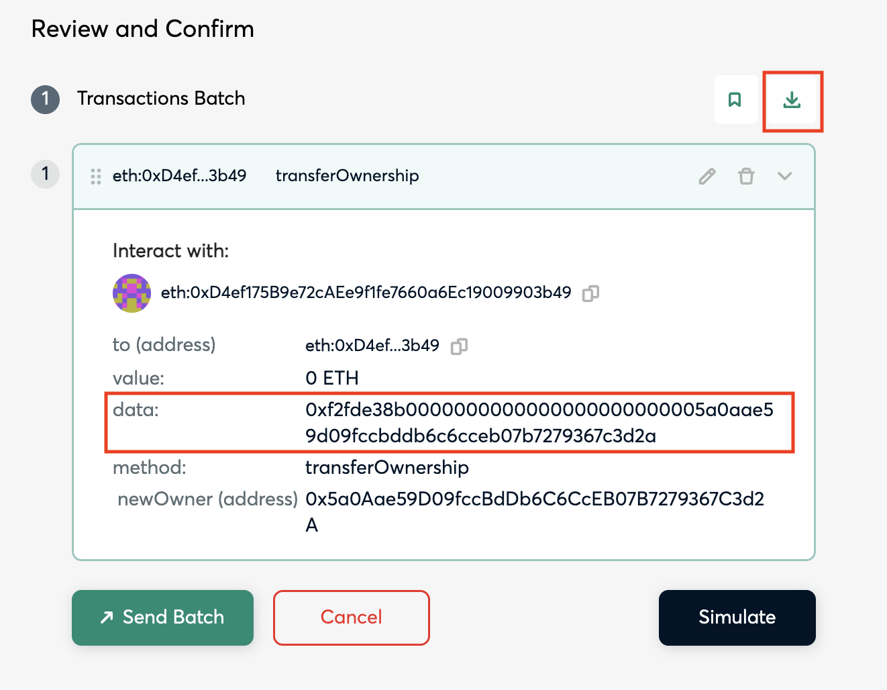

# Key Handover Runbook

This document describes how to generate upgrade playbooks to upgrade chains to the Key Handover upgrade.

## Context

One of the requirements for getting to Stage, 1 as defined by [L2Beat](https://medium.com/l2beat/introducing-stages-a-framework-to-evaluate-rollups-maturity-d290bb22befe) is having a Security Council in place. The Security Council acts as a safeguard in the system, ready to step in in the event of bugs or issues with the proof system. It must function through a multisig setup consisting of at least 8 participants and require a 50% consensus threshold. Furthermore, at least half of the participants must be external to the organization running the rollup, with a minimum of two outsiders required for consensus.

This setup ensures a diversity of viewpoints and minimizes the risk of any single party exerting undue influence. For the sake of transparency and accountability, the identities (or the pseudonyms) of the council participants should also be publicly disclosed.

As a result, “key handover” is necessary to enable the use of Security Council. In practice, this means upgrading the smart contracts to have the `ProxyAdmin` account be the Optimism Foundation and Security Council’s multisig account for mainnets.

This document describes how to generate a key hand over playbook to transfer the Mainnet `ProxyAdminOwner` role from the Chain Servicer to  [0x5a0Aae59D09fccBdDb6C6CcEB07B7279367C3d2A](https://github.com/ethereum-optimism/superchain-registry/blob/0fb0dcbefc50882f1bb02fafcb27f47b463875c9/superchain/configs/mainnet/op.toml#L50) or Sepolia `ProxyAdminOwner` to [0x1Eb2fFc903729a0F03966B917003800b145F56E2](https://github.com/ethereum-optimism/superchain-registry/blob/0fb0dcbefc50882f1bb02fafcb27f47b463875c9/superchain/configs/sepolia/op.toml#L50).

> [!NOTE]
> The mainnet address is a [2-of-2 multisig](https://etherscan.io/address/0x5a0Aae59D09fccBdDb6C6CcEB07B7279367C3d2A#readProxyContract). One owner is an Optimism Foundation 5/7 [multisig](https://etherscan.io/address/0x847B5c174615B1B7fDF770882256e2D3E95b9D92#readProxyContract) and the other owner is the [Security Council's](https://gov.optimism.io/t/intro-to-optimisms-security-council/6885) [multisig](https://etherscan.io/address/0xc2819DC788505Aac350142A7A707BF9D03E3Bd03#readProxyContract).

> [!IMPORTANT]
> The prerequisite for the Key Handover upgrade is that the chain must be a Standard Chain and passes the corresponding [block history integrity checks](https://github.com/ethereum-optimism/security-tools/tree/main/src/block-history-integrity-checks).

## Upgrade Process

### Setup

#### **Local Machine**

First, let’s make sure you have all the right repos and tools on your machine. Start by cloning the repos below and checking out the latest main branch unless stated otherwise. Then, follow the repo setup instructions for each.

1. https://github.com/ethereum-optimism/superchain-ops
    1. Follow the installation instructions in the README: https://github.com/ethereum-optimism/superchain-ops?tab=readme-ov-file#installation
    2. Then, run `just install`.
2. https://github.com/ethereum-optimism/superchain-registry
    1. No setup steps.
3. Ensure you have a Tenderly account.

#### Familiarize yourself with the `single.just` file (superchain-ops repo)

There are three just recipes in this file:

- `simulate` - to simulate the transactions in the the `input.json` bundle
- `sign` - to sign the transactions in the `input.json` bundle
- `execute` - to execute the transactions in the `input.json` bundle

We use `single.just` because the ProxyAdmin owners are regular Safe’s. (For OP Mainnet we use `nested.just` because the ProxyAdmin owner is a Safe, where both owners are also Safes).

### Scaffold the ops task (playbook) for your upgrade (superchain-ops repo)

> [!NOTE]
> ℹ️ In this section we use the Mode, Metal, and Zora Sepolia Playbook as a
> template. You may choose to use a mainnet playbook as your template instead.
> Regardless, we use an existing playbook as the template instead of a dedicated
> template for two reasons:
>
> 1. We know this playbook correct, because it was reviewed very thoroughly. Copying it and changing it into a separate template introduces sources of error (e.g. accidentally deleting a state change) so that template would need to be reviewed even more carefully. This is especially difficult because it wouldn’t have the benefit of being executable as a simulation to help with that validation.
>
> 2. Each chain has some unique addresses (like their proxies) and some shared addresses (implementations for those proxies). Using the existing task as-is for the template lets us avoid modifying links for all the shared addresses for Sepolia (this is why you may prefer a mainnet directory as the template for mainnet playbooks). It also makes it easy to find/replace the unique addresses.
>
> 3. This Key Handover was done for three chains at once because it was the same ProxyAdminOwner for all of them.
>
> **Additionally, if you do use a mainnet playbook as the template, use the Mode, Metal, and Zora Mainnet one.**

In the superchain-ops repo, tasks live in `tasks/<NETWORK_DIR>/<RUNBOOK_DIR>` where:

- `NETWORK_DIR` is `eth` for Ethereum mainnet and `sep` for Sepolia.
- `RUNBOOK_DIR` is of the form `{chainName}-{upgradeIndex}-{upgradeName}`.
    - `chainName` is just the chain’s name i.e. `base` . This is excluded for OP Chains.
    - `upgradeIndex` starts at `001` for the first playbook and increments each time. This gives a sequential ordering to upgrade transactions occurring on that chain.
    - `upgradeName` is `key-handover`

We’ll use the `tasks/sep/mmz-002-key-handover` directory as our template. Start by copying everything over:

```bash
cd tasks/{NetworkDir}

# copy everything from the metal directory into a directory that
# will be created.
cp -R mmz-002-key-handover/. {chainName}-{upgradeIndex}-key-handover

# Delete the input.json file.
cd {chainName}-{upgradeIndex}-key-handover
rm input.json

# Clean your environment to avoid forge caching issues.
forge clean
```

The `.env` file should look like below. It can be left alone, unless you need
to change the address of the owner safe. This can be found with
`cast call $ProxyAdmin "owner()(address)" -r $SEPOLIA_RPC_URL`,
and the proxy admin address can be found from the superchain registry. In other
words, the `OWNER_SAFE` corresponds to the proxy admin owner. It’s populated
with a default value as a result of the `cp` command ran above. This account
might not actually be the correct proxy admin owner for the chain being
upgraded, so you should *always* run that `cast` command to verify what address
should be there.

Now, update the `README.md` so instead of referencing Mode, Metal, and Zora
Sepolia it references the chain you are updating. Additionally, change the status
to READY TO SIGN. For these playbooks, approval of the PR adding the playbook
doubles as the indication the playbook is ready to sign.

`SignFromJson.s.sol`: This solidity script will generate the Tenderly validation link.

Leave the validation file alone for now—it will be partly incorrect since it
was based on another chain’s data, but it serves as a useful template for
validations and to reduce work, so later we will modify it.

This is a good time to commit your initial changes. Note that if you edited your
global gitignore to always ignore `.env` files, you will have to run
`git add tasks/{networkDir}/{chainName}-{chain-index}-key-handover/.env -f`
to force add the file to git.

### Generate the `input.json`

1. Open up the [Safe Transaction Bundler UI](https://app.safe.global/apps/open?safe=eth:0x99eb2770c5c70aD2fd6798e76616f40F6611f539&appUrl=https%3A%2F%2Fapps-portal.safe.global%2Ftx-builder)
    1. You can replace `eth` in the URL with `sep` for testnet key hand overs
    2. You can replace the address in the URL with the current `ProxyAdminOwner`
2. Enter the address of the chain’s `ProxyAdmin` on Ethereum
3. Add the [ProxyAdmin contract ABI](https://raw.githubusercontent.com/ethereum-optimism/optimism/4cbe59b6568b738be7c4f66fea5441f3e932a308/packages/contracts-bedrock/snapshots/abi/ProxyAdmin.json)
4. Select `transferOwnership` from the `Contract Method Selector`
5. Enter the address of the chain’s `ProxyAdmin` in the `_proxy(address)` field
6. Enter the 2-of-2 Multisig Address of the Optimism Foundation and Security Council [0x5a0Aae59D09fccBdDb6C6CcEB07B7279367C3d2A](https://etherscan.io/address/0x5a0Aae59D09fccBdDb6C6CcEB07B7279367C3d2A) in the `_newAdmin(address)` field
    1. This is the same as OP Mainnets: https://github.com/ethereum-optimism/superchain-registry/blob/c01722001e88a8d21a6450f89bb7bb42311c9609/superchain/configs/mainnet/op.toml#L50
7. Click `Add transaction` and then Click `Create Batch`
   1. 
8.  Click the download icon on the `(1) Transactions Batch` row
    1.  
9.  Rename the file to `input.json` and put it in the task folder
10. Modify the `input.json`
    1.  Remove the `createdAt` key and value
    2.  Update `meta.name` to `{Network Name} Key Handover`
    3.  Remove `meta.description`, `meta.txBuilderVersion`, `createdFromSafeAddress`, and `createdFromOwnerAddress`
    4.  Replace `transactions[0].data` with the data from step 8, the download bundle page.

### Simulate and Validate

Now your task folder is prepared. Navigate into that directory and execute the following command:

```
SIMULATE_WITHOUT_LEDGER=1 just \
  --dotenv-path $(pwd).env \
  --justfile ../../../single.just \
  simulate
```

If all goes well, your output should look similar to this:

```bash
Using script /Users/soyboy/Documents/GitHub/superchain-ops/tasks/sep/mmz-002-key-handover/SignFromJson.s.sol
Safe address: 0xE75Cd021F520B160BF6b54D472Fa15e52aFe5aDD
Getting signer address...
Simulating with: 0xa0C600a6e85bf225958FFAcC70B5FDDF9A059038

[⠊] Compiling...
No files changed, compilation skipped
[⠊] Compiling...
[⠔] Compiling 1 files with Solc 0.8.15
[⠒] Solc 0.8.15 finished in 8.66s
Compiler run successful!
Script ran successfully.

== Logs ==
  Reading transaction bundle /Users/soyboy/Documents/GitHub/superchain-ops/tasks/sep/mmz-002-key-handover/input.json
  Safe current nonce: 5
  Safe current nonce: 5
  https://dashboard.tenderly.co/TENDERLY_USERNAME/TENDERLY_PROJECT/simulator/new?network=11155111&contractAddress=0xE75Cd021F520B160BF6b54D472Fa15e52aFe5aDD&from=0xa0C600a6e85bf225958FFAcC70B5FDDF9A059038&stateOverrides=%5B%7B"contractAddress":"0xE75Cd021F520B160BF6b54D472Fa15e52aFe5aDD","storage":%5B%7B"key":"0x0000000000000000000000000000000000000000000000000000000000000004","value":"0x0000000000000000000000000000000000000000000000000000000000000001"%7D%5D%7D,%7B"contractAddress":"0x0000000000000000000000000000000000000000","storage":%5B%5D%7D%5D&rawFunctionInput=0x6a761202000000000000000000000000ca11bde05977b3631167028862be2a173976ca1100000000000000000000000000000000000000000000000000000000000000000000000000000000000000000000000000000000000000000000000000000140000000000000000000000000000000000000000000000000000000000000000100000000000000000000000000000000000000000000000000000000000000000000000000000000000000000000000000000000000000000000000000000000000000000000000000000000000000000000000000000000000000000000000000000000000000000000000000000000000000000000000000000000000000000000000000000000000000000000000000000000000000000000000000000000000000000000000000000000000000000000000000000000000000000000046000000000000000000000000000000000000000000000000000000000000002e482ad56cb000000000000000000000000000000000000000000000000000000000000002000000000000000000000000000000000000000000000000000000000000000030000000000000000000000000000000000000000000000000000000000000060000000000000000000000000000000000000000000000000000000000000012000000000000000000000000000000000000000000000000000000000000001e0000000000000000000000000e17071f4c216eb189437fbdbcc16bb79c4efd9c2000000000000000000000000000000000000000000000000000000000000000000000000000000000000000000000000000000000000000000000000000000600000000000000000000000000000000000000000000000000000000000000024f2fde38b0000000000000000000000001eb2ffc903729a0f03966b917003800b145f56e200000000000000000000000000000000000000000000000000000000000000000000000000000000f7bc4b3a78c7dd8be9b69b3128eeb0d6776ce18a000000000000000000000000000000000000000000000000000000000000000000000000000000000000000000000000000000000000000000000000000000600000000000000000000000000000000000000000000000000000000000000024f2fde38b0000000000000000000000001eb2ffc903729a0f03966b917003800b145f56e200000000000000000000000000000000000000000000000000000000000000000000000000000000e7413127f29e050df65ac3fc9335f85bb10091ae000000000000000000000000000000000000000000000000000000000000000000000000000000000000000000000000000000000000000000000000000000600000000000000000000000000000000000000000000000000000000000000024f2fde38b0000000000000000000000001eb2ffc903729a0f03966b917003800b145f56e200000000000000000000000000000000000000000000000000000000000000000000000000000000000000000000000000000000000000000000000000000000000000000000000000000000000000000000000000000041000000000000000000000000a0c600a6e85bf225958ffacc70b5fddf9a05903800000000000000000000000000000000000000000000000000000000000000000100000000000000000000000000000000000000000000000000000000000000
  WARNING: _postCheck not implemented
  Safe current nonce: 5
  ---
Data to sign:
  vvvvvvvv
  0x1901e6fee5800561fe5def27e3820ad60b2a3529ac17127df8e1a94364ce0702b1b0c4b688c5aa181b218d3144c4a8980f6f5e11ddc03a28de3723cfbda253402db0
  ^^^^^^^^

  ########## IMPORTANT ##########
  Please make sure that the 'Data to sign' displayed above matches what you see in the simulation and on your hardware wallet.
  This is a critical step that must not be skipped.
  ###############################
```

- Copy the entire `https://dashboard.tenderly.co/....` URL and paste it into your browser.
  - Make sure to include the `contractAddress`, `storage`, `key`, `value`, `contractAddress`, and `storage` parameters.
    - Note: Due to the data in this URL, you cannot just click the link from some terminals (like VSCode’s) directly. Instead you will have to highlight the whole link and copy/paste it.
- The tenderly UI will ask you to select a project—select any one.
- Scroll down and click the “Simulate Transaction” button.
- In the part that looks like the image below, sanity check these values. For example, make sure the block number is close to the latest block for the chain, ensure the sender is correct, and that the gas used seems sensible.
- Please make sure that the `Data to sign` matches what you see in the simulation and on your hardware wallet. This is a critical step that must not be skipped. Copy the `Data to sign:` from your terminal output and search the Tenderly Simulated Transaction and ensure its there.
- Then click the “State” tab at the top to see the state diff.

#### Update Validation.md

Update the validation file to match the tenderly simulation user interface.
Addresses, superchain registry URLs, Etherscan URLs, and “After” slot values all must be changed.

- Use the superchain registry to find the chain’s addresses. Look for the file will be located at `superchain/configs/mainnet/{network}/{chainName}.toml`.
- Ensure the order of the state changes match Tenderly.
- Ensure the etherscan links are correct.

Below is a non-comprehensive list of things to check after writing the
validations file, to verify it has no mistakes. These bullet points are written
assuming OP Sepolia validation files for brevity, but can be modified
accordingly for other chains:

- Cmd+F for "mainnet" to make sure there are no mainnet references.
- Cmd+F for `https://etherscan` to make sure all links are not to mainnet etherscan.
- Cmd+F for "op" (or use `\bop[^-]\b` as a regex search) to ensure no links are pointing to the OP chains.
- Do the same but for other chain names that are not the chain you are upgrading.
- Walk through the validations file as if you are the most diligent multisig signer on the Safe, while viewing the markdown render on github (or some IDE different from the one you used to write it). Creating these files is a tedious and error-prone manual process so mistakes are likely. Walking through the file and validating everything in a different viewer/IDE is a really great way to catch mistakes.

### Add New Chain to CircleCI

Before the task is executed, it should be added to the CircleCI config to ensure it continues to pass even as changes are made to the repo prior to execution.

Add the following to the `jobs` in the `.circleci/config.yml` file:

```yml
just_simulate_[eth or sep]-[chain-name]-[index]-key-handover:
    docker:
      - image: <<pipeline.parameters.ci_builder_image>>
    steps:
      - checkout
      - run:
          name: just simulate [eth or sep]/[chain-name]-[index]-key-handover
          command: |
            go install github.com/mikefarah/yq/v4@latest
            just install
            cd tasks/[eth or sep]/[chain-name]-[index]-key-handover
            export SIMULATE_WITHOUT_LEDGER=1
            just \
            --dotenv-path $(pwd)/.env \
            --justfile ../../../single.just \
            simulate
```

The add the following to the workflows.main.jobs section at the bottom:

```
- just_simulate_[eth or sep]-[chain-name]-[index]-key-handover
```

### Open PR

Once the task folder has been prepared, you can open a PR with the following
information:

```md
pr title: tasks([eth or sep]/[chain-short-name]) <chain-name> key handover

**Description**

<chain-name> Key Handover task has been prepared.
```

### Sign

Follow steps 4 and 5 in `SINGLE.md`

### Facilitators Execute

Ensure you properly fill out your `.env` file and follow the last section of the `SINGLE.md` file.

### Post Execution

#### superchain-ops

Once the task is executed, the job can be removed from CI and the task status
should be updated to: `[EXECUTED](block-explorer-transaction-execution-link)`.
Then opening a PR to the repo with the following information:

```md
pr title: <chain-name> Key Handover Executed

**Description**

The <chain-name> key handover task has been executed.
```

#### superchain-registry

The Superchain Registry needs to be updated. You can do that by modifying the
`ProxyAdminOwner` in the `superchain/configs/<superchain-target>/<chain-short-name>.toml`
and then running `just codegen` from the root of the repository. Then opening
a PR to the repo with the following information:

```md
pr title: <chain-name> key handover executed

**Description**

- The <chain-name> Key Handover [task](<merged-task>)
- I've updated the ProxyAdminOwners for the network to the new owner, the same one as OP <Mainnet or Sepolia>. I did this by modifying the `superchain/configs/sepolia/<chain-short-name>.toml` and then running `just codegen`.
```

