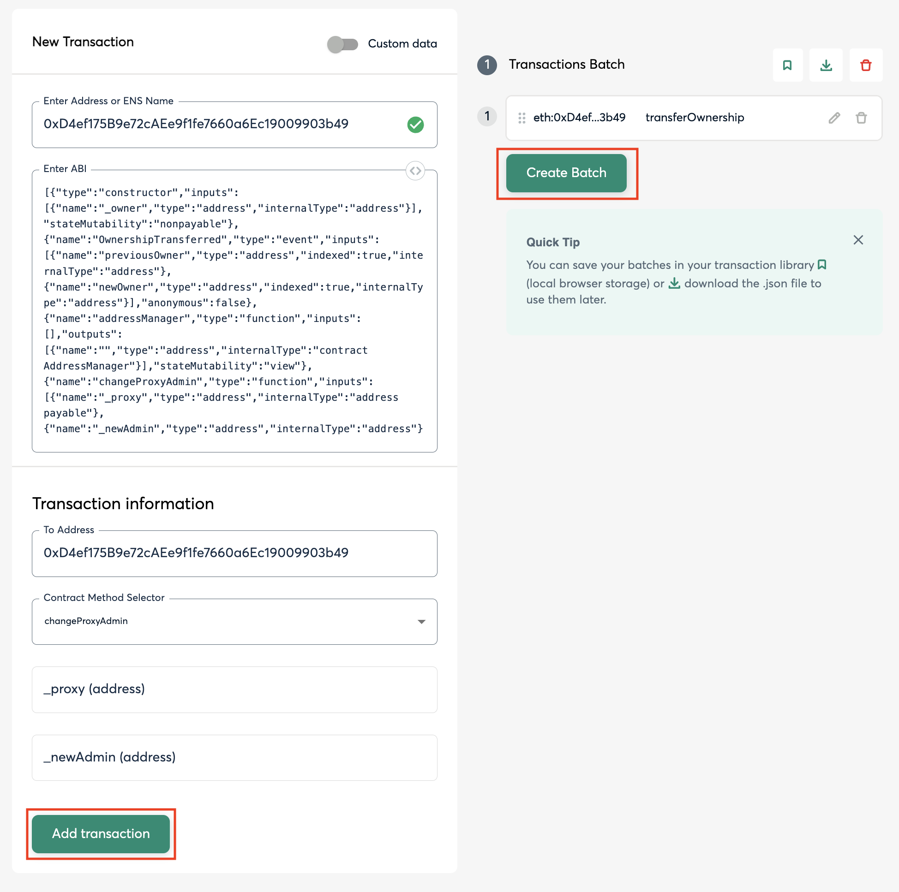
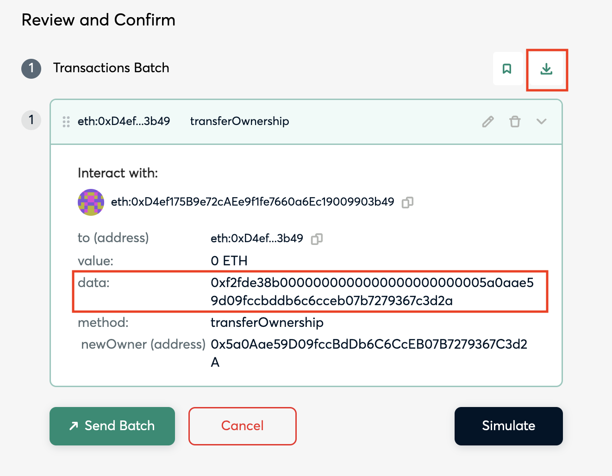

# Key Handover Runbook

This document describes how to generate upgrade playbooks to upgrade chains to the Key Handover upgrade.

## Context

One of the requirement for getting to Stage, 1 as defined by [L2Beat](https://medium.com/l2beat/introducing-stages-a-framework-to-evaluate-rollups-maturity-d290bb22befe) is having a Security Council in place. The Security Council acts as a safeguard in the system, ready to step in in the event of bugs or issues with the proof system. It must function through a multisig setup consisting of at least 8 participants and require a 50% consensus threshold. Furthermore, at least half of the participants must be external to the organization running the rollup, with a minimum of two outsiders required for consensus. 

This setup ensures a diversity of viewpoints and minimizes the risk of any single party exerting undue influence. For the sake of transparency and accountability, the identities (or the pseudonyms) of the council participants should also be publicly disclosed.

As a result, “key handover” is necessary to enable the use of Security Council. In practice, this means upgrading the smart contracts to have the `ProxyAdmin` account be the Optimism Foundation and Security Council’s multisig account.

This document describes how to generate a key hand over playbook to transfer the mainnet `ProxyAdminOwner` role from the Chain Servicer to  [0x5a0Aae59D09fccBdDb6C6CcEB07B7279367C3d2A](https://github.com/ethereum-optimism/superchain-registry/blob/0fb0dcbefc50882f1bb02fafcb27f47b463875c9/superchain/configs/mainnet/op.toml#L50) or testnet `ProxyAdminOwner` to [0x1Eb2fFc903729a0F03966B917003800b145F56E2](https://github.com/ethereum-optimism/superchain-registry/blob/0fb0dcbefc50882f1bb02fafcb27f47b463875c9/superchain/configs/sepolia/op.toml#L50). 

> [!NOTE] 
> The mainnet address is a [2-of-2 multisig](https://etherscan.io/address/0x5a0Aae59D09fccBdDb6C6CcEB07B7279367C3d2A#readProxyContract). One owner is an Optimism Foundation 5/7 [multisig](https://etherscan.io/address/0x847B5c174615B1B7fDF770882256e2D3E95b9D92#readProxyContract) and the other owner is the [Security Council's](https://gov.optimism.io/t/intro-to-optimisms-security-council/6885) [multisig](https://etherscan.io/address/0xc2819DC788505Aac350142A7A707BF9D03E3Bd03#readProxyContract).

> [!IMPORTANT]
> The prerequisite for the Key Handover upgrade is that the chain must be a Standard Chain and passes the corresponding [block history integrity checks](https://github.com/ethereum-optimism/security-tools/tree/main/src/block-history-integrity-checks). 

## Upgrade Process

### Setup

#### **Local Machine**

First, let’s make sure you have all the right repos and tools on your machine. Start by cloning the repos below and checking out the latest main branch unless stated otherwise. Then, follow the repo setup instructions for each.

1. https://github.com/ethereum-optimism/superchain-ops
    1. Follow the installation instructions in the README: https://github.com/ethereum-optimism/superchain-ops?tab=readme-ov-file#installation
    2. Then, run `just install`.
2. https://github.com/ethereum-optimism/superchain-registry
    1. No setup steps.
3. Ensure you have a Tenderly account.

#### Familiarize yourself with the `single.just` file (superchain-ops repo)

There are three just recipes in this file:

- `simulate` - to simulate the transactions in the the `input.json` bundle
- `sign` - to sign the transactions in the `input.json` bundle
- `execute` - to execute the transactions in the `input.json` bundle

We use `single.just` because the ProxyAdmin owners are regular Safe’s. (For OP Mainnet we use `nested.just` because the ProxyAdmin owner is a Safe, where both owners are also Safes).

### Scaffold the ops task (playbook) for your upgrade (superchain-ops repo)

#### Create a task directory in superchain-ops

```bash
mkdir tasks/<NETWORK_DIR>/<RUNBOOK_DIR>
```

In the superchain-ops repo, tasks live in `tasks/<NETWORK_DIR>/<RUNBOOK_DIR>` where:

- `NETWORK_DIR` is `eth` for Ethereum mainnet and `sep` for Sepolia.
- `RUNBOOK_DIR` is of the form `{chainName}-{upgradeIndex}-{upgradeName}`.
    - `chainName` is just the chain’s name i.e. `base` . This is excluded for OP Chains.
    - `upgradeIndex` starts at `001` for the first playbook and increments each time. This gives a sequential ordering to upgrade transactions occurring on that chain.
    - `upgradeName` is `key-handover`

### Copy the following files into the task directory

Please create the following files in the task directory and update the placeholder values.

- [README.md](./README.md)
- [.env](./.env)
- [SignFromJson.s.sol](./SignFromJson.s.sol)
- [VALIDATION.md](./VALIDATION.md)

#### `README.md`

The README template with an overview of the upgrade task. This needs to be updated with the network details.

#### `.env`

These are the enviornment variables for the upgrade.

- The `ETH_RPC_URL` can be from [PublicNode](https://ethereum.publicnode.com/) or your own node provider.
- The `OWNER_SAFE` can be found with `cast call $ProxyAdmin "owner()(address)" -r $RPC_URL` or from the [Superchain Registry](https://github.com/ethereum-optimism/superchain-registry/tree/main). In other words, the`OWNER_SAFE` corresponds to the ProxyAdmin owner. You should *always* run that `cast` command to verify what address should be there.
- The `SAFE_NONCE` can be found using `getSafeDetails()` from mds1’s [Ethereum helper functions](https://gist.github.com/mds1/3f070676129a095dec372c2d02cedfdd#file-ethrc-sh-L181-L230).


#### SignFromJson.s.sol

This solidity script will generate the Tenderly validation link.

#### Validation.md

The vallidation template

### Generate the `input.json`

1. Open up the [Safe Transaction Bundler UI](https://app.safe.global/apps/open?safe=eth:0x99eb2770c5c70aD2fd6798e76616f40F6611f539&appUrl=https%3A%2F%2Fapps-portal.safe.global%2Ftx-builder)
    1. You can replace `eth` in the URL with `sep` for testnet key hand overs
    2. You can replace the address in the URL with the current `ProxyAdminOwner`
2. Enter the address of the chain’s `ProxyAdmin` on Ethereum
3. Add the [ProxyAdmin contract ABI](https://raw.githubusercontent.com/ethereum-optimism/optimism/4cbe59b6568b738be7c4f66fea5441f3e932a308/packages/contracts-bedrock/snapshots/abi/ProxyAdmin.json)
4. Select `transferOwnership` from the `Contract Method Selector`
5. Enter the address of the chain’s `ProxyAdmin` in the `_proxy(address)` field
6. Enter the 2-of-2 Multisig Address of the Optimism Foundation and Security Council [0x5a0Aae59D09fccBdDb6C6CcEB07B7279367C3d2A](https://etherscan.io/address/0x5a0Aae59D09fccBdDb6C6CcEB07B7279367C3d2A) in the `_newAdmin(address)` field
    1. This is the same as OP Mainnets: https://github.com/ethereum-optimism/superchain-registry/blob/c01722001e88a8d21a6450f89bb7bb42311c9609/superchain/configs/mainnet/op.toml#L50
7. Click `Add transaction` and then Click `Create Batch`
   1. 
8.  Click the download icon on the `(1) Transactions Batch` row
    1.  
9.  Rename the file to `input.json` and put it in the task folder
10. Modify the `input.json`
    1.  Remove the `createdAt` key and value
    2.  Update `meta.name` to `{Network Name} Key Handover`
    3.  Replace `transactions[0].data` with the data from step 8, the download bundle page.

### Simulate and Validate

Now your task folder is prepared. Navigate into that directory and execute the following command:

```
SIMULATE_WITHOUT_LEDGER=1 just \                    
  --dotenv-path .env \
  --justfile ../../../single.just \
  simulate
```

If all goes well, your output should look similar to this:

```bash
Using script /Users/soyboy/Documents/GitHub/superchain-ops/tasks/sep/mmz-002-key-handover/SignFromJson.s.sol
Safe address: 0xE75Cd021F520B160BF6b54D472Fa15e52aFe5aDD
Getting signer address...
Simulating with: 0xa0C600a6e85bf225958FFAcC70B5FDDF9A059038

[⠊] Compiling...
No files changed, compilation skipped
[⠊] Compiling...
[⠔] Compiling 1 files with Solc 0.8.15
[⠒] Solc 0.8.15 finished in 8.66s
Compiler run successful!
Script ran successfully.

== Logs ==
  Reading transaction bundle /Users/soyboy/Documents/GitHub/superchain-ops/tasks/sep/mmz-002-key-handover/input.json
  Safe current nonce: 5
  Safe current nonce: 5
  https://dashboard.tenderly.co/TENDERLY_USERNAME/TENDERLY_PROJECT/simulator/new?network=11155111&contractAddress=0xE75Cd021F520B160BF6b54D472Fa15e52aFe5aDD&from=0xa0C600a6e85bf225958FFAcC70B5FDDF9A059038&stateOverrides=%5B%7B"contractAddress":"0xE75Cd021F520B160BF6b54D472Fa15e52aFe5aDD","storage":%5B%7B"key":"0x0000000000000000000000000000000000000000000000000000000000000004","value":"0x0000000000000000000000000000000000000000000000000000000000000001"%7D%5D%7D,%7B"contractAddress":"0x0000000000000000000000000000000000000000","storage":%5B%5D%7D%5D&rawFunctionInput=0x6a761202000000000000000000000000ca11bde05977b3631167028862be2a173976ca1100000000000000000000000000000000000000000000000000000000000000000000000000000000000000000000000000000000000000000000000000000140000000000000000000000000000000000000000000000000000000000000000100000000000000000000000000000000000000000000000000000000000000000000000000000000000000000000000000000000000000000000000000000000000000000000000000000000000000000000000000000000000000000000000000000000000000000000000000000000000000000000000000000000000000000000000000000000000000000000000000000000000000000000000000000000000000000000000000000000000000000000000000000000000000000000046000000000000000000000000000000000000000000000000000000000000002e482ad56cb000000000000000000000000000000000000000000000000000000000000002000000000000000000000000000000000000000000000000000000000000000030000000000000000000000000000000000000000000000000000000000000060000000000000000000000000000000000000000000000000000000000000012000000000000000000000000000000000000000000000000000000000000001e0000000000000000000000000e17071f4c216eb189437fbdbcc16bb79c4efd9c2000000000000000000000000000000000000000000000000000000000000000000000000000000000000000000000000000000000000000000000000000000600000000000000000000000000000000000000000000000000000000000000024f2fde38b0000000000000000000000001eb2ffc903729a0f03966b917003800b145f56e200000000000000000000000000000000000000000000000000000000000000000000000000000000f7bc4b3a78c7dd8be9b69b3128eeb0d6776ce18a000000000000000000000000000000000000000000000000000000000000000000000000000000000000000000000000000000000000000000000000000000600000000000000000000000000000000000000000000000000000000000000024f2fde38b0000000000000000000000001eb2ffc903729a0f03966b917003800b145f56e200000000000000000000000000000000000000000000000000000000000000000000000000000000e7413127f29e050df65ac3fc9335f85bb10091ae000000000000000000000000000000000000000000000000000000000000000000000000000000000000000000000000000000000000000000000000000000600000000000000000000000000000000000000000000000000000000000000024f2fde38b0000000000000000000000001eb2ffc903729a0f03966b917003800b145f56e200000000000000000000000000000000000000000000000000000000000000000000000000000000000000000000000000000000000000000000000000000000000000000000000000000000000000000000000000000041000000000000000000000000a0c600a6e85bf225958ffacc70b5fddf9a05903800000000000000000000000000000000000000000000000000000000000000000100000000000000000000000000000000000000000000000000000000000000
  WARNING: _postCheck not implemented
  Safe current nonce: 5
  ---
Data to sign:
  vvvvvvvv
  0x1901e6fee5800561fe5def27e3820ad60b2a3529ac17127df8e1a94364ce0702b1b0c4b688c5aa181b218d3144c4a8980f6f5e11ddc03a28de3723cfbda253402db0
  ^^^^^^^^

  ########## IMPORTANT ##########
  Please make sure that the 'Data to sign' displayed above matches what you see in the simulation and on your hardware wallet.
  This is a critical step that must not be skipped.
  ###############################
```

- Copy the entire `https://dashboard.tenderly.co/....` URL and paste it into your browser.
  - Make sure to include the `contractAddress`, `storage`, `key`, `value`, `contractAddress`, and `storage` parameters.
    - Note: Due to the data in this URL, you cannot just click the link from some terminals (like VSCode’s) directly. Instead you will have to highlight the whole link and copy/paste it.
- The tenderly UI will ask you to select a project—select any one.
- Scroll down and click the “Simulate Transaction” button.
- In the part that looks like the image below, sanity check these values. For example, make sure the block number is close to the latest block for the chain, ensure the sender is correct, and that the gas used seems sensible.
- Please make sure that the `Data to sign` matches what you see in the simulation and on your hardware wallet. This is a critical step that must not be skipped. Copy the `Data to sign:` from your terminal output and search the Tenderly Simulated Transaction and ensure its there.
- Then click the “State” tab at the top to see the state diff. 

#### Update Validation.md

todo

### Add New Chain to CircleCI

Before the task is executed, it should be added to the CircleCI config to ensure it continues to pass even as changes are made to the repo prior to execution.
Check out existing tasks in the `.circleci/config.yml` file as examples of how to add it. Once the task is executed, the job can be removed from CI.

### Sign

Follow steps 4 and 5 in `SINGLE.md`

### Facilitators Execute

Ensure you properly fill out your `.env` file and follow the last section of the `SINGLE.md` file.
