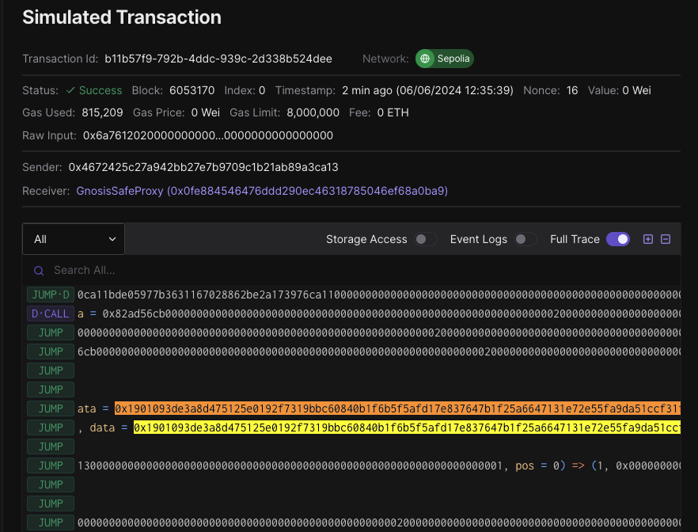

# MCP L1 Upgrades Runbook

This document describes how to generate upgrade playbooks to upgrade chains to
the Multi-Chain Prep (MCP) L1 upgrade, also known as Upgrade #6.
If upgrading a chain from Bedrock, this will also apply the Extended Pause functionality,
also known as Upgrade #4.

<!-- START doctoc generated TOC please keep comment here to allow auto update -->
<!-- DON'T EDIT THIS SECTION, INSTEAD RE-RUN doctoc TO UPDATE -->
- [MCP L1 Upgrades Runbook](#mcp-l1-upgrades-runbook)
  - [Upgrades Involved](#upgrades-involved)
    - [Extended Pause Overview (Upgrade #4)](#extended-pause-overview-upgrade-4)
    - [Multi-Chain Prep (MCP) Overview (Upgrade #6)](#multi-chain-prep-mcp-overview-upgrade-6)
  - [Upgrade Process](#upgrade-process)
    - [Setup](#setup)
      - [Local Machine](#local-machine)
      - [Familiarize yourself with the `single.just` file (superchain-ops repo)](#familiarize-yourself-with-the-singlejust-file-superchain-ops-repo)
    - [Scaffold the ops task (playbook) for your upgrade (superchain-ops repo)](#scaffold-the-ops-task-playbook-for-your-upgrade-superchain-ops-repo)
    - [Generate the `input.json` file from the Optimism monorepo](#generate-the-inputjson-file-from-the-optimism-monorepo)
    - [Simulate and Validate](#simulate-and-validate)
    - [Add New Chain to CircleCI](#add-new-chain-to-circleci)
    - [Sign](#sign)
    - [Facilitators Execute](#facilitators-execute)
    - [Onchain Validation Ideas](#onchain-validation-ideas)
  - [Appendix A: Using this Runbook for Other Chains](#appendix-a-using-this-runbook-for-other-chains)

<!-- END doctoc generated TOC please keep comment here to allow auto update -->

## Upgrades Involved

This runbook will apply up to two upgrades to the chain:

- [Extended Pause](#extended-pause-overview-upgrade-4)
- [Multi-Chain Prep (MCP)](#multi-chain-prep-mcp-overview-upgrade-6)

Each upgrade is described below.
The Extended Pause upgrade is only applied to chains currently on the Bedrock commit, corresponding to the [`op-contracts/v1.0.0`](https://github.com/ethereum-optimism/optimism/releases/tag/op-contracts%2Fv1.0.0) tag in the [Optimism monorepo](https://github.com/ethereum-optimism/optimism).

In either case, the upgrade will be a single, atomic transaction.

### Extended Pause Overview (Upgrade #4)

This protocol upgrade introduced a Superchain-wide pause mechanism that enables simultaneously pausing ETH, ERC20, and ERC-721 withdrawals for and all chains pointing to the same `SuperchainConfig` contract.
Withdrawals are a security-critical code path so this provides a significant improvement to a chain's incident response capabilities.

Learn more:

- [Extended Pause release notes](https://github.com/ethereum-optimism/optimism/releases/tag/op-contracts%2Fv1.2.0). (This is release `op-contracts/v1.2.0`).
- [Governance post](https://gov.optimism.io/t/upgrade-proposal-4/7534).

### Multi-Chain Prep (MCP) Overview (Upgrade #6)

This protocol upgrade strengthens the security and upgradeability of the Superchain by enabling L1
contracts to be upgraded atomically across multiple chains in a single transaction. This upgrade
also extends the `SystemConfig` to contain the addresses of the contracts in the network, allowing
users to discover the system's contract addresses programmatically.

MCP is a contract upgrade that doesn’t change functionality, it changes the contract code so the
implementation contract is used for every chain in the superchain. Meaning each chain’s proxies
point to the same implementation and this ensures we’re all on the same version.

This document provides a repeatable process that can be used to upgrade the following 8 chains:
Metal, Mode, Zora, and Base, for both the Sepolia and Mainnet chains.

Learn more:

- [MCP release notes](https://github.com/ethereum-optimism/optimism/releases/tag/op-contracts%2Fv1.3.0) (This is release `op-contracts/v1.3.0`).
- [Governance post](https://gov.optimism.io/t/upgrade-proposal-6-multi-chain-prep-mcp-l1/7677)

**This runbook MUST only be used for MCP L1 upgrades of those chains.** See [Appendix A](#appendix-a-using-this-runbook-for-other-chains)
to learn about modifications required to use this for other chains.

## Upgrade Process

### Setup

#### Local Machine

First, let’s make sure you have all the right repos and tools on your machine. Start by cloning the
three repos below and checking out the latest main branch unless stated otherwise. Then, follow the
repo setup instructions for each.

1. [https://github.com/ethereum-optimism/optimism](https://github.com/ethereum-optimism/optimism)
    1. Checkout the branch for this PR: [https://github.com/ethereum-optimism/optimism/pull/10160](https://github.com/ethereum-optimism/optimism/pull/10160)
    2. Run `pnpm clean && pnpm install && cd packages/contracts-bedrock && pnpm build:go-ffi && forge build`
2. [https://github.com/ethereum-optimism/superchain-ops](https://github.com/ethereum-optimism/superchain-ops)
    1. Follow the setup instructions in the README: [https://github.com/ethereum-optimism/superchain-ops?tab=readme-ov-file#installation](https://github.com/ethereum-optimism/superchain-ops?tab=readme-ov-file#installation)
    2. Then, run `just install`.
    3. Ensure you have a Tenderly account.
3. [https://github.com/ethereum-optimism/superchain-registry](https://github.com/ethereum-optimism/superchain-registry)
    1. No setup steps.

#### Familiarize yourself with the `single.just` file (superchain-ops repo)

There are three just recipes in this file:

- `simulate` - to simulate the transactions in the the `input.json` bundle
- `sign` - to sign the transactions in the `input.json` bundle
- `execute` - to execute the transactions in the `input.json` bundle

We use `single.just` because the ProxyAdmin owners are regular Safe’s. (For OP Mainnet we use
`nested.just` because the ProxyAdmin owner is a Safe, where both owners are also Safes).

### Scaffold the ops task (playbook) for your upgrade (superchain-ops repo)

> [!NOTE]
> ℹ️ In this section we use the Metal Sepolia Playbook as a template. You may choose to use a
> mainnet playbook as your template instead. Regardless, we use an existing playbook as the template
> instead of a dedicated template for two reasons:
>
> 1. We know the metal playbook correct, because it was reviewed very thoroughly. Copying it and changing it into a separate template introduces sources of error (e.g. accidentally deleting a state change) so that template would need to be reviewed even more carefully. This is especially difficult because it wouldn’t have the benefit of being executable as a simulation to help with that validation.
>
> 2. Each chain has some unique addresses (like their proxies) and some shared addresses (implementations for those proxies). Using Metal as-is for the template lets us avoid modifying links for all the shared addresses for Sepolia (this is why you may prefer a mainnet directory as the template for mainnet playbooks). It also makes it easy to find/replace the unique addresses.
>
> **Additionally, if you do use a mainnet playbook as the template, do not use the OP Mainnet one. It predates some improvements that have been made.**

In the superchain-ops repo, tasks live in `tasks/<NETWORK_DIR>/<RUNBOOK_DIR>` where:

- Network directory is `eth` for Ethereum mainnet and `sep` for Sepolia.
- Runbook directory is of the form `{chainName}-{upgradeIndex}-{upgradeName}`.
  - `chainName` is just the chain’s name, like `metal` or `mode`
  - `upgradeIndex` starts at 001 for the first playbook and increments each time. This gives a sequential ordering to upgrade transactions occurring on that chain.
    - This will be 001 for the six chains
  - Note that `chainName` is excluded for OP chains

We’ll use the `tasks/sep/metal-001-MCP-L1` directory as our template. Start by copying everything over:

```bash
cd tasks/{NetworkDir}

# copy everything from the metal directory into a directory that
# will be created.
cp -R metal-001-MCP-L1/. {chainName}-001-MCP-L1

# Delete the input.json file.
cd {chainName}-001-MCP-L1
rm input.json

# Clean your environment to avoid forge caching issues.
forge clean
```

The `.env` file should look like below. t can be left alone, unless you need to change the address
of the owner safe. This can be found with `cast call $ProxyAdmin "owner()(address)" -r $SEPOLIA_RPC_URL`,
and the proxy admin address can be found from the superchain registry. In other words, the
`OWNER_SAFE` corresponds to the proxy admin owner. It’s populated with a default value as a
result of the `cp` command ran above. This account might not actually be the correct proxy admin
owner for the chain being upgraded, so you should *always* run that `cast` command to verify
what address should be there.

```bash
ETH_RPC_URL=https://1rpc.io/sepolia # L1 Sepolia RPC URL that has archive data access.
OWNER_SAFE=0xE75Cd021F520B160BF6b54D472Fa15e52aFe5aDD
SAFE_NONCE=""
```

Now, update the `README.md` so instead of referencing Metal Sepolia it references the chain you
are updating. Additionally, change the status to READY TO SIGN. For these playbooks, approval of
the PR adding the playbook doubles as the indication the playbook is ready to sign.

Leave the validation file alone for now—it will be partly incorrect since it was based on another
chain’s data, but it serves as a useful template for validations and to reduce work, so later we
will modify it.

This is a good time to commit your initial changes. Note that if you edited your global gitignore
to always ignore `.env` files, you will have to run `git add tasks/{networkDir}/{chainName}-001-MCP-L1/.env -f`
to force add the file to git.

### Generate the `input.json` file from the Optimism monorepo

This file defines the upgrade transaction and is what gets broadcasted onchain. This JSON file is
a Safe bundle and it is used to execute several transactions, instead of having to confirm a set
of transactions individually. It is compatible with the Safe UI.

Use the [op-chain-ops/cmd/op-upgrade](https://github.com/ethereum-optimism/optimism/tree/develop/op-chain-ops/cmd/op-upgrade)
CLI tool from the monorepo to generate the `input.json`. (The README there may be outdated due to
some changes we made, but this guide will contain all the info you need).

Below is the syntax we’ll use to run this tool from the root of the monorepo:

```bash
SYSTEM_CONFIG_START_BLOCK={startBlock} go run op-chain-ops/cmd/op-upgrade/main.go \
  --l1-rpc-url [mainnet or sepolia L1 RPC URL] \
  --chain-ids [chain ID of the L2 to upgrade] \
  --superchain-target [name of the superchain target to upgrade, either mainnet or sepolia] \
  --outfile input.json
```

The `startBlock` is the the block number at which the `SystemConfig` proxy was initialized for the
first time. To find this value, find the very first `Initialize` event after the `SystemConfig`
was deployed. One way to do this is view the Etherscan events page for the contract. This only
shows the last 25 or less events, which is often enough. Etherscan will tell you the transaction
hash (and therefore block) in which the contract was deployed. If the oldest event that you see on
the page is that deployment block, and you only see one `Initialize` event, then you can use the
block number of the `Initialize` event in the UI. An alternate approach is to use `cast logs` to
fetch all `Initialize` events and find the oldest.

The other parameters are self-explanatory given the above descriptions. A sample invocation for Metal Sepolia looks like this:

```bash
SYSTEM_CONFIG_START_BLOCK=5304055 go run op-chain-ops/cmd/op-upgrade/main.go \
  --l1-rpc-url $SEPOLIA_RPC_URL \
  --chain-ids 1740 \
  --superchain-target sepolia \
  --outfile input.json
```

A successful execution will generate the `input.json` file.

### Simulate and Validate

> [!WARNING]
> This is part is the most complicated part of the process, so its recommended to do this while
> you’re well rested and can carefully validate the transaction simulation results.

Copy the `input.json` from the monorepo into the task you created in the ops repo. It should live
at `tasks/{NetworkDir}/{chainName}-001-MCP-L1/input.json`

Next, open the `SignFromJson.s.sol` in your task. This has various hardcoded values that you may
need to change, including:

- The `l1ChainName` and `l2ChainName` values.
- The 6 addresses under the `// Known EOAs to exclude from safety checks.` comment.
  - These have comments explaining where to get each value from.
  - Context on these addresses: Most upgrades have an an invariant of “When writing an address into a storage slot, that address should *usually* have code”. It’s “usually” and not “always” because:
    - Some roles in the protocol are EOAs with no code, and their addresses are in storage. This is what these 6 EOAs are.
    - Other exceptions are when we put an L2 predeploy address in L1 storage.

    Therefore we added a method that takes a value that’s being written to storage and checks if that value looks like an address. If that address has no code, and is not one of the expected exceptions, we revert, causing the simulation to fail. Depending on the chain configuration, this list of six addresses may be too large or too small, so edit the `getCodeExceptions` method as appropriate by adding or removing addresses.

- The `systemConfigStartBlock`, based on the value you found above.
- The `addressManager`, which can be obtained from the superchain registry.
- The block we fork at to save off old data in the `vm.createSelectFork` call. It’s set to 5705332 for Sepolia. You can use the latest current block here.

Everything else in this script should not need to be changed.

Now we can run our simulation. From within your task’s directory, run:

```bash
SIMULATE_WITHOUT_LEDGER=1 just \
  --dotenv-path $(pwd)/.env \
  --justfile ../../../single.just \
  simulate
```

If everything was successful, the end of your terminal output should look something like this, but
the data to sign will differ.

```bash
  Running post-deploy assertions
  Running assertions on the state diff
  Running assertions on the SystemConfig
  Running assertions on the L1CrossDomainMessenger
  Running assertions on the L1StandardBridge
  Running assertions on the L2OutputOracle
  Running assertions on the OptimismMintableERC20Factory
  Running assertions on the L1ERC721Bridge
  Running assertions on the OptimismPortal
  Running assertions on the ProtocolVersions
  Running assertions on the SuperchainConfig
  All assertions passed!
  Safe current nonce: 1
  ---
Data to sign:
  vvvvvvvv
  0x1901e6fee5800....{66 total bytes of data here}
  ^^^^^^^^
```

If there was a revert and the command failed, you will need to troubleshoot why. If there was not
a revert it’s very likely, but **not guaranteed**, your input bundle is working correctly.

**In the case that you did not get a revert, verify everything did in fact work correctly by changing something that should trigger a revert.** For example, replace one of the 6 hardcoded EOAs with the zero address.

Now scroll up in the terminal output and look the part that looks like this:


Then:

- Copy the entire `https://dashboard.tenderly.co/....` URL and paste it into your browser.
  - Make sure to include the `contractAddress`, `storage`, `key`, `value`, `contractAddress`, and `storage` parameters.
    - Note: Due to the data in this URL, you cannot just click the link from some terminals (like VSCode’s) directly. Instead you will have to highlight the whole link and copy/paste it.
- The tenderly UI will ask you to select a project—select any one.
- Click the “Enter raw input data” button
- Paste the hex data from the output log into that field.
- Scroll down and click the “Simulate Transaction” button.
- In the part that looks like the image below, sanity check these values. For example, make sure the block number is close to the latest block for the chain, ensure the sender is correct, and that the gas used seems sensible.

    
- Please make sure that the `Data to sign` matches what you see in the simulation and on your hardware wallet. This is a critical step that must not be skipped. Copy the `Data to sign:` from your terminal output and search the Tenderly Simulated Transaction and ensure its there.

    

- Then click the “State” tab at the top to see the state diff. Unfortunately this will not be decoded due to a Tenderly bug that [they’re working on](https://oplabs-pbc.slack.com/archives/C053NFWLG9K/p1711719503660909?thread_ts=1710771049.267939&cid=C053NFWLG9K).

With the state diff ready, first we sanity check the high level changes, without validating the
details. For every address in the Tenderly state diff—for both the State Overrides and State
changes sections—perform the following process:

- Use the superchain registry to find the name of the contract an address corresponds to. The chain’s address file will be located in `superchain-registry/superchain/extra/addresses/{network}/{chainName}.json`
- In the `VALIDATION.md` file (which is set to the template chain’s data, not our own), find that contract by section name.
- Verify that the total number of state changes shown is the same.
- Verify that the keys (i.e. storage slots) changed are the same.
- **If something differs, was added, or is missing, something is likely wrong with the bundle.**

After sanity checking things from a high level, we can now update the details in the `VALIDATION.md` file appropriately.
Addresses, superchain registry URLs, Etherscan URLs, and “After” slot values all must be changed.

> [!NOTE]
> Writing the validation file is a very manual process and is prone to errors.
> It’s important to be very careful and diligent when writing it. Future upgrades to this repo will
> simplify and automate this process.

One idea to help stay organized during this modification process is to use the below separators.
Continually move chunks of the validation file around them.
This helps know where exactly you need to continue from and stay organized when jumping around the files.

The reason to move things around is so the ordering of the state diff in the Validations file
matches the ordering of the state diff in the Tenderly state diff, which is alphabetical by address.
This makes it significantly easier for signers to verify the state diffs are equivalent and match
what is expected according to the Validation file.

```bash
====================================================================================================
====================== ABOVE THIS LINE IS FINALIZED, BELOW IT IS IN PROGRESS =======================
====================================================================================================

====================================================================================================
===================== ABOVE THIS LINE IS IN PROGRESS, BELOW IT WAS NOT UPDATED =====================
====================================================================================================
```

Below is a non-comprehensive list of things to check after writing the validations file, to verify
it has no mistakes. These bullet points are written assuming OP Sepolia validation files for
brevity, but can be modified accordingly for other chains:

- Cmd+F for "mainnet" to make sure there are no mainnet references.
- Cmd+F for `https://etherscan` to make sure all links are not to mainnet etherscan.
- Cmd+F for "op" (or use `\bop[^-]\b` as a regex search) to ensure no links are pointing to the OP chains.
- Do the same but for other chain names that are not the chain you are upgrading.
- Walk through the validations file as if you are the most diligent multisig signer on the Safe, while viewing the markdown render on github (or some IDE different from the one you used to write it). Creating these files is a tedious and error-prone manual process so mistakes are likely. Walking through the file and validating everything in a different viewer/IDE is a really great way to catch mistakes.

### Add New Chain to CircleCI

Before the task is executed, it should be added to the CircleCI config to ensure it continues
to pass even as changes are made to the repo prior to execution.
Check out existing tasks in the `.circleci/config.yml` file as examples of how to add it.

Once the task is executed, the job can be removed from CI.

### Sign

Follow steps 4 and 5 in `SINGLE.md`

### Facilitators Execute

Ensure you properly fill out your `.env` file and follow the last section of the `SINGLE.md` file.

### Onchain Validation Ideas

- Test an ETH deposit/withdrawal.
- Test ERC20 deposit/withdrawal.
- Test ERC721 deposit/withdrawal.
- Propose a state root.
- Post calldata or blobs to L1.
- Derive the chain from the L1 state.

## Appendix A: Using this Runbook for Other Chains

> [!WARNING]
> The steps in this section have not been tested, and there may be missing steps or safety checks. Suggestions to ensure the upgrade for these chains goes smoothly:
>
> 1. Ensure the chain is on a valid Bedrock commit. Details on this are below.
> 2. Carefully audit the state diff and think critically about it to ensure it makes sense.

As mentioned above, the runbook as-is only works for 8 chains. If you try using it from other
chains, you will hit a `panic` when generating the `input.json` in the [op-upgrade script here](https://github.com/ethereum-optimism/optimism/blob/efd0b75b011c6518e2227623c2461553280888a3/op-chain-ops/cmd/op-upgrade/main.go#L27-L55).

To use this runbook for other chains, you **MUST** confirm that the existing contracts are a valid
Bedrock commit, and have not been upgraded to non-standard contracts. The standard set of contract
releases this guide can be used with corresponds to the `op-contracts/v1.0.0` and `op-contracts/v1.2.0` tags in the [Optimism monorepo](https://github.com/ethereum-optimism/optimism/). **Important notes:**

1. `op-contracts/v1.3.0` is the release that contracts are upgraded to after following this runbook.
2. `op-contracts/v1.1.0` only released the `ProtocolVersions` contract so was not a full release.
3. Note that the Bedrock tag of `op-contracts/v1.0.0` was added retroactively, therefore there are other valid Bedrock commits from around the same time that have been used by teams. If you are unsure if a set of contracts is a valid Bedrock version, you can compare them against the implementations at the `op-contracts/v1.0.0` tag.
4. If you are currently on `op-contracts/v1.2.0`, the state diff will be smaller than if you are on a Bedrock version.

The setup section states to use the branch from PR [https://github.com/ethereum-optimism/optimism/pull/10160](https://github.com/ethereum-optimism/optimism/pull/10160)
in the monorepo (called `mds/registry-upgrade-and-abi-fix`). You will need to pull this down and
commit a patch that prevents the panic for your chain IDs in the [op-upgrade script here](https://github.com/ethereum-optimism/optimism/blob/efd0b75b011c6518e2227623c2461553280888a3/op-chain-ops/cmd/op-upgrade/main.go#L27-L55).
