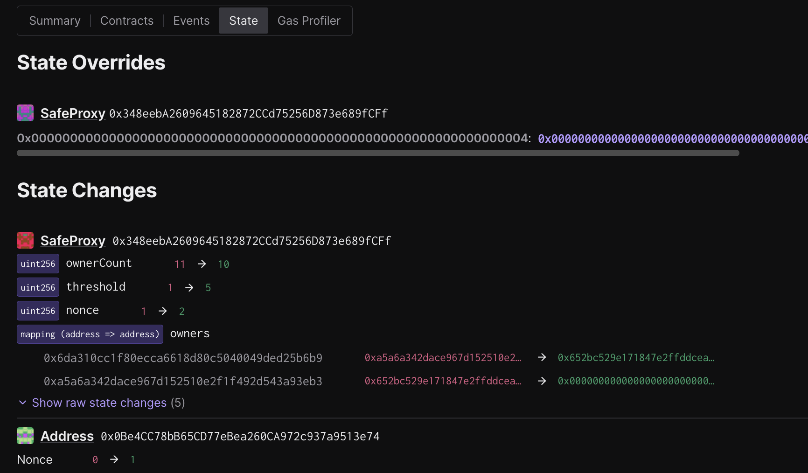
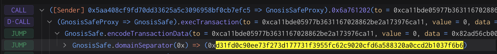
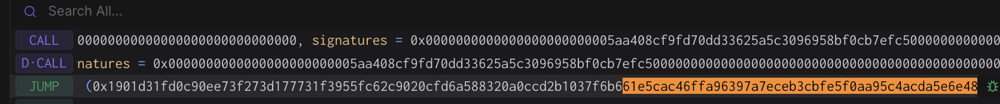

# Rehearsal 2 - Signer Removal

## Objective

In this rehearsal we will be removing one of the owners of the Safe.

Once completed:
- There will be 1 fewer owner
- The threshold should be unchanged

The call that will be executed by the Safe contract is defined in a
json file. This will be the standard approach for all transactions.

Note that no onchain actions will be taking place during this
signing. You won’t be submitting a transaction and your address
doesn’t even need to be funded. These are offchain signatures produced
with your wallet which will be collected by a Facilitator will execute
the contract, submitting all signatures for its execution.

Execution can be finalized by anyone once a threshold of signatures
are collected, so a Facilitator will do the final execution for
convenience.

## Approving the transaction

### 1. Update repo and move to the appropriate folder for this rehearsal task:

```
cd superchain-ops
git pull
just install
cd security-council-rehearsals/2025-01-19-r2-remove-signer-250119
```

### 2. Setup Ledger

Your Ledger needs to be connected and unlocked. The Ethereum
application needs to be opened on Ledger with the message “Application
is ready”.

### 3. Simulate and validate the transaction

Make sure your ledger is still unlocked and run the following.

Remember that by default `just` is running with the address derived
from `/0` (first nonce). If you wish to use a different account, run
`just simulate [X]`, where X is the derivation path of the address
that you want to use.

``` shell
just simulate
```

You will see a "Simulation link" from the output.

Paste this URL in your browser. A prompt may ask you to choose a
project, any project will do. You can create one if necessary.

Click "Simulate Transaction".

We will be performing 3 validations and ensure the domain hash and
message hash are the same between the Tenderly simulation and your
Ledger:

1. Validate integrity of the simulation.
2. Validate correctness of the state diff.
3. Validate and extract domain hash and message hash to approve.

#### 3.1. Validate integrity of the simulation.

Make sure you are on the "Overview" tab of the tenderly simulation, to
validate integrity of the simulation, we need to

1. "Network": Check the network is Ethereum Mainnet.
2. "Timestamp": Check the simulation is performed on a block with a
   recent timestamp (i.e. close to when you run the script).
3. "Sender": Check the address shown is your signer account. If not,
   you will need to determine which “number” it is in the list of
   addresses on your ledger. By default the script will assume the
   derivation path is m/44'/60'/0'/0/0. By calling the script with
   `just simulate 1` it will derive the address using
   m/44'/60'/1'/0/0 instead.

Here is an example screenshot, note that the Timestamp and Sender
might be different in your simulation:


#### 3.2. Validate correctness of the state diff.

Now click on the "State" tab. Verify that:

1. The rehearsal Safe's `ownerCount` is reduced by one, and a signer
   is being removed from the `owners` mapping.
2. You will see a `threshold` change from `1` to a new value. This
   only exists in the simulation and is safe to ignore as long as the
   new value is equal to the actual threshold of the Safe.
3. There are no other significant state changes except for 2 nonce
   changes from the Safe and the signer address.
4. You will see a state override (not a state change). This is
   expected and its purpose is to generate a successful Safe execution
   simulation without collecting any signatures.

Here is an example screenshot. Note that the addresses may be
different:



#### 3.3. Extract the domain hash and the message hash to approve.

Now that we have verified the transaction performs the right
operation, we need to extract the domain hash and the message hash to
approve.

Go back to the "Overview" tab, and find the first
`GnosisSafe.domainSeparator` call. This call's return value will be
the domain hash that will show up in your Ledger.

Here is an example screenshot. Note that the hash value may be
different:



Right before the `GnosisSafe.domainSeparator` call, you will see a
call to `GnosisSafe.encodeTransactionData`. Its return value will be a
concatenation of `0x1901`, the domain hash, and the message hash:
`0x1901[domain hash][message hash]`.

Here is an example screenshot. Note that the hash value may be
different:



Note down both the domain hash and the message hash. You will need to
compare them with the ones displayed on the Ledger screen at signing.

### 4. Approve the signature on your ledger

Once the validations are done, it's time to actually sign the
transaction. Make sure your ledger is still unlocked and run the
following:

``` shell
just sign # or just sign <hdPath>
```

> [!IMPORTANT] This is the most security critical part of the
> playbook: make sure the domain hash and message hash in the
> following two places match:

1. on your Ledger screen.
2. in the Tenderly simulation. You should use the same Tenderly
   simulation as the one you used to verify the state diffs, instead
   of opening the new one printed in the console.

There is no need to verify anything printed in the console. There is
no need to open the new Tenderly simulation link either.

After verification, sign the transaction. You will see the `Data`,
`Signer` and `Signature` printed in the console. Format should be
something like this:

```
Data:  <DATA>
Signer: <ADDRESS>
Signature: <SIGNATURE>
```

Double check the signer address is the right one.

### 5. Send the output to Facilitator(s)

Nothing has occurred onchain - these are offchain signatures which
will be collected by Facilitators for execution. Execution can occur
by anyone once a threshold of signatures are collected, so a
Facilitator will do the final execution for convenience.

Format should be something like this:

```
Data:  <DATA>
Signer: <ADDRESS>
Signature: <SIGNATURE>
```

Share the `Data`, `Signer` and `Signature` with the Facilitator, and
congrats, you are done!

## [For Facilitator ONLY] How to prepare and execute the rehearsal

### [Before the rehearsal] Prepare the rehearsal

#### 1. Update .env file

1. Set the `COUNCIL_SAFE` address in `.env` to the same one used in
   `r1-hello-council`.
2. The `removeOwner` method on the multisig requires three parameters:
   the `preOwner` address, the `owner` address to remove, and the new
   `_threshold`. To find out the right `preOwner` address, run `just
   get-owners` to get the list of owners. The address before the owner
   to remove should be the right `preOwner` to use in the call. If the
   owner to remove is the first one in the list, use
   `0x0000000000000000000000000000000000000001`.
3. Update the `SIGNER_TO_REMOVE` and `PREVIOUS_OWNER` addresses in
   `.env`.
4. Run `just prepare`.
5. Test the newly created rehearsal by following the security council
   steps in the `Approving the transaction` section above.
6. Update the rehearsal folder name in the `1. Update repo and move to
   the appropriate folder for this rehearsal task` section and the
   addresses in the `3.2. Validate correctness of the state diff`
   section above.
7. Commit the newly created files to Github.

#### 2. Update input.json

1. Run `just prepare-json` to update the `input.json` file.
2. Test the newly created rehearsal by following the security council
   steps in the `Approving the transaction` section above.
3. Update the rehearsal folder name in the `1. Update repo and move to
   the appropriate folder for this rehearsal task` section and the
   address in the `3.2. Validate correctness of the state diff`
   section above.
4. Commit the newly created files to Github.

### [After the rehearsal] Execute the output

1. Collect outputs from all participating signers.
2. Concatenate all signatures and export it as the `SIGNATURES`
   environment variable, i.e. `export
   SIGNATURES="0x[SIGNATURE1][SIGNATURE2]..."`.
3. Run `just execute 0 # or 1 or ...` to execute the transaction onchain.

For example, if the quorum is 2 and you get the following outputs:

``` shell
Data:  0xDEADBEEF
Signer: 0xC0FFEE01
Signature: AAAA
```

``` shell
Data:  0xDEADBEEF
Signer: 0xC0FFEE02
Signature: BBBB
```

Then you should run

``` shell
export SIGNATURES="0xAAAABBBB"
just execute 0 # or 1 or ...
```
