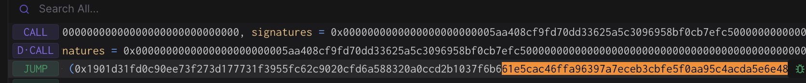

# Rehearsal 1 - Welcome to SuperchainOps

## Objective

This rehearsal is intended simply to ensure that all the signers feel
confident running the tooling and performing the validations required
to execute an onchain action.

Once completed, you can be sure that if the task is executed, the WelcomeToSuperchainOps contract will return `"Welcome to SuperchainOps, <name>"` from its [`welcome()`](https://etherscan.io/address/0x0fb11b4164894912f079de62699f4cc5a2271f0c#readContract#F2) method.

The call that will be executed can be found in the `build` function of the [`WelcomeToSuperchainOps`](../../src/template/WelcomeToSuperchainOps.sol) template.

Note that no onchain actions will be taking place during this
signing. You won’t be submitting a transaction and your address
doesn’t even need to be funded. These are offchain signatures produced with your wallet. 
A Facilitator will collect them and use them to execute the transaction that you approved.

Execution can be finalized by anyone once a threshold of signatures
are collected, so a Facilitator will do the final execution for
convenience.

## Approving the transaction

### 1. Update repo and move to the appropriate folder for this rehearsal task:

```
cd superchain-ops
git pull
# Make sure you've installed the dependencies for the repository.
cd src/tasks/<network>/rehearsals/<rehearsal-task-name> # This path should be shared with you by the Facilitator.
```

See the [README](../../src/README.md) for more information on how to install the dependencies for the repository.

### 2. Setup Ledger

Your Ledger needs to be connected and unlocked. The Ethereum
application needs to be opened on Ledger with the message “Application
is ready”.

### 3. Simulate and validate the transaction

Make sure your ledger is still unlocked and run the following.

``` shell
cd src/tasks/<network>/rehearsals/<rehearsal-task-name>
just --dotenv-path $(pwd)/.env simulate
# For a different derivation path, use: HD_PATH=1 just --dotenv-path $(pwd)/.env simulate
```

You will see a "Simulation link" URL in the output.

Copy this URL from the output and and open it with your browser. A prompt may ask you to choose a
project, any project will do. You can create one if necessary.

Click "Simulate Transaction".

We will be performing 3 validations and ensure the domain hash and
message hash are the same between the Tenderly simulation and your
Ledger:

1. Validate integrity of the simulation.
2. Validate correctness of the state diff.
3. Validate and extract domain hash and message hash to approve.

#### 3.1. Validate integrity of the simulation.

To validate integrity of the simulation, we need to check the following:

1. "Network": Check the network is Ethereum Mainnet.
2. "Timestamp": Check the simulation is performed on a block with a
   recent timestamp (i.e. close to when you run the script).
3. "Sender": Check the address shown is your signer account. If not,
   you will need to determine which “number” it is in the list of
   addresses on your ledger. By default the script uses derivation path 0
   (`m/44'/60'/0'/0/0`). You can set the HD_PATH environment variable to use a different path.

Here is an example screenshot, note that the Timestamp and Sender might be different in your simulation:


#### 3.2. Validate correctness of the state diff.

Now click on the "State" tab. Verify that:

1. Under address `0x0fb11b4164894912f079de62699f4cc5a2271f0c`, the
   storage key `0x0`'s `After` value changed to `0x5361746f7368690000000000000000000000000000000000000000000000000e` (for when `name` in the `config.toml` file is 'Satoshi'). This is indicating that the [`name`](https://etherscan.io/address/0x0fb11b4164894912f079de62699f4cc5a2271f0c#readContract#F1) variable is successfully changed to `"Satoshi"`. 
   ```bash
   cast --to-utf8 0x5361746f7368690000000000000000000000000000000000000000000000000e
   # Returns: Satoshi
   ```
2. You'll notice two other changes: 
   - The `nonce` of the signer address being incremented.
   - The `nonce` of the Security Council safe being incremented.
   - (Optional: Only present if you're using the real Security Council safe) The `lastLive` value on the `LivenessGuard` contract being updated for the signer address.
       - You can verify the `slot` using the command:
       ```bash
       cast index address <signer-address> 0 
       # 0 is the slot on the LivenessGuard contract for the lastLive mapping.
       # Returns: slot shown in the state diff for the LivenessGuard contract.
       ```
       The `After` value of the `lastLive` slot will change with every simulation. This is because the `block.timestamp` is different for each simulation.
3. You will see some state overrides (under the `State Overrides` section). This is
   expected and its purpose is to generate a successful Safe execution
   simulation without collecting any signatures. You can read more about the specific state overrides [here](https://github.com/ethereum-optimism/superchain-ops/blob/main/SINGLE-VALIDATION.md#state-overrides).

Here is an example screenshot. Note that the addresses may be
different:


#### 3.3. Extract the domain hash and the message hash to approve.

Now that we have verified the transaction performs the right
operation, we need to extract the domain hash and the message hash to
approve.

Go back to the "Summary" tab, and find the first
`GnosisSafe.domainSeparator` call. This call's return value will be
the domain hash that will show up in your Ledger.

Here is an example screenshot. Note that the hash value may be
different:


Right before the `GnosisSafe.domainSeparator` call, you will see a
call to `GnosisSafe.encodeTransactionData`. Its return value will be a
concatenation of `0x1901`, the domain hash, and the message hash (last 32 bytes/64 hex characters):
`0x1901[domain hash][message hash]`.

Here is an example screenshot. Note that the hash value may be
different:



Note down both the domain hash and the message hash. You will need to
compare them with the ones displayed in your terminal AND on the Ledger screen at signing.

### 4. Approve the signature on your ledger

Once the validations are done, it's time to actually sign the
transaction. Make sure your ledger is still unlocked and run the
following:

``` shell
cd src/tasks/<network>/rehearsals/<rehearsal-task-name>
just --dotenv-path $(pwd)/.env sign
# For a different derivation path, use: HD_PATH=1 just --dotenv-path $(pwd)/.env sign
```

> [!IMPORTANT] This is the most security critical part of the
> playbook: make sure the domain hash and message hash in the
> following three places match:

1. In your terminal output.
2. On your Ledger screen.
3. In the Tenderly simulation. You should use the same Tenderly
   simulation as the one you used to verify the state diffs, instead
   of opening the new one printed in the console.

After verification, sign the transaction. You will see the `Data`,
`Signer` and `Signature` printed in the console. Format should be
something like this:

```
Data:  <DATA>
Signer: <ADDRESS>
Signature: <SIGNATURE>
```

Double check the signer address is the right one.

### 5. Send the output to Facilitator(s)

Nothing has occurred onchain - these are offchain signatures which
will be collected by Facilitators for execution. Execution can occur
by anyone once a threshold of signatures are collected, so a
Facilitator will do the final execution for convenience.

Format should be something like this:

```
Data:  <DATA>
Signer: <ADDRESS>
Signature: <SIGNATURE>
```

Share the `Data`, `Signer` and `Signature` with the Facilitator, and
congrats, you are done!

## [For Facilitator ONLY] How to prepare and execute the rehearsal

### [Before the rehearsal] Prepare the rehearsal

#### 1. Create the Council Safe

The first step of preparing the rehearsal is creating a multisig for
the participants using the [Safe
UI](https://app.safe.global/new-safe/create?chain=eth).

To make the preparation and coordination of the ceremonies easier, we
recommend setting the threshold (M) of the multisig to be equal to the
number of participants, and add M+1 additional signers
using keys owned by the Facilitator, to make it a M-of-2M+1 multisig. 
For example, if there are 3 participants, we recommend creating a 3 of 7
multisig with 4 additional keys owned by the Facilitator.

#### 2. Create a new task in the `eth` directory:

```bash
cd superchain-ops/src
just new task # Follow the prompts to create a new rehearsals task. 
# (a) choose 'eth' 
# (b) choose 'WelcomeToSuperchainOps' 
# (c) press enter to answer 'no' to 'Is this a test task?'
# (d) press 'y' for 'Is this a security council rehearsal task?'
# (e) enter a name of the task in the format of '<yyyy-mm-dd>-<task-name>'

# This creates a new directory in the `src/tasks/eth/rehearsals` directory.
```

Next, make sure your `config.toml` is correct. You should use the TOML below as a starting point.

```toml
templateName = "WelcomeToSuperchainOps"

name = "Satoshi" # Enter your name here if you like.

allowOverwrite = ["SecurityCouncil"] # We know that we want to overwrite the default SecurityCouncil address in [addresses].

[addresses]
TargetContract = "0x0fb11b4164894912f079de62699f4cc5a2271f0c" # This is the mainnet deployment. Sepolia deployment of target contract: 0x5c6623738B2a3a54edF1d46B2A85f959fe6b1f6b
SecurityCouncil = "<enter-your-multisig-address>" # This is the address of the multisig that you created in step 1. e.g. 0x799F5202AEBB41eC779e046e46a4D033d367d877.
```

For mainnet, the Gnosis safe that you will be signing for will be the safe you created in step 1. If you don't include the `SecurityCouncil` address entry in the `config.toml` file, the code will automatically retrieve the real `SecurityCouncil` safe address from the [`addresses.toml`](../../src/addresses.toml) file (we don't want this). 

#### 3. Test the rehearsal and commit the files to Github

1. Test the newly created rehearsal by following the security council
   steps in the `Approving the transaction` section above.
2. Commit the newly created files to Github.

### [After the rehearsal] Execute the output

1. Collect outputs from all participating signers.
2. Concatenate all signatures and export it as the `SIGNATURES`
   environment variable, i.e. `export
   SIGNATURES="0x[SIGNATURE1][SIGNATURE2]..."`.
3. Execute the transaction onchain.

For example, if the quorum is 2 and you get the following outputs:

``` shell
Data:  0xDEADBEEF
Signer: 0xC0FFEE01
Signature: AAAA
```

``` shell
Data:  0xDEADBEEF
Signer: 0xC0FFEE02
Signature: BBBB
```

Then you should run

``` shell
export SIGNATURES="0xAAAABBBB"
cd src/tasks/<network>/rehearsals/<rehearsal-task-name>
just --dotenv-path $(pwd)/.env execute
```

For posterity, you should make a `README.md` file in the tasks directory that contains a link to the executed transaction e.g. see [here](../../src/tasks/eth/rehearsals/2025-07-21-R1-welcome/README.md).