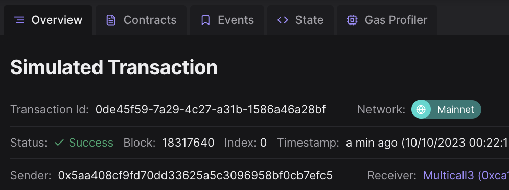
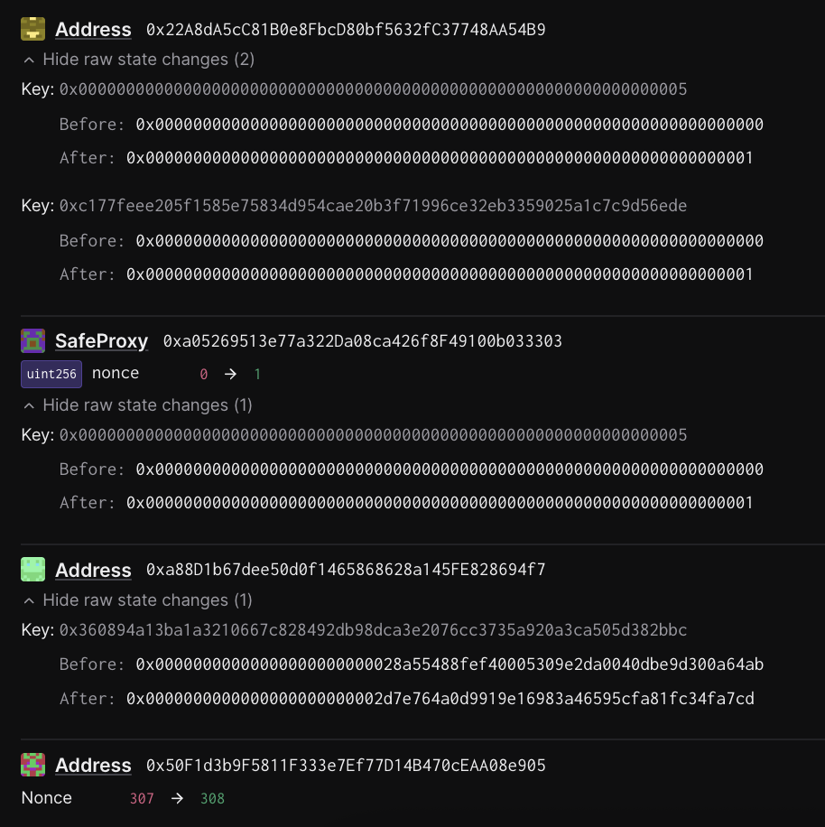
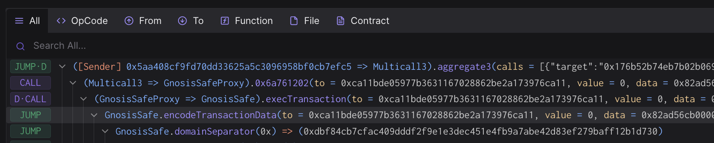
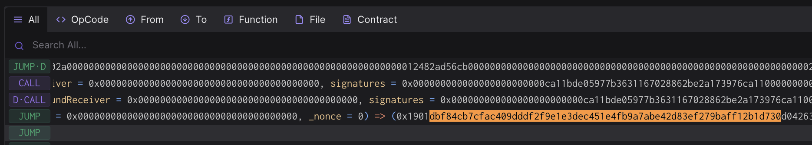
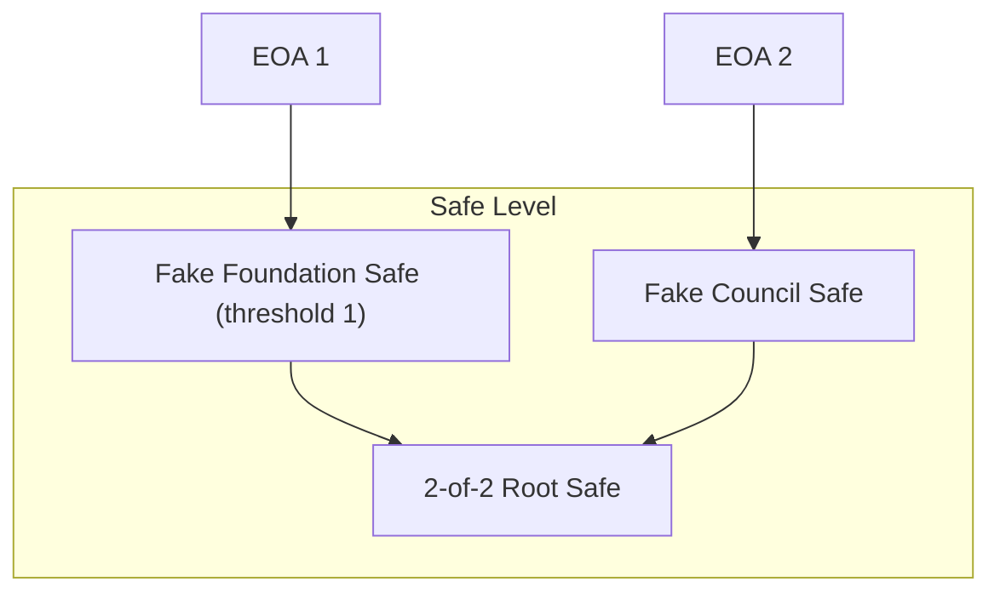
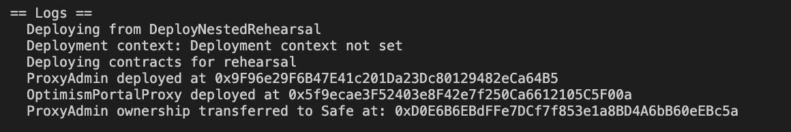

# Rehearsal 4 - Protocol Upgrade via Nested Multisig

## Objective

In this rehearsal we will be performing a simple protocol upgrade.

Once Completed, a fake OptimismPortalProxy contract will be upgraded to a new implementation. Additional setup is required to create all the necessary contracts to simulate this upgrade. We want to make it as close to a production upgrade as possible. Therefore, we will require:
1. Deploying a ProxyAdmin contract.
2. Deploying a OptimismPortalProxy contract.
3. Deploying a fake Security Council Safe (can reuse the same Safe as the previous rehearsal).
4. Deploying a fake Foundation Safe.
5. Deploying a fake ProxyAdminOwner Safe (2-of-2 between the safes from steps 3 and 4).

The call executed by the Safe contract is defined in the `build` function of the [`SetEIP1967Implementation`](../../src/template/SetEIP1967Implementation.sol) template.

Note: No onchain actions will occur during this rehearsal. You are not submitting a transaction, and your wallet does not need to be funded. You will simply sign an offchain message with your wallet. These signatures will be collected by a Facilitator, who will submit them for execution.
Once the required number of signatures is collected, anyone can finalize the execution. For convenience, a Facilitator will handle this step.

## Approving the transaction

### 1. Update repo and move to the appropriate folder for this rehearsal task:

```
cd superchain-ops
git pull
# Make sure you've installed the dependencies for the repository.
cd src/tasks/<network>/rehearsals/<rehearsal-task-name> # This path should be shared with you by the Facilitator.
```

See the [README](../../src/README.md) for more information on how to install the dependencies for the repository.

### 2. Setup Ledger

Your Ledger needs to be connected and unlocked. The Ethereum
application needs to be opened on Ledger with the message "Application
is ready".

### 3. Simulate and validate the transaction

Make sure your ledger is still unlocked and run the following.

``` shell
cd src/tasks/<network>/rehearsals/<rehearsal-task-name>
just --dotenv-path $(pwd)/.env simulate test-rehearsal-council
# For a different derivation path, use: HD_PATH=1 just --dotenv-path $(pwd)/.env simulate test-rehearsal-council
# 'test-rehearsal-council' maps to the test rehearsal security council safe in the tasks 'config.toml' file. Denoted as 'TestRehearsalCouncil'.
```

You will see a "Simulation link" URL in the output.

Copy this URL from the output and and open it with your browser. A prompt may ask you to choose a
project, any project will do. You can create one if necessary.

Click "Simulate Transaction".

We will be performing 3 validations and ensure the domain hash and
message hash are the same between the Tenderly simulation and your
Ledger:

1. Validate integrity of the simulation.
2. Validate correctness of the state diff.
3. Validate and extract domain hash and message hash to approve.

#### 3.1. Validate integrity of the simulation.

To validate integrity of the simulation, we need to check the following:

1. "Network": Check the network is Ethereum Mainnet.
2. "Timestamp": Check the simulation is performed on a block with a
   recent timestamp (i.e. close to when you run the script).
3. "Sender": Check the address shown is your signer account. If not,
   you will need to determine which “number” it is in the list of
   addresses on your ledger. By default the script will assume the
   derivation path is `m/44'/60'/0'/0/0`.

Here is an example screenshot, note that the Timestamp and Sender
might be different in your simulation:



#### 3.2. Validate correctness of the state diff.

Now click on the "State" tab. Verify that:

1. In `0xa88D1b67dee50d0f1465868628a145FE828694f7` (the `OptimismPortalProxy` contract, this is an example address that exist on sepolia. You should look for your own specific address in the state diff.):
   - The implementation of the `OptimismPortalProxy` contract (storage key [0x360894a13ba1a3210667c828492db98dca3e2076cc3735a920a3ca505d382bbc](https://github.com/ethereum-optimism/optimism/blob/cb42a6108d780451f6cecceff8182e11aa6a0490/packages/contracts-bedrock/src/libraries/Constants.sol#L27C9-L27C75)) is changed to `0x0000000000000000000000002d7e764a0d9919e16983a46595cfa81fc34fa7cd` which is `0x2D7e764a0D9919e16983a46595CfA81fc34fa7Cd`. This value should match the `newImplementation` in the `config.toml` file.

All of these addresses should be part of the Optimism Governance vote that approves this upgrade if this is a [Normal Operation](https://github.com/ethereum-optimism/OPerating-manual/blob/1f42a3766d084864a818b93ce7ba0857a4a846ea/Security%20Council%20Charter%20v0.1.md#normal-operation).

_Note: The screenshot below is an example. You should look for your own specific address in the state diff._


#### 3.3. Extract the domain hash and the message hash to approve.

Now that we have verified the transaction performs the right
operation, we need to extract the domain hash and the message hash to
approve.

Go back to the "Overview" tab, and find the first
`GnosisSafe.domainSeparator` call. This call's return value will be
the domain hash that will show up in your Ledger.

Here is an example screenshot. Note that the hash value may be
different:



Right before the `GnosisSafe.domainSeparator` call, you will see a
call to `GnosisSafe.encodeTransactionData`. Its return value will be a
concatenation of `0x1901`, the domain hash, and the message hash:
`0x1901[domain hash][message hash]`.

Here is an example screenshot. Note that the hash value may be
different:



Note down both the domain hash and the message hash. You will need to
compare them with the ones displayed in your terminal AND on the Ledger screen at signing.

### 4. Approve the signature on your ledger

Once the validations are done, it's time to actually sign the
transaction. Make sure your ledger is still unlocked and run the
following:

``` shell
cd src/tasks/<network>/rehearsals/<rehearsal-task-name>
just --dotenv-path $(pwd)/.env sign test-rehearsal-council
# For a different derivation path, use: HD_PATH=1 just --dotenv-path $(pwd)/.env sign test-rehearsal-council
# 'test-rehearsal-council' maps to the test rehearsal security council safe in the tasks 'config.toml' file.
```

> [!IMPORTANT] This is the most security critical part of the
> playbook: make sure the domain hash and message hash in the
> following three places match:

1. In your terminal output.
2. On your Ledger screen.
3. In the Tenderly simulation. You should use the same Tenderly
   simulation as the one you used to verify the state diffs, instead
   of opening the new one printed in the console.

After verification, sign the transaction. You will see the `Data`,
`Signer` and `Signature` printed in the console. Format should be
something like this:

```
Data:  <DATA>
Signer: <ADDRESS>
Signature: <SIGNATURE>
```

Double check the signer address is the right one.

### 5. Send the output to Facilitator(s)

Nothing has occurred onchain - these are offchain signatures which
will be collected by Facilitators for execution. Execution can occur
by anyone once a threshold of signatures are collected, so a
Facilitator will do the final execution for convenience.

Format should be something like this:

```
Data:  <DATA>
Signer: <ADDRESS>
Signature: <SIGNATURE>
```

Share the `Data`, `Signer` and `Signature` with the Facilitator, and
congrats, you are done!

## [For Facilitator ONLY] How to prepare and execute the rehearsal

### [Before the rehearsal] Prepare the rehearsal

#### 1. Create and configure the safes

To simulate our production Safe configuration (i.e. 2-of-2 between the Security Council and the Optimism Foundation), we need to create 2 more Safe contracts. We are assuming you have already created the Security Council Safe in the [previous rehearsal](../step-1-welcome/README.md). You should create the safes in the following order:
1. Fake Foundation Safe: You can set the owner on this safe to your EOA and the threshold to 1.
2. Owner Safe: This safe will have two owners (fake security council and the fake foundation safe). It's important they're both Safe contracts. The simulation will fail if they're not. Set the threshold to 2.

You should leverage the [Safe UI](https://app.safe.global/new-safe/create?chain=eth) to do that.

The resulting configuration must resemble the following:


#### 2. Create the rehearsal contracts

1. Set the `OWNER_SAFE` address in [`.env`](./.env) to the newly-created Safe address.
2. Set the `COUNCIL_SAFE` address in [`.env`](./.env) to the same one used in previous rehearsals.
3. Make sure your Ledger is connected and run `just deploy-contracts` to deploy the rehearsal contracts. There will be two contracts deployed: the `OptimismPortalProxy` and the `ProxyAdmin` as their admin (you'll have to accept a total of 4 transactions on your Ledger).
4. Take note of all the addresses that are deployed, we will need them for the next step.

Below is a screenshot of example output of the `just deploy-contracts` command: 


#### 3. Create a new task in the `eth` directory:

```bash
cd superchain-ops/src
just new task # Follow the prompts to create a new rehearsals task. 
# (a) choose 'eth' 
# (b) choose 'SetEIP1967Implementation' 
# (c) press enter to answer 'no' to 'Is this a test task?'
# (d) press 'y' for 'Is this a security council rehearsal task?'
# (e) enter a name of the task in the format of '<yyyy-mm-dd>-<task-name>'

# This creates a new directory in the `src/tasks/eth/rehearsals` directory.
```

Next, make sure your `config.toml` file, located in your newly created task directory, is correct. You should use the TOML below as a starting point. Make sure to fill in the missing values.

```toml
l2chains = [
    {name = "Rehearsal Chain", chainId = 10101010101010} # Create a fake chain
]
fallbackAddressesJsonPath = "src/tasks/eth/rehearsals/<rehearsal-task-name>/addresses.json" # You're going to create this file in the next step. Make sure to update the path to the correct directory.

templateName = "SetEIP1967Implementation"

contractIdentifier = "OptimismPortalProxy"
newImplementation = "0x2D7e764a0D9919e16983a46595CfA81fc34fa7Cd" # This is an old OptimismPortalProxy implementation. You can change this if you like. 

[addresses]
TestRehearsalCouncil = "<enter-your-security-council-safe-address>" # This is the address of the Safe that you already created.
TestRehearsalFoundation = "<enter-your-foundation-safe-address>" # This is the address of the Safe that you already created.
```

_Note_: The task you create should look similar to the example task in the [`test/tasks/example/sep/018-set-eip1967-impl` directory](../../test/tasks/example/sep/018-set-eip1967-impl).

#### 4. Create the `addresses.json` file

Create a new file called `addresses.json` in the same directory as the `config.toml` file. The `fallbackAddressesJsonPath` property in the `config.toml` file should point to this file. Using the addresses from the `just deploy-contracts` output, fill in the `addresses.json` file.

_Note: You'll have to remove the comments from the JSON file for it to work correctly._
```json
{
    "10101010101010": { // Make sure this chainId matches the one in the `config.toml` file. This can be completely made up.
      "ProxyAdminOwner": "<enter-your-owner-safe-address>", // This is the address of the Safe that you created in step 1.
      "ProxyAdmin": "<enter-your-proxy-admin-address>", // This is the address of the ProxyAdmin that you deployed in step 2.
      "OptimismPortalProxy": "<enter-your-optimism-portal-proxy-address>" // This is the address of the OptimismPortalProxy that you deployed in step 2.
    }
}
```

Commit the newly created files to Github.

### [After the rehearsal] Execute the output

1. Collect outputs from all participating signers on the security council safe.
2. Concatenate all signatures and export it as the `SIGNATURES` environment variable, i.e. `export SIGNATURES="0x[SIGNATURE1][SIGNATURE2]..."`.
3. Run the approval for the Security Council Safe:
```bash
# These should be the signatures from the signers on the security council safe.
export SIGNATURES="0x[SIGNATURE1]..."
just --dotenv-path $(pwd)/.env approve test-rehearsal-council
# 'test-rehearsal-council' maps to the test rehearsal security council safe in the tasks 'config.toml' file. Denoted as 'TestRehearsalCouncil'.
```
4. Run the approval for the Foundation Safe. Note that `SIGNATURES` will now contain signatures from the foundation safe, not the security council safe.
```bash
# These should be the signatures from the signers on the foundation safe.
export SIGNATURES="0x[SIGNATURE1]..."
# Remember, if you're using a different HD_PATH to set the env var e.g. 'export HD_PATH=1'
just --dotenv-path $(pwd)/.env approve test-rehearsal-foundation
# 'test-rehearsal-foundation' maps to the test rehearsal foundation safe in the tasks 'config.toml' file. Denoted as 'TestRehearsalFoundation'.
```
5. Perform the final execution:
```bash
# Reset the SIGNATURES env var as it can sometimes interact with the execute function.
export SIGNATURES=""
# Remember, if you're using a different HD_PATH to set the env var e.g. 'export HD_PATH=1'
just --dotenv-path $(pwd)/.env execute
```
