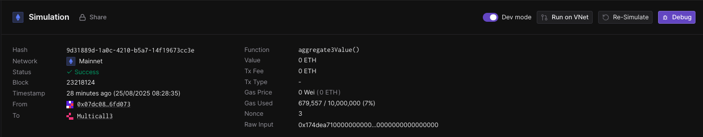
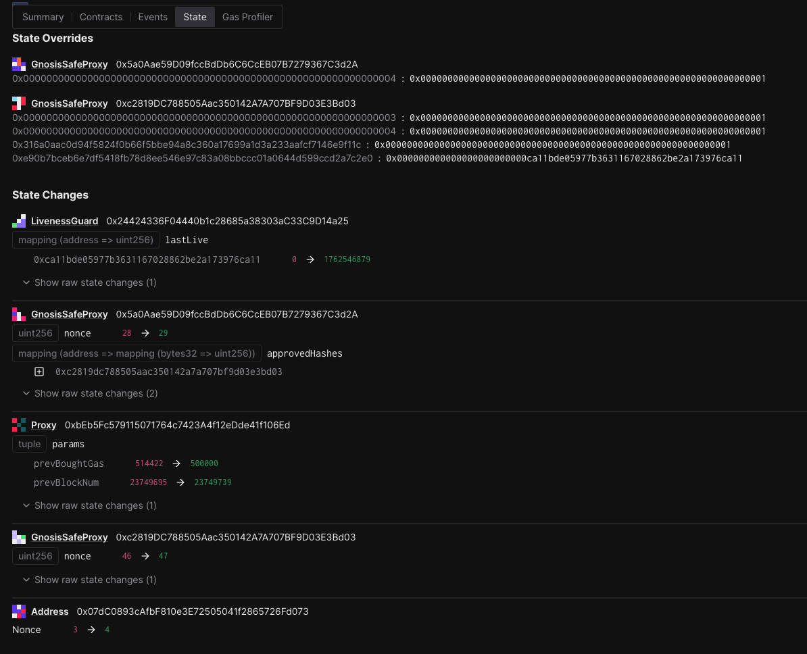
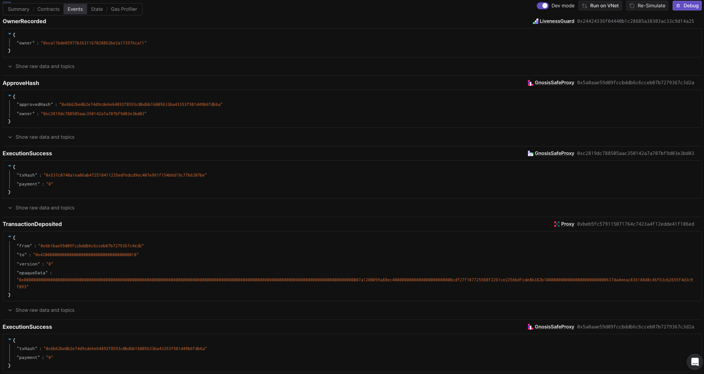
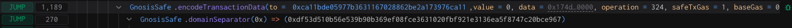
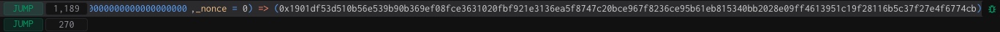

# Rehearsal 4 - No-op Governor Upgrade

## Objective

In this rehearsal, we will be performing an upgrade call to the Governor Proxy on OP Mainnet.

Once completed:

- A deposit transaction event will be emitted from the OptimismPortal contract on L1.
- The Governor implementation on OP Mainnet will remain unchanged

The call executed by the Safe contract is defined in the `build` function of the [`L1PortalExecuteL2Call`](/src/template/L1PortalExecuteL2Call.sol) template.

Note: No onchain actions will occur during this rehearsal. You are not submitting a transaction, and your wallet does not need to be funded. You will simply sign an offchain message with your wallet. These signatures will be collected by a Facilitator, who will submit them for execution.
Once the required number of signatures is collected, anyone can finalize the execution. For convenience, a Facilitator will handle this step.

## Approving the transaction

### 1. Update repo and move to the appropriate folder for this rehearsal task:

```
cd superchain-ops
git pull
# Make sure you've installed the dependencies for the repository.
cd src/tasks/<network>/rehearsals/<rehearsal-task-name> # This path should be shared with you by the Facilitator.
```

See the [README](/README.md) for more information on how to install the dependencies for the repository.

### 2. Setup Ledger

Your Ledger needs to be connected and unlocked. The Ethereum application needs to be opened on Ledger with the message “Application is ready”.

### 3. Simulate and validate the transaction

Make sure your ledger is still unlocked and run the following.

```shell
cd src/tasks/<network>/rehearsals/<rehearsal-task-name>
just --dotenv-path $(pwd)/.env simulate
# For a different derivation path, use: HD_PATH=1 just --dotenv-path $(pwd)/.env simulate
# For simulating without Ledger, use: SIMULATE_WITHOUT_LEDGER=1 just --dotenv-path $(pwd)/.env simulate council
```

You will see a "Simulation link" URL in the output.

Copy this URL from the output and and open it with your browser. A prompt may ask you to choose a project, any project will do. You can create one if necessary.

Click "Simulate Transaction".

We will be performing 3 validations and ensure the domain hash and message hash are the same between the Tenderly simulation and your Ledger:

1. Validate integrity of the simulation.
2. Validate correctness of the state diff.
3. Validate and extract domain hash and message hash to approve.

#### 3.1. Validate integrity of the simulation.

To validate integrity of the simulation, we need to check the following:

1. "Network": Check the network is Ethereum Mainnet.
2. "Timestamp": Check the simulation is performed on a block with a
   recent timestamp (i.e. close to when you run the script).
3. "Sender": Check the address shown is your signer account. If not,
   you will need to determine which “number” it is in the list of
   addresses on your ledger. By default the script will assume the
   derivation path is `m/44'/60'/0'/0/0`.

Here is an example screenshot, note that the Timestamp and Sender
might be different in your simulation:



#### 3.2. Validate correctness of the state diff.

Now click on the "State" tab (dev mode has to be active). Verify that:

1. You'll see 3 nonce changes for: the signer address, the Safe and the Proxy Admin's safe.
2. You will see state overrides (not a state change) for both Council's Safe and Proxy Admin's. This is expected and its purpose is to generate a successful Safe execution simulation without collecting any signatures.
3. You will also see state changes on the Proxy Admin's `approvedHashes` mapping.
4. You will see state changes for the OptimismPortal's `prevBoughtGas` and `prevBlockNum` storage variables, on the first slot.
5. You may see some LivenessGuard state changes which are safe to ignore, as per the screenshot below. These are a result of using the production Security Council safe for the simulation, which has LivenessGuard enabled.

Here is an example screenshot. Note that the addresses may be
different:



Now click on the "Events" tab. Verify that:

1. `TransactionDeposited` event has been emitted by the Optimism Portal. This should include:
   - The correct `to` address, in this case, the address used in the `config.toml` for `l2Target`.
   - The correct `from` address, in this case, the aliased address of the `ProxyAdmin`.
   - The correct calldata sent to the target in the `opaqueData` field: this is the concatenation of the value sent to the contract, the gas limit, a flag indicating if we are creating a contract (`false` in this rehearsal) and the actual call made to the L2 contract.

Here is an example screenshot. Note the specific data might be different:



In this rehearsal the values correspond to:

```
0000000000000000000000000000000000000000000000000000000000000000 -> msg.value
0000000000000000000000000000000000000000000000000000000000000000 -> value sent to L2 contract
000000000007a120 -> Gas Limit, in the photo the value corresponds to 500,000
00 -> isCreation, set to false
0x99a88ec4000000000000000000000000cdf27f107725988f2261ce2256bdfcde8b382b10000000000000000000000000637da4eeac836188d8c46f63cb2655f4d3c9f893 -> The abi-encoded call to `upgrade(address proxy, address implementation)` with proxy `0xcDF27F107725988f2261Ce2256bDfCdE8B382B10` and implementation `0x637DA4Eeac836188D8C46F63Cb2655f4d3C9F893`
```

#### 3.3. Extract the domain hash and the message hash to approve.

Now that we have verified the transaction performs the right
operation, we need to extract the domain hash and the message hash to
approve.

Go back to the "Summary" tab, and find the first
`GnosisSafe.domainSeparator` call. This call's return value will be
the domain hash that will show up in your Ledger.

Here is an example screenshot. Note that the hash value may be
different:



Right before the `GnosisSafe.domainSeparator` call, you will see a
call to `GnosisSafe.encodeTransactionData`. Its return value will be a
concatenation of `0x1901`, the domain hash, and the message hash:
`0x1901[domain hash][message hash]`.

Here is an example screenshot. Note that the hash value may be
different:



Note down both the domain hash and the message hash. You will need to
compare them with the ones displayed in your terminal AND on the Ledger screen at signing.

### 4. Approve the signature on your ledger

Once the validations are done, it's time to actually sign the
transaction. Make sure your ledger is still unlocked and run the
following:

```shell
cd src/tasks/<network>/rehearsals/<rehearsal-task-name>
just --dotenv-path $(pwd)/.env sign
# For a different derivation path, use: HD_PATH=1 just --dotenv-path $(pwd)/.env sign
```

> [!IMPORTANT] This is the most security critical part of the
> playbook: make sure the domain hash and message hash in the
> following three places match:

1. In your terminal output.
2. On your Ledger screen.
3. In the Tenderly simulation. You should use the same Tenderly
   simulation as the one you used to verify the state diffs, instead
   of opening the new one printed in the console.

After verification, sign the transaction. You will see the `Data`,
`Signer` and `Signature` printed in the console. Format should be
something like this:

```
Data:  <DATA>
Signer: <ADDRESS>
Signature: <SIGNATURE>
```

Double check the signer address is the right one.

### 5. Send the output to Facilitator(s)

Nothing has occurred onchain - these are offchain signatures which
will be collected by Facilitators for execution. Execution can occur
by anyone once a threshold of signatures are collected, so a
Facilitator will do the final execution for convenience.

Format should be something like this:

```
Data:  <DATA>
Signer: <ADDRESS>
Signature: <SIGNATURE>
```

Share the `Data`, `Signer` and `Signature` with the Facilitator, and
congrats, you are done!

## [For Facilitator ONLY] How to prepare and execute the rehearsal

### [Before the rehearsal] Prepare the rehearsal

#### 1. Create a new task in the `eth` directory:

```bash
cd superchain-ops/src
just new task # Follow the prompts to create a new rehearsals task.
# (a) choose 'eth'
# (b) choose 'L1PortalExecuteL2Call'
# (c) press enter to answer 'no' to 'Is this a test task?'
# (d) press 'y' for 'Is this a security council rehearsal task?'
# (e) enter a name of the task in the format of '<yyyy-mm-dd>-<task-name>'

# This creates a new directory in the `src/tasks/eth/rehearsals` directory.
```

Next, make sure your `config.toml` is correct. You should use the TOML below as a starting point.

```toml
l2chains = [] # e.g. [{name = "OP Mainnet", chainId = 10}]
templateName = "L1PortalExecuteL2Call"

portal = "0x0" # L1 OptimismPortal
l2Target = "0x0" # replace with the target contract on L2
l2Data = "0x0" # calldata to pass to L2 contract
gasLimit = 500000
value = 0
isCreation = false

[addresses]
ProxyAdminOwner = "0x0"
OptimismPortal = "0x0"
```

#### 2. Test the rehearsal and commit the files to Github

1. Test the newly created rehearsal by following the security council
   steps in the `Approving the transaction` section above.
2. Commit the newly created files to Github.

### [After the rehearsal] Execute the output

1. Collect outputs from all participating signers.
2. Concatenate all signatures and export it as the `SIGNATURES`
   environment variable, i.e. `export
SIGNATURES="0x[SIGNATURE1][SIGNATURE2]..."`.
3. Execute the transaction onchain.

For example, if the quorum is 2 and you get the following outputs:

```shell
Data:  0xDEADBEEF
Signer: 0xC0FFEE01
Signature: AAAA
```

```shell
Data:  0xDEADBEEF
Signer: 0xC0FFEE02
Signature: BBBB
```

Then you should run

```shell
export SIGNATURES="0xAAAABBBB"
cd src/tasks/<network>/rehearsals/<rehearsal-task-name>
just --dotenv-path $(pwd)/.env execute
```

For posterity, you should make a `README.md` file in the tasks directory that contains a link to the executed transaction e.g. see [here](src/tasks/<network>/rehearsals/<rehearsal-task-name>/README.md).
