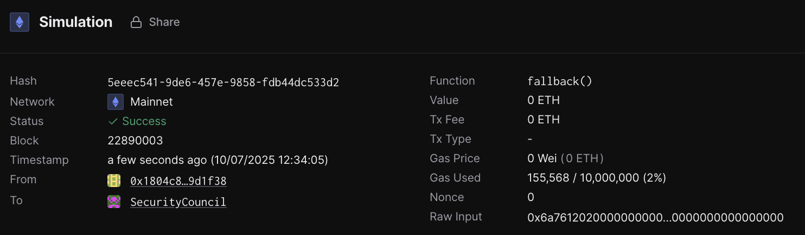
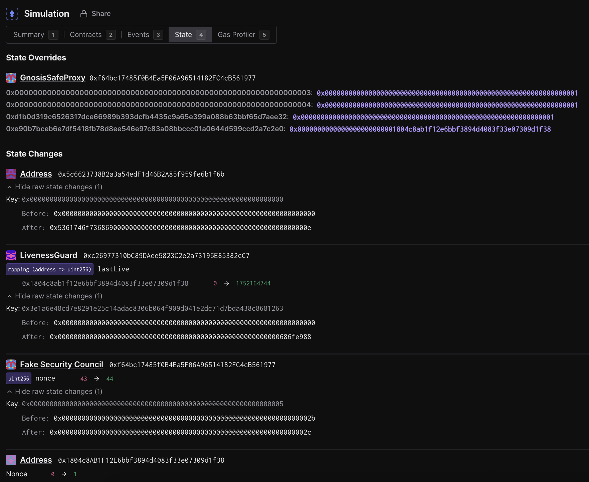
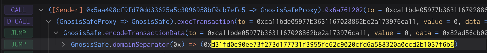
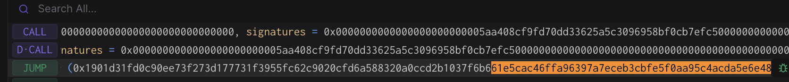

# Rehearsal 1 - Welcome to SuperchainOps

## Objective

This rehearsal is intended simply to ensure that all the signers feel
confident running the tooling and performing the validations required
to execute an onchain action.

Once completed, you can be sure that if the task is executed, the WelcomeToSuperchainOps contract will return `"Welcome to SuperchainOps, <name>"` from its [`welcome()`](https://etherscan.io/address/0x0fb11b4164894912f079de62699f4cc5a2271f0c#readContract#F2) method.

The call that will be executed can be found in the `build` function of the `WelcomeToSuperchainOps` template.

Note that no onchain actions will be taking place during this
signing. You won’t be submitting a transaction and your address
doesn’t even need to be funded. These are offchain signatures produced
with your wallet which will be collected by a Facilitator will execute
the contract, submitting all signatures for its execution.

Execution can be finalized by anyone once a threshold of signatures
are collected, so a Facilitator will do the final execution for
convenience.

## Approving the transaction

### 1. Create a new task in the `sep` directory:

```bash
cd superchain-ops/src/improvements
just new task # Follow the prompts to create a new rehearsals task. 
# (a) choose 'eth' 
# (b) choose 'WelcomeToSuperchainOps' 
# (c) press enter to answer 'no' to 'Is this a test task?'
# (d) press 'y' for 'Is this a security council rehearsal task?'
# (e) enter a name of the task in the format of '<yyyy-mm-dd>-<task-name>'

# This creates a new directory in the `src/improvements/tasks/eth/rehearsals` directory.
```

Next, make sure your `config.toml` is correct. You should use the TOML below as a starting point.

```toml
templateName = "WelcomeToSuperchainOps"

name = "Satoshi" # Enter your name here if you like.

[addresses]
TargetContract = "0x0fb11b4164894912f079de62699f4cc5a2271f0c" # Mainnet deployment of target contract.
```

For sepolia, the Gnosis safe that you will be signing for will be the `SecurityCouncil` safe. Because this task lives in the `eth` directory, the code automatically retrieves the `SecurityCouncil` safe address from the [`addresses.toml`](../../src/improvements/addresses.toml) file. 

### 2. Setup Ledger

Your Ledger needs to be connected and unlocked. The Ethereum
application needs to be opened on Ledger with the message “Application
is ready”.

### 3. Simulate and validate the transaction

Make sure your ledger is still unlocked and run the following.

``` shell
cd tasks/eth/rehearsals/<your-rehearsal-task-name>
just --dotenv-path $(pwd)/.env --justfile ../../../../single.just simulate 0
# You may change the integer from '0' to your own specific derivation path value.
```

You will see a "Simulation link" from the output.

Paste this URL in your browser. A prompt may ask you to choose a
project, any project will do. You can create one if necessary.

Click "Simulate Transaction".

We will be performing 3 validations and ensure the domain hash and
message hash are the same between the Tenderly simulation and your
Ledger:

1. Validate integrity of the simulation.
2. Validate correctness of the state diff.
3. Validate and extract domain hash and message hash to approve.

#### 3.1. Validate integrity of the simulation.

To validate integrity of the simulation, we need to check the following:

1. "Network": Check the network is Ethereum Mainnet.
2. "Timestamp": Check the simulation is performed on a block with a
   recent timestamp (i.e. close to when you run the script).
3. "Sender": Check the address shown is your signer account. If not,
   you will need to determine which “number” it is in the list of
   addresses on your ledger. By default the script will assume the
   derivation path is `m/44'/60'/0'/0/0`.

Here is an example screenshot, note that the Timestamp and Sender might be different in your simulation:



#### 3.2. Validate correctness of the state diff.

Now click on the "State" tab. Verify that:

1. Under address `0x0FB11B4164894912f079de62699f4cc5A2271f0C`, the
   storage key `0x0`'s `After` value changed to `0x5361746f7368690000000000000000000000000000000000000000000000000e` (for when `name` in the `config.toml` file is 'Satoshi'). This is indicating that the [`name`](https://etherscan.io/address/0x0fb11b4164894912f079de62699f4cc5a2271f0c#readContract#F1) variable is successfully changed to `"Satoshi"`. 
   ```bash
   cast --to-utf8 0x5361746f7368690000000000000000000000000000000000000000000000000e
   # Returns: Satoshi
   ```
2. You'll notice three other changes: 
   - The `nonce` of the signer address being incremented.
   - The `nonce` of the Security Council safe being incremented.
   - The `lastLive` value on the `LivenessGuard` contract being updated for the signer address.
       - You can verify the `slot` using the command:
       ```bash
       cast index address <signer-address> 0 
       # 0 is the slot on the LivenessGuard contract for the lastLive mapping.
       # Returns: slot shown in the state diff for the LivenessGuard contract.
       ```
       The `After` value of the `lastLive` slot will change with every simulation. This is because the `block.timestamp` is different for each simulation.
3. You will see some state overrides (under the `State Overrides` section). This is
   expected and its purpose is to generate a successful Safe execution
   simulation without collecting any signatures. You can read more about the specific state overrides [here](https://github.com/ethereum-optimism/superchain-ops/blob/main/SINGLE-VALIDATION.md#state-overrides).

Here is an example screenshot. Note that the addresses may be
different:


#### 3.3. Extract the domain hash and the message hash to approve.

Now that we have verified the transaction performs the right
operation, we need to extract the domain hash and the message hash to
approve.

Go back to the "Summary" tab, and find the first
`GnosisSafe.domainSeparator` call. This call's return value will be
the domain hash that will show up in your Ledger.

Here is an example screenshot. Note that the hash value may be
different:



Right before the `GnosisSafe.domainSeparator` call, you will see a
call to `GnosisSafe.encodeTransactionData`. Its return value will be a
concatenation of `0x1901`, the domain hash, and the message hash (last 32 bytes/64 hex characters):
`0x1901[domain hash][message hash]`.

Here is an example screenshot. Note that the hash value may be
different:



Note down both the domain hash and the message hash. You will need to
compare them with the ones displayed in your terminal AND on the Ledger screen at signing.

### 4. Approve the signature on your ledger

Once the validations are done, it's time to actually sign the
transaction. Make sure your ledger is still unlocked and run the
following:

``` shell
cd tasks/eth/rehearsals/<your-rehearsal-task-name>
just --dotenv-path $(pwd)/.env --justfile ../../../../single.just sign 0 # Again, you may change the integer from '0' to your own specific derivation path value.
```

> [!IMPORTANT] This is the most security critical part of the
> playbook: make sure the domain hash and message hash in the
> following three places match:

1. In your terminal output.
2. On your Ledger screen.
2. In the Tenderly simulation. You should use the same Tenderly
   simulation as the one you used to verify the state diffs, instead
   of opening the new one printed in the console.

After verification, sign the transaction. You will see the `Data`,
`Signer` and `Signature` printed in the console. Format should be
something like this:

```
Data:  <DATA>
Signer: <ADDRESS>
Signature: <SIGNATURE>
```

Double check the signer address is the right one.

### 5. Send the output to Facilitator(s)

Nothing has occurred onchain - these are offchain signatures which
will be collected by Facilitators for execution. Execution can occur
by anyone once a threshold of signatures are collected, so a
Facilitator will do the final execution for convenience.

Format should be something like this:

```
Data:  <DATA>
Signer: <ADDRESS>
Signature: <SIGNATURE>
```

Share the `Data`, `Signer` and `Signature` with the Facilitator, and
congrats, you are done!