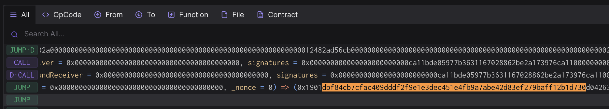

# Rehearsal 5 - Remove Deputy Guardian and Unpause

## Objective

In this rehearsal we will be intervening to restore users ability to make withdrawals from the
Superchain, and prevent the Deputy Guardian from pausing the system again.

## Overview

The rehearsal will involve the following contracts:

1. A Security Council Safe.
2. A dummy `DeputyGuardianModule` at `0xAbCD1234ABCD1234AbCD1234ABcD1234ABCD1234`
   - There is no need to interact with the `DeputyGuardianModule` during the rehearsal, so
     this 'dummy' address is used  to represent it.
3. A Guardian Safe with that `DeputyGuardianModule` enabled on it.
4. A `SuperchainConfig` contract, which will be paused.

Once completed the `DeputyGuardianModule` will be disabled on the Guardian Safe, and the
`SuperchainConfig` will be unpaused.

The call that will be executed by the Safe contract is defined in a
json file. This will be the standard approach for all transactions.

Note that no onchain actions will be taking place during this
signing. You won’t be submitting a transaction and your address
doesn’t even need to be funded. These are offchain signatures produced
with your wallet which will be collected by a Facilitator, who will
submit all signatures and perform the execution onchain.


## Approving the transaction

### 1. Update repo and move to the appropriate folder for this rehearsal task:

```
cd superchain-ops
git pull
just install
cd security-council-rehearsals/$(REPLACE_WITH_REHEARSAL_FOLDER)
```

### 2. Setup Ledger

Your Ledger needs to be connected and unlocked. The Ethereum
application needs to be opened on Ledger with the message "Application
is ready".

### 3. Simulate and validate the transaction

Make sure your ledger is still unlocked and run the following.

Remember that by default just is running with the address derived from
`/0` (first nonce). If you wish to use a different account, append the value `X` to the end of the following command where X is the derivation path of the address that you want to use.

``` shell
just \
   --dotenv-path $(pwd)/.env \
   --justfile ../../../single.just \
simulate # 0 or 1 or your derivation path index
```

You will see a "Simulation link" from the output.

Paste this URL in your browser. A prompt may ask you to choose a
project, any project will do. You can create one if necessary.

Click "Simulate Transaction".

We will be performing 3 validations and extract the domain hash and
message hash to approve on your Ledger:

1. Validate integrity of the simulation.
2. Validate correctness of the state diff.
3. Validate and extract domain hash and message hash to approve.

#### 3.1. Validate integrity of the simulation.

Make sure you are on the "Overview" tab of the tenderly simulation, to
validate integrity of the simulation, we need to

1. "Network": Check the network is Ethereum Mainnet.
2. "Timestamp": Check the simulation is performed on a block with a
   recent timestamp (i.e. close to when you run the script).
3. "Sender": Check the address shown is your signer account.


#### 3.2. Validate correctness of the state diff.

Now click on the "State" tab. Verify that:

TODO: Add validations


#### 3.3. Extract the domain hash and the message hash to approve.

Now that we have verified the transaction performs the right
operation, we need to extract the domain hash and the message hash to
approve.

Go back to the "Overview" tab, and find the first
`GnosisSafe.domainSeparator` call. This call's return value will be
the domain hash that will show up in your Ledger.

Here is an example screenshot. Note that the hash value may be
different:


Right before the `GnosisSafe.domainSeparator` call, you will see a
call to `GnosisSafe.encodeTransactionData`. Its return value will be a
concatenation of `0x1901`, the domain hash, and the message hash:
`0x1901[domain hash][message hash]`.

Here is an example screenshot. Note that the hash value may be
different:



Note down both the domain hash and the message hash. You will need to
compare them with the ones displayed on the Ledger screen at signing.

### 4. Approve the signature on your ledger

Once the validations are done, it's time to actually sign the
transaction. Make sure your ledger is still unlocked and run the
following:

``` shell
just sign-council # or just sign-council <hdPath>
```

> [!IMPORTANT] This is the most security critical part of the
> playbook: make sure the domain hash and message hash in the
> following two places match:

1. on your Ledger screen.
2. in the Tenderly simulation. You should use the same Tenderly
   simulation as the one you used to verify the state diffs, instead
   of opening the new one printed in the console.

There is no need to verify anything printed in the console. There is
no need to open the new Tenderly simulation link either.

After verification, sign the transaction. You will see the `Data`,
`Signer` and `Signature` printed in the console. Format should be
something like this:

```
Data:  <DATA>
Signer: <ADDRESS>
Signature: <SIGNATURE>
```

Double check the signer address is the right one.

### 5. Send the output to Facilitator(s)

Nothing has occurred onchain - these are offchain signatures which
will be collected by Facilitators for execution. Execution can occur
by anyone once a threshold of signatures are collected, so a
Facilitator will do the final execution for convenience.

Share the `Data`, `Signer` and `Signature` with the Facilitator, and
congrats, you are done!

## [For Facilitator ONLY] How to prepare and execute the rehearsal

### [Before the rehearsal] Prepare the rehearsal

#### 1. Identify the Council Safe

This rehearsal can be done with any safe which has all of the participating signers on it. If a
new safe is required, please follow the instructions laid out in the Facilitator instructions for
  [Rehearsal 4](../r4-jointly-upgrade/README.md#1-create-the-council-safe).

In order to remove any doubt that the execution of this Rehearsal could have consequences on the
mainnet Superchain, it is not recommended to use the actual Security Council Safe itself in the
rehearsal.

#### 2. Create the rehearsal contracts

1. Set the `COUNCIL_SAFE` address in `.env` to the Safe address identified in the previous step.
2. Make sure your Ledger is connected and run `just deploy-contracts`
   to deploy the rehearsal contract. There will be two contracts
   deployed: the new `GuardianSafe`, and a `SuperchainConfig`.
3. Update the `GuardianSafe_ADDRESS`, and the `SuperchainConfig_ADDRESS`
   variables in `.env` to the newly-created contracts' addresses. These address will have been
   printed out in step 1.

#### 3. Update input.json

1. Make sure the variables in the `.env` file have been updated, then
   run `just prepare-json` to update the `input.json` file.
2. Test the newly created rehearsal by following the security council
   steps in the `Approving the transaction` section above.
3. Update the rehearsal folder name in the `1. Update repo and move to
   the appropriate folder for this rehearsal task` section and the
   address in the `3.2. Validate correctness of the state diff`
   section above.
4. Commit the newly created files to Github.

### [After the rehearsal] Execute the output

1. Collect outputs from all participating signers.
2. Concatenate all signatures and export it as the `SIGNATURES`
   environment variable, i.e. `export
   SIGNATURES="0x[SIGNATURE1][SIGNATURE2]..."`.
3. Run `just approve-council 0 # or 1 or ...` to execute a transaction
   onchain to approve the upgrade transaction.
4. Run `just execute-all 0 # or 1 or...` to execute the actual upgrade
   transaction.

For example, if the quorum is 2 and you get the following outputs:

``` shell
Data:  0xDEADBEEF
Signer: 0xC0FFEE01
Signature: AAAA
```

``` shell
Data:  0xDEADBEEF
Signer: 0xC0FFEE02
Signature: BBBB
```

Then you should run

``` shell
export SIGNATURES="0xAAAABBBB"
just execute 0 # or 1 or ...
```
