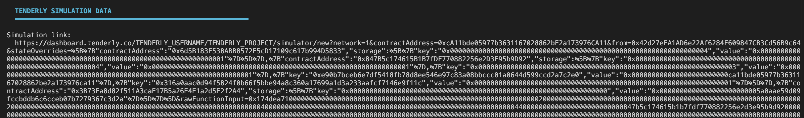
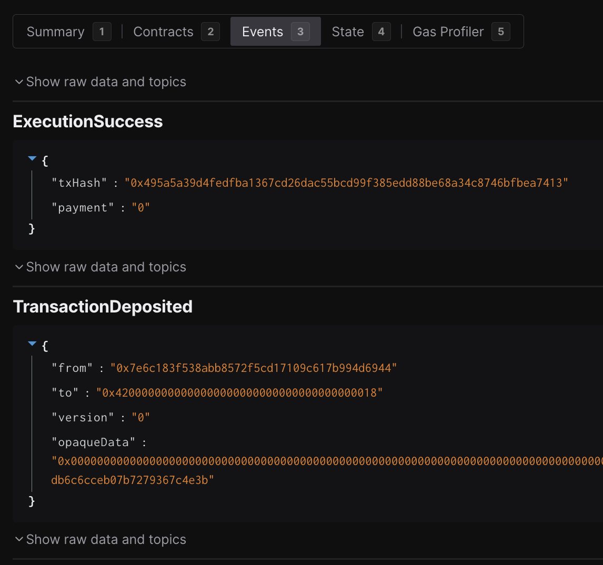
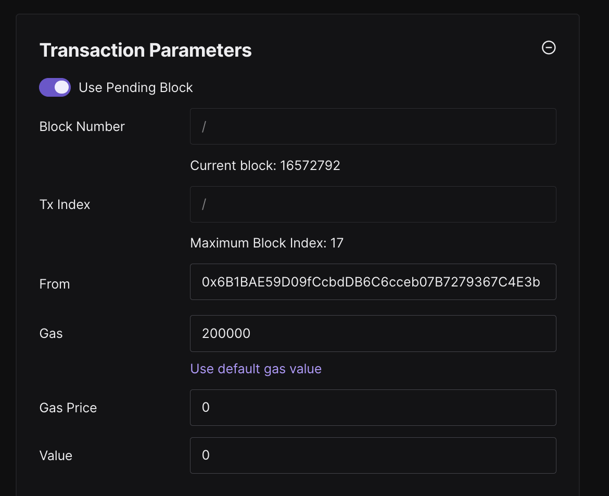

# Simulating an L2 Deposit Transaction Before Execution

The following steps describe how to simulate an L2 deposit transaction prior to L1 task execution. The [TransferL2PAOFromL1.sol](../template/TransferL2PAOFromL1.sol) template executes an L1 transaction, which is later forwarded to the L2 by the op-node. To gain additional confidence that the L2 deposit transaction works as expected, we manually simulate it and record the results in the task’s VALIDATION.md file.

## Steps

1. Simulate the task that uses the [TransferL2PAOFromL1.sol](../template/TransferL2PAOFromL1.sol) template.
2. In the terminal output, copy the Tenderly link and open it in your browser.
      
3. In Tenderly, open the `Events` tab and look for the `TransactionDeposited` event.
      
      ```json
        {
            "from": "0x7e6c183f538abb8572f5cd17109c617b994d6944",
            "to": "0x4200000000000000000000000000000000000018",
            "version": "0",
            "opaqueData": "0x000000000000000000000000000000000000000000000000000000000000000000000000000000000000000000000000000000000000000000000000000000000000000000030d4000f2fde38b0000000000000000000000006b1bae59d09fccbddb6c6cceb07b7279367c4e3b"
        }
      ```

4. Using the data in the `TransactionDeposited` event, create a new Tenderly simulation via this [link](https://dashboard.tenderly.co/TENDERLY_USERNAME/TENDERLY_PROJECT/simulator/new?block=&blockIndex=0&from=0x0000000000000000000000000000000000000000&gas=8000000&gasPrice=0&value=0&contractAddress=&headerBlockNumber=&headerTimestamp=).
5. Insert the `to` address (`0x4200000000000000000000000000000000000018`) as the destination address and select the correct L2 network.
6. Next, we need to create the calldata from the `opaqueData` field in the `TransactionDeposited` event. This is going to go into the `Enter raw input data` field. We know this particular transaction is a `transferOwnership` call to the `ProxyAdmin` contract. We can identify the start of the relevant calldata by extracting the function selector:
    ```bash
    cast sig "transferOwnership(address)"
    # returns: 0xf2fde38b
    ```
    Now that we know the function selector, we can extract the calldata from the `opaqueData` field and run the following cast command:
    ```bash
    cast calldata-decode "transferOwnership(address)" 0xf2fde38b0000000000000000000000006b1bae59d09fccbddb6c6cceb07b7279367c4e3b
    # returns: 0x6B1BAE59D09fCcbdDB6C6cceb07B7279367C4E3b
    ```
    We must put `0xf2fde38b0000000000000000000000006b1bae59d09fccbddb6c6cceb07b7279367c4e3b` in the `Enter raw input data` field.
    
8. Double-check that the address returned from the `cast calldata-decode` step matches the aliased L1 ProxyAdmin owner (L1PAO) for the target chain. In this case, the L1PAO is `0x5a0Aae59D09fccBdDb6C6CcEB07B7279367C3d2A`. Confirm this by manually unaliasing the address using [chisel](https://book.getfoundry.sh/chisel/).
    ```bash
    > uint160 constant offset = uint160(0x1111000000000000000000000000000000001111)
    > function undoL1ToL2Alias(address l2Address) internal pure returns (address l1Address) {
        unchecked {
            l1Address = address(uint160(l2Address) - offset);
        }
    }
    > undoL1ToL2Alias(0x6B1BAE59D09fCcbdDB6C6cceb07B7279367C4E3b)
    # returns: 0x5a0Aae59D09fccBdDb6C6CcEB07B7279367C3d2A
    ```
9. Next we need to fill out the `Transaction Parameters` section on the right of the UI. Specifically, fill out the `From` address and `Gas` fields. The `From` address should be the aliased L1PAO address obtained in the previous step (i.e. `0x6B1BAE59D09fCcbdDB6C6cceb07B7279367C4E3b`). The `Gas` field should be set to `200000`. You can get this number by further parsing the opaque data and extracting the gas limit.
    ```bash
    cast --to-dec 0x30d40
    # returns: 200000
    ```
    

10. Click `Simulate Transaction` and you should see the transaction succeed. 
11. Finally, check the `State` tab and ensure the state changes are as expected. Specifically, confirm that the `ProxyAdmin` contract reflects the new, expected owner.
