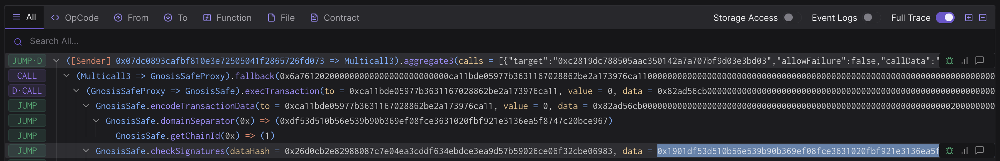

# Nested Execution

- [Approving the transaction](#approving-the-transaction)
   - [1. Update repo:](#1-update-repo)
   - [2. Setup Ledger](#2-setup-ledger)
   - [3. Simulate and validate the transaction](#3-simulate-and-validate-the-transaction)
   - [3.1. Validate integrity of the simulation.](#31-validate-integrity-of-the-simulation)
   - [3.2. Validate correctness of the state diff.](#32-validate-correctness-of-the-state-diff)
   - [3.3. Extract the domain hash and the message hash to approve.](#33-extract-the-domain-hash-and-the-message-hash-to-approve)
   - [4. Approve the signature on your ledger](#4-approve-the-signature-on-your-ledger)
   - [5. Send the output to Facilitator(s)](#5-send-the-output-to-facilitators)
- [\[For Facilitator ONLY\] How to execute](#for-facilitator-only-how-to-execute)
   - [Approve the transaction](#approve-the-transaction)
   - [Execute the transaction](#execute-the-transaction)


## Approving the transaction

### 1. Update repo:

```shell
cd superchain-ops/src/improvements
git pull
just --justfile ../../justfile clean
just --justfile ../../justfile install
cd tasks/<NETWORK_DIR>/<RUNBOOK_DIR>
```

### 2. Setup Ledger

Your Ledger needs to be connected and unlocked. The Ethereum
application needs to be opened on Ledger with the message "Application
is ready".

### 3. Simulate and validate the transaction

Make sure your ledger is still unlocked and run the following commands depending on which Safe you are signing on behalf of.

Note: during development of the Solidity script, simulations can be run without any Ledger by exporting `SIMULATE_WITHOUT_LEDGER=1` in your shell, or by adding it to the `.env` file.

**Note:** Remember that by default the script will assume the derivation path of your address is `m/44'/60'/0'/0/0`.
If you wish to use a different account, append an `X` to the command to set the derivation path of the address that you want to use. For example by adding a `1` to the end, it will derive the address using `m/44'/60'/1'/0/0` instead.

For the Security Council:

```shell
just \
   --dotenv-path $(pwd)/.env \
   --justfile ../../../nested.just \
   simulate \
   council # 0 or 1 or ...
```

For the Foundation:

```shell
just \
   --dotenv-path $(pwd)/.env \
   --justfile ../../../nested.just \
   simulate \
   foundation # 0 or 1 or ...
```

For the Chain Governor:

```shell
just \
   --dotenv-path $(pwd)/.env \
   --justfile ../../../nested.just \
   simulate \
   chain-governor # 0 or 1 or ...
```

**This will generate an op-txverify link with instructions on how to verify the domain and message hashes. Follow and complete the instructions before proceeding.**

You will also see a "Simulation link" from the output.

Paste this URL in your browser. A prompt may ask you to choose a
project, any project will do. You can create one if necessary.

Click "Simulate Transaction". Please note that in some cases, when the calldata is very large, you may have to complete an additional step. 
This involves copying and pasting the 'Raw Input data' field from the terminal into the Raw input data field in the Tenderly simulation, then clicking "Simulate Transaction".

We will be performing 3 validations and extract the domain hash and
message hash to approve on your Ledger:

1. Validate integrity of the simulation.
2. Validate correctness of the state diff.
3. Validate and extract domain hash and message hash to approve.

#### 3.1. Validate integrity of the simulation.

Make sure you are on the "Overview" tab of the tenderly simulation, to
validate integrity of the simulation, we need to check the following:

1. "Network": Check the network is Ethereum mainnet or Sepolia. This must match the `<NETWORK_DIR>` from above.
2. "Timestamp": Check the simulation is performed on a block with a
   recent timestamp (i.e. close to when you run the script).
3. "Sender": Check the address shown is your signer account. If not see the derivation path Note above.


#### 3.2. Validate correctness of the state diff.

Now click on the "State" tab, and refer to the "State Validations" instructions for the transaction you are signing.
Once complete return to this document to complete the signing.

#### 3.3. Extract the domain hash and the message hash to approve.

Now that we have verified the transaction performs the right
operation, we need to extract the domain hash and the message hash to
approve.

Go back to the "Overview" tab, and find the
`GnosisSafe.checkSignatures` call. This call's `data` parameter
contains both the domain hash and the message hash that will show up
in your Ledger.

Here is an example screenshot. Note that the hash value may be
different:



It will be a concatenation of `0x1901`, the domain hash, and the
message hash: `0x1901[domain hash][message hash]`.

Note down this value. You will need to compare it with the ones
displayed on the Ledger screen at signing.

### 4. Approve the signature on your ledger

Once the validations are done, it's time to actually sign the
transaction. Make sure your ledger is still unlocked and run the
following:

```shell
just \
   --dotenv-path $(pwd)/.env \
   --justfile ../../../nested.just \
   sign \
   council # 0 or 1 or ...
```

or

```shell
just \
   --dotenv-path $(pwd)/.env \
   --justfile ../../../nested.just \
   sign \
   foundation # 0 or 1 or ...
```

or

```shell
just \
   --dotenv-path $(pwd)/.env \
   --justfile ../../../nested.just \
   sign \
   chain-governor # 0 or 1 or ...
```

> [!WARNING]
> This is the most security critical part of the playbook: make sure the
> domain hash and message hash in the following two places match:
>
> 1. On your Ledger screen.
> 2. In the Tenderly simulation. You should use the same Tenderly
> simulation as the one you used to verify the state diffs, instead
> of opening the new one printed in the console.
>
> There is no need to verify anything printed in the console. There is
> no need to open the new Tenderly simulation link either.

After verification, sign the transaction. You will see the `Data`,
`Signer` and `Signature` printed in the console. Format should be
something like this:

```shell
Data:  <DATA>
Signer: <ADDRESS>
Signature: <SIGNATURE>
```

Double check the signer address is the right one.

### 5. Send the output to Facilitator(s)

Nothing has occurred onchain - these are offchain signatures which
will be collected by Facilitators for execution. Execution can occur
by anyone once a threshold of signatures are collected, so a
Facilitator will do the final execution for convenience.

Share the `Data`, `Signer` and `Signature` with the Facilitator, and
congrats, you are done!

## [For Facilitator ONLY] How to execute

### Approve the transaction

1. Collect outputs from all participating signers.
2. Concatenate all signatures and export it as the `SIGNATURES`
   environment variable, i.e. `export
   SIGNATURES="0x[SIGNATURE1][SIGNATURE2]..."`.
3. Run the `just approve` command as described below to approve the transaction in each multisig.

For example, if the quorum is 2 and you get the following outputs:

```shell
Data:  0xDEADBEEF
Signer: 0xC0FFEE01
Signature: AAAA
```

```shell
Data:  0xDEADBEEF
Signer: 0xC0FFEE02
Signature: BBBB
```

Then you should run:

```shell
export SIGNATURES="0xAAAABBBB"
just \
   --dotenv-path $(pwd)/.env \
   --justfile ../../../nested.just \
   approve \
   foundation \ # or council or chain-governor
   0 # or 1 or ...
```

### Execute the transaction

Once the signatures have been submitted approving the transaction for all nested Safes run:

```shell
just \
   --dotenv-path $(pwd)/.env \
   --justfile ../../../nested.just \
   execute \
   0 # or 1 or ...
```
