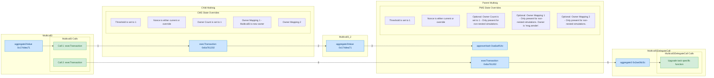

```mermaid
graph LR
  subgraph Multicall3
    A1[aggregate3Value 0x174dea71]
    subgraph Multicall3 Calls
        A2[Call 1: execTransaction]
        A3[Call 2: execTransaction]
    end
  end

  subgraph Child Multisig
    B1[execTransaction 0x6a761202]
    subgraph CMS State Overrides
        B2[Threshold is set to 1]
        B3[Nonce is either current or override]
        B4[Owner Count is set to 1]
        B5[Owner Mapping 1 - Multicall3 is new owner]
        B6[Owner Mapping 2]
    end
  end

  subgraph Multicall3_2
    C1[aggregate3Value 0x174dea71]
  end

  subgraph Parent Multisig
    D1[approveHash 0xa6a4f14c]
    D2[execTransaction 0x6a761202]
    subgraph PMS State Overrides
        D3[Threshold is set to 1]
        D4[Nonce is either current or override]
        D5[Optional: Owner Count is set to 1 - Only present for non-nested simulations.]
        D6[Optional: Owner Mapping 1 - Only present for non-nested simulations. Owner is 'msg.sender'.]
        D7[Optional: Owner Mapping 2 - Only present for non-nested simulations.]
    end
  end

  subgraph Multicall3DelegateCall
    E1["aggregate3 0x2ae36c5c"]

    subgraph Multicall3DelegateCall Calls 
      E2[Upgrade task specific function]
    end
  end

  A1 --> A2
  A2 -->|1| B1
  B1 -->|2| C1
  C1 -->|3| D1
  A3 -->|4| D2
  D2 -->|5| E1
  E1 --> E2


  classDef blue fill:#cce5ff,stroke:#007acc,color:#003366;
  classDef green fill:#d4edda,stroke:#28a745,color:#155724;

  class A1 blue
  class A2 green
  class A3 green
  class B1 blue
  class C1 blue
  class D1 blue
  class D2 blue
  class E1 blue
  class E2 green
```