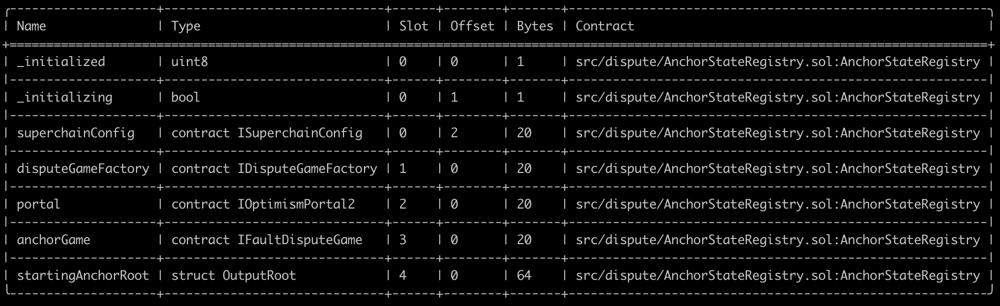

# Validation

This document can be used to validate the inputs and result of the execution of the upgrade transaction which you are
signing.

The steps are:

1. [Validate the Domain and Message Hashes](#expected-domain-and-message-hashes)
2. [Verifying the transaction input](#understanding-task-calldata)
3. [Verifying the state changes](#state-changes)

## Expected Domain and Message Hashes

First, we need to validate the domain and message hashes. These values should match both the values on your ledger and
the values printed to the terminal when you run the task.

> [!CAUTION]
>
> Before signing, ensure the below hashes match what is on your ledger.
>
> ### Security Council
>
> - Domain Hash: `0xdf53d510b56e539b90b369ef08fce3631020fbf921e3136ea5f8747c20bce967`
> - Message Hash: `0xb4d7088223615b345d8d8f5a04902b466c7543861a7ca7576b980e9870bf6aa3`
>
> ### Optimism Foundation
>
> - Domain Hash: `0xa4a9c312badf3fcaa05eafe5dc9bee8bd9316c78ee8b0bebe3115bb21b732672`
> - Message Hash: `0x22501b51c38f03ccdcc8c2010ce074a185dd29de30e2a91fa8390691c764d4d8`


## Understanding Task Calldata

This document provides a detailed analysis of the final calldata executed on-chain for the OPCM upgrade to v2.0.0.

By reconstructing the calldata, we can confirm that the execution precisely implements the approved upgrade plan with no unexpected modifications or side effects.

### Inputs to `opcm.upgrade()`

For each chain being upgrade, the `opcm.upgrade()` function is called with a tuple of three elements:

1. OP Mainnet:
    - SystemConfigProxy: [0x229047fed2591dbec1eF1118d64F7aF3dB9EB290](https://github.com/ethereum-optimism/superchain-registry/blob/d4bb112dc979fd43ac92252c549d3ed7c4d0eb57/superchain/configs/mainnet/op.toml#L58)
    - ProxyAdmin: [0x543bA4AADBAb8f9025686Bd03993043599c6fB04](https://github.com/ethereum-optimism/superchain-registry/blob/d4bb112dc979fd43ac92252c549d3ed7c4d0eb57/superchain/configs/mainnet/op.toml#L59)
    - AbsolutePrestate: [0x039facea52b20c605c05efb0a33560a92de7074218998f75bcdf61e8989cb5d9](https://github.com/ethereum-optimism/superchain-registry/blob/934ea2dd22d160e076ebbecb310582049eec071d/validation/standard/standard-prestates.toml#L22)

2. Soneium:
    - SystemConfigProxy: [0x7A8Ed66B319911A0F3E7288BDdAB30d9c0C875c3](https://github.com/ethereum-optimism/superchain-registry/blob/d4bb112dc979fd43ac92252c549d3ed7c4d0eb57/superchain/configs/mainnet/soneium.toml#L58)
    - ProxyAdmin: [0x89889B569c3a505f3640ee1Bd0ac1D557f436D2a](https://github.com/ethereum-optimism/superchain-registry/blob/d4bb112dc979fd43ac92252c549d3ed7c4d0eb57/superchain/configs/mainnet/soneium.toml#L59)
    - AbsolutePrestate: [0x039facea52b20c605c05efb0a33560a92de7074218998f75bcdf61e8989cb5d9](https://github.com/ethereum-optimism/superchain-registry/blob/934ea2dd22d160e076ebbecb310582049eec071d/validation/standard/standard-prestates.toml#L22)

3. Ink:
    - SystemConfigProxy: [0x62C0a111929fA32ceC2F76aDba54C16aFb6E8364](https://github.com/ethereum-optimism/superchain-registry/blob/d4bb112dc979fd43ac92252c549d3ed7c4d0eb57/superchain/configs/mainnet/ink.toml#L58)
    - ProxyAdmin: [0xd56045E68956FCe2576E680c95a4750cf8241f79](https://github.com/ethereum-optimism/superchain-registry/blob/d4bb112dc979fd43ac92252c549d3ed7c4d0eb57/superchain/configs/mainnet/ink.toml#L59)
    - AbsolutePrestate: [0x039facea52b20c605c05efb0a33560a92de7074218998f75bcdf61e8989cb5d9](https://github.com/ethereum-optimism/superchain-registry/blob/934ea2dd22d160e076ebbecb310582049eec071d/validation/standard/standard-prestates.toml#L22)


Thus, the command to encode the calldata to the OPCM's [`upgrade()`](https://github.com/ethereum-optimism/optimism/blob/8d0dd96e494b2ba154587877351e87788336a4ec/packages/contracts-bedrock/src/L1/OPContractsManager.sol#L463) function is:

```bash
cast calldata 'upgrade((address,address,bytes32)[])' "[(0x229047fed2591dbec1eF1118d64F7aF3dB9EB290,0x543bA4AADBAb8f9025686Bd03993043599c6fB04,0x039facea52b20c605c05efb0a33560a92de7074218998f75bcdf61e8989cb5d9),(0x7A8Ed66B319911A0F3E7288BDdAB30d9c0C875c3,0x89889B569c3a505f3640ee1Bd0ac1D557f436D2a,0x039facea52b20c605c05efb0a33560a92de7074218998f75bcdf61e8989cb5d9),(0x62C0a111929fA32ceC2F76aDba54C16aFb6E8364,0xd56045E68956FCe2576E680c95a4750cf8241f79,0x039facea52b20c605c05efb0a33560a92de7074218998f75bcdf61e8989cb5d9)]"
```

### Inputs to `Multicall3DelegateCall`

The output from the previous section becomes the `data` in the argument to the `Multicall3DelegateCall.aggregate3()` function.

This function is called with a tuple of three elements:

- `target`: [0x026b2f158255beac46c1e7c6b8bbf29a4b6a7b76](https://github.com/ethereum-optimism/superchain-registry/blob/d4bb112dc979fd43ac92252c549d3ed7c4d0eb57/validation/standard/standard-versions-mainnet.toml#L21) - Mainnet OPContractsManager v2.0.0
- `allowFailure`: false
- `callData`: `0xff2dd5a1...` (output from the previous section)

Command to encode:
```bash
cast calldata 'aggregate3((address,bool,bytes)[])' "[(0x026b2f158255beac46c1e7c6b8bbf29a4b6a7b76,false,0xff2dd5a100000000000000000000000000000000000000000000000000000000000000200000000000000000000000000000000000000000000000000000000000000003000000000000000000000000229047fed2591dbec1ef1118d64f7af3db9eb290000000000000000000000000543ba4aadbab8f9025686bd03993043599c6fb04039facea52b20c605c05efb0a33560a92de7074218998f75bcdf61e8989cb5d90000000000000000000000007a8ed66b319911a0f3e7288bddab30d9c0c875c300000000000000000000000089889b569c3a505f3640ee1bd0ac1d557f436d2a039facea52b20c605c05efb0a33560a92de7074218998f75bcdf61e8989cb5d900000000000000000000000062c0a111929fa32cec2f76adba54c16afb6e8364000000000000000000000000d56045e68956fce2576e680c95a4750cf8241f79039facea52b20c605c05efb0a33560a92de7074218998f75bcdf61e8989cb5d9)]"
```

The resulting calldata sent from the ProxyAdminOwner safe is thus:

```
0x82ad56cb000000000000000000000000000000000000000000000000000000000000002000000000000000000000000000000000000000000000000000000000000000010000000000000000000000000000000000000000000000000000000000000020000000000000000000000000026b2f158255beac46c1e7c6b8bbf29a4b6a7b76000000000000000000000000000000000000000000000000000000000000000000000000000000000000000000000000000000000000000000000000000000600000000000000000000000000000000000000000000000000000000000000164ff2dd5a100000000000000000000000000000000000000000000000000000000000000200000000000000000000000000000000000000000000000000000000000000003000000000000000000000000229047fed2591dbec1ef1118d64f7af3db9eb290000000000000000000000000543ba4aadbab8f9025686bd03993043599c6fb04039facea52b20c605c05efb0a33560a92de7074218998f75bcdf61e8989cb5d90000000000000000000000007a8ed66b319911a0f3e7288bddab30d9c0c875c300000000000000000000000089889b569c3a505f3640ee1bd0ac1d557f436d2a039facea52b20c605c05efb0a33560a92de7074218998f75bcdf61e8989cb5d900000000000000000000000062c0a111929fa32cec2f76adba54c16afb6e8364000000000000000000000000d56045e68956fce2576e680c95a4750cf8241f79039facea52b20c605c05efb0a33560a92de7074218998f75bcdf61e8989cb5d900000000000000000000000000000000000000000000000000000000
```

In mainnet runbooks, this calldata should appear in the [Action Plan](https://gov.optimism.io/t/upgrade-proposal-13-opcm-and-incident-response-improvements/9739#p-43725-action-plan-15) section of the Governance proposal.

# State Validations

For each contract listed in the state diff, please verify that no contracts or state changes shown in the Tenderly diff are missing from this document. Additionally, please verify that for each contract:

- The following state changes (and none others) are made to that contract. This validates that no unexpected state
  changes occur.
- All addresses (in section headers and storage values) match the provided name, using the Etherscan and Superchain
  Registry links provided. This validates the bytecode deployed at the addresses contains the correct logic.
- All key values match the semantic meaning provided, which can be validated using the storage layout links provided.

### State Overrides

Note: The changes listed below do not include threshold, nonce and owner mapping overrides. These changes are listed and explained in the [NESTED-VALIDATION.md](../../../../../NESTED-VALIDATION.md) file.

### Task State Changes

<pre>
  <code>
  ----- DecodedStateDiff[0] -----
    Who:               <a href="https://github.com/ethereum-optimism/superchain-registry/blob/b40cf4289c58e28eb1c791f9ad5724380b7516a7/validation/standard/standard-versions-mainnet.toml#L40">0x026b2F158255Beac46c1E7c6b8BbF29A4b6A7B76</a>
    Contract:          OPContractsManager
    Raw Slot:          0x0000000000000000000000000000000000000000000000000000000000000016
    Raw Old Value:     0x0000000000000000000000000000000000000000000000000000000000000001
    Raw New Value:     0x0000000000000000000000000000000000000000000000000000000000000000
    Summary:           <i>isRC</i> storage slot updated to 0.
    Detail:            Once OPContractsManager is upgraded, the <i>isRC</i> flag is set to false.
                        This happens in the first invocation of the <i>upgrade</i> function.
                        Slot 22 is the <i>isRC</i> flag:
                          <i>cast to-hex 22</i> -> <i>0x16</i>.
                        Please refer to <i>'Figure 0.1'</i> at the end of this report for the storage layout of OPContractsManager.

  ----- DecodedStateDiff[1] -----
    Who:               <a href="https://github.com/ethereum-optimism/superchain-registry/blob/c1bcf3601dfdf72f0fd4f5bade180b9c0f94d93b/superchain/configs/mainnet/ink.toml#L63">0x10d7B35078d3baabB96Dd45a9143B94be65b12CD</a>
    Contract:          DisputeGameFactory - Ink
    Chain ID:          57073
    Raw Slot:          0x360894a13ba1a3210667c828492db98dca3e2076cc3735a920a3ca505d382bbc
    Raw Old Value:     0x000000000000000000000000c641a33cab81c559f2bd4b21ea34c290e2440c2b
    Raw New Value:     0x0000000000000000000000004bba758f006ef09402ef31724203f316ab74e4a0
    Decoded Kind:      address
    Decoded Old Value: <a href="https://github.com/ethereum-optimism/superchain-registry/blob/84bce73573f130008d84bae6e924163bab589a11/validation/standard/standard-versions-mainnet.toml#L55">0xc641A33cab81C559F2bd4b21EA34C290E2440C2B</a>
    Decoded New Value: <a href="https://github.com/ethereum-optimism/superchain-registry/blob/84bce73573f130008d84bae6e924163bab589a11/validation/standard/standard-versions-mainnet.toml#L34">0x4bbA758F006Ef09402eF31724203F316ab74e4a0</a>
    Summary:           ERC-1967 implementation slot
    Detail:            Standard slot for storing the implementation address in a proxy contract that follows the ERC-1967 standard. DisputeGameFactory contract for 'op-contracts/v2.0.0-rc.1'.

  ----- DecodedStateDiff[2] -----
    Who:               <a href="https://github.com/ethereum-optimism/superchain-registry/blob/c1bcf3601dfdf72f0fd4f5bade180b9c0f94d93b/superchain/configs/mainnet/ink.toml#L63">0x10d7B35078d3baabB96Dd45a9143B94be65b12CD</a>
    Contract:          DisputeGameFactory - Ink
    Chain ID:          57073
    Raw Slot:          0x4d5a9bd2e41301728d41c8e705190becb4e74abe869f75bdb405b63716a35f9e
    Raw Old Value:     0x0000000000000000000000008d9faaeb46cbcf487baf2182e438ac3d0847f637
    Raw New Value:     0x0000000000000000000000004699d20479dfd20e15cab4fcb6f2a7cc6fe35443
    Summary:           Update Permissioned GameType implementation.
    Detail:            This is gameImpls[1] -> 0x4699d20479dfd20e15cab4fcb6f2a7cc6fe35443
                       Verify that the old implementation is set in this slot using:
                        - <i>cast call 0x10d7B35078d3baabB96Dd45a9143B94be65b12CD "gameImpls(uint32)(address)" 1 --rpc-url mainnet</i>
                        - <i>cast storage 0x10d7B35078d3baabB96Dd45a9143B94be65b12CD 0x4d5a9bd2e41301728d41c8e705190becb4e74abe869f75bdb405b63716a35f9e --rpc-url mainnet</i>
                       The Raw Slot can be derived from:
                        - <i>cast index uint32 1 101</i>

  ----- DecodedStateDiff[3] -----
    Who:               <a href="https://github.com/ethereum-optimism/superchain-registry/blob/c1bcf3601dfdf72f0fd4f5bade180b9c0f94d93b/superchain/configs/mainnet/ink.toml#L63">0x10d7B35078d3baabB96Dd45a9143B94be65b12CD</a>
    Contract:          DisputeGameFactory - Ink
    Chain ID:          57073
    Raw Slot:          0xffdfc1249c027f9191656349feb0761381bb32c9f557e01f419fd08754bf5a1b
    Raw Old Value:     0x0000000000000000000000007e87b471e96b96955044328242456427a0d49694
    Raw New Value:     0x00000000000000000000000069361c9134d620b704c2a72c58523a4373ece86f
    Decoded Old Value: 0x7e87b471e96b96955044328242456427a0d49694
    Decoded New Value: 0x69361c9134d620b704c2a72c58523a4373ece86f
    Summary:           Updated CANNON GameType implementation.
    Detail:            This is gameImpls[0] -> 0x69361c9134d620b704c2a72c58523a4373ece86f where '0' is the <a href="https://github.com/ethereum-optimism/optimism/blob/op-contracts/v1.4.0/packages/contracts-bedrock/src/dispute/lib/Types.sol#L28">CANNON game type</a>.
                       Verify that the old implementation is set in this slot using:
                        - <i>cast call 0x10d7B35078d3baabB96Dd45a9143B94be65b12CD "gameImpls(uint32)(address)" 0 --rpc-url mainnet</i>
                        - <i>cast storage 0x10d7B35078d3baabB96Dd45a9143B94be65b12CD 0xffdfc1249c027f9191656349feb0761381bb32c9f557e01f419fd08754bf5a1b --rpc-url mainnet</i>
                       The Raw Slot can be derived from:
                        - <i>cast index uint32 0 101</i>

  ----- DecodedStateDiff[4] -----
    Who:               0x190B6ecEE5A2ddF39669288B9B8daEa4641ae8b1 (Newly deployed during upgrade)
    Contract:          AnchorStateRegistryProxy - Soneium
    Chain ID:          1868
    Raw Slot:          0x0000000000000000000000000000000000000000000000000000000000000000
    Raw Old Value:     0x0000000000000000000000000000000000000000000000000000000000000000
    Raw New Value:     0x0000000000000000000095703e0982140d16f8eba6d158fccede42f04a4c0001
    Summary:           Slot 0 is updated to set AnchorStateRegistryProxy address
    Detail:            Please refer to <i>'Figure 0.2'</i> at the end of this report for the storage layout of AnchorStateRegistry.
                       Reading 'Raw New Value' from Right to Left, we have:
                       1. <i>0x01</i> - <i>_initialized</i> flag set to 'true'
                       2. <i>0x00</i> - <i>_initializing</i> flag set to 'false'
                       3. <a href="https://github.com/ethereum-optimism/superchain-registry/blob/b40cf4289c58e28eb1c791f9ad5724380b7516a7/superchain/configs/mainnet/superchain.toml#L3">0x95703e0982140D16f8ebA6d158FccEde42f04a4C</a> - Mainnet SuperchainConfig

  ----- DecodedStateDiff[5] -----
    Who:               0x190B6ecEE5A2ddF39669288B9B8daEa4641ae8b1 (Newly deployed during upgrade)
    Contract:          AnchorStateRegistryProxy - Soneium
    Chain ID:          1868
    Raw Slot:          0x0000000000000000000000000000000000000000000000000000000000000001
    Raw Old Value:     0x0000000000000000000000000000000000000000000000000000000000000000
    Raw New Value:     0x000000000000000000000000512a3d2c7a43bd9261d2b8e8c9c70d4bd4d503c0
    Summary:           Slot 1 is updated to set DisputeGameFactoryProxy address
    Detail:            Please refer to <i>'Figure 0.2'</i> at the end of this report for the storage layout of AnchorStateRegistry.
                       <a href="https://github.com/ethereum-optimism/superchain-registry/blob/84bce73573f130008d84bae6e924163bab589a11/superchain/configs/mainnet/soneium.toml#L63">0x512A3d2c7a43BD9261d2B8E8C9c70D4bd4D503C0</a> is the
                       DisputeGameFactoryProxy address on Soneium.

  ----- DecodedStateDiff[6] -----
    Who:               0x190B6ecEE5A2ddF39669288B9B8daEa4641ae8b1 (Newly deployed during upgrade)
    Contract:          AnchorStateRegistryProxy - Soneium
    Chain ID:          1868
    Raw Slot:          0x0000000000000000000000000000000000000000000000000000000000000002
    Raw Old Value:     0x0000000000000000000000000000000000000000000000000000000000000000
    Raw New Value:     0x00000000000000000000000088e529a6ccd302c948689cd5156c83d4614fae92
    Summary:           Slot 2 is updated to set OptimismPortalProxy address
    Detail:            Please refer to <i>'Figure 0.2'</i> at the end of this report for the storage layout of AnchorStateRegistry.
                       <a href="https://github.com/ethereum-optimism/superchain-registry/blob/84bce73573f130008d84bae6e924163bab589a11/superchain/configs/mainnet/soneium.toml#L57">0x88e529a6ccd302c948689cd5156c83d4614fae92</a> is the
                       OptimismPortalProxy address on Soneium.

  ----- DecodedStateDiff[7] -----
    Who:               0x190B6ecEE5A2ddF39669288B9B8daEa4641ae8b1 (Newly deployed during upgrade)
    Contract:          AnchorStateRegistryProxy - Soneium
    Chain ID:          1868
    Raw Slot:          0x0000000000000000000000000000000000000000000000000000000000000004
    Raw Old Value:     0x0000000000000000000000000000000000000000000000000000000000000000
    Raw New Value:     0xd1d632a1c83002b4a45f2ffc9116b8f59546921724b729d52d0787372b18c337
    Summary:           Slot 4 updates the <a href="https://github.com/ethereum-optimism/optimism/blob/op-contracts/v2.0.0-rc.1/packages/contracts-bedrock/src/dispute/lib/Types.sol#L44">'root'</a> for the <a href="https://github.com/ethereum-optimism/optimism/blob/op-contracts/v2.0.0-rc.1/packages/contracts-bedrock/src/dispute/AnchorStateRegistry.sol#L42">startingAnchorRoot</a>
    Detail:            Please refer to <i>'Figure 0.2'</i> at the end of this report for the storage layout of AnchorStateRegistry.
                       The 'Raw New Value' for this entry might be different than what is seen in the Tenderly state diff.
                       This is expected because the AnchorStateRegistry is being continually updated.
                       Anyone can call <a href="https://github.com/ethereum-optimism/optimism/blob/op-contracts/v2.0.0-rc.1/packages/contracts-bedrock/src/dispute/AnchorStateRegistry.sol#L239"><i>'setAnchorState(IDisputeGame _game)'</i></a> so it can be updated often if the conditions are right.

  ----- DecodedStateDiff[8] -----
    Who:               0x190B6ecEE5A2ddF39669288B9B8daEa4641ae8b1 (Newly deployed during upgrade)
    Contract:          AnchorStateRegistryProxy - Soneium
    Chain ID:          1868
    Raw Slot:          0x0000000000000000000000000000000000000000000000000000000000000005
    Raw Old Value:     0x0000000000000000000000000000000000000000000000000000000000000000
    Raw New Value:     0x0000000000000000000000000000000000000000000000000000000000486a0e
    Summary:           Slot 5 updates the <a href="https://github.com/ethereum-optimism/optimism/blob/op-contracts/v2.0.0-rc.1/packages/contracts-bedrock/src/dispute/lib/Types.sol#L44">'l2BlockNumber'</a> for the <a href="https://github.com/ethereum-optimism/optimism/blob/op-contracts/v2.0.0-rc.1/packages/contracts-bedrock/src/dispute/AnchorStateRegistry.sol#L42">startingAnchorRoot</a>
    Detail:            Please refer to <i>'Figure 0.2'</i> at the end of this report for the storage layout of AnchorStateRegistry.
                       The 'Raw New Value' for this entry might be different than what is seen in the Tenderly state diff.
                       This is expected because the AnchorStateRegistry is being continually updated.
                        - <i>cast --to-dec 486a0e</i> -> <i>4745742</i>
                       Anyone can call <a href="https://github.com/ethereum-optimism/optimism/blob/op-contracts/v2.0.0-rc.1/packages/contracts-bedrock/src/dispute/AnchorStateRegistry.sol#L239"><i>'setAnchorState(IDisputeGame _game)'</i></a> so it can be updated often if the conditions are right.

  ----- DecodedStateDiff[9] -----
    Who:               0x190B6ecEE5A2ddF39669288B9B8daEa4641ae8b1 (Newly deployed during upgrade)
    Contract:          AnchorStateRegistryProxy - Soneium
    Chain ID:          1868
    Raw Slot:          0x360894a13ba1a3210667c828492db98dca3e2076cc3735a920a3ca505d382bbc
    Raw Old Value:     0x0000000000000000000000000000000000000000000000000000000000000000
    Raw New Value:     0x0000000000000000000000007b465370bb7a333f99edd19599eb7fb1c2d3f8d2
    Decoded Kind:      address
    Decoded Old Value: 0x0000000000000000000000000000000000000000
    Decoded New Value: <a href="https://github.com/ethereum-optimism/superchain-registry/blob/c1bcf3601dfdf72f0fd4f5bade180b9c0f94d93b/validation/standard/standard-versions-mainnet.toml#L32">0x7b465370BB7A333f99edd19599EB7Fb1c2D3F8D2</a>
    Summary:           ERC-1967 implementation slot
    Detail:            Standard slot for storing the implementation address in a proxy contract that follows the ERC-1967 standard.
                       AnchorStateRegistry contract for 'op-contracts/v2.0.0-rc.1'.

  ----- DecodedStateDiff[10] -----
    Who:               0x190B6ecEE5A2ddF39669288B9B8daEa4641ae8b1 (Newly deployed during upgrade)
    Contract:          AnchorStateRegistryProxy - Soneium
    Chain ID:          1868
    Raw Slot:          0xb53127684a568b3173ae13b9f8a6016e243e63b6e8ee1178d6a717850b5d6103
    Raw Old Value:     0x0000000000000000000000000000000000000000000000000000000000000000
    Raw New Value:     0x00000000000000000000000089889b569c3a505f3640ee1bd0ac1d557f436d2a
    Decoded Kind:      address
    Decoded Old Value: 0x0000000000000000000000000000000000000000
    Decoded New Value: <a href="https://github.com/ethereum-optimism/superchain-registry/blob/c1bcf3601dfdf72f0fd4f5bade180b9c0f94d93b/superchain/configs/mainnet/soneium.toml#L59">0x89889b569c3a505f3640ee1bd0ac1d557f436d2a</a>
    Summary:           Proxy owner address
    Detail:            Standard slot for storing the owner address in a Proxy contract.
                       The owner in this case is the <a href="https://github.com/ethereum-optimism/superchain-registry/blob/c1bcf3601dfdf72f0fd4f5bade180b9c0f94d93b/superchain/configs/mainnet/soneium.toml#L59">ProxyAdmin</a> of Ink.

  ----- DecodedStateDiff[11] -----
    Who:               0x1c68ECfbf9C8B1E6C0677965b3B9Ecf9A104305b (Newly deployed during upgrade)
    Contract:          AnchorStateRegistryProxy - OP Mainnet
    Chain ID:          10
    Raw Slot:          0x0000000000000000000000000000000000000000000000000000000000000000
    Raw Old Value:     0x0000000000000000000000000000000000000000000000000000000000000000
    Raw New Value:     0x0000000000000000000095703e0982140d16f8eba6d158fccede42f04a4c0001
    Summary:           Slot 0 is updated to set AnchorStateRegistryProxy address
    Detail:            Please refer to <i>'Figure 0.2'</i> at the end of this report for the storage layout of AnchorStateRegistry.
                       Reading 'Raw New Value' from Right to Left, we have:
                       1. <i>0x01</i> - <i>_initialized</i> flag set to 'true'
                       2. <i>0x00</i> - <i>_initializing</i> flag set to 'false'
                       3. <a href="https://github.com/ethereum-optimism/superchain-registry/blob/b40cf4289c58e28eb1c791f9ad5724380b7516a7/superchain/configs/mainnet/superchain.toml#L3">0x95703e0982140D16f8ebA6d158FccEde42f04a4C</a> - Mainnet SuperchainConfig

  ----- DecodedStateDiff[12] -----
    Who:               0x1c68ECfbf9C8B1E6C0677965b3B9Ecf9A104305b (Newly deployed during upgrade)
    Contract:          AnchorStateRegistryProxy - OP Mainnet
    Chain ID:          10
    Raw Slot:          0x0000000000000000000000000000000000000000000000000000000000000001
    Raw Old Value:     0x0000000000000000000000000000000000000000000000000000000000000000
    Raw New Value:     0x000000000000000000000000e5965ab5962edc7477c8520243a95517cd252fa9
    Summary:           Slot 1 is updated to set DisputeGameFactoryProxy address
    Detail:            Please refer to <i>'Figure 0.2'</i> at the end of this report for the storage layout of AnchorStateRegistry.
                       <a href="https://github.com/ethereum-optimism/superchain-registry/blob/84bce73573f130008d84bae6e924163bab589a11/superchain/configs/mainnet/op.toml#L62">0xe5965Ab5962eDc7477C8520243A95517CD252fA9</a> is the
                       DisputeGameFactoryProxy address on OP Mainnet.

  ----- DecodedStateDiff[13] -----
    Who:               0x1c68ECfbf9C8B1E6C0677965b3B9Ecf9A104305b (Newly deployed during upgrade)
    Contract:          AnchorStateRegistryProxy - OP Mainnet
    Chain ID:          10
    Raw Slot:          0x0000000000000000000000000000000000000000000000000000000000000002
    Raw Old Value:     0x0000000000000000000000000000000000000000000000000000000000000000
    Raw New Value:     0x000000000000000000000000beb5fc579115071764c7423a4f12edde41f106ed
    Detail:            Please refer to <i>'Figure 0.2'</i> at the end of this report for the storage layout of AnchorStateRegistry.
                       <a href="https://github.com/ethereum-optimism/superchain-registry/blob/84bce73573f130008d84bae6e924163bab589a11/superchain/configs/mainnet/op.toml#L57">0xbeb5fc579115071764c7423a4f12edde41f106ed</a> is the
                       OptimismPortalProxy address on OP Mainnet.

  ----- DecodedStateDiff[14] -----
    Who:               0x1c68ECfbf9C8B1E6C0677965b3B9Ecf9A104305b (Newly deployed during upgrade)
    Contract:          AnchorStateRegistryProxy - OP Mainnet
    Chain ID:          10
    Raw Slot:          0x0000000000000000000000000000000000000000000000000000000000000004
    Raw Old Value:     0x0000000000000000000000000000000000000000000000000000000000000000
    Raw New Value:     0x5c957423b18bed04245927a0ab5652675a51d4cc3c611bc51f438fd2d7c18bae
    Summary:           Slot 4 updates the <a href="https://github.com/ethereum-optimism/optimism/blob/op-contracts/v2.0.0-rc.1/packages/contracts-bedrock/src/dispute/lib/Types.sol#L44">'root'</a> for the <a href="https://github.com/ethereum-optimism/optimism/blob/op-contracts/v2.0.0-rc.1/packages/contracts-bedrock/src/dispute/AnchorStateRegistry.sol#L42">startingAnchorRoot</a>
    Detail:            Please refer to <i>'Figure 0.2'</i> at the end of this report for the storage layout of AnchorStateRegistry.
                       The 'Raw New Value' for this entry might be different than what is seen in the Tenderly state diff.
                       This is expected because the AnchorStateRegistry is being continually updated.
                       Anyone can call <a href="https://github.com/ethereum-optimism/optimism/blob/op-contracts/v2.0.0-rc.1/packages/contracts-bedrock/src/dispute/AnchorStateRegistry.sol#L239"><i>'setAnchorState(IDisputeGame _game)'</i></a> so it can be updated often if the conditions are right.

  ----- DecodedStateDiff[15] -----
    Who:               0x1c68ECfbf9C8B1E6C0677965b3B9Ecf9A104305b (Newly deployed during upgrade)
    Contract:          AnchorStateRegistryProxy - OP Mainnet
    Chain ID:          10
    Raw Slot:          0x0000000000000000000000000000000000000000000000000000000000000005
    Raw Old Value:     0x0000000000000000000000000000000000000000000000000000000000000000
    Raw New Value:     0x0000000000000000000000000000000000000000000000000000000007f5432d
    Summary:           Slot 5 updates the <a href="https://github.com/ethereum-optimism/optimism/blob/op-contracts/v2.0.0-rc.1/packages/contracts-bedrock/src/dispute/lib/Types.sol#L44">'l2BlockNumber'</a> for the <a href="https://github.com/ethereum-optimism/optimism/blob/op-contracts/v2.0.0-rc.1/packages/contracts-bedrock/src/dispute/AnchorStateRegistry.sol#L42">startingAnchorRoot</a>
    Detail:            Please refer to <i>'Figure 0.2'</i> at the end of this report for the storage layout of AnchorStateRegistry.
                       The 'Raw New Value' for this entry might be different than what is seen in the Tenderly state diff.
                       This is expected because the AnchorStateRegistry is being continually updated.
                        - <i>cast --to-dec 7f5432d</i> -> <i>133514029</i>
                       Anyone can call <a href="https://github.com/ethereum-optimism/optimism/blob/op-contracts/v2.0.0-rc.1/packages/contracts-bedrock/src/dispute/AnchorStateRegistry.sol#L239"><i>'setAnchorState(IDisputeGame _game)'</i></a> so it can be updated often if the conditions are right.

  ----- DecodedStateDiff[16] -----
    Who:               0x1c68ECfbf9C8B1E6C0677965b3B9Ecf9A104305b (Newly deployed during upgrade)
    Contract:          AnchorStateRegistryProxy - OP Mainnet
    Chain ID:          10
    Raw Slot:          0x360894a13ba1a3210667c828492db98dca3e2076cc3735a920a3ca505d382bbc
    Raw Old Value:     0x0000000000000000000000000000000000000000000000000000000000000000
    Raw New Value:     0x0000000000000000000000007b465370bb7a333f99edd19599eb7fb1c2d3f8d2
    Decoded Kind:      address
    Decoded Old Value: 0x0000000000000000000000000000000000000000
    Decoded New Value: <a href="https://github.com/ethereum-optimism/superchain-registry/blob/c1bcf3601dfdf72f0fd4f5bade180b9c0f94d93b/validation/standard/standard-versions-mainnet.toml#L32">0x7b465370BB7A333f99edd19599EB7Fb1c2D3F8D2</a>
    Summary:           ERC-1967 implementation slot
    Detail:            Standard slot for storing the implementation address in a proxy contract that follows the ERC-1967 standard.
                       AnchorStateRegistry contract for 'op-contracts/v2.0.0-rc.1'.

  ----- DecodedStateDiff[17] -----
    Who:               0x1c68ECfbf9C8B1E6C0677965b3B9Ecf9A104305b (Newly deployed during upgrade)
    Contract:          AnchorStateRegistryProxy - OP Mainnet
    Chain ID:          10
    Raw Slot:          0xb53127684a568b3173ae13b9f8a6016e243e63b6e8ee1178d6a717850b5d6103
    Raw Old Value:     0x0000000000000000000000000000000000000000000000000000000000000000
    Raw New Value:     0x000000000000000000000000543ba4aadbab8f9025686bd03993043599c6fb04
    Decoded Kind:      address
    Decoded Old Value: 0x0000000000000000000000000000000000000000
    Decoded New Value: <a href="https://github.com/ethereum-optimism/superchain-registry/blob/c1bcf3601dfdf72f0fd4f5bade180b9c0f94d93b/superchain/configs/mainnet/op.toml#L59">0x543ba4aadbab8f9025686bd03993043599c6fb04</a>
    Summary:           Proxy owner address
    Detail:            Standard slot for storing the owner address in a Proxy contract.
                       The owner in this case is the <a href="https://github.com/ethereum-optimism/superchain-registry/blob/c1bcf3601dfdf72f0fd4f5bade180b9c0f94d93b/superchain/configs/mainnet/op.toml#L59">ProxyAdmin</a> of OP Mainnet.

  ----- DecodedStateDiff[18] -----
    Who:               0x21429aF66058BC3e4aE4a8f2EC4531AaC433ecbC
    Contract:          Permissioned DelayedWeth - OP Mainnet
    Chain ID:          10
    Raw Slot:          0x360894a13ba1a3210667c828492db98dca3e2076cc3735a920a3ca505d382bbc
    Raw Old Value:     0x00000000000000000000000071e966ae981d1ce531a7b6d23dc0f27b38409087
    Raw New Value:     0x0000000000000000000000005e40b9231b86984b5150507046e354dbfbed3d9e
    Decoded Kind:      address
    Decoded Old Value: <a href="https://github.com/ethereum-optimism/superchain-registry/blob/c1bcf3601dfdf72f0fd4f5bade180b9c0f94d93b/validation/standard/standard-versions-mainnet.toml#L54">0x71e966Ae981d1ce531a7b6d23DC0f27B38409087</a>
    Decoded New Value: <a href="https://github.com/ethereum-optimism/superchain-registry/blob/c1bcf3601dfdf72f0fd4f5bade180b9c0f94d93b/validation/standard/standard-versions-mainnet.toml#L33">0x5e40B9231B86984b5150507046e354dbFbeD3d9e</a>
    Summary:           ERC-1967 implementation slot
    Detail:            Standard slot for storing the implementation address in a proxy contract that follows the ERC-1967 standard.
                       Using OP Mainnet's <a href="https://github.com/ethereum-optimism/superchain-registry/blob/c1bcf3601dfdf72f0fd4f5bade180b9c0f94d93b/superchain/configs/mainnet/op.toml#L62">DisputeGameFactory</a>, we can find this DelayedWETH address:
                        - <i>cast call 0xe5965Ab5962eDc7477C8520243A95517CD252fA9 "gameImpls(uint32)(address)" 1 --rpc-url mainnet</i>
                        - <i>cast call 0x91a661891248d8C4916FB4a1508492a5e2CBcb87 "weth()(address)" --rpc-url mainnet</i>
                        returns <b>0x21429aF66058BC3e4aE4a8f2EC4531AaC433ecbC</b>

  ----- DecodedStateDiff[19] -----
    Who:               0x229047fed2591dbec1eF1118d64F7aF3dB9EB290
    Contract:          SystemConfig - OP Mainnet
    Chain ID:          10
    Raw Slot:          0x360894a13ba1a3210667c828492db98dca3e2076cc3735a920a3ca505d382bbc
    Raw Old Value:     0x000000000000000000000000ab9d6cb7a427c0765163a7f45bb91cafe5f2d375
    Raw New Value:     0x000000000000000000000000760c48c62a85045a6b69f07f4a9f22868659cbcc
    Decoded Kind:      address
    Decoded Old Value: 0xAB9d6cB7A427c0765163A7f45BB91cAfe5f2D375
    Decoded New Value: <a href="https://github.com/ethereum-optimism/superchain-registry/blob/b40cf4289c58e28eb1c791f9ad5724380b7516a7/validation/standard/standard-versions-mainnet.toml#L27">0x760C48C62A85045A6B69f07F4a9f22868659CbCc</a>
    Summary:           ERC-1967 implementation slot
    Detail:            Standard slot for storing the implementation address in a proxy contract that follows the ERC-1967 standard.

  ----- DecodedStateDiff[20] -----
    Who:               0x2fc99fd16D8D3F6F66d164aA84E244c567E58A3d (Newly deployed during upgrade)
    Contract:          AnchorStateRegistryProxy - Ink
    Chain ID:          57073
    Raw Slot:          0x0000000000000000000000000000000000000000000000000000000000000000
    Raw Old Value:     0x0000000000000000000000000000000000000000000000000000000000000000
    Raw New Value:     0x0000000000000000000095703e0982140d16f8eba6d158fccede42f04a4c0001
    Detail:            Please refer to <i>'Figure 0.2'</i> at the end of this report for the storage layout of AnchorStateRegistry.
                       Reading 'Raw New Value' from Right to Left, we have:
                       1. <i>0x01</i> - <i>_initialized</i> flag set to 'true'
                       2. <i>0x00</i> - <i>_initializing</i> flag set to 'false'
                       3. <a href="https://github.com/ethereum-optimism/superchain-registry/blob/b40cf4289c58e28eb1c791f9ad5724380b7516a7/superchain/configs/mainnet/superchain.toml#L3">0x95703e0982140D16f8ebA6d158FccEde42f04a4C</a> - Mainnet SuperchainConfig

  ----- DecodedStateDiff[21] -----
    Who:               0x2fc99fd16D8D3F6F66d164aA84E244c567E58A3d (Newly deployed during upgrade)
    Contract:          AnchorStateRegistryProxy - Ink
    Chain ID:          57073
    Raw Slot:          0x0000000000000000000000000000000000000000000000000000000000000001
    Raw Old Value:     0x0000000000000000000000000000000000000000000000000000000000000000
    Raw New Value:     0x00000000000000000000000010d7b35078d3baabb96dd45a9143b94be65b12cd
    Summary:           Slot 1 is updated to set DisputeGameFactoryProxy address
    Detail:            Please refer to <i>'Figure 0.2'</i> at the end of this report for the storage layout of AnchorStateRegistry.
                       <a href="https://github.com/ethereum-optimism/superchain-registry/blob/84bce73573f130008d84bae6e924163bab589a11/superchain/configs/mainnet/ink.toml#L63">0x10d7b35078d3baabb96dd45a9143b94be65b12cd</a> is the
                       DisputeGameFactoryProxy address on Soneium.

  ----- DecodedStateDiff[22] -----
    Who:               0x2fc99fd16D8D3F6F66d164aA84E244c567E58A3d (Newly deployed during upgrade)
    Contract:          AnchorStateRegistryProxy - Ink
    Chain ID:          57073
    Raw Slot:          0x0000000000000000000000000000000000000000000000000000000000000002
    Raw Old Value:     0x0000000000000000000000000000000000000000000000000000000000000000
    Raw New Value:     0x0000000000000000000000005d66c1782664115999c47c9fa5cd031f495d3e4f
    Detail:            Please refer to <i>'Figure 0.2'</i> at the end of this report for the storage layout of AnchorStateRegistry.
                       <a href="https://github.com/ethereum-optimism/superchain-registry/blob/84bce73573f130008d84bae6e924163bab589a11/superchain/configs/mainnet/ink.toml#L57">0x5d66c1782664115999c47c9fa5cd031f495d3e4f</a> is the
                       OptimismPortalProxy address on Ink.

  ----- DecodedStateDiff[23] -----
    Who:               0x2fc99fd16D8D3F6F66d164aA84E244c567E58A3d (Newly deployed during upgrade)
    Contract:          AnchorStateRegistryProxy - Ink
    Chain ID:          57073
    Raw Slot:          0x0000000000000000000000000000000000000000000000000000000000000004
    Raw Old Value:     0x0000000000000000000000000000000000000000000000000000000000000000
    Raw New Value:     0xf24819ad2addf7cb3dc453c6cc17c9bc90288ba932271da6692ebb5be4cbdc74
    Summary:           Slot 4 updates the <a href="https://github.com/ethereum-optimism/optimism/blob/op-contracts/v2.0.0-rc.1/packages/contracts-bedrock/src/dispute/lib/Types.sol#L44">'root'</a> for the <a href="https://github.com/ethereum-optimism/optimism/blob/op-contracts/v2.0.0-rc.1/packages/contracts-bedrock/src/dispute/AnchorStateRegistry.sol#L42">startingAnchorRoot</a>
    Detail:            Please refer to <i>'Figure 0.2'</i> at the end of this report for the storage layout of AnchorStateRegistry.
                       The 'Raw New Value' for this entry might be different than what is seen in the Tenderly state diff.
                       This is expected because the AnchorStateRegistry is being continually updated.
                       Anyone can call <a href="https://github.com/ethereum-optimism/optimism/blob/op-contracts/v2.0.0-rc.1/packages/contracts-bedrock/src/dispute/AnchorStateRegistry.sol#L239"><i>'setAnchorState(IDisputeGame _game)'</i></a> so it can be updated often if the conditions are right.


  ----- DecodedStateDiff[24] -----
    Who:               0x2fc99fd16D8D3F6F66d164aA84E244c567E58A3d (Newly deployed during upgrade)
    Contract:          AnchorStateRegistryProxy - Ink
    Chain ID:          57073
    Raw Slot:          0x0000000000000000000000000000000000000000000000000000000000000005
    Raw Old Value:     0x0000000000000000000000000000000000000000000000000000000000000000
    Raw New Value:     0x00000000000000000000000000000000000000000000000000000000008afb2f
    Summary:           Slot 5 updates the <a href="https://github.com/ethereum-optimism/optimism/blob/op-contracts/v2.0.0-rc.1/packages/contracts-bedrock/src/dispute/lib/Types.sol#L44">'l2BlockNumber'</a> for the <a href="https://github.com/ethereum-optimism/optimism/blob/op-contracts/v2.0.0-rc.1/packages/contracts-bedrock/src/dispute/AnchorStateRegistry.sol#L42">startingAnchorRoot</a>
    Detail:            Please refer to <i>'Figure 0.2'</i> at the end of this report for the storage layout of AnchorStateRegistry.
                       The 'Raw New Value' for this entry might be different than what is seen in the Tenderly state diff.
                       This is expected because the AnchorStateRegistry is being continually updated.
                        - <i>cast --to-dec 8afb2f</i> -> <i>9108271</i>
                       Anyone can call <a href="https://github.com/ethereum-optimism/optimism/blob/op-contracts/v2.0.0-rc.1/packages/contracts-bedrock/src/dispute/AnchorStateRegistry.sol#L239"><i>'setAnchorState(IDisputeGame _game)'</i></a> so it can be updated often if the conditions are right.

  ----- DecodedStateDiff[25] -----
    Who:               0x2fc99fd16D8D3F6F66d164aA84E244c567E58A3d (Newly deployed during upgrade)
    Contract:          AnchorStateRegistryProxy - Ink
    Chain ID:          57073
    Raw Slot:          0x360894a13ba1a3210667c828492db98dca3e2076cc3735a920a3ca505d382bbc
    Raw Old Value:     0x0000000000000000000000000000000000000000000000000000000000000000
    Raw New Value:     0x0000000000000000000000007b465370bb7a333f99edd19599eb7fb1c2d3f8d2
    Decoded Kind:      address
    Decoded Old Value: 0x0000000000000000000000000000000000000000
    Decoded New Value: <a href="https://github.com/ethereum-optimism/superchain-registry/blob/c1bcf3601dfdf72f0fd4f5bade180b9c0f94d93b/validation/standard/standard-versions-mainnet.toml#L32">0x7b465370BB7A333f99edd19599EB7Fb1c2D3F8D2</a>
    Summary:           ERC-1967 implementation slot
    Detail:            Standard slot for storing the implementation address in a proxy contract that follows the ERC-1967 standard.
                       AnchorStateRegistry contract for 'op-contracts/v2.0.0-rc.1'.

  ----- DecodedStateDiff[26] -----
    Who:               0x2fc99fd16D8D3F6F66d164aA84E244c567E58A3d (Newly deployed during upgrade)
    Contract:          AnchorStateRegistryProxy - Ink
    Chain ID:          57073
    Raw Slot:          0xb53127684a568b3173ae13b9f8a6016e243e63b6e8ee1178d6a717850b5d6103
    Raw Old Value:     0x0000000000000000000000000000000000000000000000000000000000000000
    Raw New Value:     0x000000000000000000000000d56045e68956fce2576e680c95a4750cf8241f79
    Decoded Kind:      address
    Decoded Old Value: 0x0000000000000000000000000000000000000000
    Decoded New Value: <a href="https://github.com/ethereum-optimism/superchain-registry/blob/c1bcf3601dfdf72f0fd4f5bade180b9c0f94d93b/superchain/configs/mainnet/ink.toml#L59">0xd56045e68956fce2576e680c95a4750cf8241f79</a>
    Summary:           Proxy owner address
    Detail:            Standard slot for storing the owner address in a Proxy contract.
                       The owner in this case is the <a href="https://github.com/ethereum-optimism/superchain-registry/blob/c1bcf3601dfdf72f0fd4f5bade180b9c0f94d93b/superchain/configs/mainnet/ink.toml#L59">ProxyAdmin</a> of Ink.

  ----- DecodedStateDiff[27] -----
    Who:               0x323dFC63c9B83CB83f40325AaB74b245937cbdF0
    Contract:          Permissionless DelayedWeth - OP Mainnet
    Chain ID:          10
    Raw Slot:          0x360894a13ba1a3210667c828492db98dca3e2076cc3735a920a3ca505d382bbc
    Raw Old Value:     0x00000000000000000000000071e966ae981d1ce531a7b6d23dc0f27b38409087
    Raw New Value:     0x0000000000000000000000005e40b9231b86984b5150507046e354dbfbed3d9e
    Decoded Kind:      address
    Decoded Old Value: <a href="https://github.com/ethereum-optimism/superchain-registry/blob/c1bcf3601dfdf72f0fd4f5bade180b9c0f94d93b/validation/standard/standard-versions-mainnet.toml#L54">0x71e966ae981d1ce531a7b6d23dc0f27b38409087</a>
    Decoded New Value: <a href="https://github.com/ethereum-optimism/superchain-registry/blob/c1bcf3601dfdf72f0fd4f5bade180b9c0f94d93b/validation/standard/standard-versions-mainnet.toml#L33">0x5e40B9231B86984b5150507046e354dbFbeD3d9e</a>
    Summary:           ERC-1967 implementation slot
    Detail:            Standard slot for storing the implementation address in a proxy contract that follows the ERC-1967 standard.
                       Using OP Mainnet's <a href="https://github.com/ethereum-optimism/superchain-registry/blob/c1bcf3601dfdf72f0fd4f5bade180b9c0f94d93b/superchain/configs/mainnet/op.toml#L62">DisputeGameFactory</a>, we can find this DelayedWETH address:
                        - <i>cast call 0xe5965Ab5962eDc7477C8520243A95517CD252fA9 "gameImpls(uint32)(address)" 0 --rpc-url mainnet</i>
                        - <i>cast call 0x27B81db41F586016694632193b99E45b1a27B8f8 "weth()(address)" --rpc-url mainnet</i>
                        returns <b>0x323dFC63c9B83CB83f40325AaB74b245937cbdF0</b>

  ----- DecodedStateDiff[28] -----
    Who:               <a href="https://github.com/ethereum-optimism/superchain-registry/blob/84bce73573f130008d84bae6e924163bab589a11/superchain/configs/mainnet/soneium.toml#L63">0x512A3d2c7a43BD9261d2B8E8C9c70D4bd4D503C0</a>
    Contract:          DisputeGameFactory - Soneium
    Chain ID:          1868
    Raw Slot:          0x360894a13ba1a3210667c828492db98dca3e2076cc3735a920a3ca505d382bbc
    Raw Old Value:     0x000000000000000000000000c641a33cab81c559f2bd4b21ea34c290e2440c2b
    Raw New Value:     0x0000000000000000000000004bba758f006ef09402ef31724203f316ab74e4a0
    Decoded Kind:      address
    Decoded Old Value: <a href="https://github.com/ethereum-optimism/superchain-registry/blob/84bce73573f130008d84bae6e924163bab589a11/validation/standard/standard-versions-mainnet.toml#L55">0xc641A33cab81C559F2bd4b21EA34C290E2440C2B</a>
    Decoded New Value: <a href="https://github.com/ethereum-optimism/superchain-registry/blob/84bce73573f130008d84bae6e924163bab589a11/validation/standard/standard-versions-mainnet.toml#L34">0x4bbA758F006Ef09402eF31724203F316ab74e4a0</a>
    Summary:           ERC-1967 implementation slot
    Detail:            Standard slot for storing the implementation address in a proxy contract that follows the ERC-1967 standard. DisputeGameFactory contract for 'op-contracts/v2.0.0-rc.1'.

  ----- DecodedStateDiff[29] -----
    Who:               <a href="https://github.com/ethereum-optimism/superchain-registry/blob/84bce73573f130008d84bae6e924163bab589a11/superchain/configs/mainnet/soneium.toml#L63">0x512A3d2c7a43BD9261d2B8E8C9c70D4bd4D503C0</a>
    Contract:          DisputeGameFactory - Soneium
    Chain ID:          1868
    Raw Slot:          0x4d5a9bd2e41301728d41c8e705190becb4e74abe869f75bdb405b63716a35f9e
    Raw Old Value:     0x00000000000000000000000042d15f045159ce4ade9edc7da5704ef36056c936
    Raw New Value:     0x0000000000000000000000001661af719956198628f7e67087f19f8a79524a1d
    Decoded Kind:      address
    Decoded Old Value: 0x42d15f045159ce4ade9edc7da5704ef36056c936
    Decoded New Value: 0x1661af719956198628f7e67087f19f8a79524a1d
    Detail:            This is gameImpls[1] -> 0x1661af719956198628f7e67087f19f8a79524a1d
                       Verify that the old implementation is set in this slot using:
                        - <i>cast call 0x512A3d2c7a43BD9261d2B8E8C9c70D4bd4D503C0 "gameImpls(uint32)(address)" 1 --rpc-url mainnet</i>
                        - <i>cast storage 0x512A3d2c7a43BD9261d2B8E8C9c70D4bd4D503C0 0x4d5a9bd2e41301728d41c8e705190becb4e74abe869f75bdb405b63716a35f9e --rpc-url mainnet</i>
                       The Raw Slot can be derived from:
                        - <i>cast index uint32 1 101</i>

  ----- DecodedStateDiff[30] -----
    Who:               <a href="https://github.com/ethereum-optimism/superchain-registry/blob/84bce73573f130008d84bae6e924163bab589a11/superchain/configs/mainnet/soneium.toml#L54">0x5933e323bE8896DfaCd1cD671442F27dAA10a053</a>
    Contract:          L1ERC721Bridge - Soneium
    Chain ID:          1868
    Raw Slot:          0x360894a13ba1a3210667c828492db98dca3e2076cc3735a920a3ca505d382bbc
    Raw Old Value:     0x000000000000000000000000ae2af01232a6c4a4d3012c5ec5b1b35059caf10d
    Raw New Value:     0x000000000000000000000000276d3730f219f7ec22274f7263180b8452b46d47
    Decoded Kind:      address
    Decoded Old Value: <a href="https://github.com/ethereum-optimism/superchain-registry/blob/84bce73573f130008d84bae6e924163bab589a11/validation/standard/standard-versions-mainnet.toml#L58">0xAE2AF01232a6c4a4d3012C5eC5b1b35059caF10d</a>
    Decoded New Value: <a href="https://github.com/ethereum-optimism/superchain-registry/blob/b40cf4289c58e28eb1c791f9ad5724380b7516a7/validation/standard/standard-versions-mainnet.toml#L37">0x276d3730f219f7ec22274f7263180b8452B46d47</a>
    Summary:           ERC-1967 implementation slot
    Detail:            Standard slot for storing the implementation address in a proxy contract that follows the ERC-1967 standard.
                       L1ERC721Bridge contract for 'op-contracts/v2.0.0-rc.1'.

  ----- DecodedStateDiff[31] -----
    Who:               0x5a0Aae59D09fccBdDb6C6CcEB07B7279367C3d2A
    Contract:          ProxyAdminOwner (GnosisSafe)
    Chain ID:          10
    Raw Slot:          0x0000000000000000000000000000000000000000000000000000000000000005
    Raw Old Value:     0x000000000000000000000000000000000000000000000000000000000000000b
    Raw New Value:     0x000000000000000000000000000000000000000000000000000000000000000c
    Decoded Kind:      uint256
    Decoded Old Value: 11
    Decoded New Value: 12
    Summary:           nonce
    Detail:

----- TENDERLY ONLY STATE DIFF -----
  Who:               <a href="https://github.com/ethereum-optimism/superchain-registry/blob/1a5d7a208cea9b0ea175df1fe71bdc4da7f4c04c/superchain/configs/mainnet/op.toml#L44">0x5a0Aae59D09fccBdDb6C6CcEB07B7279367C3d2A</a>
  Contract:          ProxyAdminOwner (GnosisSafe) - OP, Soneium, Ink
  Chain ID:          10, 1868, 57073
  Raw Slot:          Key: 0x7c13db94a7425b0315c88b011d783fc5428b69af0e70b4479946ec79489df784
  Raw Old Value:     Before: 0x0000000000000000000000000000000000000000000000000000000000000000
  Raw New Value:     After: 0x0000000000000000000000000000000000000000000000000000000000000001

  Summary:           <i>approveHash(bytes32)</i> called on ProxyAdminOwner by child multisig.
  Detail:            As part of the Tenderly simulation, we want to illustrate the <i>approveHash</i> invocation.
                     This step isn't shown in the local simulation because the parent multisig is invoked directly,
                     bypassing the <i>approveHash</i> calls.
                     This slot change reflects an update to the approvedHashes mapping, where the
                     parent hash to be approved is (as can be seen in the `just simulate` output):
                      - <i>parent_hashToApprove=0x59a9ec9c4821628a4000c73472b7a0e6fd177076b4fc03c4b3eb3ab53ece10ed</i>
                     Specifically, if the simulation was run as the Foundation's nested safe <i>0x847B5c174615B1B7fDF770882256e2D3E95b9D92</i>.
                      - <i>res=$(cast index address 0x847B5c174615B1B7fDF770882256e2D3E95b9D92 8)</i>
                      - <i>cast index bytes32 $parent_hasToApprove $res</i>
                     Alternatively, if the simulation was run as the Council's nested safe <i>0xc2819DC788505Aac350142A7A707BF9D03E3Bd03</i>.
                      - <i>res=$(cast index address 0xc2819DC788505Aac350142A7A707BF9D03E3Bd03 8)</i>
                      - <i>cast index bytes32 0x59a9ec9c4821628a4000c73472b7a0e6fd177076b4fc03c4b3eb3ab53ece10ed $res</i>
                      - Alternative 'Raw Slot': <i>0xdcf861a51bf44cdb145c36eb23c4ff9be892b5406c6dbb604418c8777b78d95f</i>

  ----- DecodedStateDiff[32] -----
    Who:               <a href="https://github.com/ethereum-optimism/superchain-registry/blob/84bce73573f130008d84bae6e924163bab589a11/superchain/configs/mainnet/op.toml#L54">0x5a7749f83b81B301cAb5f48EB8516B986DAef23D</a>
    Contract:          L1ERC721Bridge - OP Mainet
    Chain ID:          10
    Raw Slot:          0x360894a13ba1a3210667c828492db98dca3e2076cc3735a920a3ca505d382bbc
    Raw Old Value:     0x000000000000000000000000ae2af01232a6c4a4d3012c5ec5b1b35059caf10d
    Raw New Value:     0x000000000000000000000000276d3730f219f7ec22274f7263180b8452b46d47
    Decoded Kind:      address
    Decoded Old Value: <a href="https://github.com/ethereum-optimism/superchain-registry/blob/84bce73573f130008d84bae6e924163bab589a11/validation/standard/standard-versions-mainnet.toml#L58">0xAE2AF01232a6c4a4d3012C5eC5b1b35059caF10d</a>
    Decoded New Value: <a href="https://github.com/ethereum-optimism/superchain-registry/blob/b40cf4289c58e28eb1c791f9ad5724380b7516a7/validation/standard/standard-versions-mainnet.toml#L37">0x276d3730f219f7ec22274f7263180b8452B46d47</a>
    Summary:           ERC-1967 implementation slot
    Detail:            Standard slot for storing the implementation address in a proxy contract that follows the ERC-1967 standard.
                       L1ERC721Bridge contract for 'op-contracts/v2.0.0-rc.1'.

  ----- DecodedStateDiff[33] -----
    Who:               <a href="https://github.com/ethereum-optimism/superchain-registry/blob/c1bcf3601dfdf72f0fd4f5bade180b9c0f94d93b/superchain/configs/mainnet/ink.toml#L57">0x5d66C1782664115999C47c9fA5cd031f495D3e4F</a>
    Contract:          OptimismPortal2 - Ink
    Chain ID:          57073
    Raw Slot:          0x360894a13ba1a3210667c828492db98dca3e2076cc3735a920a3ca505d382bbc
    Raw Old Value:     0x000000000000000000000000e2f826324b2faf99e513d16d266c3f80ae87832b
    Raw New Value:     0x0000000000000000000000002d7e764a0d9919e16983a46595cfa81fc34fa7cd
    Decoded Kind:      address
    Decoded Old Value: <a href="https://github.com/ethereum-optimism/superchain-registry/blob/934ea2dd22d160e076ebbecb310582049eec071d/validation/standard/standard-versions-mainnet.toml#L72">0xe2F826324b2faf99E513D16D266c3F80aE87832B</a>
    Decoded New Value: <a href="https://github.com/ethereum-optimism/superchain-registry/blob/b40cf4289c58e28eb1c791f9ad5724380b7516a7/validation/standard/standard-versions-mainnet.toml#L31">0x2D7e764a0D9919e16983a46595CfA81fc34fa7Cd</a>
    Summary:           ERC-1967 implementation slot
    Detail:            Standard slot for storing the implementation address in a proxy contract that follows the ERC-1967 standard.s in a proxy contract that follows the ERC-1967 standard.

  ----- DecodedStateDiff[34] -----
    Who:               <a href="https://github.com/ethereum-optimism/superchain-registry/blob/934ea2dd22d160e076ebbecb310582049eec071d/superchain/configs/mainnet/ink.toml#L58">0x62C0a111929fA32ceC2F76aDba54C16aFb6E8364</a>
    Contract:          SystemConfig - Ink
    Chain ID:          57073
    Raw Slot:          0x360894a13ba1a3210667c828492db98dca3e2076cc3735a920a3ca505d382bbc
    Raw Old Value:     0x000000000000000000000000f56d96b2535b932656d3c04ebf51babff241d886
    Raw New Value:     0x000000000000000000000000760c48c62a85045a6b69f07f4a9f22868659cbcc
    Decoded Kind:      address
    Decoded Old Value: <a href="https://github.com/ethereum-optimism/superchain-registry/blob/934ea2dd22d160e076ebbecb310582049eec071d/validation/standard/standard-versions-mainnet.toml#L107">0xF56D96B2535B932656d3c04Ebf51baBff241D886</a>
    Decoded New Value: <a href="https://github.com/ethereum-optimism/superchain-registry/blob/934ea2dd22d160e076ebbecb310582049eec071d/validation/standard/standard-versions-mainnet.toml#L47">0x760C48C62A85045A6B69f07F4a9f22868659CbCc</a>
    Summary:           ERC-1967 implementation slot
    Detail:            Standard slot for storing the implementation address in a proxy contract that follows the ERC-1967 standard.

  ----- DecodedStateDiff[35] -----
    Who:               <a href="https://github.com/ethereum-optimism/superchain-registry/blob/84bce73573f130008d84bae6e924163bab589a11/superchain/configs/mainnet/ink.toml#L54">0x661235a238B11191211fa95D4Dd9E423d521E0Be</a>
    Contract:          L1ERC721Bridge
    Chain ID:          57073
    Raw Slot:          0x360894a13ba1a3210667c828492db98dca3e2076cc3735a920a3ca505d382bbc
    Raw Old Value:     0x000000000000000000000000ae2af01232a6c4a4d3012c5ec5b1b35059caf10d
    Raw New Value:     0x000000000000000000000000276d3730f219f7ec22274f7263180b8452b46d47
    Decoded Kind:      address
    Decoded Old Value: <a href="https://github.com/ethereum-optimism/superchain-registry/blob/84bce73573f130008d84bae6e924163bab589a11/validation/standard/standard-versions-mainnet.toml#L58">0xAE2AF01232a6c4a4d3012C5eC5b1b35059caF10d</a>
    Decoded New Value: <a href="https://github.com/ethereum-optimism/superchain-registry/blob/b40cf4289c58e28eb1c791f9ad5724380b7516a7/validation/standard/standard-versions-mainnet.toml#L37">0x276d3730f219f7ec22274f7263180b8452B46d47</a>
    Summary:           ERC-1967 implementation slot
    Detail:            Standard slot for storing the implementation address in a proxy contract that follows the ERC-1967 standard.
                       L1ERC721Bridge contract for 'op-contracts/v2.0.0-rc.1'.

  ----- DecodedStateDiff[36] -----
    Who:               <a href="https://github.com/ethereum-optimism/superchain-registry/blob/84bce73573f130008d84bae6e924163bab589a11/superchain/configs/mainnet/op.toml#L56">0x75505a97BD334E7BD3C476893285569C4136Fa0F</a>
    Contract:          OptimismMintableERC20Factory - OP Mainnet
    Chain ID:          10
    Raw Slot:          0x360894a13ba1a3210667c828492db98dca3e2076cc3735a920a3ca505d382bbc
    Raw Old Value:     0x000000000000000000000000e01efbeb1089d1d1db9c6c8b135c934c0734c846
    Raw New Value:     0x0000000000000000000000005493f4677a186f64805fe7317d6993ba4863988f
    Decoded Kind:      address
    Decoded Old Value: <a href="https://github.com/ethereum-optimism/superchain-registry/blob/84bce73573f130008d84bae6e924163bab589a11/validation/standard/standard-versions-mainnet.toml#L61">0xE01efbeb1089D1d1dB9c6c8b135C934C0734c846</a>
    Decoded New Value: <a href="https://github.com/ethereum-optimism/superchain-registry/blob/84bce73573f130008d84bae6e924163bab589a11/validation/standard/standard-versions-mainnet.toml#L39">0x5493f4677A186f64805fe7317D6993ba4863988F</a>
    Summary:           ERC-1967 implementation slot
    Detail:            Standard slot for storing the implementation address in a proxy contract that follows the ERC-1967 standard.

  ----- DecodedStateDiff[37] -----
    Who:               <a href="https://github.com/ethereum-optimism/superchain-registry/blob/934ea2dd22d160e076ebbecb310582049eec071d/superchain/configs/mainnet/soneium.toml#L58">0x7A8Ed66B319911A0F3E7288BDdAB30d9c0C875c3</a>
    Contract:          SystemConfig
    Chain ID:          1868
    Raw Slot:          0x360894a13ba1a3210667c828492db98dca3e2076cc3735a920a3ca505d382bbc
    Raw Old Value:     0x000000000000000000000000ab9d6cb7a427c0765163a7f45bb91cafe5f2d375
    Raw New Value:     0x000000000000000000000000760c48c62a85045a6b69f07f4a9f22868659cbcc
    Decoded Kind:      address
    Decoded Old Value: 0xAB9d6cB7A427c0765163A7f45BB91cAfe5f2D375
    Decoded New Value: <a href="https://github.com/ethereum-optimism/superchain-registry/blob/b40cf4289c58e28eb1c791f9ad5724380b7516a7/validation/standard/standard-versions-mainnet.toml#L27">0x760C48C62A85045A6B69f07F4a9f22868659CbCc</a>
    Summary:           ERC-1967 implementation slot
    Detail:            Standard slot for storing the implementation address in a proxy contract that follows the ERC-1967 standard.

  ----- DecodedStateDiff[38] -----
    Who:               <a href="https://github.com/ethereum-optimism/superchain-registry/blob/934ea2dd22d160e076ebbecb310582049eec071d/superchain/configs/mainnet/superchain.toml#L2">0x8062AbC286f5e7D9428a0Ccb9AbD71e50d93b935</a>
    Contract:          ProtocolVersions
    Chain ID:          1
    Raw Slot:          0x360894a13ba1a3210667c828492db98dca3e2076cc3735a920a3ca505d382bbc
    Raw Old Value:     0x00000000000000000000000042f0bd8313ad456a38061308857b2383fe2c72a0
    Raw New Value:     0x00000000000000000000000037e15e4d6dffa9e5e320ee1ec036922e563cb76c
    Decoded Kind:      address
    Decoded Old Value: 0x42F0bD8313ad456A38061308857b2383fe2c72a0
    Decoded New Value: <a href="https://github.com/ethereum-optimism/superchain-registry/blob/84bce73573f130008d84bae6e924163bab589a11/validation/standard/standard-versions-mainnet.toml#L42">0x37E15e4d6DFFa9e5E320Ee1eC036922E563CB76C</a>
    Summary:           ERC-1967 implementation slot
    Detail:            Standard slot for storing the implementation address in a proxy contract that follows the ERC-1967 standard.

----- TENDERLY ONLY STATE DIFF -----
  Who:               0x847B5c174615B1B7fDF770882256e2D3E95b9D92
  Contract:          Foundation Safe
  Raw Slot:          Key: 0x0000000000000000000000000000000000000000000000000000000000000005
  Raw Old Value:     Before: 0x0000000000000000000000000000000000000000000000000000000000000012
  Raw New Value:     After: 0x0000000000000000000000000000000000000000000000000000000000000013
  Summary:           The nonce of the Foundation Safe is incremented.
  Detail:            The ProxyAdmin Owner is <a href="https://github.com/ethereum-optimism/superchain-registry/blob/934ea2dd22d160e076ebbecb310582049eec071d/superchain/configs/sepolia/op.toml#L45">0x1Eb2fFc903729a0F03966B917003800b145F56E2</a>:
                     - <i>cast call 'getOwners()' 0x1Eb2fFc903729a0F03966B917003800b145F56E2 --rpc-url mainnet</i>
                     returns [<b>0x847B5c174615B1B7fDF770882256e2D3E95b9D92</b>, 0xc2819DC788505Aac350142A7A707BF9D03E3Bd03]

  ----- DecodedStateDiff[39] -----
    Who:               <a href="https://github.com/ethereum-optimism/superchain-registry/blob/c1bcf3601dfdf72f0fd4f5bade180b9c0f94d93b/superchain/configs/mainnet/soneium.toml#L57">0x88e529A6ccd302c948689Cd5156C83D4614FAE92</a>
    Contract:          OptimismPortal2 - Soneium
    Chain ID:          1868
    Raw Slot:          0x360894a13ba1a3210667c828492db98dca3e2076cc3735a920a3ca505d382bbc
    Raw Old Value:     0x000000000000000000000000e2f826324b2faf99e513d16d266c3f80ae87832b
    Raw New Value:     0x0000000000000000000000002d7e764a0d9919e16983a46595cfa81fc34fa7cd
    Decoded Kind:      address
    Decoded Old Value: <a href="https://github.com/ethereum-optimism/superchain-registry/blob/934ea2dd22d160e076ebbecb310582049eec071d/validation/standard/standard-versions-mainnet.toml#L72">0xe2F826324b2faf99E513D16D266c3F80aE87832B</a>
    Decoded New Value: <a href="https://github.com/ethereum-optimism/superchain-registry/blob/b40cf4289c58e28eb1c791f9ad5724380b7516a7/validation/standard/standard-versions-mainnet.toml#L31">0x2D7e764a0D9919e16983a46595CfA81fc34fa7Cd</a>
    Summary:           ERC-1967 implementation slot
    Detail:            Standard slot for storing the implementation address in a proxy contract that follows the ERC-1967 standard.s in a proxy contract that follows the ERC-1967 standard.

  ----- DecodedStateDiff[40] -----
    Who:               <a href="https://github.com/ethereum-optimism/superchain-registry/blob/84bce73573f130008d84bae6e924163bab589a11/superchain/configs/mainnet/ink.toml#L55">0x88FF1e5b602916615391F55854588EFcBB7663f0</a>
    Contract:          L1StandardBridge - Ink
    Chain ID:          57073
    Raw Slot:          0x360894a13ba1a3210667c828492db98dca3e2076cc3735a920a3ca505d382bbc
    Raw Old Value:     0x00000000000000000000000064b5a5ed26dcb17370ff4d33a8d503f0fbd06cff
    Raw New Value:     0x00000000000000000000000078972e88ab8bbb517a36caea23b931bab58ad3c6
    Decoded Kind:      address
    Decoded Old Value: <a href="https://github.com/ethereum-optimism/superchain-registry/blob/934ea2dd22d160e076ebbecb310582049eec071d/validation/standard/standard-versions-mainnet.toml#L79"><a href="https://github.com/ethereum-optimism/superchain-registry/blob/934ea2dd22d160e076ebbecb310582049eec071d/validation/standard/standard-versions-mainnet.toml#L79">0x64B5a5Ed26DCb17370Ff4d33a8D503f0fbD06CfF</a></a>
    Decoded New Value: <a href="https://github.com/ethereum-optimism/superchain-registry/blob/84bce73573f130008d84bae6e924163bab589a11/validation/standard/standard-versions-mainnet.toml#L38">0x78972E88Ab8BBB517a36cAea23b931BAB58AD3c6</a>
    Summary:           ERC-1967 implementation slot
    Detail:            Standard slot for storing the implementation address in a proxy contract that follows the ERC-1967 standard.

  ----- DecodedStateDiff[41] -----
    Who:               <a href="https://github.com/ethereum-optimism/superchain-registry/blob/934ea2dd22d160e076ebbecb310582049eec071d/superchain/configs/mainnet/superchain.toml#L3">0x95703e0982140D16f8ebA6d158FccEde42f04a4C</a>
    Contract:          SuperchainConfig
    Chain ID:          1
    Raw Slot:          0x360894a13ba1a3210667c828492db98dca3e2076cc3735a920a3ca505d382bbc
    Raw Old Value:     0x00000000000000000000000053c165169401764778f780a69701385eb0ff19b7
    Raw New Value:     0x0000000000000000000000004da82a327773965b8d4d85fa3db8249b387458e7
    Decoded Kind:      address
    Decoded Old Value: <a href="https://etherscan.io/address/0x53c165169401764778F780a69701385eb0FF19B7#code">0x53c165169401764778F780a69701385eb0FF19B7</a>
    Decoded New Value: <a href="https://github.com/ethereum-optimism/superchain-registry/blob/84bce73573f130008d84bae6e924163bab589a11/validation/standard/standard-versions-mainnet.toml#L41">0x4da82a327773965b8d4D85Fa3dB8249b387458E7</a>
    Summary:           ERC-1967 implementation slot
    Detail:            Standard slot for storing the implementation address in a proxy contract that follows the ERC-1967 standard.

  ----- DecodedStateDiff[42] -----
    Who:               <a href="https://github.com/ethereum-optimism/superchain-registry/blob/84bce73573f130008d84bae6e924163bab589a11/superchain/configs/mainnet/op.toml#L55">0x99C9fc46f92E8a1c0deC1b1747d010903E884bE1</a>
    Contract:          L1StandardBridge - OP Mainnet
    Chain ID:          10
    Raw Slot:          0x360894a13ba1a3210667c828492db98dca3e2076cc3735a920a3ca505d382bbc
    Raw Old Value:     0x00000000000000000000000064b5a5ed26dcb17370ff4d33a8d503f0fbd06cff
    Raw New Value:     0x00000000000000000000000078972e88ab8bbb517a36caea23b931bab58ad3c6
    Decoded Kind:      address
    Decoded Old Value: <a href="https://github.com/ethereum-optimism/superchain-registry/blob/934ea2dd22d160e076ebbecb310582049eec071d/validation/standard/standard-versions-mainnet.toml#L79">0x64B5a5Ed26DCb17370Ff4d33a8D503f0fbD06CfF</a>
    Decoded New Value: <a href="https://github.com/ethereum-optimism/superchain-registry/blob/84bce73573f130008d84bae6e924163bab589a11/validation/standard/standard-versions-mainnet.toml#L38">0x78972E88Ab8BBB517a36cAea23b931BAB58AD3c6</a>
    Summary:           ERC-1967 implementation slot
    Detail:            Standard slot for storing the implementation address in a proxy contract that follows the ERC-1967 standard.

  ----- DecodedStateDiff[43] -----
    Who:               0x9AEA1FD851b63d57Ba4Fc556B0e0c170126C9EAf
    Contract:          Permissioned DelayedWeth - Soneium
    Chain ID:          1868
    Raw Slot:          0x360894a13ba1a3210667c828492db98dca3e2076cc3735a920a3ca505d382bbc
    Raw Old Value:     0x00000000000000000000000071e966ae981d1ce531a7b6d23dc0f27b38409087
    Raw New Value:     0x0000000000000000000000005e40b9231b86984b5150507046e354dbfbed3d9e
    Decoded Kind:      address
    Decoded Old Value: <a href="https://github.com/ethereum-optimism/superchain-registry/blob/c1bcf3601dfdf72f0fd4f5bade180b9c0f94d93b/validation/standard/standard-versions-mainnet.toml#L54">0x71e966ae981d1ce531a7b6d23dc0f27b38409087</a>
    Decoded New Value: <a href="https://github.com/ethereum-optimism/superchain-registry/blob/c1bcf3601dfdf72f0fd4f5bade180b9c0f94d93b/validation/standard/standard-versions-mainnet.toml#L33">0x5e40B9231B86984b5150507046e354dbFbeD3d9e</a>
    Summary:           ERC-1967 implementation slot
    Detail:            Standard slot for storing the implementation address in a proxy contract that follows the ERC-1967 standard.
                       Using OP Mainnet's <a href="https://github.com/ethereum-optimism/superchain-registry/blob/c1bcf3601dfdf72f0fd4f5bade180b9c0f94d93b/superchain/configs/mainnet/soneium.toml#L61">DisputeGameFactory</a>, we can find this DelayedWETH address:
                        - <i>cast call 0x512A3d2c7a43BD9261d2B8E8C9c70D4bd4D503C0 "gameImpls(uint32)(address)" 1 --rpc-url mainnet</i>
                        - <i>cast call 0x42D15f045159Ce4adE9EDC7da5704eF36056c936 "weth()(address)" --rpc-url mainnet</i>
                        returns <b>0x9AEA1FD851b63d57Ba4Fc556B0e0c170126C9EAf</b>

  ----- DecodedStateDiff[44] -----
    Who:               <a href="https://github.com/ethereum-optimism/superchain-registry/blob/84bce73573f130008d84bae6e924163bab589a11/superchain/configs/mainnet/ink.toml#L52">0x9b7C9BbD6d540A8A4dEDd935819fC4408Ba71153</a>
    Contract:          AddressManager - Ink
    Chain ID:          57073
    Raw Slot:          0x515216935740e67dfdda5cf8e248ea32b3277787818ab59153061ac875c9385e
    Raw Old Value:     0x000000000000000000000000d3494713a5cfad3f5359379dfa074e2ac8c6fd65
    Raw New Value:     0x0000000000000000000000003ea6084748ed1b2a9b5d4426181f1ad8c93f6231
    Summary:           The name `OVM_L1CrossDomainMessenger` is set to the address of the new 'op-contracts/v2.0.0-rc.1' L1CrossDomainMessenger at <a href="https://github.com/ethereum-optimism/superchain-registry/blob/84bce73573f130008d84bae6e924163bab589a11/validation/standard/standard-versions-mainnet.toml#L36">0x3eA6084748ED1b2A9B5D4426181F1ad8C93F6231</a>.
    Detail:            This key is complicated to compute, so instead we attest to correctness of the key by
                       verifying that the "Before" value currently exists in that slot, as explained below.
                       <b>Before</b> address matches both of the following cast calls:
                        1. What is returned by calling `AddressManager.getAddress()`:
                         - <i>cast call 0x9b7C9BbD6d540A8A4dEDd935819fC4408Ba71153 'getAddress(string)(address)' 'OVM_L1CrossDomainMessenger' --rpc-url mainnet</i>
                        2. What is currently stored at the key:
                         - <i>cast storage 0x9b7C9BbD6d540A8A4dEDd935819fC4408Ba71153 0x515216935740e67dfdda5cf8e248ea32b3277787818ab59153061ac875c9385e --rpc-url mainnet</i>

  ----- DecodedStateDiff[45] -----
    Who:               <a href="https://github.com/ethereum-optimism/superchain-registry/blob/84bce73573f130008d84bae6e924163bab589a11/superchain/configs/mainnet/ink.toml#L56">0xA8B389A82e088b164cD03230e900980CcED34d29</a>
    Contract:          OptimismMintableERC20Factory - Ink
    Chain ID:          57073
    Raw Slot:          0x360894a13ba1a3210667c828492db98dca3e2076cc3735a920a3ca505d382bbc
    Raw Old Value:     0x000000000000000000000000e01efbeb1089d1d1db9c6c8b135c934c0734c846
    Raw New Value:     0x0000000000000000000000005493f4677a186f64805fe7317d6993ba4863988f
    Decoded Kind:      address
    Decoded Old Value: <a href="https://github.com/ethereum-optimism/superchain-registry/blob/84bce73573f130008d84bae6e924163bab589a11/validation/standard/standard-versions-mainnet.toml#L61">0xE01efbeb1089D1d1dB9c6c8b135C934C0734c846</a>
    Decoded New Value: <a href="https://github.com/ethereum-optimism/superchain-registry/blob/84bce73573f130008d84bae6e924163bab589a11/validation/standard/standard-versions-mainnet.toml#L39">0x5493f4677A186f64805fe7317D6993ba4863988F</a>
    Summary:           ERC-1967 implementation slot
    Detail:            Standard slot for storing the implementation address in a proxy contract that follows the ERC-1967 standard.

  ----- DecodedStateDiff[46] -----
    Who:               <a href="https://github.com/ethereum-optimism/superchain-registry/blob/84bce73573f130008d84bae6e924163bab589a11/superchain/configs/mainnet/soneium.toml#L52">0xB24bFEeCE1B3b7A44559F4Cbc21BeD312b130b70</a>
    Contract:          AddressManager - Soneium
    Chain ID:          1868
    Raw Slot:          0x515216935740e67dfdda5cf8e248ea32b3277787818ab59153061ac875c9385e
    Raw Old Value:     0x000000000000000000000000d3494713a5cfad3f5359379dfa074e2ac8c6fd65
    Raw New Value:     0x0000000000000000000000003ea6084748ed1b2a9b5d4426181f1ad8c93f6231
    Summary:           The name `OVM_L1CrossDomainMessenger` is set to the address of the new 'op-contracts/v2.0.0-rc.1' L1CrossDomainMessenger at <a href="https://github.com/ethereum-optimism/superchain-registry/blob/84bce73573f130008d84bae6e924163bab589a11/validation/standard/standard-versions-mainnet.toml#L36">0x3eA6084748ED1b2A9B5D4426181F1ad8C93F6231</a>.
    Detail:            This key is complicated to compute, so instead we attest to correctness of the key by
                       verifying that the "Before" value currently exists in that slot, as explained below.
                       <b>Before</b> address matches both of the following cast calls:
                        1. What is returned by calling `AddressManager.getAddress()`:
                         - <i>cast call 0xB24bFEeCE1B3b7A44559F4Cbc21BeD312b130b70 'getAddress(string)(address)' 'OVM_L1CrossDomainMessenger' --rpc-url mainnet</i>
                        2. What is currently stored at the key:
                         - <i>cast storage 0xB24bFEeCE1B3b7A44559F4Cbc21BeD312b130b70 0x515216935740e67dfdda5cf8e248ea32b3277787818ab59153061ac875c9385e --rpc-url mainnet</i>

  ----- DecodedStateDiff[47] -----
    Who:               <a href="https://github.com/ethereum-optimism/superchain-registry/blob/c1bcf3601dfdf72f0fd4f5bade180b9c0f94d93b/superchain/configs/mainnet/op.toml#L57">0xbEb5Fc579115071764c7423A4f12eDde41f106Ed</a>
    Contract:          OptimismPortal2 - OP Mainnet
    Chain ID:          10
    Raw Slot:          0x360894a13ba1a3210667c828492db98dca3e2076cc3735a920a3ca505d382bbc
    Raw Old Value:     0x000000000000000000000000e2f826324b2faf99e513d16d266c3f80ae87832b
    Raw New Value:     0x0000000000000000000000002d7e764a0d9919e16983a46595cfa81fc34fa7cd
    Decoded Kind:      address
    Decoded Old Value: <a href="https://github.com/ethereum-optimism/superchain-registry/blob/934ea2dd22d160e076ebbecb310582049eec071d/validation/standard/standard-versions-mainnet.toml#L72">0xe2F826324b2faf99E513D16D266c3F80aE87832B</a>
    Decoded New Value: <a href="https://github.com/ethereum-optimism/superchain-registry/blob/b40cf4289c58e28eb1c791f9ad5724380b7516a7/validation/standard/standard-versions-mainnet.toml#L31">0x2D7e764a0D9919e16983a46595CfA81fc34fa7Cd</a>
    Summary:           ERC-1967 implementation slot
    Detail:            Standard slot for storing the implementation address in a proxy contract that follows the ERC-1967 standard.s in a proxy contract that follows the ERC-1967 standard.

  ----- DecodedStateDiff[48] -----
    Who:               <a href="https://github.com/ethereum-optimism/superchain-registry/blob/84bce73573f130008d84bae6e924163bab589a11/superchain/configs/mainnet/soneium.toml#L56">0xc1047e30EFC9E172cFe7aa0219895B6a43fC415F</a>
    Contract:          OptimismMintableERC20Factory - Soneium
    Chain ID:          1868
    Raw Slot:          0x360894a13ba1a3210667c828492db98dca3e2076cc3735a920a3ca505d382bbc
    Raw Old Value:     0x000000000000000000000000e01efbeb1089d1d1db9c6c8b135c934c0734c846
    Raw New Value:     0x0000000000000000000000005493f4677a186f64805fe7317d6993ba4863988f
    Decoded Kind:      address
    Decoded Old Value: <a href="https://github.com/ethereum-optimism/superchain-registry/blob/84bce73573f130008d84bae6e924163bab589a11/validation/standard/standard-versions-mainnet.toml#L61">0xE01efbeb1089D1d1dB9c6c8b135C934C0734c846</a>
    Decoded New Value: <a href="https://github.com/ethereum-optimism/superchain-registry/blob/84bce73573f130008d84bae6e924163bab589a11/validation/standard/standard-versions-mainnet.toml#L39">0x5493f4677A186f64805fe7317D6993ba4863988F</a>
    Summary:           ERC-1967 implementation slot
    Detail:            Standard slot for storing the implementation address in a proxy contract that follows the ERC-1967 standard.

----- TENDERLY ONLY STATE DIFF -----
  Who:               0xc2819DC788505Aac350142A7A707BF9D03E3Bd03
  Contract:          Council Safe
  Raw Slot:          Key: 0x0000000000000000000000000000000000000000000000000000000000000005
  Raw Old Value:     Before: 0x0000000000000000000000000000000000000000000000000000000000000014
  Raw New Value:     After: 0x0000000000000000000000000000000000000000000000000000000000000015
  Summary:           The nonce of the Council Safe is incremented.
  Detail:            The ProxyAdmin Owner is <a href="https://github.com/ethereum-optimism/superchain-registry/blob/934ea2dd22d160e076ebbecb310582049eec071d/superchain/configs/sepolia/op.toml#L45">0x1Eb2fFc903729a0F03966B917003800b145F56E2</a>:
                     - <i>cast call 'getOwners()' 0x1Eb2fFc903729a0F03966B917003800b145F56E2 --rpc-url mainnet</i>
                     returns [0x847B5c174615B1B7fDF770882256e2D3E95b9D92, <b>0xc2819DC788505Aac350142A7A707BF9D03E3Bd03</b>]

  ----- DecodedStateDiff[49] -----
    Who:               0xc4986627A41cdCf6fa33543D96f00F475bCE42f5
    Contract:          Permissioned DelayedWeth - Ink
    Chain ID:          57073
    Raw Slot:          0x360894a13ba1a3210667c828492db98dca3e2076cc3735a920a3ca505d382bbc
    Raw Old Value:     0x00000000000000000000000071e966ae981d1ce531a7b6d23dc0f27b38409087
    Raw New Value:     0x0000000000000000000000005e40b9231b86984b5150507046e354dbfbed3d9e
    Decoded Kind:      address
    Decoded Old Value: <a href="https://github.com/ethereum-optimism/superchain-registry/blob/c1bcf3601dfdf72f0fd4f5bade180b9c0f94d93b/validation/standard/standard-versions-mainnet.toml#L54">0x71e966ae981d1ce531a7b6d23dc0f27b38409087</a>
    Decoded New Value: <a href="https://github.com/ethereum-optimism/superchain-registry/blob/c1bcf3601dfdf72f0fd4f5bade180b9c0f94d93b/validation/standard/standard-versions-mainnet.toml#L33">0x5e40B9231B86984b5150507046e354dbFbeD3d9e</a>
    Summary:           ERC-1967 implementation slot
    Detail:            Standard slot for storing the implementation address in a proxy contract that follows the ERC-1967 standard.
                       Using Ink's <a href="https://github.com/ethereum-optimism/superchain-registry/blob/c1bcf3601dfdf72f0fd4f5bade180b9c0f94d93b/superchain/configs/mainnet/ink.toml#L63">DisputeGameFactory</a>, we can find this DelayedWETH address:
                        - <i>cast call 0x10d7B35078d3baabB96Dd45a9143B94be65b12CD "gameImpls(uint32)(address)" 1 --rpc-url mainnet</i>
                        - <i>cast call 0x8D9faaEb46cBCf487baf2182E438Ac3D0847F637 "weth()(address)" --rpc-url mainnet</i>
                        returns <b>0xc4986627A41cdCf6fa33543D96f00F475bCE42f5</b>

  ----- DecodedStateDiff[50] -----
    Who:               <a href="https://github.com/ethereum-optimism/superchain-registry/blob/84bce73573f130008d84bae6e924163bab589a11/superchain/configs/mainnet/op.toml#L52">0xdE1FCfB0851916CA5101820A69b13a4E276bd81F</a>
    Contract:          AddressManager - OP Mainnet
    Chain ID:          10
    Raw Slot:          0x515216935740e67dfdda5cf8e248ea32b3277787818ab59153061ac875c9385e
    Raw Old Value:     0x000000000000000000000000d3494713a5cfad3f5359379dfa074e2ac8c6fd65
    Raw New Value:     0x0000000000000000000000003ea6084748ed1b2a9b5d4426181f1ad8c93f6231
    Summary:           The name `OVM_L1CrossDomainMessenger` is set to the address of the new 'op-contracts/v2.0.0-rc.1' L1CrossDomainMessenger at <a href="https://github.com/ethereum-optimism/superchain-registry/blob/84bce73573f130008d84bae6e924163bab589a11/validation/standard/standard-versions-mainnet.toml#L36">0x3eA6084748ED1b2A9B5D4426181F1ad8C93F6231</a>.
    Detail:            This key is complicated to compute, so instead we attest to correctness of the key by
                       verifying that the "Before" value currently exists in that slot, as explained below.
                       <b>Before</b> address matches both of the following cast calls:
                        1. What is returned by calling `AddressManager.getAddress()`:
                         - <i>cast call 0xdE1FCfB0851916CA5101820A69b13a4E276bd81F 'getAddress(string)(address)' 'OVM_L1CrossDomainMessenger' --rpc-url mainnet</i>
                        2. What is currently stored at the key:
                         - <i>cast storage 0xdE1FCfB0851916CA5101820A69b13a4E276bd81F 0x515216935740e67dfdda5cf8e248ea32b3277787818ab59153061ac875c9385e --rpc-url mainnet</i>

  ----- DecodedStateDiff[51] -----
    Who:               <a href="https://github.com/ethereum-optimism/superchain-registry/blob/84bce73573f130008d84bae6e924163bab589a11/superchain/configs/mainnet/op.toml#L62">0xe5965Ab5962eDc7477C8520243A95517CD252fA9</a>
    Contract:          DisputeGameFactory - OP Mainnet
    Chain ID:          10
    Raw Slot:          0x360894a13ba1a3210667c828492db98dca3e2076cc3735a920a3ca505d382bbc
    Raw Old Value:     0x000000000000000000000000c641a33cab81c559f2bd4b21ea34c290e2440c2b
    Raw New Value:     0x0000000000000000000000004bba758f006ef09402ef31724203f316ab74e4a0
    Decoded Kind:      address
    Decoded Old Value: <a href="https://github.com/ethereum-optimism/superchain-registry/blob/84bce73573f130008d84bae6e924163bab589a11/validation/standard/standard-versions-mainnet.toml#L55">0xc641A33cab81C559F2bd4b21EA34C290E2440C2B</a>
    Decoded New Value: <a href="https://github.com/ethereum-optimism/superchain-registry/blob/84bce73573f130008d84bae6e924163bab589a11/validation/standard/standard-versions-mainnet.toml#L34">0x4bbA758F006Ef09402eF31724203F316ab74e4a0</a>
    Summary:           ERC-1967 implementation slot
    Detail:            Standard slot for storing the implementation address in a proxy contract that follows the ERC-1967 standard.

  ----- DecodedStateDiff[52] -----
    Who:               <a href="https://github.com/ethereum-optimism/superchain-registry/blob/84bce73573f130008d84bae6e924163bab589a11/superchain/configs/mainnet/op.toml#L62">0xe5965Ab5962eDc7477C8520243A95517CD252fA9</a>
    Contract:          DisputeGameFactory - OP Mainnet
    Chain ID:          10
    Raw Slot:          0x4d5a9bd2e41301728d41c8e705190becb4e74abe869f75bdb405b63716a35f9e
    Raw Old Value:     0x00000000000000000000000091a661891248d8c4916fb4a1508492a5e2cbcb87
    Raw New Value:     0x000000000000000000000000d113ad136a0df1c7ffb7f1606be1c778bcfe2f3b
    Decoded Old Value: 0x91a661891248d8c4916fb4a1508492a5e2cbcb87
    Decoded New Value: 0xd113ad136a0df1c7ffb7f1606be1c778bcfe2f3b
    Summary:           Update Permissioned GameType implementation.
    Detail:            This is gameImpls[1] -> 0x4699d20479dfd20e15cab4fcb6f2a7cc6fe35443
                       Verify that the old implementation is set in this slot using:
                        - <i>cast call 0xe5965Ab5962eDc7477C8520243A95517CD252fA9 "gameImpls(uint32)(address)" 1 --rpc-url mainnet</i>
                        - <i>cast storage 0xe5965Ab5962eDc7477C8520243A95517CD252fA9 0x4d5a9bd2e41301728d41c8e705190becb4e74abe869f75bdb405b63716a35f9e --rpc-url mainnet</i>
                       The Raw Slot can be derived from:
                        - <i>cast index uint32 1 101</i>

  ----- DecodedStateDiff[53] -----
    Who:               <a href="https://github.com/ethereum-optimism/superchain-registry/blob/84bce73573f130008d84bae6e924163bab589a11/superchain/configs/mainnet/op.toml#L62">0xe5965Ab5962eDc7477C8520243A95517CD252fA9</a>
    Contract:          DisputeGameFactory - OP Mainnet
    Chain ID:          10
    Raw Slot:          0xffdfc1249c027f9191656349feb0761381bb32c9f557e01f419fd08754bf5a1b
    Raw Old Value:     0x00000000000000000000000027b81db41f586016694632193b99e45b1a27b8f8
    Raw New Value:     0x000000000000000000000000ba94955ca3422fc57f9d982a0bad2a9c88e2a9d0
    Decoded Old Value: 0x27b81db41f586016694632193b99e45b1a27b8f8
    Decoded New Value: 0xba94955ca3422fc57f9d982a0bad2a9c88e2a9d0
    Summary:           Updated CANNON GameType implementation.
    Detail:            This is gameImpls[0] -> 0x69361c9134d620b704c2a72c58523a4373ece86f where '0' is the <a href="https://github.com/ethereum-optimism/optimism/blob/op-contracts/v1.4.0/packages/contracts-bedrock/src/dispute/lib/Types.sol#L28">CANNON game type</a>.
                       Verify that the old implementation is set in this slot using:
                        - <i>cast call 0xe5965Ab5962eDc7477C8520243A95517CD252fA9 "gameImpls(uint32)(address)" 0 --rpc-url mainnet</i>
                        - <i>cast storage 0xe5965Ab5962eDc7477C8520243A95517CD252fA9 0xffdfc1249c027f9191656349feb0761381bb32c9f557e01f419fd08754bf5a1b --rpc-url mainnet</i>
                       The Raw Slot can be derived from:
                        - <i>cast index uint32 0 101</i>

  ----- DecodedStateDiff[54] -----
    Who:               <a href="https://github.com/ethereum-optimism/superchain-registry/blob/84bce73573f130008d84bae6e924163bab589a11/superchain/configs/mainnet/soneium.toml#L55">0xeb9bf100225c214Efc3E7C651ebbaDcF85177607</a>
    Contract:          L1StandardBridge - Soneium
    Chain ID:          1868
    Raw Slot:          0x360894a13ba1a3210667c828492db98dca3e2076cc3735a920a3ca505d382bbc
    Raw Old Value:     0x00000000000000000000000064b5a5ed26dcb17370ff4d33a8d503f0fbd06cff
    Raw New Value:     0x00000000000000000000000078972e88ab8bbb517a36caea23b931bab58ad3c6
    Decoded Kind:      address
    Decoded Old Value: <a href="https://github.com/ethereum-optimism/superchain-registry/blob/934ea2dd22d160e076ebbecb310582049eec071d/validation/standard/standard-versions-mainnet.toml#L79">0x64B5a5Ed26DCb17370Ff4d33a8D503f0fbD06CfF</a>
    Decoded New Value: <a href="https://github.com/ethereum-optimism/superchain-registry/blob/84bce73573f130008d84bae6e924163bab589a11/validation/standard/standard-versions-mainnet.toml#L38">0x78972E88Ab8BBB517a36cAea23b931BAB58AD3c6</a>
    Summary:           ERC-1967 implementation slot
    Detail:            Standard slot for storing the implementation address in a proxy contract that follows the ERC-1967 standard.

  ----- DecodedStateDiff[55] -----
    Who:               0xf6b1554F483C391414d3830927E3600c105AaE6E
    Contract:          Permissionless DelayedWETH - Ink
    Chain ID:
    Raw Slot:          0x360894a13ba1a3210667c828492db98dca3e2076cc3735a920a3ca505d382bbc
    Raw Old Value:     0x00000000000000000000000071e966ae981d1ce531a7b6d23dc0f27b38409087
    Raw New Value:     0x0000000000000000000000005e40b9231b86984b5150507046e354dbfbed3d9e
    Decoded Kind:      address
    Decoded Old Value: <a href="https://github.com/ethereum-optimism/superchain-registry/blob/c1bcf3601dfdf72f0fd4f5bade180b9c0f94d93b/validation/standard/standard-versions-mainnet.toml#L54">0x71e966ae981d1ce531a7b6d23dc0f27b38409087</a>
    Decoded New Value: <a href="https://github.com/ethereum-optimism/superchain-registry/blob/c1bcf3601dfdf72f0fd4f5bade180b9c0f94d93b/validation/standard/standard-versions-mainnet.toml#L33">0x5e40B9231B86984b5150507046e354dbFbeD3d9e</a>
    Summary:           ERC-1967 implementation slot
    Detail:            Standard slot for storing the implementation address in a proxy contract that follows the ERC-1967 standard.
                       Using Ink's <a href="https://github.com/ethereum-optimism/superchain-registry/blob/c1bcf3601dfdf72f0fd4f5bade180b9c0f94d93b/superchain/configs/mainnet/ink.toml#L63">DisputeGameFactory</a>, we can find this DelayedWETH address:
                        - <i>cast call 0x10d7B35078d3baabB96Dd45a9143B94be65b12CD "gameImpls(uint32)(address)" 0 --rpc-url mainnet</i>
                        - <i>cast call 0x7e87B471e96b96955044328242456427A0D49694 "weth()(address)" --rpc-url mainnet</i>
                        returns <b>0xf6b1554F483C391414d3830927E3600c105AaE6E</b>

----- TENDERLY ONLY STATE DIFF -----

  Six accounts will show a nonce increment:
  - 0x4699D20479dfD20e15CaB4FCB6F2a7CC6fE35443 (Ink's newly created Permissioned dispute game)
  - 0x69361c9134D620B704C2a72c58523a4373eCe86f (Ink's newly created Cannon dispute game)
  - 0xbA94955CA3422fC57f9D982a0BaD2a9c88e2a9D0 (OP Mainnet's newly created Cannon dispute game)
  - 0xd113ad136a0dF1c7FfB7F1606Be1c778bCfE2f3b (OP Mainnet's newly created Permissioned dispute game)
  - 0x1661af719956198628f7e67087f19f8a79524a1d (Soneium's newly created Permissioned dispute game)
  - 0x42d27eEA1AD6e22Af6284F609847CB3Cd56B9c64 (the signer of the transaction, alternatively your own address may appear here)
  </code>
</pre>

# Supplementary Material

## Figure 0.1: Storage Layout of OPContractsManager


## Figure 0.2: Storage Layout of AnchorStateRegistryProxy


