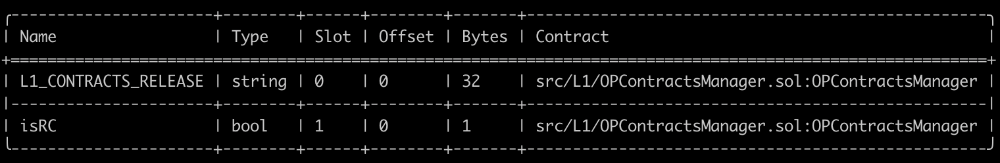

# Validation

This document can be used to validate the inputs and result of the execution of the upgrade transaction which you are
signing.

The steps are:

1. [Validate the Domain and Message Hashes](#expected-domain-and-message-hashes)
2. [Verifying the transaction input](#understanding-task-calldata)
3. [Verifying the state changes](#state-changes)

## Expected Domain and Message Hashes

First, we need to validate the domain and message hashes. These values should match both the values on your ledger and
the values printed to the terminal when you run the task.

> [!CAUTION]
>
> Before signing, ensure the below hashes match what is on your ledger.
>
> ### Security Council - `0xc2819DC788505Aac350142A7A707BF9D03E3Bd03`
>
> - Domain Hash: `0xdf53d510b56e539b90b369ef08fce3631020fbf921e3136ea5f8747c20bce967`
> - Message Hash: `0x29c3914c55b1fb31412058abedaf32af3358b2c46572b0d8f4c099cd85a50706`
>
> ### Optimism Foundation - `0x847B5c174615B1B7fDF770882256e2D3E95b9D92`
>
> - Domain Hash: `0xa4a9c312badf3fcaa05eafe5dc9bee8bd9316c78ee8b0bebe3115bb21b732672`
> - Message Hash: `0x0d2be41ad50c6045579fe3f20c0e77a4bb99dc8ce8a2a032489b76f85b7563b9`

## Understanding Task Calldata

This document provides a detailed analysis of the final calldata executed on-chain for the OPCM upgrade to v3.0.0.

By reconstructing the calldata, we can confirm that the execution precisely implements the approved upgrade plan with no unexpected modifications or side effects.

### Inputs to `opcm.upgrade()`

For each chain being upgrade, the `opcm.upgrade()` function is called with a tuple of three elements:

1. OP Mainnet:
    - SystemConfigProxy: [0x229047fed2591dbec1eF1118d64F7aF3dB9EB290](https://github.com/ethereum-optimism/superchain-registry/blob/d4bb112dc979fd43ac92252c549d3ed7c4d0eb57/superchain/configs/mainnet/op.toml#L58)
    - ProxyAdmin: [0x543bA4AADBAb8f9025686Bd03993043599c6fB04](https://github.com/ethereum-optimism/superchain-registry/blob/d4bb112dc979fd43ac92252c549d3ed7c4d0eb57/superchain/configs/mainnet/op.toml#L59)
    - AbsolutePrestate: [0x03ee2917da962ec266b091f4b62121dc9682bb0db534633707325339f99ee405](https://www.notion.so/oplabs/Upgrade-14-MTCannon-1d6f153ee1628024af26cd0098d3bdfe?pvs=4)

2. Soneium:
    - SystemConfigProxy: [0x7A8Ed66B319911A0F3E7288BDdAB30d9c0C875c3](https://github.com/ethereum-optimism/superchain-registry/blob/d4bb112dc979fd43ac92252c549d3ed7c4d0eb57/superchain/configs/mainnet/soneium.toml#L58)
    - ProxyAdmin: [0x89889B569c3a505f3640ee1Bd0ac1D557f436D2a](https://github.com/ethereum-optimism/superchain-registry/blob/d4bb112dc979fd43ac92252c549d3ed7c4d0eb57/superchain/configs/mainnet/soneium.toml#L59)
    - AbsolutePrestate: [0x03ee2917da962ec266b091f4b62121dc9682bb0db534633707325339f99ee405](https://www.notion.so/oplabs/Upgrade-14-MTCannon-1d6f153ee1628024af26cd0098d3bdfe?pvs=4)

3. Ink:
    - SystemConfigProxy: [0x62C0a111929fA32ceC2F76aDba54C16aFb6E8364](https://github.com/ethereum-optimism/superchain-registry/blob/d4bb112dc979fd43ac92252c549d3ed7c4d0eb57/superchain/configs/mainnet/ink.toml#L58)
    - ProxyAdmin: [0xd56045E68956FCe2576E680c95a4750cf8241f79](https://github.com/ethereum-optimism/superchain-registry/blob/d4bb112dc979fd43ac92252c549d3ed7c4d0eb57/superchain/configs/mainnet/ink.toml#L59)
    - AbsolutePrestate: [0x03ee2917da962ec266b091f4b62121dc9682bb0db534633707325339f99ee405](https://www.notion.so/oplabs/Upgrade-14-MTCannon-1d6f153ee1628024af26cd0098d3bdfe?pvs=4)


Thus, the command to encode the calldata is:


```bash
cast calldata 'upgrade((address,address,bytes32)[])' "[(0x229047fed2591dbec1eF1118d64F7aF3dB9EB290,0x543bA4AADBAb8f9025686Bd03993043599c6fB04,0x03ee2917da962ec266b091f4b62121dc9682bb0db534633707325339f99ee405),(0x7A8Ed66B319911A0F3E7288BDdAB30d9c0C875c3,0x89889B569c3a505f3640ee1Bd0ac1D557f436D2a,0x03ee2917da962ec266b091f4b62121dc9682bb0db534633707325339f99ee405),(0x62C0a111929fA32ceC2F76aDba54C16aFb6E8364,0xd56045E68956FCe2576E680c95a4750cf8241f79,0x03ee2917da962ec266b091f4b62121dc9682bb0db534633707325339f99ee405)]"
```

### Inputs to `Multicall3DelegateCall`

The output from the previous section becomes the `data` in the argument to the `Multicall3DelegateCall.aggregate3()` function.

This function is called with a tuple of three elements:


Call3 struct for Multicall3DelegateCall:
- `target`: [0x3a1f523a4bc09cd344a2745a108bb0398288094f](https://github.com/ethereum-optimism/superchain-registry/blob/1a5d7a208cea9b0ea175df1fe71bdc4da7f4c04c/validation/standard/standard-versions-mainnet.toml#L22) - Mainnet OPContractsManager v3.0.0
- `allowFailure`: false
- `callData`: `0xff2dd5a1...` (output from the previous section)

Command to encode:
```bash
cast calldata 'aggregate3((address,bool,bytes)[])' "[(0x3a1f523a4bc09cd344a2745a108bb0398288094f,false,0xff2dd5a100000000000000000000000000000000000000000000000000000000000000200000000000000000000000000000000000000000000000000000000000000003000000000000000000000000229047fed2591dbec1ef1118d64f7af3db9eb290000000000000000000000000543ba4aadbab8f9025686bd03993043599c6fb0403ee2917da962ec266b091f4b62121dc9682bb0db534633707325339f99ee4050000000000000000000000007a8ed66b319911a0f3e7288bddab30d9c0c875c300000000000000000000000089889b569c3a505f3640ee1bd0ac1d557f436d2a03ee2917da962ec266b091f4b62121dc9682bb0db534633707325339f99ee40500000000000000000000000062c0a111929fa32cec2f76adba54c16afb6e8364000000000000000000000000d56045e68956fce2576e680c95a4750cf8241f7903ee2917da962ec266b091f4b62121dc9682bb0db534633707325339f99ee405)]"
```

The resulting calldata sent from the ProxyAdminOwner safe is thus:

```
0x82ad56cb0000000000000000000000000000000000000000000000000000000000000020000000000000000000000000000000000000000000000000000000000000000100000000000000000000000000000000000000000000000000000000000000200000000000000000000000003a1f523a4bc09cd344a2745a108bb0398288094f000000000000000000000000000000000000000000000000000000000000000000000000000000000000000000000000000000000000000000000000000000600000000000000000000000000000000000000000000000000000000000000164ff2dd5a100000000000000000000000000000000000000000000000000000000000000200000000000000000000000000000000000000000000000000000000000000003000000000000000000000000229047fed2591dbec1ef1118d64f7af3db9eb290000000000000000000000000543ba4aadbab8f9025686bd03993043599c6fb0403ee2917da962ec266b091f4b62121dc9682bb0db534633707325339f99ee4050000000000000000000000007a8ed66b319911a0f3e7288bddab30d9c0c875c300000000000000000000000089889b569c3a505f3640ee1bd0ac1d557f436d2a03ee2917da962ec266b091f4b62121dc9682bb0db534633707325339f99ee40500000000000000000000000062c0a111929fa32cec2f76adba54c16afb6e8364000000000000000000000000d56045e68956fce2576e680c95a4750cf8241f7903ee2917da962ec266b091f4b62121dc9682bb0db534633707325339f99ee40500000000000000000000000000000000000000000000000000000000
```

In mainnet runbooks, this calldata should appear in [Action Plan](https://gov.optimism.io/t/upgrade-proposal-14-isthmus-l1-contracts-mt-cannon/9796#p-43948-action-plan-9) section of the Governance proposal.

# State Validations

For each contract listed in the state diff, please verify that no contracts or state changes shown in the Tenderly diff are missing from this document. Additionally, please verify that for each contract:

- The following state changes (and none others) are made to that contract. This validates that no unexpected state
  changes occur.
- All addresses (in section headers and storage values) match the provided name, using the Etherscan and Superchain
  Registry links provided. This validates the bytecode deployed at the addresses contains the correct logic.
- All key values match the semantic meaning provided, which can be validated using the storage layout links provided.

### State Overrides

Note: The changes listed below do not include threshold, nonce and owner mapping overrides. These changes are listed and explained in the [NESTED-VALIDATION.md](../../../../../NESTED-VALIDATION.md) file.

### Task State Changes

  ---

### [`0x10d7b35078d3baabb96dd45a9143b94be65b12cd`](https://github.com/ethereum-optimism/superchain-registry/blob/b3d020de42abeebeb5786ea5508aa08d12bdf4cd/superchain/configs/mainnet/ink.toml#L64) (DisputeGameFactory) - Chain ID: 57073

- **Key:**          `0x4d5a9bd2e41301728d41c8e705190becb4e74abe869f75bdb405b63716a35f9e`
  - **Before:**     `0x0000000000000000000000004699d20479dfd20e15cab4fcb6f2a7cc6fe35443`
  - **After:**     `0x000000000000000000000000436bac2efe273e3f13eefeda2b3689c34591bca1`
  - **Summary:**  Set a new game implementation for game type [PERMISSIONED_CANNON](https://github.com/ethereum-optimism/optimism/blob/op-contracts/v3.0.0-rc.2/packages/contracts-bedrock/src/dispute/lib/Types.sol#L55)
  - **Detail:**  This is `gameImpls[1]` -> `0x436BaC2Efe273e3f13eEFeda2b3689C34591bca1`. The [`gameImpls` mapping](https://github.com/ethereum-optimism/optimism/blob/op-contracts/v3.0.0-rc.2/packages/contracts-bedrock/src/dispute/DisputeGameFactory.sol#L57) is at [storage slot 101](https://github.com/ethereum-optimism/optimism/blob/op-contracts/v3.0.0-rc.2/packages/contracts-bedrock/snapshots/storageLayout/DisputeGameFactory.json#L41) and is keyed by [`GameType` (`uint32`)](https://github.com/ethereum-optimism/optimism/blob/op-contracts/v3.0.0-rc.2/packages/contracts-bedrock/src/dispute/lib/LibUDT.sol#L224).
    - Confirm the expected key slot with the following:
      ```shell
      cast index uint32 1 101
      0x4d5a9bd2e41301728d41c8e705190becb4e74abe869f75bdb405b63716a35f9e
      ```

- **Key:**          `0xffdfc1249c027f9191656349feb0761381bb32c9f557e01f419fd08754bf5a1b`
  - **Before:**     `0x00000000000000000000000069361c9134d620b704c2a72c58523a4373ece86f`
  - **After:**     `0x000000000000000000000000499e30a3b1bdb03f554ffffae4c9c5edf31ca554`
- **Summary:**  Set a new game implementation for game type [CANNON](https://github.com/ethereum-optimism/optimism/blob/op-contracts/v3.0.0-rc.2/packages/contracts-bedrock/src/dispute/lib/Types.sol#L52)
  - **Detail:**  This is `gameImpls[0]` -> `0x499E30a3b1BDB03f554fFFFAe4c9c5Edf31ca554`. The [`gameImpls` mapping](https://github.com/ethereum-optimism/optimism/blob/op-contracts/v3.0.0-rc.2/packages/contracts-bedrock/src/dispute/DisputeGameFactory.sol#L57) is at [storage slot 101](https://github.com/ethereum-optimism/optimism/blob/op-contracts/v3.0.0-rc.2/packages/contracts-bedrock/snapshots/storageLayout/DisputeGameFactory.json#L41) and is keyed by [`GameType` (`uint32`)](https://github.com/ethereum-optimism/optimism/blob/op-contracts/v3.0.0-rc.2/packages/contracts-bedrock/src/dispute/lib/LibUDT.sol#L224).
    - Confirm the expected key slot with the following:
      ```shell
      cast index uint32 0 101
      0xffdfc1249c027f9191656349feb0761381bb32c9f557e01f419fd08754bf5a1b
      ```

  ---

### [`0x229047fed2591dbec1ef1118d64f7af3db9eb290`](https://github.com/ethereum-optimism/superchain-registry/blob/b3d020de42abeebeb5786ea5508aa08d12bdf4cd/superchain/configs/mainnet/op.toml#L59) (SystemConfig) - Chain ID: 10

- **Key:**          `0x360894a13ba1a3210667c828492db98dca3e2076cc3735a920a3ca505d382bbc`
  - **Decoded Kind:**      `address`
  - **Before:** `0x760C48C62A85045A6B69f07F4a9f22868659CbCc`
  - **After:** [`0x340f923E5c7cbB2171146f64169EC9d5a9FfE647`](https://github.com/ethereum-optimism/superchain-registry/blob/b3d020de42abeebeb5786ea5508aa08d12bdf4cd/validation/standard/standard-versions-mainnet.toml#L9)
  - **Summary:**           ERC-1967 implementation slot
  - **Detail:**            Standard slot for storing the implementation address in a proxy contract that follows the ERC-1967 standard. SystemConfig contract for `op-contracts/v3.0.0-rc.2`.

  ---

### [`0x24424336F04440b1c28685a38303aC33C9D14a25`](https://github.com/ethereum-optimism/superchain-ops/blob/2b33763cbae24bf5af1467f510e66a31b1b98b4a/NESTED-VALIDATION.md?plain=1#L106) (LivenessGuard)

> [!IMPORTANT]
> Security Council Only

**THIS STATE DIFF ONLY APPEARS WHEN SIGNING FOR THE COUNCIL AND DOES NOT NEED TO BE CHECKED BY SIGNERS.**

- **Key:**          `0xee4378be6a15d4c71cb07a5a47d8ddc4aba235142e05cb828bb7141206657e27`
  - **Before:**     `0x0000000000000000000000000000000000000000000000000000000000000000`
  - **After:**     `0x0000000000000000000000000000000000000000000000000000000067ff1066`
  - **Summary:**   LivenessGuard timestamp update.
  - **Detail:**    - **Detail:** **THIS STATE DIFF ONLY APPEARS WHEN SIGNING FOR THE COUNCIL AND DOES NOT NEED TO BE CHECKED BY SIGNERS.**
                   When the security council safe executes a transaction, the liveness timestamps are updated.
                   This is updating at the moment when the  transaction is submitted (`block.timestamp`) into the [`lastLive`](https://github.com/ethereum-optimism/optimism/blob/e84868c27776fd04dc77e95176d55c8f6b1cc9a3/packages/contracts-bedrock/src/safe/LivenessGuard.sol#L41) mapping located at the slot 0.

  ---

### [`0x3a1f523a4bc09cd344a2745a108bb0398288094f`](https://github.com/ethereum-optimism/superchain-registry/blob/b3d020de42abeebeb5786ea5508aa08d12bdf4cd/validation/standard/standard-versions-mainnet.toml#L22) (OPContractsManager)

- **Key:**          `0x0000000000000000000000000000000000000000000000000000000000000001`
  - **Before:**     `0x0000000000000000000000000000000000000000000000000000000000000001`
  - **After:**     `0x0000000000000000000000000000000000000000000000000000000000000000`
  - **Summary:**  `isRC` storage slot updated to 0.
    - **Detail:**  Once OPContractsManager is upgraded, the `isRC` flag is set to false.
                   This happens in the first invocation of the `upgrade` function. Please refer to `'Figure 0.1'` at the end of this report for the storage layout of OPContractsManager ([slot 1](https://github.com/ethereum-optimism/optimism/blob/op-contracts/v3.0.0-rc.2/packages/contracts-bedrock/snapshots/storageLayout/OPContractsManager.json#L16) is the `isRC` flag).

  ---

### [`0x512a3d2c7a43bd9261d2b8e8c9c70d4bd4d503c0`](https://github.com/ethereum-optimism/superchain-registry/blob/b3d020de42abeebeb5786ea5508aa08d12bdf4cd/superchain/configs/mainnet/soneium.toml#L64) (DisputeGameFactory) - Chain ID: 1868

- **Key:**          `0x4d5a9bd2e41301728d41c8e705190becb4e74abe869f75bdb405b63716a35f9e`
  - **Before:**     `0x0000000000000000000000001661af719956198628f7e67087f19f8a79524a1d`
  - **After:**     `0x0000000000000000000000003d56d47b9e7e34a46612badc70377f74051e6b17`
  - **Summary:**  Set a new game implementation for game type [PERMISSIONED_CANNON](https://github.com/ethereum-optimism/optimism/blob/op-contracts/v3.0.0-rc.2/packages/contracts-bedrock/src/dispute/lib/Types.sol#L55)
  - **Detail:**  This is `gameImpls[1]` -> `0x3D56d47b9E7E34A46612BadC70377F74051E6b17`. The [`gameImpls` mapping](https://github.com/ethereum-optimism/optimism/blob/op-contracts/v3.0.0-rc.2/packages/contracts-bedrock/src/dispute/DisputeGameFactory.sol#L57) is at [storage slot 101](https://github.com/ethereum-optimism/optimism/blob/op-contracts/v3.0.0-rc.2/packages/contracts-bedrock/snapshots/storageLayout/DisputeGameFactory.json#L41) and is keyed by [`GameType` (`uint32`)](https://github.com/ethereum-optimism/optimism/blob/op-contracts/v3.0.0-rc.2/packages/contracts-bedrock/src/dispute/lib/LibUDT.sol#L224).
    - Confirm the expected key slot with the following:
      ```shell
      cast index uint32 1 101
      0x4d5a9bd2e41301728d41c8e705190becb4e74abe869f75bdb405b63716a35f9e
      ```

  ---

### [`0x5933e323be8896dfacd1cd671442f27daa10a053`](https://github.com/ethereum-optimism/superchain-registry/blob/b3d020de42abeebeb5786ea5508aa08d12bdf4cd/superchain/configs/mainnet/soneium.toml#L55) (L1ERC721Bridge) - Chain ID: 1868

- **Key:**          `0x360894a13ba1a3210667c828492db98dca3e2076cc3735a920a3ca505d382bbc`
  - **Decoded Kind:**      `address`
  - **Before:** `0x276d3730f219f7ec22274f7263180b8452B46d47`
  - **After:** [`0x7aE1d3BD877a4C5CA257404ce26BE93A02C98013`](https://github.com/ethereum-optimism/superchain-registry/blob/b3d020de42abeebeb5786ea5508aa08d12bdf4cd/validation/standard/standard-versions-mainnet.toml#L19)
  - **Summary:**           ERC-1967 implementation slot
  - **Detail:**            Standard slot for storing the implementation address in a proxy contract that follows the ERC-1967 standard. L1ERC721Bridge contract for `op-contracts/v3.0.0-rc.2`.

  ---

### [`0x5a0aae59d09fccbddb6c6cceb07b7279367c3d2a`](https://github.com/ethereum-optimism/superchain-registry/blob/b3d020de42abeebeb5786ea5508aa08d12bdf4cd/validation/standard/standard-config-roles-mainnet.toml#L3) (ProxyAdminOwner (GnosisSafe)) - Chain ID: 10

- **Nonce:**
  - **Before:** 9
  - **After:** 14
  - **Detail:** Five new dispute games were deployed by the ProxyAdminOwner during execution, resulting in the account nonce in state being incremented five times.

- **Key:**          `0x0000000000000000000000000000000000000000000000000000000000000005`
  - **Decoded Kind:**      `uint256`
  - **Before:** `13`
  - **After:** `14`
  - **Summary:**  nonce updated to 14.
  - **Detail:**  This is the nonce of the ProxyAdminOwner (GnosisSafe) contract.

> [!IMPORTANT]
> Foundation Only

If signer is on foundation safe: `0x847B5c174615B1B7fDF770882256e2D3E95b9D92`:

- **Key:**      `0xb83cd9f113d329914a61adce818feb77eb750bf02115fdb71f059425216265be`
  - **Before:** `0x0000000000000000000000000000000000000000000000000000000000000000`
  - **After:** `0x0000000000000000000000000000000000000000000000000000000000000001`
  - **Summary:**  `approveHash(bytes32)` called on ProxyAdminOwner by child multisig.
  - **Detail:** **THIS WAS CAREFULLY VERIFIED BY RUNBOOK REVIEWERS AND NEED NOT BE CHECKED BY SIGNERS.** As part of the Tenderly simulation, we want to illustrate the <i>approveHash</i> invocation. This step isn't shown in the local simulation because the parent multisig is invoked directly, bypassing the <i>approveHash</i> calls. This slot change reflects an update to the approvedHashes mapping.
    Specifically, this simulation was ran as the nested safe `0x847B5c174615B1B7fDF770882256e2D3E95b9D92`. To verify the slot yourself, run:
    - `res=$(cast index address 0x847B5c174615B1B7fDF770882256e2D3E95b9D92 8)`
    - `cast index bytes32 0x0d1a3b425e64a0c9bd90f6933632c1cc0042896a1c5831ac8ef290cab8205e83 $res`
    - Please note: the `0x0d1a3b425e64a0c9bd90f6933632c1cc0042896a1c5831ac8ef290cab8205e83` value is taken from the Terminal output and this is the transaction hash of the `approveHash` call.

> [!IMPORTANT]
> Security Council Only

OR if signer is on council safe: `0xc2819DC788505Aac350142A7A707BF9D03E3Bd03`:

- **Key:**      `0x5a885a773b6d96648c59349af0d248450dd37b147ea53bb5b02a1eb5964bb78e`
  - **Before:** `0x0000000000000000000000000000000000000000000000000000000000000000`
  - **After:** `0x0000000000000000000000000000000000000000000000000000000000000001`
  - **Summary:**  `approveHash(bytes32)` called on ProxyAdminOwner by child multisig.
  - **Detail:** **THIS WAS CAREFULLY VERIFIED BY RUNBOOK REVIEWERS AND NEED NOT BE CHECKED BY SIGNERS.** As part of the Tenderly simulation, we want to illustrate the <i>approveHash</i> invocation. This step isn't shown in the local simulation because the parent multisig is invoked directly, bypassing the <i>approveHash</i> calls. This slot change reflects an update to the approvedHashes mapping.
    Specifically, this simulation was ran as the nested safe `0xc2819DC788505Aac350142A7A707BF9D03E3Bd03`. To verify the slot yourself, run:
    - `res=$(cast index address 0xc2819DC788505Aac350142A7A707BF9D03E3Bd03 8)`
    - `cast index bytes32 0x0d1a3b425e64a0c9bd90f6933632c1cc0042896a1c5831ac8ef290cab8205e83 $res`
    - Please note: the `0x0d1a3b425e64a0c9bd90f6933632c1cc0042896a1c5831ac8ef290cab8205e83` value is taken from the Terminal output and this is the transaction hash of the `approveHash` call.

  ---

### [`0x5a7749f83b81b301cab5f48eb8516b986daef23d`](https://github.com/ethereum-optimism/superchain-registry/blob/b3d020de42abeebeb5786ea5508aa08d12bdf4cd/superchain/configs/mainnet/op.toml#L55)  (L1ERC721Bridge) - Chain ID: 10

- **Key:**          `0x360894a13ba1a3210667c828492db98dca3e2076cc3735a920a3ca505d382bbc`
  - **Decoded Kind:**      `address`
  - **Before:** `0x276d3730f219f7ec22274f7263180b8452B46d47`
  - **After:** [`0x7aE1d3BD877a4C5CA257404ce26BE93A02C98013`](https://github.com/ethereum-optimism/superchain-registry/blob/b3d020de42abeebeb5786ea5508aa08d12bdf4cd/validation/standard/standard-versions-mainnet.toml#L19)
  - **Summary:**           ERC-1967 implementation slot
  - **Detail:**            Standard slot for storing the implementation address in a proxy contract that follows the ERC-1967 standard. L1ERC721Bridge contract for `op-contracts/v3.0.0-rc.2`.

  ---

### [`0x5d66c1782664115999c47c9fa5cd031f495d3e4f`](https://github.com/ethereum-optimism/superchain-registry/blob/b3d020de42abeebeb5786ea5508aa08d12bdf4cd/superchain/configs/mainnet/ink.toml#L58) (OptimismPortal2) - Chain ID: 57073

- **Key:**          `0x360894a13ba1a3210667c828492db98dca3e2076cc3735a920a3ca505d382bbc`
  - **Decoded Kind:**      `address`
  - **Before:** `0x2D7e764a0D9919e16983a46595CfA81fc34fa7Cd`
  - **After:** [`0xB443Da3e07052204A02d630a8933dAc05a0d6fB4`](https://github.com/ethereum-optimism/superchain-registry/blob/b3d020de42abeebeb5786ea5508aa08d12bdf4cd/validation/standard/standard-versions-mainnet.toml#L13)
  - **Summary:**           ERC-1967 implementation slot
  - **Detail:**            Standard slot for storing the implementation address in a proxy contract that follows the ERC-1967 standard. OptimismPortal2 contract for `op-contracts/v3.0.0-rc.2`.

  ---

### [`0x62c0a111929fa32cec2f76adba54c16afb6e8364`](https://github.com/ethereum-optimism/superchain-registry/blob/b3d020de42abeebeb5786ea5508aa08d12bdf4cd/superchain/configs/mainnet/ink.toml#L59) (SystemConfig) - Chain ID: 57073

- **Key:**          `0x360894a13ba1a3210667c828492db98dca3e2076cc3735a920a3ca505d382bbc`
  - **Decoded Kind:**      `address`
  - **Before:** `0x760C48C62A85045A6B69f07F4a9f22868659CbCc`
  - **After:** [`0x340f923E5c7cbB2171146f64169EC9d5a9FfE647`](https://github.com/ethereum-optimism/superchain-registry/blob/b3d020de42abeebeb5786ea5508aa08d12bdf4cd/validation/standard/standard-versions-mainnet.toml#L9)
  - **Summary:**           ERC-1967 implementation slot
  - **Detail:**            Standard slot for storing the implementation address in a proxy contract that follows the ERC-1967 standard.

  ---

### [`0x661235a238b11191211fa95d4dd9e423d521e0be`](https://github.com/ethereum-optimism/superchain-registry/blob/b3d020de42abeebeb5786ea5508aa08d12bdf4cd/superchain/configs/mainnet/ink.toml#L55) (L1ERC721Bridge) - Chain ID: 57073

- **Key:**          `0x360894a13ba1a3210667c828492db98dca3e2076cc3735a920a3ca505d382bbc`
  - **Decoded Kind:**      `address`
  - **Before:** `0x276d3730f219f7ec22274f7263180b8452B46d47`
  - **After:** [`0x7aE1d3BD877a4C5CA257404ce26BE93A02C98013`](https://github.com/ethereum-optimism/superchain-registry/blob/b3d020de42abeebeb5786ea5508aa08d12bdf4cd/validation/standard/standard-versions-mainnet.toml#L19)
  - **Summary:**           ERC-1967 implementation slot
  - **Detail:**            Standard slot for storing the implementation address in a proxy contract that follows the ERC-1967 standard. L1ERC721Bridge contract for `op-contracts/v3.0.0-rc.2`.

  ---

### [`0x7a8ed66b319911a0f3e7288bddab30d9c0c875c3`](https://github.com/ethereum-optimism/superchain-registry/blob/b3d020de42abeebeb5786ea5508aa08d12bdf4cd/superchain/configs/mainnet/soneium.toml#L59) (SystemConfig) - Chain ID: 1868

- **Key:**          `0x360894a13ba1a3210667c828492db98dca3e2076cc3735a920a3ca505d382bbc`
  - **Decoded Kind:**      `address`
  - **Before:** `0x760C48C62A85045A6B69f07F4a9f22868659CbCc`
  - **After:** [`0x340f923E5c7cbB2171146f64169EC9d5a9FfE647`](https://github.com/ethereum-optimism/superchain-registry/blob/b3d020de42abeebeb5786ea5508aa08d12bdf4cd/validation/standard/standard-versions-mainnet.toml#L9)
  - **Summary:**           ERC-1967 implementation slot
  - **Detail:**            Standard slot for storing the implementation address in a proxy contract that follows the ERC-1967 standard. SystemConfig contract for `op-contracts/v3.0.0-rc.2`.

  ---

### [`0x847B5c174615B1B7fDF770882256e2D3E95b9D92`](https://github.com/ethereum-optimism/superchain-ops/blob/2b33763cbae24bf5af1467f510e66a31b1b98b4a/NESTED-VALIDATION.md?plain=1#L37) (GnosisSafe) - Foundation Safe

> [!IMPORTANT]
> Foundation Only

**Note: You'll only see this state diff if signer is on foundation safe: `0x847B5c174615B1B7fDF770882256e2D3E95b9D92`. Ignore if you're signing for the council safe: `0xc2819DC788505Aac350142A7A707BF9D03E3Bd03`.**

- **Key:**    `0x0000000000000000000000000000000000000000000000000000000000000005`
  - **Before:** `21`
  - **After:** `22`
  - **Summary:**  Nonce update
  - **Detail:**            Standard slot for storing the implementation address in a proxy contract that follows the ERC-1967 standard. SystemConfig contract for `op-contracts/v3.0.0-rc.2`.
    - Before: `cast --to-dec 0x15` = 21
    - After: `cast --to-dec 0x16` = 22

  ---

### [`0x88e529a6ccd302c948689cd5156c83d4614fae92`](https://github.com/ethereum-optimism/superchain-registry/blob/b3d020de42abeebeb5786ea5508aa08d12bdf4cd/superchain/configs/mainnet/soneium.toml#L58) (OptimismPortal2) - Chain ID: 1868

- **Key:**          `0x360894a13ba1a3210667c828492db98dca3e2076cc3735a920a3ca505d382bbc`
  - **Decoded Kind:**      `address`
  - **Before:** `0x2D7e764a0D9919e16983a46595CfA81fc34fa7Cd`
  - **After:** [`0xB443Da3e07052204A02d630a8933dAc05a0d6fB4`](https://github.com/ethereum-optimism/superchain-registry/blob/b3d020de42abeebeb5786ea5508aa08d12bdf4cd/validation/standard/standard-versions-mainnet.toml#L13)
  - **Summary:**           ERC-1967 implementation slot
  - **Detail:**            Standard slot for storing the implementation address in a proxy contract that follows the ERC-1967 standard. OptimismPortal2 contract for `op-contracts/v3.0.0-rc.2`.

  ---

### [`0x88ff1e5b602916615391f55854588efcbb7663f0`](https://github.com/ethereum-optimism/superchain-registry/blob/b3d020de42abeebeb5786ea5508aa08d12bdf4cd/superchain/configs/mainnet/ink.toml#L56) (L1StandardBridge) - Chain ID: 57073

- **Key:**          `0x360894a13ba1a3210667c828492db98dca3e2076cc3735a920a3ca505d382bbc`
  - **Decoded Kind:**      `address`
  - **Before:** `0x78972E88Ab8BBB517a36cAea23b931BAB58AD3c6`
  - **After:** [`0x0b09ba359A106C9ea3b181CBc5F394570c7d2a7A`](https://github.com/ethereum-optimism/superchain-registry/blob/b3d020de42abeebeb5786ea5508aa08d12bdf4cd/validation/standard/standard-versions-mainnet.toml#L20)
  - **Summary:**           ERC-1967 implementation slot
  - **Detail:**            Standard slot for storing the implementation address in a proxy contract that follows the ERC-1967 standard. L1StandardBridge contract for `op-contracts/v3.0.0-rc.2`.

  ---

### [`0x99c9fc46f92e8a1c0dec1b1747d010903e884be1`](https://github.com/ethereum-optimism/superchain-registry/blob/b3d020de42abeebeb5786ea5508aa08d12bdf4cd/superchain/configs/mainnet/op.toml#L56) (L1StandardBridge) - Chain ID: 10

- **Key:**          `0x360894a13ba1a3210667c828492db98dca3e2076cc3735a920a3ca505d382bbc`
  - **Decoded Kind:**      `address`
  - **Before:** `0x78972E88Ab8BBB517a36cAea23b931BAB58AD3c6`
  - **After:** [`0x0b09ba359A106C9ea3b181CBc5F394570c7d2a7A`](https://github.com/ethereum-optimism/superchain-registry/blob/b3d020de42abeebeb5786ea5508aa08d12bdf4cd/validation/standard/standard-versions-mainnet.toml#L20)
  - **Summary:**           ERC-1967 implementation slot
  - **Detail:**            Standard slot for storing the implementation address in a proxy contract that follows the ERC-1967 standard. L1StandardBridge contract for `op-contracts/v3.0.0-rc.2`.

  ---

### [`0x9b7c9bbd6d540a8a4dedd935819fc4408ba71153`](https://github.com/ethereum-optimism/superchain-registry/blob/b3d020de42abeebeb5786ea5508aa08d12bdf4cd/superchain/configs/mainnet/ink.toml#L53) (AddressManager) - Chain ID: 57073

- **Key:**          `0x515216935740e67dfdda5cf8e248ea32b3277787818ab59153061ac875c9385e`
  - **Before:**     `0x0000000000000000000000003ea6084748ed1b2a9b5d4426181f1ad8c93f6231`
  - **After:**     `0x0000000000000000000000005d5a095665886119693f0b41d8dfee78da033e8b`
  - **Summary:**  The name `OVM_L1CrossDomainMessenger` is set to the address of the new 'op-contracts/v3.0.0-rc.2' L1CrossDomainMessenger at [0x5d5a095665886119693f0b41d8dfee78da033e8b](https://github.com/ethereum-optimism/superchain-registry/blob/b3d020de42abeebeb5786ea5508aa08d12bdf4cd/validation/standard/standard-versions-mainnet.toml#L18).
  - **Detail:** **THIS WAS CAREFULLY VERIFIED BY RUNBOOK REVIEWERS AND NEED NOT BE CHECKED BY SIGNERS.**
    This key is complicated to compute, so instead we attest to correctness of the key by
    verifying that the "Before" value currently exists in that slot, as explained below.
    **Before** address matches the following cast call to `AddressManager.getAddress()`:
      - `cast call 0x9b7c9bbd6d540a8a4dedd935819fc4408ba71153 'getAddress(string)(address)' 'OVM_L1CrossDomainMessenger' --rpc-url mainnet`
      - returns: `0x3eA6084748ED1b2A9B5D4426181F1ad8C93F6231`

  ---

### [`0xb24bfeece1b3b7a44559f4cbc21bed312b130b70`](https://github.com/ethereum-optimism/superchain-registry/blob/b3d020de42abeebeb5786ea5508aa08d12bdf4cd/superchain/configs/mainnet/soneium.toml#L53) (AddressManager) - Chain ID: 1868

- **Key:**          `0x515216935740e67dfdda5cf8e248ea32b3277787818ab59153061ac875c9385e`
  - **Before:**     `0x0000000000000000000000003ea6084748ed1b2a9b5d4426181f1ad8c93f6231`
  - **After:**     `0x0000000000000000000000005d5a095665886119693f0b41d8dfee78da033e8b`
  - **Summary:**  The name `OVM_L1CrossDomainMessenger` is set to the address of the new 'op-contracts/v3.0.0-rc.2' L1CrossDomainMessenger at [0x5d5a095665886119693f0b41d8dfee78da033e8b](https://github.com/ethereum-optimism/superchain-registry/blob/b3d020de42abeebeb5786ea5508aa08d12bdf4cd/validation/standard/standard-versions-mainnet.toml#L18).
  - **Detail:** **THIS WAS CAREFULLY VERIFIED BY RUNBOOK REVIEWERS AND NEED NOT BE CHECKED BY SIGNERS.**
    This key is complicated to compute, so instead we attest to correctness of the key by
    verifying that the "Before" value currently exists in that slot, as explained below.
    **Before** address matches the following cast call to `AddressManager.getAddress()`:
      - `cast call 0xb24bfeece1b3b7a44559f4cbc21bed312b130b70 'getAddress(string)(address)' 'OVM_L1CrossDomainMessenger' --rpc-url mainnet`
      - returns: `0x3eA6084748ED1b2A9B5D4426181F1ad8C93F6231`

  ---

### [`0xbeb5fc579115071764c7423a4f12edde41f106ed`](https://github.com/ethereum-optimism/superchain-registry/blob/b3d020de42abeebeb5786ea5508aa08d12bdf4cd/superchain/configs/mainnet/op.toml#L58) (OptimismPortal2) - Chain ID: 10

- **Key:**          `0x360894a13ba1a3210667c828492db98dca3e2076cc3735a920a3ca505d382bbc`
  - **Decoded Kind:** `address`
  - **Before:** `0x2D7e764a0D9919e16983a46595CfA81fc34fa7Cd`
  - **After:** [`0xB443Da3e07052204A02d630a8933dAc05a0d6fB4`](https://github.com/ethereum-optimism/superchain-registry/blob/b3d020de42abeebeb5786ea5508aa08d12bdf4cd/validation/standard/standard-versions-mainnet.toml#L13)
  - **Summary:**           ERC-1967 implementation slot
  - **Detail:**            Standard slot for storing the implementation address in a proxy contract that follows the ERC-1967 standard. OptimismPortal2 contract for `op-contracts/v3.0.0-rc.2`.

  ---

### [`0xc2819DC788505Aac350142A7A707BF9D03E3Bd03`](https://github.com/ethereum-optimism/superchain-ops/blob/2b33763cbae24bf5af1467f510e66a31b1b98b4a/NESTED-VALIDATION.md?plain=1#L36) (GnosisSafe) - Council Safe

> [!IMPORTANT]
> Security Council Only

**Note: You'll only see this state diff if signer is on the counil safe: `0xc2819DC788505Aac350142A7A707BF9D03E3Bd03`. Ignore if you're signing for the foundation safe: `0x847B5c174615B1B7fDF770882256e2D3E95b9D92`.**

- **Key:**    `0x0000000000000000000000000000000000000000000000000000000000000005`
  - **Before:** `23`
  - **After:** `24`
  - **Summary:**  Nonce update
  - **Detail:**  Nonce update for the child safe `0x847B5c174615B1B7fDF770882256e2D3E95b9D92`. You can verify manually with the following:
    - Before: `cast --to-dec 0x15` = 21
    - After: `cast --to-dec 0x16` = 22

  ---

### [`0xde1fcfb0851916ca5101820a69b13a4e276bd81f`](https://github.com/ethereum-optimism/superchain-registry/blob/b3d020de42abeebeb5786ea5508aa08d12bdf4cd/superchain/configs/mainnet/op.toml#L53) (AddressManager) - Chain ID: 10

- **Key:**          `0x515216935740e67dfdda5cf8e248ea32b3277787818ab59153061ac875c9385e`
  - **Before:**     `0x0000000000000000000000003ea6084748ed1b2a9b5d4426181f1ad8c93f6231`
  - **After:**     `0x0000000000000000000000005d5a095665886119693f0b41d8dfee78da033e8b`
  - **Summary:**  The name `OVM_L1CrossDomainMessenger` is set to the address of the new 'op-contracts/v3.0.0-rc.2' L1CrossDomainMessenger at [0x5d5a095665886119693f0b41d8dfee78da033e8b](https://github.com/ethereum-optimism/superchain-registry/blob/b3d020de42abeebeb5786ea5508aa08d12bdf4cd/validation/standard/standard-versions-mainnet.toml#L18).
  - **Detail:** **THIS WAS CAREFULLY VERIFIED BY RUNBOOK REVIEWERS AND NEED NOT BE CHECKED BY SIGNERS.**
    This key is complicated to compute, so instead we attest to correctness of the key by
    verifying that the "Before" value currently exists in that slot, as explained below.
    **Before** address matches the following cast call to `AddressManager.getAddress()`:
      - `cast call 0xde1fcfb0851916ca5101820a69b13a4e276bd81f 'getAddress(string)(address)' 'OVM_L1CrossDomainMessenger' --rpc-url mainnet`
      - returns: `0x3eA6084748ED1b2A9B5D4426181F1ad8C93F6231`

  ---

### [`0xe5965ab5962edc7477c8520243a95517cd252fa9`](https://github.com/ethereum-optimism/superchain-registry/blob/b3d020de42abeebeb5786ea5508aa08d12bdf4cd/superchain/configs/mainnet/op.toml#L63) (DisputeGameFactory) - Chain ID: 10

- **Key:**          `0x4d5a9bd2e41301728d41c8e705190becb4e74abe869f75bdb405b63716a35f9e`
  - **Before:**     `0x000000000000000000000000d113ad136a0df1c7ffb7f1606be1c778bcfe2f3b`
  - **After:**     `0x0000000000000000000000001ae178ebfeecd51709432ea5f37845da0414edfe`
  - **Summary:**  Set a new game implementation for game type [PERMISSIONED_CANNON](https://github.com/ethereum-optimism/optimism/blob/op-contracts/v3.0.0-rc.2/packages/contracts-bedrock/src/dispute/lib/Types.sol#L55)
  - **Detail:**  This is `gameImpls[1]` -> `0x1Ae178eBFEECd51709432EA5f37845Da0414EdFe`. The [`gameImpls` mapping](https://github.com/ethereum-optimism/optimism/blob/op-contracts/v3.0.0-rc.2/packages/contracts-bedrock/src/dispute/DisputeGameFactory.sol#L57) is at [storage slot 101](https://github.com/ethereum-optimism/optimism/blob/op-contracts/v3.0.0-rc.2/packages/contracts-bedrock/snapshots/storageLayout/DisputeGameFactory.json#L41) and is keyed by [`GameType` (`uint32`)](https://github.com/ethereum-optimism/optimism/blob/op-contracts/v3.0.0-rc.2/packages/contracts-bedrock/src/dispute/lib/LibUDT.sol#L224).
    - Confirm the expected key slot with the following:
      ```shell
      cast index uint32 1 101
      0x4d5a9bd2e41301728d41c8e705190becb4e74abe869f75bdb405b63716a35f9e
      ```

- **Key:**          `0xffdfc1249c027f9191656349feb0761381bb32c9f557e01f419fd08754bf5a1b`
  - **Before:**     `0x000000000000000000000000ba94955ca3422fc57f9d982a0bad2a9c88e2a9d0`
  - **After:**     `0x0000000000000000000000005738a876359b48a65d35482c93b43e2c1147b32b`
- **Summary:**  Set a new game implementation for game type [CANNON](https://github.com/ethereum-optimism/optimism/blob/op-contracts/v3.0.0-rc.2/packages/contracts-bedrock/src/dispute/lib/Types.sol#L52)
  - **Detail:**  This is `gameImpls[0]` -> `0x5738a876359b48A65d35482C93B43e2c1147B32B`. The [`gameImpls` mapping](https://github.com/ethereum-optimism/optimism/blob/op-contracts/v3.0.0-rc.2/packages/contracts-bedrock/src/dispute/DisputeGameFactory.sol#L57) is at [storage slot 101](https://github.com/ethereum-optimism/optimism/blob/op-contracts/v3.0.0-rc.2/packages/contracts-bedrock/snapshots/storageLayout/DisputeGameFactory.json#L41) and is keyed by [`GameType` (`uint32`)](https://github.com/ethereum-optimism/optimism/blob/op-contracts/v3.0.0-rc.2/packages/contracts-bedrock/src/dispute/lib/LibUDT.sol#L224).
    - Confirm the expected key slot with the following:
      ```shell
      cast index uint32 0 101
      0xffdfc1249c027f9191656349feb0761381bb32c9f557e01f419fd08754bf5a1b
      ```

  ---

### [`0xeb9bf100225c214efc3e7c651ebbadcf85177607`](https://github.com/ethereum-optimism/superchain-registry/blob/b3d020de42abeebeb5786ea5508aa08d12bdf4cd/superchain/configs/mainnet/soneium.toml#L56) (L1StandardBridge) - Chain ID: 1868

- **Key:**          `0x360894a13ba1a3210667c828492db98dca3e2076cc3735a920a3ca505d382bbc`
  - **Decoded Kind:**      `address`
  - **Before:** `0x78972E88Ab8BBB517a36cAea23b931BAB58AD3c6`
  - **After:** [`0x0b09ba359A106C9ea3b181CBc5F394570c7d2a7A`](https://github.com/ethereum-optimism/superchain-registry/blob/b3d020de42abeebeb5786ea5508aa08d12bdf4cd/validation/standard/standard-versions-mainnet.toml#L20)
  - **Summary:**           ERC-1967 implementation slot
  - **Detail:**            Standard slot for storing the implementation address in a proxy contract that follows the ERC-1967 standard. L1StandardBridge contract for `op-contracts/v3.0.0-rc.2`.

  ---

### Nonce increments

- `0x1Ae178eBFEECd51709432EA5f37845Da0414EdFe` - Permissioned GameType Implementation for OP Mainnet
- `0x3D56d47b9E7E34A46612BadC70377F74051E6b17` - Permissioned GameType Implementation for Soneium
- <sender-address> - Sender address of the Tenderly transaction (Your ledger or first owner on the nested safe (if you're simulating)).
- `0x436BaC2Efe273e3f13eEFeda2b3689C34591bca1` - Permissioned GameType Implementation for Ink
- `0x499E30a3b1BDB03f554fFFFAe4c9c5Edf31ca554` - Permissionless GameType Implementation for Ink
- `0x5738a876359b48A65d35482C93B43e2c1147B32B` - Permissionless GameType Implementation for OP Mainnet
  
# Supplementary Material

## Figure 0.1: Storage Layout of OPContractsManager

