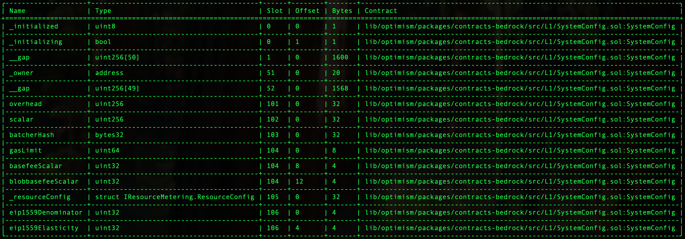

# Validation

This document can be used to validate the inputs and result of the execution of the SystemConfig gas param transactions which you are
signing.

The steps are:

1. [Validate the Domain and Message Hashes](#expected-domain-and-message-hashes)
2. [Verifying the transaction input](#understanding-task-calldata)
3. [Verifying the state changes](#state-changes)

## Expected Domain and Message Hashes

First, we need to validate the domain and message hashes. These values should match both the values on your ledger and
the values printed to the terminal when you run the task.

> [!CAUTION]
>
> Before signing, ensure the below hashes match what is on your ledger.
>
> ### FoundationUpgradeSafe: `0x847B5c174615B1B7fDF770882256e2D3E95b9D92`
> 
> - Safe Transaction Hash: `0x2a2bbcf27d84917e63af938f74f371f2b50fe8684e13b2e33491a374492514a4`
> - Domain Hash: `0xa4a9c312badf3fcaa05eafe5dc9bee8bd9316c78ee8b0bebe3115bb21b732672`
> - Message Hash: `0x1f2889becb33bef3df763954b321406d069dfef4ccf82c7d91c619336ad96f33`

## Understanding Task Calldata

This document provides a detailed analysis of the final calldata executed on-chain for the gas params update for OP Mainnet.

By reconstructing the calldata, we can confirm that the execution precisely implements the approved upgrade plan with no unexpected modifications or side effects.

### Inputs to `SystemConfig.setGasLimit(uint64 _gasLimit)`

This function is called with the following inputs:

- `_gasLimit`: 60_000_000

We are using an environment variable override `GETH_MINER_EFFECTIVEGASLIMIT: "40000000"` on our sequencers such that the effective gas limit is 40M. We set the onchain gasLimit to 60M because it allows us to set the gasTarget to the exact value we want due to this gasTarget formula:
```
gasTarget = (onchain gasLimit)/(eip1559_elasticity) = 60Mgas/4 = 15Mgas
```

Command to encode:

```bash
cast calldata "setGasLimit(uint64)" 60000000
```

Resulting calldata:
```
0xb40a817c0000000000000000000000000000000000000000000000000000000003938700
```

### Inputs to `SystemConfig.setEIP1559Params(uint32 _denominator, uint32 _elasticity)`

This function is called with the following inputs:

- `_denominator`: 250
- `_elasticity`: 4

Command to encode:

```bash
cast calldata "setEIP1559Params(uint32,uint32)" 250 4
```

Resulting calldata:
```
0xc0fd4b4100000000000000000000000000000000000000000000000000000000000000fa0000000000000000000000000000000000000000000000000000000000000004
```

### Inputs to `Multicall3DelegateCall`

The output from the previous section becomes the `data` in the argument to the `Multicall3DelegateCall.aggregate3Value()` function.

This function is called with a tuple of three elements:

Call3 struct for Multicall3DelegateCall SystemConfig tx_1:

- `target`: [0x229047fed2591dbec1ef1118d64f7af3db9eb290](https://github.com/ethereum-optimism/superchain-registry/blob/main/superchain/configs/mainnet/op.toml#L59) - op-mainnet SystemConfig
- `allowFailure`: false
- `value`: 0
- `callData`: `0xb40a817c0000000000000000000000000000000000000000000000000000000003938700` (output from the previous section)

Call3 struct for Multicall3DelegateCall SystemConfig tx_2:

- `target`: [0x229047fed2591dbec1ef1118d64f7af3db9eb290](https://github.com/ethereum-optimism/superchain-registry/blob/main/superchain/configs/mainnet/op.toml#L59) - op-mainnet SystemConfig
- `allowFailure`: false
- `value`: 0
- `callData`: `0xc0fd4b4100000000000000000000000000000000000000000000000000000000000000fa0000000000000000000000000000000000000000000000000000000000000004` (output from the previous section)

Command to encode:

```bash
cast calldata 'aggregate3Value((address,bool,uint256,bytes)[])' "[(0x229047fed2591dbec1ef1118d64f7af3db9eb290,false,0,0xb40a817c0000000000000000000000000000000000000000000000000000000003938700),(0x229047fed2591dbec1ef1118d64f7af3db9eb290,false,0,0xc0fd4b4100000000000000000000000000000000000000000000000000000000000000fa0000000000000000000000000000000000000000000000000000000000000004)]"
```

The resulting calldata sent from the `FoundationUpgradesSafe` is thus:
```
0x174dea710000000000000000000000000000000000000000000000000000000000000020000000000000000000000000000000000000000000000000000000000000000200000000000000000000000000000000000000000000000000000000000000400000000000000000000000000000000000000000000000000000000000000120000000000000000000000000229047fed2591dbec1ef1118d64f7af3db9eb2900000000000000000000000000000000000000000000000000000000000000000000000000000000000000000000000000000000000000000000000000000000000000000000000000000000000000000000000000000000000000000000000800000000000000000000000000000000000000000000000000000000000000024b40a817c000000000000000000000000000000000000000000000000000000000393870000000000000000000000000000000000000000000000000000000000000000000000000000000000229047fed2591dbec1ef1118d64f7af3db9eb2900000000000000000000000000000000000000000000000000000000000000000000000000000000000000000000000000000000000000000000000000000000000000000000000000000000000000000000000000000000000000000000000800000000000000000000000000000000000000000000000000000000000000044c0fd4b4100000000000000000000000000000000000000000000000000000000000000fa000000000000000000000000000000000000000000000000000000000000000400000000000000000000000000000000000000000000000000000000
```

# State Changes

## Single Safe State Overrides and Changes

This task is executed by the `FoundationUpgradesSafe`. Refer to the [generic single Safe execution validation document](../../../../../SINGLE-VALIDATION.md)
for the expected state overrides and changes.

Additionally, Safe-related nonces [will increment by one](../../../../../SINGLE-VALIDATION.md#nonce-increments).

## State Diffs

For each contract listed in the state diff, please verify that no contracts or state changes shown in the Tenderly diff are missing from this document. Additionally, please verify that for each contract:

- The following state changes (and none others) are made to that contract. This validates that no unexpected state
  changes occur.
- All addresses (in section headers and storage values) match the provided name, using the Etherscan and Superchain
  Registry links provided. This validates the bytecode deployed at the addresses contains the correct logic.
- All key values match the semantic meaning provided, which can be validated using the storage layout links provided.

  ---

### `0x229047fed2591dbec1ef1118d64f7af3db9eb290`  ([SystemConfig](https://github.com/ethereum-optimism/superchain-registry/blob/main/superchain/configs/mainnet/op.toml#L59)) - Chain ID: 10
  
- **Key:** `0x000000000000000000000000000000000000000000000000000000000000006a`
  - **Before:** `0x0000000000000000000000000000000000000000000000000000000000000000`
  - **After:** `0x00000000000000000000000000000000000000000000000000000004000000fa`
  - **Summary:** eip1559Denominator and eip1559Elasticity changes
  - **Detail:** Changes two params, which share the same storage slot.
      * Sets the eip1559Denominator to 250, which is no change from [the current default value used](https://github.com/ethereum-optimism/superchain-registry/blob/main/superchain/configs/mainnet/op.toml#L27). We must set this value since we are also changing the eip1559Elasticity in the same tx. 
      * Sets the eip1559Denominator to 4: it's currently using [the default value of 6](https://github.com/ethereum-optimism/superchain-registry/blob/main/superchain/configs/mainnet/op.toml#L25). ([Slot 106](#supplementary-material) contains these values)
  
  ---
  
### `0x847b5c174615b1b7fdf770882256e2d3e95b9d92`  ([SystemConfigOwner](https://github.com/ethereum-optimism/superchain-registry/blob/main/superchain/configs/mainnet/op.toml#L44) (GnosisSafe)) - Chain ID: 10
  
- **Key:** `0x0000000000000000000000000000000000000000000000000000000000000005`
  - **Decoded Kind:** `uint256`
  - **Before:** `23`
  - **After:** `24`
  - **Summary:** nonce increments from 23 to 24
  - **Detail:** Increments the SystemConfigOwner (FoundationUpgradesSafe) nonce

### Nonce increments

The only other state change are the nonce increments as follows:

- sender-address - Sender address of the Tenderly transaction (Your ledger address).

# Supplementary Material
Figure 1: SystemConfig storage layout
