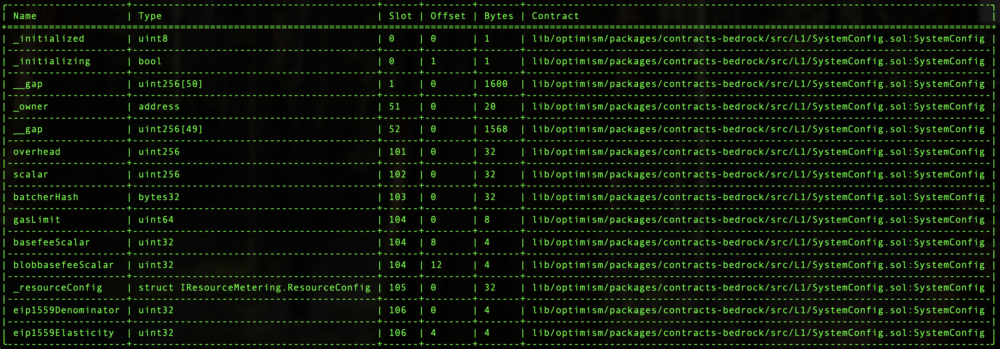

# Validation

This document can be used to validate the inputs and result of the execution of the SystemConfig gas param transactions you are signing.

The steps are:

1. [Validate the Domain and Message Hashes](#expected-domain-and-message-hashes)
2. [Verifying the state changes via the normalized state diff hash](#normalized-state-diff-hash-attestation)
3. [Verifying the transaction input](#understanding-task-calldata)
4. [Verifying the state changes](#task-state-changes)

## Expected Domain and Message Hashes

First, we need to validate the domain and message hashes. These values should match both the values on your ledger and
the values printed to the terminal when you run the task.

> [!CAUTION]
>
> Before signing, ensure the below hashes match what is on your ledger.
>
> ### FoundationUpgradeSafe: `0x847B5c174615B1B7fDF770882256e2D3E95b9D92`
> 
> - Safe Transaction Hash: `0x2b791100e1aaa7cdddf0a11846412dcd20595abd7011d3fbb946a5cf5e2b5c5b`
> - Domain Hash: `0xa4a9c312badf3fcaa05eafe5dc9bee8bd9316c78ee8b0bebe3115bb21b732672`
> - Message Hash: `0xf654f4cec87ea0aee5f1632a35fe9184a0ab53cd9a6c3d86fdcd0fdb446abf76`

## Normalized State Diff Hash Attestation

The normalized state diff hash **MUST** match the hash produced by the state changes attested to in the state diff audit report. As a signer, you are responsible for verifying that this hash is correct. Please compare the hash below with the one in the audit report. If no audit report is available for this task, you must still ensure that the normalized state diff hash matches the output in your terminal.

**Normalized hash:** `0x2576512ad010b917c049a392e916bb02de1c168477fe29c4f8cbc4fcb016a4b0`

## Understanding Task Calldata

This document provides a detailed analysis of the final calldata executed on-chain for the gas params update for OP Mainnet.

By reconstructing the calldata, we can confirm that the execution precisely implements the approved upgrade plan with no unexpected modifications or side effects.

### Inputs to `SystemConfig.setGasLimit(uint64 _gasLimit)`

This function is called with the following inputs:

- `_gasLimit`: 40_000_000

We are using an environment variable override `GETH_MINER_EFFECTIVEGASLIMIT: "40000000"` on our sequencers such that the effective gas limit has already been 40M. We set the onchain gasLimit to 40M now because we can achieve the desired gasTarget of 20Mgas/block and align the effective gas limit with the onchain gasLimit. This is the formula to calculate the gasTarget:
```
gasTarget = (onchain gasLimit)/(eip1559_elasticity) = 40Mgas/2 = 20Mgas/block
```

Command to encode:

```bash
cast calldata "setGasLimit(uint64)" 40000000
```

Resulting calldata:
```
0xb40a817c0000000000000000000000000000000000000000000000000000000002625a00
```

### Inputs to `SystemConfig.setEIP1559Params(uint32 _denominator, uint32 _elasticity)`

This function is called with the following inputs:

- `_denominator`: 250
- `_elasticity`: 2

Command to encode:

```bash
cast calldata "setEIP1559Params(uint32,uint32)" 250 2
```

Resulting calldata:
```
0xc0fd4b4100000000000000000000000000000000000000000000000000000000000000fa0000000000000000000000000000000000000000000000000000000000000002
```

### Inputs to `Multicall3DelegateCall`

The output from the previous section becomes the `data` in the argument to the `Multicall3DelegateCall.aggregate3Value()` function.

This function is called with a tuple of three elements:

Call3 struct for Multicall3DelegateCall SystemConfig tx_1:

- `target`: [0x229047fed2591dbec1ef1118d64f7af3db9eb290](https://github.com/ethereum-optimism/superchain-registry/blob/main/superchain/configs/mainnet/op.toml#L59) - op-mainnet SystemConfig
- `allowFailure`: false
- `value`: 0
- `callData`: `0xb40a817c0000000000000000000000000000000000000000000000000000000002625a00` (output from the previous section)

Call3 struct for Multicall3DelegateCall SystemConfig tx_2:

- `target`: [0x229047fed2591dbec1ef1118d64f7af3db9eb290](https://github.com/ethereum-optimism/superchain-registry/blob/main/superchain/configs/mainnet/op.toml#L59) - op-mainnet SystemConfig
- `allowFailure`: false
- `value`: 0
- `callData`: `0xc0fd4b4100000000000000000000000000000000000000000000000000000000000000fa0000000000000000000000000000000000000000000000000000000000000002` (output from the previous section)

Command to encode:

```bash
cast calldata 'aggregate3Value((address,bool,uint256,bytes)[])' "[(0x229047fed2591dbec1ef1118d64f7af3db9eb290,false,0,0xb40a817c0000000000000000000000000000000000000000000000000000000002625a00),(0x229047fed2591dbec1ef1118d64f7af3db9eb290,false,0,0xc0fd4b4100000000000000000000000000000000000000000000000000000000000000fa0000000000000000000000000000000000000000000000000000000000000002)]"
```

The resulting calldata sent from the `FoundationUpgradesSafe` is thus:
```
0x174dea710000000000000000000000000000000000000000000000000000000000000020000000000000000000000000000000000000000000000000000000000000000200000000000000000000000000000000000000000000000000000000000000400000000000000000000000000000000000000000000000000000000000000120000000000000000000000000229047fed2591dbec1ef1118d64f7af3db9eb2900000000000000000000000000000000000000000000000000000000000000000000000000000000000000000000000000000000000000000000000000000000000000000000000000000000000000000000000000000000000000000000000800000000000000000000000000000000000000000000000000000000000000024b40a817c0000000000000000000000000000000000000000000000000000000002625a0000000000000000000000000000000000000000000000000000000000000000000000000000000000229047fed2591dbec1ef1118d64f7af3db9eb2900000000000000000000000000000000000000000000000000000000000000000000000000000000000000000000000000000000000000000000000000000000000000000000000000000000000000000000000000000000000000000000000800000000000000000000000000000000000000000000000000000000000000044c0fd4b4100000000000000000000000000000000000000000000000000000000000000fa000000000000000000000000000000000000000000000000000000000000000200000000000000000000000000000000000000000000000000000000
```

# State Validations

## Single Safe State Overrides and Changes

This task is executed by the `FoundationUpgradesSafe`. Refer to the [generic single Safe execution validation document](../../../../../SINGLE-VALIDATION.md)
for the expected state overrides and changes.

Additionally, Safe-related nonces [will increment by one](../../../../../SINGLE-VALIDATION.md#nonce-increments).

### Task State Changes

For each contract listed in the state diff, please verify that no contracts or state changes shown in the Tenderly diff are missing from this document. Additionally, please verify that for each contract:

- The following state changes (and none others) are made to that contract. This validates that no unexpected state
  changes occur.
- All addresses (in section headers and storage values) match the provided name, using the Etherscan and Superchain
  Registry links provided. This validates the bytecode deployed at the addresses contains the correct logic.
- All key values match the semantic meaning provided, which can be validated using the storage layout links provided.

  ---

### `0x229047fed2591dbec1ef1118d64f7af3db9eb290`  ([SystemConfig](https://github.com/ethereum-optimism/superchain-registry/blob/main/superchain/configs/mainnet/op.toml#L59)) - Chain ID: 10

- **Key:** `0x0000000000000000000000000000000000000000000000000000000000000068`
  - **Before:** `0x00000000000000000000000000000000000f79c50000146b0000000003938700`
  - **After:** `0x00000000000000000000000000000000000f79c50000146b0000000002625a00`
  - **Summary:** (`uint64`) gasLimit change from 60M to 40M
  - **Detail:** gasLimit, basefeeScalar, and blobbasefeeScalar share this same storage slot
      * Changes onchain gasLimit from `60_000_000` to `40_000_000`
      * basefeeScalar and blobbasefeeScalar are unchanged


- **Key:** `0x000000000000000000000000000000000000000000000000000000000000006a`
  - **Before:** `0x00000000000000000000000000000000000000000000000000000004000000fa`
  - **After:** `0x00000000000000000000000000000000000000000000000000000002000000fa`
  - **Summary:** (`uint32`) eip1559Elasticity change
  - **Detail:** eip1559Elasticity and eip1559Denominator share this same storage slot
      * Sets the eip1559Denominator to 250, which is no change from its previous value. We must provide this value since we are also changing the eip1559Elasticity in the same tx. 
      * Sets the eip1559Denominator to 2: it's currently set to 4. ([Slot 106](#supplementary-material) contains these values)
  
  ---
  
### `0x847b5c174615b1b7fdf770882256e2d3e95b9d92`  ([SystemConfigOwner](https://github.com/ethereum-optimism/superchain-registry/blob/main/superchain/configs/mainnet/op.toml#L44) (GnosisSafe)) - Chain ID: 10
  
- **Key:** `0x0000000000000000000000000000000000000000000000000000000000000005`
  - **Decoded Kind:** `uint256`
  - **Before:** `28`
  - **After:** `29`
  - **Summary:** nonce increments from 28 to 29
  - **Detail:** Increments the SystemConfigOwner (FoundationUpgradesSafe) nonce

### Nonce increments

The only other state change are the nonce increments as follows:

- sender-address - Sender address of the Tenderly transaction (Your ledger address).

# Supplementary Material
Figure 1: SystemConfig storage layout
