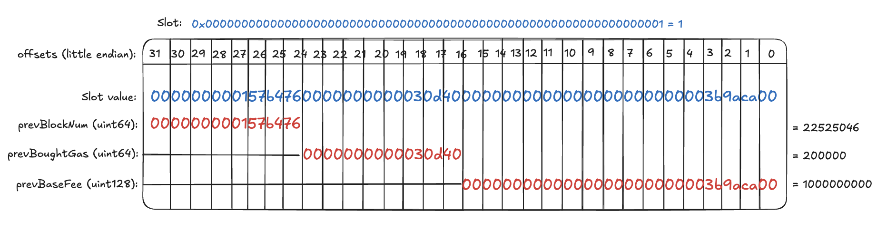
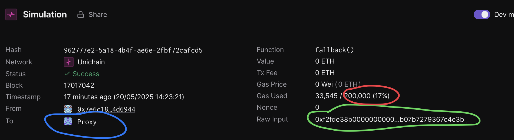
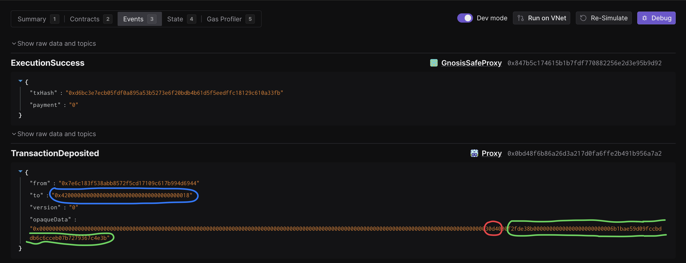

# Validation

This document can be used to validate the inputs and result of the execution of the upgrade transaction which you are
signing.

The steps are:

1. [Validate the Domain and Message Hashes](#expected-domain-and-message-hashes)
2. [Verifying the state changes via the normalized state diff hash](#normalized-state-diff-hash-attestation)
3. [Verifying the transaction input](#understanding-task-calldata)
4. [Verifying the state changes](#task-state-changes)

## Expected Domain and Message Hashes

First, we need to validate the domain and message hashes. These values should match both the values on your ledger and
the values printed to the terminal when you run the task.

> [!CAUTION]
>
> Before signing, ensure the below hashes match what is on your ledger.
>
> ### Unichain Upgrade Safe (Chain Governor) (`0xb0c4C487C5cf6d67807Bc2008c66fa7e2cE744EC`)
>
> - Domain Hash:  `0x4f0b6efb6c01fa7e127a0ff87beefbeb53e056d30d3216c5ac70371b909ca66d`
> - Message Hash: `0x3c7a84f52b9351a415da72b96f122777f4d5cd59ea84bf78d795ad8b76e582be`
>
> ### Optimism Foundation Upgrade Safe (`0x847B5c174615B1B7fDF770882256e2D3E95b9D92`)
>
> - Domain Hash:  `0xa4a9c312badf3fcaa05eafe5dc9bee8bd9316c78ee8b0bebe3115bb21b732672`
> - Message Hash: `0x3aec83315afa8668cec3e78736c1a560003a9890cad88cc725360e70f17101da`
>
> ### Security Council (`0xc2819DC788505Aac350142A7A707BF9D03E3Bd03`)
>
> - Domain Hash: `0xdf53d510b56e539b90b369ef08fce3631020fbf921e3136ea5f8747c20bce967`
> - Message Hash: `0x3aec83315afa8668cec3e78736c1a560003a9890cad88cc725360e70f17101da`

## Normalized State Diff Hash Attestation

The normalized state diff hash **MUST** match the hash produced by the state changes attested to in the state diff audit report. As a signer, you are responsible for verifying that this hash is correct. Please compare the hash below with the one in the audit report. If no audit report is available for this task, you must still ensure that the normalized state diff hash matches the output in your terminal.

**Normalized hash:** `0x569e75fc77c1a856f6daaf9e69d8a9566ca34aa47f9133711ce065a571af0cfd`

## Understanding Task Calldata


- [OptimismPortalProxy](https://github.com/ethereum-optimism/superchain-registry/blob/main/superchain/configs/mainnet/unichain.toml#L58C26-L58C68): `0x0bd48f6B86a26D3a217d0Fa6FfE2B491B956A7a2`
- [L2ProxyAdmin](https://github.com/ethereum-optimism/optimism/blob/7c59c8c262d4495bf6d982c67cfbd2804b7db1a7/packages/contracts-bedrock/src/libraries/Predeploys.sol#L63): `0x4200000000000000000000000000000000000018`
- [Aliased L1PAO](https://github.com/ethereum-optimism/superchain-registry/blob/main/superchain/configs/mainnet/op.toml#L45): `0x5a0Aae59D09fccBdDb6C6CcEB07B7279367C3d2A` -> `0x6B1BAE59D09fCcbdDB6C6cceb07B7279367C4E3b`.
To recompute open `chisel` and run: 
```bash
    > uint160 constant offset = uint160(0x1111000000000000000000000000000000001111)
    > function undoL1ToL2Alias(address l2Address) internal pure returns (address l1Address) {
        unchecked {
            l1Address = address(uint160(l2Address) - offset);
        }
    }
    > undoL1ToL2Alias(0x6B1BAE59D09fCcbdDB6C6cceb07B7279367C4E3b)
    # returns: 0x5a0Aae59D09fccBdDb6C6CcEB07B7279367C3d2A
```

1. Craft `transferOwnership` calldata.
```
cast calldata 'transferOwnership(address)' 0x6B1BAE59D09fCcbdDB6C6cceb07B7279367C4E3b
# Returns: 0xf2fde38b0000000000000000000000006b1bae59d09fccbddb6c6cceb07b7279367c4e3b
```

2. Craft `depositTransaction` calldata.
```
cast calldata 'depositTransaction(address,uint256,uint64,bool,bytes)' 0x4200000000000000000000000000000000000018 0 200000 false 0xf2fde38b0000000000000000000000006b1bae59d09fccbddb6c6cceb07b7279367c4e3b
# Returns: 0xe9e05c42000000000000000000000000420000000000000000000000000000000000001800000000000000000000000000000000000000000000000000000000000000000000000000000000000000000000000000000000000000000000000000030d40000000000000000000000000000000000000000000000000000000000000000000000000000000000000000000000000000000000000000000000000000000a00000000000000000000000000000000000000000000000000000000000000024f2fde38b0000000000000000000000006b1bae59d09fccbddb6c6cceb07b7279367c4e3b00000000000000000000000000000000000000000000000000000000
```

3. Craft `aggregate3Value` calldata.
```
cast calldata 'aggregate3Value((address,bool,uint256,bytes)[])' "[(0x0bd48f6B86a26D3a217d0Fa6FfE2B491B956A7a2, false, 0, 0xe9e05c42000000000000000000000000420000000000000000000000000000000000001800000000000000000000000000000000000000000000000000000000000000000000000000000000000000000000000000000000000000000000000000030d40000000000000000000000000000000000000000000000000000000000000000000000000000000000000000000000000000000000000000000000000000000a00000000000000000000000000000000000000000000000000000000000000024f2fde38b0000000000000000000000006b1bae59d09fccbddb6c6cceb07b7279367c4e3b00000000000000000000000000000000000000000000000000000000)]"
# Returns: See below
```

The resulting calldata:
```
0x174dea710000000000000000000000000000000000000000000000000000000000000020000000000000000000000000000000000000000000000000000000000000000100000000000000000000000000000000000000000000000000000000000000200000000000000000000000000bd48f6b86a26d3a217d0fa6ffe2b491b956a7a20000000000000000000000000000000000000000000000000000000000000000000000000000000000000000000000000000000000000000000000000000000000000000000000000000000000000000000000000000000000000000000000800000000000000000000000000000000000000000000000000000000000000104e9e05c42000000000000000000000000420000000000000000000000000000000000001800000000000000000000000000000000000000000000000000000000000000000000000000000000000000000000000000000000000000000000000000030d40000000000000000000000000000000000000000000000000000000000000000000000000000000000000000000000000000000000000000000000000000000a00000000000000000000000000000000000000000000000000000000000000024f2fde38b0000000000000000000000006b1bae59d09fccbddb6c6cceb07b7279367c4e3b0000000000000000000000000000000000000000000000000000000000000000000000000000000000000000000000000000000000000000
```

# State Validations

For each contract listed in the state diff, please verify that no contracts or state changes shown in the Tenderly diff are missing from this document. Additionally, please verify that for each contract:

- The following state changes (and none others) are made to that contract. This validates that no unexpected state
  changes occur.
- All addresses (in section headers and storage values) match the provided name, using the Etherscan and Superchain
  Registry links provided. This validates the bytecode deployed at the addresses contains the correct logic.
- All key values match the semantic meaning provided, which can be validated using the storage layout links provided.

### State Overrides

Note: The changes listed below do not include threshold, nonce and owner mapping overrides. These changes are listed and explained in the [NESTED-VALIDATION.md](../../../../../NESTED-VALIDATION.md) file.

### Task State Changes

Note: The Tenderly link printed to the terminal after simulation only shows L1 state changes. L2 state changes are not included. To view L2 state changes, you’ll need to manually craft a Tenderly simulation using the event emitted from Unichain’s OptimismPortalProxy contract.

After verifying the L1 state changes below, you **must** continue to the L2 state changes section and follow the instructions there.

### L1 State Changes:

  ---
  
### [`0x0bd48f6b86a26d3a217d0fa6ffe2b491b956a7a2`](https://github.com/ethereum-optimism/superchain-registry/blob/main/superchain/configs/mainnet/unichain.toml#L58) (OptimismPortal2) - Chain ID: 130
  
- **Key:**          `0x0000000000000000000000000000000000000000000000000000000000000001`
  - **Decoded Kind:** `struct ResourceMetering.ResourceParams`
  - **Before:** `0x000000000157b450000000000007df760000000000000000000000003b9aca00`
  - **After:** `0x000000000157b4760000000000030d400000000000000000000000003b9aca00`
  - **Summary:** Resource Metering Data Updated
  - **Detail:**  The `ResourceParams` struct was updated. **Please note that `prevBaseFee` and `prevBlockNum` are non-deterministic and may differ slightly from what you see on Tenderly**. However, `prevBoughtGas` should be `200000`. You can confirm this by extracting 64 bits starting at the 9th byte from the left and converting to decimal:
  ```bash
  cast --to-dec 0x0000000000030d40 # 200,000
  ```
The figure below demonstracts how the resource param variables are laid out in the slot. Remember, `prevBaseFee` and `prevBlockNum` values **may be different on Tenderly**.

  
  ---

### `0x24424336F04440b1c28685a38303aC33C9D14a25` (LivenessGuard Security Council)

> [!IMPORTANT]
> Security Council Only

**THIS STATE DIFF ONLY APPEARS WHEN SIGNING FOR THE COUNCIL AND DOES NOT NEED TO BE CHECKED BY SIGNERS.**

The details are explained in [NESTED-VALIDATION.md](../../../../../NESTED-VALIDATION.md#liveness-guard).

### `0x9343c452dec3251fe99D9Fd29b74c5b9CD1751a6` (LivenessGuard Unichain)

> [!IMPORTANT]
> Unichain Safe Only

**THIS STATE DIFF ONLY APPEARS WHEN SIGNING FOR THE UNICHAIN SAFE AND DOES NOT NEED TO BE CHECKED BY SIGNERS.**

The details are explained in [NESTED-VALIDATION.md](../../../../../NESTED-VALIDATION.md#liveness-guard).

---

### [`0x6d5B183F538ABB8572F5cD17109c617b994D5833`](https://github.com/ethereum-optimism/superchain-registry/blob/main/superchain/configs/mainnet/unichain.toml#L45) (Unichain ProxyAdminOwner)

- Nonce increments see [below](#nonce-increments)
- `approvedHashes` mapping updates are explained in detail in [NESTED-VALIDATION.md](../../../../../NESTED-VALIDATION.md#key-computation).
  The key computations are:
  - **Unichain Safe only**
    ```
    SAFE_SIGNER=0xb0c4c487c5cf6d67807bc2008c66fa7e2ce744ec
    SAFE_HASH=0x9ee573bf1dfc7a12a8a124d6ca9f4b985a8dc3765132f24958f7b5637cc3cd60
    cast index bytes32 $SAFE_HASH $(cast index address $SAFE_SIGNER 8)
    ```
    Key: `0x3d1eae4557d840988055c8f211db3df61890c8c7f49ed5ac36d9dae8a7bcf8d3`
  - **Optimism Foundation only**
    ```
    SAFE_SIGNER=0x847B5c174615B1B7fDF770882256e2D3E95b9D92
    SAFE_HASH=0x9ee573bf1dfc7a12a8a124d6ca9f4b985a8dc3765132f24958f7b5637cc3cd60
    cast index bytes32 $SAFE_HASH $(cast index address $SAFE_SIGNER 8)
    ```
    Key: `0x6a386039e5a2e68b409668e3eac067db3afcd8e9045b9b3f102df8f579ea8d6a`
  - **Security Council only**
    ```
    SAFE_SIGNER=0xc2819DC788505Aac350142A7A707BF9D03E3Bd03
    SAFE_HASH=0x9ee573bf1dfc7a12a8a124d6ca9f4b985a8dc3765132f24958f7b5637cc3cd60
    cast index bytes32 $SAFE_HASH $(cast index address $SAFE_SIGNER 8)
    ```
    Key: `0x5208aa03111f0b7f7136fc9cf9bb6dd12a010434203893ccde2cf7ec6030ebe6`

---


### Nonce increments

- The remaining nonce increments are for the Safes and EOAs that are involved in the simulation.
  The details are described in the generic [NESTED-VALIDATION.md](../../../../../NESTED-VALIDATION.md) document.
  - <sender-address> - Sender address of the Tenderly transaction (Your ledger or first owner on the nested safe (if you're simulating)).
  - `0x6d5B183F538ABB8572F5cD17109c617b994D5833` - Unichain ProxyAdminOwner
    - Safe nonce (slot `0x5`) `6 -> 7`
  - Only one of the following nonce increments, depending on which Owner Safe is simulated
    - `0xb0c4C487C5cf6d67807Bc2008c66fa7e2cE744EC` - Unichain Operations Safe `12 -> 13`
    - `0x847B5c174615B1B7fDF770882256e2D3E95b9D92` - Foundation Upgrade Safe `30 -> 31`
    - `0xc2819DC788505Aac350142A7A707BF9D03E3Bd03` - Security Council Safe `30 -> 31`


### L2 (Unichain Mainnet) State Changes:

**Only verify these L2 state changes after you've completed the L1 verification above.**

As mentioned, L1 and L2 state changes cannot be simulated in a single Tenderly link. To save time, the task developers have prepared a separate Tenderly simulation for the L2 side. It's the signer’s responsibility to:

1. Confirm the simulation link is correctly configured.
2. Verify that the L2 state changes are accurate.

- L2 Simulation Tenderly Link: [link](https://dashboard.tenderly.co/oplabs/eth-mainnet/simulator/962777e2-5a18-4b4f-ae6e-2fbf72cafcd5)

#### Validate that the link is configured correctly.

The Tenderly link above **must** be correctly configured. It’s the signer's responsibility to ensure that the `blue`, `red`, and `green` values (circled) shown in the simulation match those in the `TransactionDeposited` event under the `Events` tab.


Below is an example screenshot of the `Events` tab from an L1 Tenderly simulation. You **must** use your own L1 Tenderly simulation link to verify that the L2 simulation is configured correctly.


- `Blue circle`: `from` address must be `0x4200000000000000000000000000000000000018` (the L2ProxyAdmin address)
- `Red circle`: `_gasLimit` must be `200000`. You can confirm by decoding:
```bash
cast --to-dec 0x30d40
# Returns: 200000
```
- `Green circle`: raw input must be the calldata for the transferOwnership function. You can decode it like this:
```bash
cast calldata-decode "transferOwnership(address)" 0xf2fde38b0000000000000000000000006b1bae59d09fccbddb6c6cceb07b7279367c4e3b
# Returns: 0x6B1BAE59D09fCcbdDB6C6cceb07B7279367C4E3b
```
- `from` address must be `0x7e6c183f538abb8572f5cd17109c617b994d6944` which is the alias of the old L1PAO for Unichain: `0x6d5B183F538ABB8572F5cD17109c617b994D5833` (the safe that this transaction is being executed from):
```bash
# Open chisel
> uint160 constant offset = uint160(0x1111000000000000000000000000000000001111)
> function undoL1ToL2Alias(address l2Address) internal pure returns (address l1Address) {
    unchecked {
        l1Address = address(uint160(l2Address) - offset);
    }
}
> undoL1ToL2Alias(0x7e6c183f538abb8572f5cd17109c617b994d6944)
# Returns: 0x6d5B183F538ABB8572F5cD17109c617b994D5833
```

#### Validate that the L2 state changes are correct.

### [`0x4200000000000000000000000000000000000018`](https://github.com/ethereum-optimism/optimism/blob/7c59c8c262d4495bf6d982c67cfbd2804b7db1a7/packages/contracts-bedrock/src/libraries/Predeploys.sol#L63) (L2ProxyAdmin) - Chain ID: 130
  
- **Key:**          `0x0000000000000000000000000000000000000000000000000000000000000000`
  - **Before:** `0x0000000000000000000000007e6c183f538abb8572f5cd17109c617b994d6944`
  - **After:** `0x0000000000000000000000006b1bae59d09fccbddb6c6cceb07b7279367c4e3b`
  - **Summary:** Setting new L2PAO as the aliased L1PAO
  - **Detail:**  As you've seen in the [Understanding Task Calldata](#understanding-task-calldata) section, the new L2PAO value should be `0x6B1BAE59D09fCcbdDB6C6cceb07B7279367C4E3b` which is the alias for the `0x5a0Aae59D09fccBdDb6C6CcEB07B7279367C3d2A` L1PAO (same as [OP Mainnet](https://github.com/ethereum-optimism/superchain-registry/blob/main/superchain/configs/mainnet/op.toml#L45)).

