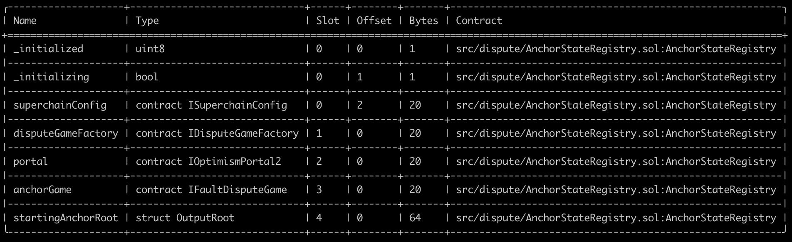

# Validation

This document can be used to validate the inputs and result of the execution of the upgrade transaction which you are
signing.

The steps are:

1. [Validate the Domain and Message Hashes](#expected-domain-and-message-hashes)
2. [Verifying the transaction input](#understanding-task-calldata)
3. [Verifying the state changes](#state-changes)

## Expected Domain and Message Hashes

First, we need to validate the domain and message hashes. These values should match both the values on your ledger and
the values printed to the terminal when you run the task.

> [!CAUTION]
>
> Before signing, ensure the below hashes match what is on your ledger.
>
> ### Security Council
>
> - Domain Hash: `0xbe081970e9fc104bd1ea27e375cd21ec7bb1eec56bfe43347c3e36c5d27b8533`
> - Message Hash: `0xdcce9a45b2af30011402f5249a3ac7848c01546643383cccd48e6deecbd7390c`
>
> ### Optimism Foundation
>
> - Domain Hash: `0x37e1f5dd3b92a004a23589b741196c8a214629d4ea3a690ec8e41ae45c689cbb`
> - Message Hash: `0x368eebebff2af903e9e65a45b82c0192c9bcdfa62c8275c5d44766cc3e7bfe8b`


## Understanding Task Calldata

This document provides a detailed analysis of the final calldata executed on-chain for the OPCM upgrade to v2.0.0.

By reconstructing the calldata, we can confirm that the execution precisely implements the approved upgrade plan with no unexpected modifications or side effects.

### Inputs to `opcm.upgrade()`

For each chain being upgrade, the `opcm.upgrade()` function is called with a tuple of three elements:

1. OP Sepolia Testnet:
    - SystemConfigProxy: [0x034edD2A225f7f429A63E0f1D2084B9E0A93b538](https://github.com/ethereum-optimism/superchain-registry/blob/d4bb112dc979fd43ac92252c549d3ed7c4d0eb57/superchain/configs/sepolia/op.toml#L58)
    - ProxyAdmin: [0x189aBAAaa82DfC015A588A7dbaD6F13b1D3485Bc](https://github.com/ethereum-optimism/superchain-registry/blob/d4bb112dc979fd43ac92252c549d3ed7c4d0eb57/superchain/configs/sepolia/op.toml#L59)
    - AbsolutePrestate: [0x0354eee87a1775d96afee8977ef6d5d6bd3612b256170952a01bf1051610ee01](https://github.com/ethereum-optimism/superchain-registry/blob/1ab48707d705ef7100f3ffa549e048f699cb886d/validation/standard/standard-prestates.toml#L14)

2. Soneium Testnet Minato:
    - SystemConfigProxy: [0x4Ca9608Fef202216bc21D543798ec854539bAAd3](https://github.com/ethereum-optimism/superchain-registry/blob/d4bb112dc979fd43ac92252c549d3ed7c4d0eb57/superchain/configs/sepolia/soneium-minato.toml#L59)
    - ProxyAdmin: [0xff9d236641962Cebf9DBFb54E7b8e91F99f10Db0](https://github.com/ethereum-optimism/superchain-registry/blob/d4bb112dc979fd43ac92252c549d3ed7c4d0eb57/superchain/configs/sepolia/soneium-minato.toml#L60)
    - AbsolutePrestate: [0x0354eee87a1775d96afee8977ef6d5d6bd3612b256170952a01bf1051610ee01](https://github.com/ethereum-optimism/superchain-registry/blob/1ab48707d705ef7100f3ffa549e048f699cb886d/validation/standard/standard-prestates.toml#L14)

3. Ink Sepolia:
    - SystemConfigProxy: [0x05C993e60179f28bF649a2Bb5b00b5F4283bD525](https://github.com/ethereum-optimism/superchain-registry/blob/d4bb112dc979fd43ac92252c549d3ed7c4d0eb57/superchain/configs/sepolia/ink.toml#L58)
    - ProxyAdmin: [0xd7dB319a49362b2328cf417a934300cCcB442C8d](https://github.com/ethereum-optimism/superchain-registry/blob/d4bb112dc979fd43ac92252c549d3ed7c4d0eb57/superchain/configs/sepolia/ink.toml#L59)
    - AbsolutePrestate: [0x0354eee87a1775d96afee8977ef6d5d6bd3612b256170952a01bf1051610ee01](https://github.com/ethereum-optimism/superchain-registry/blob/1ab48707d705ef7100f3ffa549e048f699cb886d/validation/standard/standard-prestates.toml#L14)


Thus, the command to encode the calldata is:

```bash
cast calldata 'upgrade((address,address,bytes32)[])' "[(0x034edD2A225f7f429A63E0f1D2084B9E0A93b538,0x189aBAAaa82DfC015A588A7dbaD6F13b1D3485Bc,0x0354eee87a1775d96afee8977ef6d5d6bd3612b256170952a01bf1051610ee01),(0x4Ca9608Fef202216bc21D543798ec854539bAAd3,0xff9d236641962Cebf9DBFb54E7b8e91F99f10Db0,0x0354eee87a1775d96afee8977ef6d5d6bd3612b256170952a01bf1051610ee01),(0x05C993e60179f28bF649a2Bb5b00b5F4283bD525,0xd7dB319a49362b2328cf417a934300cCcB442C8d,0x0354eee87a1775d96afee8977ef6d5d6bd3612b256170952a01bf1051610ee01)]"
```


### Inputs to `Multicall3DelegateCall`

The output from the previous section becomes the `data` in the argument to the `Multicall3DelegateCall.aggregate3()` function.

This function is called with a tuple of three elements:


Call3 struct for Multicall3DelegateCall:
- `target`: [0x1B25F566336F47BC5E0036D66E142237DcF4640b](https://github.com/ethereum-optimism/superchain-registry/blob/d4bb112dc979fd43ac92252c549d3ed7c4d0eb57/validation/standard/standard-versions-sepolia.toml#L21) - Sepolia OPContractsManager v2.0.0
- `allowFailure`: false
- `callData`: `0xff2dd5a1...` (output from the previous section)

Command to encode:
```bash
cast calldata 'aggregate3((address,bool,bytes)[])' "[(0x1B25F566336F47BC5E0036D66E142237DcF4640b,false,0xff2dd5a100000000000000000000000000000000000000000000000000000000000000200000000000000000000000000000000000000000000000000000000000000003000000000000000000000000034edd2a225f7f429a63e0f1d2084b9e0a93b538000000000000000000000000189abaaaa82dfc015a588a7dbad6f13b1d3485bc0354eee87a1775d96afee8977ef6d5d6bd3612b256170952a01bf1051610ee010000000000000000000000004ca9608fef202216bc21d543798ec854539baad3000000000000000000000000ff9d236641962cebf9dbfb54e7b8e91f99f10db00354eee87a1775d96afee8977ef6d5d6bd3612b256170952a01bf1051610ee0100000000000000000000000005c993e60179f28bf649a2bb5b00b5f4283bd525000000000000000000000000d7db319a49362b2328cf417a934300cccb442c8d0354eee87a1775d96afee8977ef6d5d6bd3612b256170952a01bf1051610ee01)]"
```

The resulting calldata sent from the ProxyAdminOwner safe is thus:

```
0x82ad56cb0000000000000000000000000000000000000000000000000000000000000020000000000000000000000000000000000000000000000000000000000000000100000000000000000000000000000000000000000000000000000000000000200000000000000000000000001b25f566336f47bc5e0036d66e142237dcf4640b000000000000000000000000000000000000000000000000000000000000000000000000000000000000000000000000000000000000000000000000000000600000000000000000000000000000000000000000000000000000000000000164ff2dd5a100000000000000000000000000000000000000000000000000000000000000200000000000000000000000000000000000000000000000000000000000000003000000000000000000000000034edd2a225f7f429a63e0f1d2084b9e0a93b538000000000000000000000000189abaaaa82dfc015a588a7dbad6f13b1d3485bc0354eee87a1775d96afee8977ef6d5d6bd3612b256170952a01bf1051610ee010000000000000000000000004ca9608fef202216bc21d543798ec854539baad3000000000000000000000000ff9d236641962cebf9dbfb54e7b8e91f99f10db00354eee87a1775d96afee8977ef6d5d6bd3612b256170952a01bf1051610ee0100000000000000000000000005c993e60179f28bf649a2bb5b00b5f4283bd525000000000000000000000000d7db319a49362b2328cf417a934300cccb442c8d0354eee87a1775d96afee8977ef6d5d6bd3612b256170952a01bf1051610ee0100000000000000000000000000000000000000000000000000000000
```

In mainnet runbooks, this calldata should appear in [Action Plan](https://gov.optimism.io/t/upgrade-proposal-13-opcm-and-incident-response-improvements/9739#p-43725-action-plan-15) section of the Governance proposal.

# State Validations

For each contract listed in the state diff, please verify that no contracts or state changes shown in the Tenderly diff are missing from this document. Additionally, please verify that for each contract:

- The following state changes (and none others) are made to that contract. This validates that no unexpected state
  changes occur.
- All addresses (in section headers and storage values) match the provided name, using the Etherscan and Superchain
  Registry links provided. This validates the bytecode deployed at the addresses contains the correct logic.
- All key values match the semantic meaning provided, which can be validated using the storage layout links provided.

### Task State Changes

<pre>
  <code>
  ----- DecodedStateDiff[0] -----
    Who:               <a href="https://github.com/ethereum-optimism/superchain-registry/blob/b40cf4289c58e28eb1c791f9ad5724380b7516a7/superchain/configs/sepolia/op.toml#L59">0x034edD2A225f7f429A63E0f1D2084B9E0A93b538</a>
    Contract:          SystemConfig - OP Sepolia Testnet
    Chain ID:          11155420

    Raw Slot:          0x360894a13ba1a3210667c828492db98dca3e2076cc3735a920a3ca505d382bbc
    Raw Old Value:     0x00000000000000000000000033b83e4c305c908b2fc181dda36e230213058d7d
    Raw New Value:     0x000000000000000000000000760c48c62a85045a6b69f07f4a9f22868659cbcc

    Decoded Kind:      address
    Decoded Old Value: 0x33b83E4C305c908B2Fc181dDa36e230213058d7d
    Decoded New Value: <a href="https://github.com/ethereum-optimism/superchain-registry/blob/b40cf4289c58e28eb1c791f9ad5724380b7516a7/validation/standard/standard-versions-sepolia.toml#L27">0x760C48C62A85045A6B69f07F4a9f22868659CbCc</a>
    Summary:           ERC-1967 implementation slot
    Detail:            Standard slot for storing the implementation address in a proxy contract that follows the ERC-1967 standard.

  ----- DecodedStateDiff[1] -----
    Who:               <a href="https://github.com/ethereum-optimism/superchain-registry/blob/b40cf4289c58e28eb1c791f9ad5724380b7516a7/superchain/configs/sepolia/ink.toml#L59">0x05C993e60179f28bF649a2Bb5b00b5F4283bD525</a>
    Contract:          SystemConfig - Ink Sepolia
    Chain ID:          763373

    Raw Slot:          0x360894a13ba1a3210667c828492db98dca3e2076cc3735a920a3ca505d382bbc
    Raw Old Value:     0x00000000000000000000000033b83e4c305c908b2fc181dda36e230213058d7d
    Raw New Value:     0x000000000000000000000000760c48c62a85045a6b69f07f4a9f22868659cbcc

    Decoded Kind:      address
    Decoded Old Value: 0x33b83E4C305c908B2Fc181dDa36e230213058d7d
    Decoded New Value: <a href="https://github.com/ethereum-optimism/superchain-registry/blob/b40cf4289c58e28eb1c791f9ad5724380b7516a7/validation/standard/standard-versions-sepolia.toml#L27">0x760C48C62A85045A6B69f07F4a9f22868659CbCc</a>
    Summary:           ERC-1967 implementation slot
    Detail:            Standard slot for storing the implementation address in a proxy contract that follows the ERC-1967 standard.

  ----- DecodedStateDiff[2] -----
    Who:               <a href="https://github.com/ethereum-optimism/superchain-registry/blob/b40cf4289c58e28eb1c791f9ad5724380b7516a7/superchain/configs/sepolia/op.toml#L63">0x05F9613aDB30026FFd634f38e5C4dFd30a197Fa1</a>
    Contract:          DisputeGameFactory - OP Sepolia Testnet
    Chain ID:          11155420

    Raw Slot:          0x360894a13ba1a3210667c828492db98dca3e2076cc3735a920a3ca505d382bbc
    Raw Old Value:     0x000000000000000000000000a51bea7e4d34206c0bcb04a776292f2f19f0beec
    Raw New Value:     0x0000000000000000000000004bba758f006ef09402ef31724203f316ab74e4a0

    Decoded Kind:      address
    Decoded Old Value: 0xA51bea7E4d34206c0bCB04a776292F2f19F0BeEc
    Decoded New Value: <a href="https://github.com/ethereum-optimism/superchain-registry/blob/b40cf4289c58e28eb1c791f9ad5724380b7516a7/validation/standard/standard-versions-sepolia.toml#L34">0x4bbA758F006Ef09402eF31724203F316ab74e4a0</a>
    Summary:           ERC-1967 implementation slot
    Detail:            Standard slot for storing the implementation address in a proxy contract that follows the ERC-1967 standard.

  ----- DecodedStateDiff[3] -----
    Who:               <a href="https://github.com/ethereum-optimism/superchain-registry/blob/b40cf4289c58e28eb1c791f9ad5724380b7516a7/superchain/configs/sepolia/op.toml#L63">0x05F9613aDB30026FFd634f38e5C4dFd30a197Fa1</a>
    Contract:          DisputeGameFactory - OP Sepolia Testnet
    Chain ID:          11155420

    Raw Slot:          0x4d5a9bd2e41301728d41c8e705190becb4e74abe869f75bdb405b63716a35f9e
    Raw Old Value:     0x0000000000000000000000001c3eb0ebd6195ab587e1ded358a87bdf9b56fe04
    Raw New Value:     0x000000000000000000000000f7529e269a3244921d31304171ae69c44f9c6e09
    [WARN] Slot was not decoded

    Summary:           Update Permissioned GameType implementation.
    Detail:            This is gameImpls[1] -> 0xf7529E269A3244921D31304171ae69c44F9c6e09
                       Verify that the old implementation is set in this slot using:
                        - <i>cast call 0x05F9613aDB30026FFd634f38e5C4dFd30a197Fa1 "gameImpls(uint32)(address)" 1 --rpc-url sepolia</i>
                        - <i>cast storage 0x05F9613aDB30026FFd634f38e5C4dFd30a197Fa1 0x4d5a9bd2e41301728d41c8e705190becb4e74abe869f75bdb405b63716a35f9e --rpc-url sepolia</i>
                       The Raw Slot can be derived from:
                        - <i>cast index uint32 1 101</i>

  ----- DecodedStateDiff[4] -----
    Who:               <a href="https://github.com/ethereum-optimism/superchain-registry/blob/b40cf4289c58e28eb1c791f9ad5724380b7516a7/superchain/configs/sepolia/op.toml#L63">0x05F9613aDB30026FFd634f38e5C4dFd30a197Fa1</a>
    Contract:          DisputeGameFactory
    Chain ID:          11155420
    Raw Slot:          0xffdfc1249c027f9191656349feb0761381bb32c9f557e01f419fd08754bf5a1b
    Raw Old Value:     0x000000000000000000000000927248cb1255e0f02413a758899db4aecffaa5fe
    Raw New Value:     0x0000000000000000000000007982afa9530a3f6b88dd49cd3974cb3121ffb00d
    [WARN] Slot was not decoded

    Summary:           Updated CANNON GameType implementation.
    Detail:            This is gameImpls[0] -> 0x7982afa9530a3f6b88dd49cd3974cb3121ffb00d where '0' is the <a href="https://github.com/ethereum-optimism/optimism/blob/op-contracts/v1.4.0/packages/contracts-bedrock/src/dispute/lib/Types.sol#L28">CANNON game type</a>.
                       Verify that the old implementation is set in this slot using:
                        - <i>cast call 0x05F9613aDB30026FFd634f38e5C4dFd30a197Fa1 "gameImpls(uint32)(address)" 0 --rpc-url sepolia</i>
                        - <i>cast storage 0x05F9613aDB30026FFd634f38e5C4dFd30a197Fa1 0xffdfc1249c027f9191656349feb0761381bb32c9f557e01f419fd08754bf5a1b --rpc-url sepolia</i>
                       The Raw Slot can be derived from:
                        - <i>cast index uint32 0 101</i>

  ----- DecodedStateDiff[5] -----
    Who:               <a href="https://github.com/ethereum-optimism/superchain-registry/blob/b40cf4289c58e28eb1c791f9ad5724380b7516a7/superchain/configs/sepolia/op.toml#L58">0x16Fc5058F25648194471939df75CF27A2fdC48BC</a>
    Contract:          OptimismPortal2 - OP Sepolia Testnet
    Chain ID:          11155420

    Raw Slot:          0x360894a13ba1a3210667c828492db98dca3e2076cc3735a920a3ca505d382bbc
    Raw Old Value:     0x00000000000000000000000035028bae87d71cbc192d545d38f960ba30b4b233
    Raw New Value:     0x0000000000000000000000002d7e764a0d9919e16983a46595cfa81fc34fa7cd

    Decoded Kind:      address
    Decoded Old Value: 0x35028bAe87D71cbC192d545d38F960BA30B4B233
    Decoded New Value: <a href="https://github.com/ethereum-optimism/superchain-registry/blob/b40cf4289c58e28eb1c791f9ad5724380b7516a7/validation/standard/standard-versions-sepolia.toml#L31">0x2D7e764a0D9919e16983a46595CfA81fc34fa7Cd</a>
    Summary:           ERC-1967 implementation slot
    Detail:            Standard slot for storing the implementation address in a proxy contract that follows the ERC-1967 standard.

  ----- DecodedStateDiff[6] -----
    Who:               <a href="https://github.com/ethereum-optimism/superchain-registry/blob/b40cf4289c58e28eb1c791f9ad5724380b7516a7/validation/standard/standard-versions-sepolia.toml#L40">0x1B25F566336F47BC5E0036D66E142237DcF4640b</a>
    Contract:          OPContractsManager - Sepolia Testnet
    Chain ID:          11155111

    Raw Slot:          0x0000000000000000000000000000000000000000000000000000000000000016
    Raw Old Value:     0x0000000000000000000000000000000000000000000000000000000000000001
    Raw New Value:     0x0000000000000000000000000000000000000000000000000000000000000000
    [WARN] Slot was not decoded

    Summary:           <b>IMPORTANT: THIS STATE CHANGE MAY NOT APPEAR IN THE TENDERLY STATE DIFF.</b>
                       <i>isRC</i> storage slot updated to 0.
    Detail:            Once OPContractsManager is upgraded, the <i>isRC</i> flag is set to false.
                       This happens in the first invocation of the <i>upgrade</i> function.
                       Slot 22 is the <i>isRC</i> flag: <i>cast to-hex 22</i> -> <i>0x16</i>.
                       Please refer to <i>'Figure 0.1'</i> at the end of this report for the storage layout of OPContractsManager.

  ----- DecodedStateDiff[7] -----
    Who:               <a href="https://github.com/ethereum-optimism/superchain-registry/blob/b40cf4289c58e28eb1c791f9ad5724380b7516a7/validation/standard/standard-config-roles-sepolia.toml#L3">0x1Eb2fFc903729a0F03966B917003800b145F56E2</a>
    Contract:          ProxyAdminOwner (GnosisSafe)
    Chain ID:          11155420

    Raw Slot:          0x0000000000000000000000000000000000000000000000000000000000000005
    Raw Old Value:     0x0000000000000000000000000000000000000000000000000000000000000017
    Raw New Value:     0x0000000000000000000000000000000000000000000000000000000000000018

    Decoded Kind:      uint256
    Decoded Old Value: 23
    Decoded New Value: 24
    Summary:           nonce
    Detail:            The nonce of the ProxyAdminOwner contract is updated.

  ----- DecodedStateDiff[8] -----
    Who:               <a href="https://github.com/ethereum-optimism/superchain-ops/blob/82fbc1f2051072c235128d8a0222cabced2a2d6c/tasks/sep/ink-001-fp-holocene-pectra-upgrade/.env#L11">0x237840A6Bfd822039d9cC00e1E7BAE280d4F2D49</a>
    Contract:          DelayedWETH - Ink Sepolia (Permissioned)
    Chain ID:          763373

    Raw Slot:          0x360894a13ba1a3210667c828492db98dca3e2076cc3735a920a3ca505d382bbc
    Raw Old Value:     0x00000000000000000000000007f69b19532476c6cd03056d6bc3f1b110ab7538
    Raw New Value:     0x0000000000000000000000005e40b9231b86984b5150507046e354dbfbed3d9e

    Decoded Kind:      address
    Decoded Old Value: 0x07F69b19532476c6Cd03056D6BC3F1b110Ab7538
    Decoded New Value: <a href="https://github.com/ethereum-optimism/superchain-registry/blob/b40cf4289c58e28eb1c791f9ad5724380b7516a7/validation/standard/standard-versions-sepolia.toml#L33">0x5e40B9231B86984b5150507046e354dbFbeD3d9e</a>
    Summary:           ERC-1967 implementation slot
    Detail:            Standard slot for storing the implementation address in a proxy contract that follows the ERC-1967 standard.
                       DelayedWETH contract for 'op-contracts/v2.0.0-rc.1'.
                       Using Ink Sepolia's <a href="https://github.com/ethereum-optimism/superchain-registry/blob/c1bcf3601dfdf72f0fd4f5bade180b9c0f94d93b/superchain/configs/sepolia/ink.toml#L64">DisputeGameFactory</a>, we can find this DelayedWETH address:
                        - <i>cast call 0x860e626c700AF381133D9f4aF31412A2d1DB3D5d "gameImpls(uint32)(address)" 1 --rpc-url sepolia</i>
                        - <i>cast call 0x39228E51A12662d78DE478BFa1930fc7595337D8 "weth()(address)" --rpc-url sepolia</i>
                        returns <b>0x237840A6Bfd822039d9cC00e1E7BAE280d4F2D49</b>

  ----- DecodedStateDiff[9] -----
    Who:               <a href="https://github.com/ethereum-optimism/superchain-registry/blob/b40cf4289c58e28eb1c791f9ad5724380b7516a7/superchain/configs/sepolia/soneium-minato.toml#L55">0x2bfb22cd534a462028771a1cA9D6240166e450c4</a>
    Contract:          L1ERC721Bridge - Soneium Testnet Minato
    Chain ID:          1946

    Raw Slot:          0x360894a13ba1a3210667c828492db98dca3e2076cc3735a920a3ca505d382bbc
    Raw Old Value:     0x000000000000000000000000ae2af01232a6c4a4d3012c5ec5b1b35059caf10d
    Raw New Value:     0x000000000000000000000000276d3730f219f7ec22274f7263180b8452b46d47

    Decoded Kind:      address
    Decoded Old Value: <a href="https://github.com/ethereum-optimism/superchain-registry/blob/84bce73573f130008d84bae6e924163bab589a11/validation/standard/standard-versions-sepolia.toml#L58">0xAE2AF01232a6c4a4d3012C5eC5b1b35059caF10d</a>
    Decoded New Value: <a href="https://github.com/ethereum-optimism/superchain-registry/blob/b40cf4289c58e28eb1c791f9ad5724380b7516a7/validation/standard/standard-versions-sepolia.toml#L37">0x276d3730f219f7ec22274f7263180b8452B46d47</a>
    Summary:           ERC-1967 implementation slot
    Detail:            Standard slot for storing the implementation address in a proxy contract that follows the ERC-1967 standard.

  ----- DecodedStateDiff[10] -----
    Who:               0x2f3432d169128c49881Cc190520bE6096a9A8D2c
    Contract:          AnchorStateRegistryProxy - Soneium Testnet Minato
    Chain ID:          1946

    Raw Slot:          0x0000000000000000000000000000000000000000000000000000000000000000
    Raw Old Value:     0x0000000000000000000000000000000000000000000000000000000000000000
    Raw New Value:     0x00000000000000000000c2be75506d5724086deb7245bd260cc9753911be0001
    [WARN] Slot was not decoded

    Summary:           Slot 0 is updated to set AnchorStateRegistryProxy address
    Detail:            Please refer to <i>'Figure 0.2'</i> at the end of this report for the storage layout of AnchorStateRegistry.
                       Reading 'Raw New Value' from Right to Left, we have:
                       1. <i>0x01</i> - <i>_initialized</i> flag set to 'true'
                       2. <i>0x00</i> - <i>_initializing</i> flag set to 'false'
                       3. <a href="https://github.com/ethereum-optimism/superchain-registry/blob/b40cf4289c58e28eb1c791f9ad5724380b7516a7/superchain/configs/sepolia/superchain.toml#L3"><i>0xc2be75506d5724086deb7245bd260cc9753911be</i><a> - Sepolia SuperchainConfig

  ----- DecodedStateDiff[11] -----
    Who:               0x2f3432d169128c49881Cc190520bE6096a9A8D2c
    Contract:          AnchorStateRegistryProxy - Soneium Testnet Minato
    Chain ID:          1946

    Raw Slot:          0x0000000000000000000000000000000000000000000000000000000000000001
    Raw Old Value:     0x0000000000000000000000000000000000000000000000000000000000000000
    Raw New Value:     0x000000000000000000000000b3ad2c38e6e0640d7ce6aa952ab3a60e81bf7a01
    [WARN] Slot was not decoded

    Summary:           Slot 1 is updated to set DisputeGameFactoryProxy address
    Detail:            Please refer to <i>'Figure 0.2'</i> at the end of this report for the storage layout of AnchorStateRegistry.
                       <a href="https://github.com/ethereum-optimism/superchain-registry/blob/84bce73573f130008d84bae6e924163bab589a11/superchain/configs/sepolia/soneium-minato.toml#L64">0xB3Ad2c38E6e0640d7ce6aA952AB3A60E81bf7a01</a> is the
                       DisputeGameFactoryProxy address on Soneium Testnet Minato.

  ----- DecodedStateDiff[12] -----
    Who:               0x2f3432d169128c49881Cc190520bE6096a9A8D2c
    Contract:          AnchorStateRegistryProxy - Soneium Testnet Minato
    Chain ID:          1946

    Raw Slot:          0x0000000000000000000000000000000000000000000000000000000000000002
    Raw Old Value:     0x0000000000000000000000000000000000000000000000000000000000000000
    Raw New Value:     0x00000000000000000000000065ea1489741a5d72ffdd8e6485b216bbdcc15af3
    [WARN] Slot was not decoded

    Summary:           Slot 2 is updated to set OptimismPortalProxy address
    Detail:            Please refer to <i>'Figure 0.2'</i> at the end of this report for the storage layout of AnchorStateRegistry.
                       <a href="https://github.com/ethereum-optimism/superchain-registry/blob/84bce73573f130008d84bae6e924163bab589a11/superchain/configs/sepolia/soneium-minato.toml#L59">0x65ea1489741A5D72fFdD8e6485B216bBdcC15Af3</a> is the
                       OptimismPortalProxy address on Soneium Testnet Minato.

  ----- DecodedStateDiff[13] -----
    Who:               0x2f3432d169128c49881Cc190520bE6096a9A8D2c
    Contract:          AnchorStateRegistryProxy - Soneium Testnet Minato
    Chain ID:          1946

    Raw Slot:          0x0000000000000000000000000000000000000000000000000000000000000004
    Raw Old Value:     0x0000000000000000000000000000000000000000000000000000000000000000
    Raw New Value:     0xfc3e28704c5ab7bb943193afd784c1b2a97d1dd8d3f880519389a6574f14ae5c
    [WARN] Slot was not decoded

    Summary:           Slot 4 updates the <a href="https://github.com/ethereum-optimism/optimism/blob/op-contracts/v2.0.0-rc.1/packages/contracts-bedrock/src/dispute/lib/Types.sol#L44">'root'</a> for the <a href="https://github.com/ethereum-optimism/optimism/blob/op-contracts/v2.0.0-rc.1/packages/contracts-bedrock/src/dispute/AnchorStateRegistry.sol#L42">startingAnchorRoot</a>
    Detail:            Please refer to <i>'Figure 0.2'</i> at the end of this report for the storage layout of AnchorStateRegistry.
                       The 'Raw New Value' for this entry might be different than what is seen in the Tenderly state diff.
                       This is expected because the AnchorStateRegistry is being continually updated.
                       Anyone can call <a href="https://github.com/ethereum-optimism/optimism/blob/op-contracts/v2.0.0-rc.1/packages/contracts-bedrock/src/dispute/AnchorStateRegistry.sol#L239"><i>'setAnchorState(IDisputeGame _game)'</i></a> so it can be updated often if the conditions are right.

  ----- DecodedStateDiff[14] -----
    Who:               0x2f3432d169128c49881Cc190520bE6096a9A8D2c
    Contract:          AnchorStateRegistryProxy - Soneium Testnet Minato
    Chain ID:          1946

    Raw Slot:          0x0000000000000000000000000000000000000000000000000000000000000005
    Raw Old Value:     0x0000000000000000000000000000000000000000000000000000000000000000
    Raw New Value:     0x00000000000000000000000000000000000000000000000000000000008baa6f
    [WARN] Slot was not decoded

    Summary:           Slot 5 updates the <a href="https://github.com/ethereum-optimism/optimism/blob/op-contracts/v2.0.0-rc.1/packages/contracts-bedrock/src/dispute/lib/Types.sol#L44">'l2BlockNumber'</a> for the <a href="https://github.com/ethereum-optimism/optimism/blob/op-contracts/v2.0.0-rc.1/packages/contracts-bedrock/src/dispute/AnchorStateRegistry.sol#L42">startingAnchorRoot</a>
    Detail:            Please refer to <i>'Figure 0.2'</i> at the end of this report for the storage layout of AnchorStateRegistry.
                       The 'Raw New Value' for this entry might be different than what is seen in the Tenderly state diff.
                       This is expected because the AnchorStateRegistry is being continually updated.
                        - <i>cast --to-dec 0x8baa6f</i> -> <i>9153135</i>
                       Anyone can call <a href="https://github.com/ethereum-optimism/optimism/blob/op-contracts/v2.0.0-rc.1/packages/contracts-bedrock/src/dispute/AnchorStateRegistry.sol#L239"><i>'setAnchorState(IDisputeGame _game)'</i></a> so it can be updated often if the conditions are right.

  ----- DecodedStateDiff[15] -----
    Who:               0x2f3432d169128c49881Cc190520bE6096a9A8D2c
    Contract:          AnchorStateRegistryProxy - Soneium Testnet Minato
    Chain ID:          1946

    Raw Slot:          0x360894a13ba1a3210667c828492db98dca3e2076cc3735a920a3ca505d382bbc
    Raw Old Value:     0x0000000000000000000000000000000000000000000000000000000000000000
    Raw New Value:     0x0000000000000000000000007b465370bb7a333f99edd19599eb7fb1c2d3f8d2

    Decoded Kind:      address
    Decoded Old Value: 0x0000000000000000000000000000000000000000
    Decoded New Value: <a href="https://github.com/ethereum-optimism/superchain-registry/blob/b40cf4289c58e28eb1c791f9ad5724380b7516a7/validation/standard/standard-versions-sepolia.toml#L32">0x7b465370BB7A333f99edd19599EB7Fb1c2D3F8D2</a>

    Summary:           ERC-1967 implementation slot
    Detail:            Standard slot for storing the implementation address in a proxy contract that follows the ERC-1967 standard.
                       AnchorStateRegistry contract for 'op-contracts/v2.0.0-rc.1'.

  ----- DecodedStateDiff[16] -----
    Who:               0x2f3432d169128c49881Cc190520bE6096a9A8D2c
    Contract:          AnchorStateRegistryProxy - Soneium Testnet Minato
    Chain ID:          1946

    Raw Slot:          0xb53127684a568b3173ae13b9f8a6016e243e63b6e8ee1178d6a717850b5d6103
    Raw Old Value:     0x0000000000000000000000000000000000000000000000000000000000000000
    Raw New Value:     0x000000000000000000000000ff9d236641962cebf9dbfb54e7b8e91f99f10db0

    Decoded Kind:      address
    Decoded Old Value: 0x0000000000000000000000000000000000000000
    Decoded New Value: <a href="https://github.com/ethereum-optimism/superchain-registry/blob/84bce73573f130008d84bae6e924163bab589a11/superchain/configs/sepolia/soneium-minato.toml#L61">0xff9d236641962Cebf9DBFb54E7b8e91F99f10Db0</a>
    Summary:           Proxy owner address
    Detail:            Standard slot for storing the owner address in a Proxy contract.
                       The owner in this case is the <a href="https://github.com/ethereum-optimism/superchain-registry/blob/84bce73573f130008d84bae6e924163bab589a11/superchain/configs/sepolia/soneium-minato.toml#L61">ProxyAdmin</a> of Soneium Testnet Minato.

  ----- DecodedStateDiff[17] -----
    Who:               <a href="https://github.com/ethereum-optimism/superchain-registry/blob/84bce73573f130008d84bae6e924163bab589a11/superchain/configs/sepolia/ink.toml#L56">0x33f60714BbD74d62b66D79213C348614DE51901C</a>
    Contract:          L1StandardBridge - Ink Sepolia
    Chain ID:          763373
    Raw Slot:          0x360894a13ba1a3210667c828492db98dca3e2076cc3735a920a3ca505d382bbc
    Raw Old Value:     0x00000000000000000000000064b5a5ed26dcb17370ff4d33a8d503f0fbd06cff
    Raw New Value:     0x00000000000000000000000078972e88ab8bbb517a36caea23b931bab58ad3c6
    Decoded Kind:      address
    Decoded Old Value: 0x64B5a5Ed26DCb17370Ff4d33a8D503f0fbD06CfF
    Decoded New Value: <a href="https://github.com/ethereum-optimism/superchain-registry/blob/84bce73573f130008d84bae6e924163bab589a11/validation/standard/standard-versions-sepolia.toml#L38">0x78972E88Ab8BBB517a36cAea23b931BAB58AD3c6</a>
    Summary:           ERC-1967 implementation slot
    Detail:            Standard slot for storing the implementation address in a proxy contract that follows the ERC-1967 standard.
                       L1StandardBridge contract for 'op-contracts/v2.0.0-rc.1'.

  ----- DecodedStateDiff[18] -----
    Who:               <a href="https://github.com/ethereum-optimism/superchain-registry/blob/84bce73573f130008d84bae6e924163bab589a11/superchain/configs/sepolia/ink.toml#L53">0x3454F9df5E750F1383e58c1CB001401e7A4f3197</a>
    Contract:          AddressManager - Ink Sepolia
    Chain ID:          763373

    Raw Slot:          0x515216935740e67dfdda5cf8e248ea32b3277787818ab59153061ac875c9385e
    Raw Old Value:     0x000000000000000000000000d3494713a5cfad3f5359379dfa074e2ac8c6fd65
    Raw New Value:     0x0000000000000000000000003ea6084748ed1b2a9b5d4426181f1ad8c93f6231
    [WARN] Slot was not decoded

    Summary:           The name `OVM_L1CrossDomainMessenger` is set to the address of the new 'op-contracts/v2.0.0-rc.1' L1CrossDomainMessenger at <a href="https://github.com/ethereum-optimism/superchain-registry/blob/84bce73573f130008d84bae6e924163bab589a11/validation/standard/standard-versions-sepolia.toml#L36">0x3eA6084748ED1b2A9B5D4426181F1ad8C93F6231</a>.
    Detail:            This key is complicated to compute, so instead we attest to correctness of the key by
                       verifying that the "Before" value currently exists in that slot, as explained below.
                       <b>Before</b> address matches both of the following cast calls:
                        1. What is returned by calling `AddressManager.getAddress()`:
                         - <i>cast call 0x3454F9df5E750F1383e58c1CB001401e7A4f3197 'getAddress(string)(address)' 'OVM_L1CrossDomainMessenger' --rpc-url sepolia</i>
                        2. What is currently stored at the key:
                         - <i>cast storage 0x3454F9df5E750F1383e58c1CB001401e7A4f3197 0x515216935740e67dfdda5cf8e248ea32b3277787818ab59153061ac875c9385e --rpc-url sepolia</i>

  ----- DecodedStateDiff[19] -----
    Who:               <a href="https://github.com/ethereum-optimism/superchain-registry/blob/84bce73573f130008d84bae6e924163bab589a11/superchain/configs/sepolia/soneium-minato.toml#L60">0x4Ca9608Fef202216bc21D543798ec854539bAAd3</a>
    Contract:          SystemConfig - Soneium Testnet Minato
    Chain ID:          1946

    Raw Slot:          0x360894a13ba1a3210667c828492db98dca3e2076cc3735a920a3ca505d382bbc
    Raw Old Value:     0x00000000000000000000000033b83e4c305c908b2fc181dda36e230213058d7d
    Raw New Value:     0x000000000000000000000000760c48c62a85045a6b69f07f4a9f22868659cbcc

    Decoded Kind:      address
    Decoded Old Value: <a href="https://github.com/ethereum-optimism/superchain-registry/blob/84bce73573f130008d84bae6e924163bab589a11/validation/standard/standard-versions-sepolia.toml#L47">0x33b83E4C305c908B2Fc181dDa36e230213058d7d</a>
    Decoded New Value: <a href="https://github.com/ethereum-optimism/superchain-registry/blob/84bce73573f130008d84bae6e924163bab589a11/validation/standard/standard-versions-sepolia.toml#L27">0x760C48C62A85045A6B69f07F4a9f22868659CbCc</a>
    Summary:           ERC-1967 implementation slot
    Detail:            Standard slot for storing the implementation address in a proxy contract that follows the ERC-1967 standard.
                       SystemConfig contract for 'op-contracts/v2.0.0-rc.1'.

  ----- DecodedStateDiff[20] -----
    Who:               <a href="https://github.com/ethereum-optimism/superchain-registry/blob/84bce73573f130008d84bae6e924163bab589a11/superchain/configs/sepolia/ink.toml#L58">0x5c1d29C6c9C8b0800692acC95D700bcb4966A1d7</a>
    Contract:          OptimismPortal2 - Ink Sepolia
    Chain ID:          763373

    Raw Slot:          0x360894a13ba1a3210667c828492db98dca3e2076cc3735a920a3ca505d382bbc
    Raw Old Value:     0x00000000000000000000000035028bae87d71cbc192d545d38f960ba30b4b233
    Raw New Value:     0x0000000000000000000000002d7e764a0d9919e16983a46595cfa81fc34fa7cd

    Decoded Kind:      address
    Decoded Old Value: <a href="https://github.com/ethereum-optimism/superchain-registry/blob/84bce73573f130008d84bae6e924163bab589a11/validation/standard/standard-versions-sepolia.toml#L52">0x35028bAe87D71cbC192d545d38F960BA30B4B233</a>
    Decoded New Value: <a href="https://github.com/ethereum-optimism/superchain-registry/blob/84bce73573f130008d84bae6e924163bab589a11/validation/standard/standard-versions-sepolia.toml#L31">0x2D7e764a0D9919e16983a46595CfA81fc34fa7Cd</a>
    Summary:           ERC-1967 implementation slot
    Detail:            Standard slot for storing the implementation address in a proxy contract that follows the ERC-1967 standard.
                       OptimismPortal contract for 'op-contracts/v2.0.0-rc.1'.

  ----- DecodedStateDiff[21] -----
    Who:               <a href="https://github.com/ethereum-optimism/superchain-registry/blob/84bce73573f130008d84bae6e924163bab589a11/superchain/configs/sepolia/soneium-minato.toml#L56">0x5f5a404A5edabcDD80DB05E8e54A78c9EBF000C2</a>
    Contract:          L1StandardBridge - Soneium Testnet Minato
    Chain ID:          1946

    Raw Slot:          0x360894a13ba1a3210667c828492db98dca3e2076cc3735a920a3ca505d382bbc
    Raw Old Value:     0x00000000000000000000000064b5a5ed26dcb17370ff4d33a8d503f0fbd06cff
    Raw New Value:     0x00000000000000000000000078972e88ab8bbb517a36caea23b931bab58ad3c6

    Decoded Kind:      address
    Decoded Old Value: <a href="https://github.com/ethereum-optimism/superchain-registry/blob/84bce73573f130008d84bae6e924163bab589a11/validation/standard/standard-versions-sepolia.toml#L59">0x64B5a5Ed26DCb17370Ff4d33a8D503f0fbD06CfF</a>
    Decoded New Value: <a href="https://github.com/ethereum-optimism/superchain-registry/blob/84bce73573f130008d84bae6e924163bab589a11/validation/standard/standard-versions-sepolia.toml#L38">0x78972E88Ab8BBB517a36cAea23b931BAB58AD3c6</a>
    Summary:           ERC-1967 implementation slot
    Detail:            Standard slot for storing the implementation address in a proxy contract that follows the ERC-1967 standard.
                       L1StandardBridge contract for 'op-contracts/v2.0.0-rc.1'.

  ----- DecodedStateDiff[22] -----
    Who:               <a href="https://github.com/ethereum-optimism/superchain-registry/blob/84bce73573f130008d84bae6e924163bab589a11/superchain/configs/sepolia/soneium-minato.toml#L58">0x6069BC38c6185f2db0d161f08eC8d1657F6078Df</a>
    Contract:          OptimismMintableERC20Factory - Soneium Testnet Minato
    Chain ID:          1946

    Raw Slot:          0x360894a13ba1a3210667c828492db98dca3e2076cc3735a920a3ca505d382bbc
    Raw Old Value:     0x000000000000000000000000e01efbeb1089d1d1db9c6c8b135c934c0734c846
    Raw New Value:     0x0000000000000000000000005493f4677a186f64805fe7317d6993ba4863988f

    Decoded Kind:      address
    Decoded Old Value: <a href="https://github.com/ethereum-optimism/superchain-registry/blob/84bce73573f130008d84bae6e924163bab589a11/validation/standard/standard-versions-sepolia.toml#L61">0xE01efbeb1089D1d1dB9c6c8b135C934C0734c846</a>
    Decoded New Value: <a href="https://github.com/ethereum-optimism/superchain-registry/blob/84bce73573f130008d84bae6e924163bab589a11/validation/standard/standard-versions-sepolia.toml#L39">0x5493f4677A186f64805fe7317D6993ba4863988F</a>
    Summary:           ERC-1967 implementation slot
    Detail:            Standard slot for storing the implementation address in a proxy contract that follows the ERC-1967 standard.
                       OptimismMintableERC20Factory contract for 'op-contracts/v2.0.0-rc.1'.

  ----- DecodedStateDiff[23] -----
    Who:               <a href="https://github.com/ethereum-optimism/superchain-registry/blob/84bce73573f130008d84bae6e924163bab589a11/superchain/configs/sepolia/soneium-minato.toml#L59">0x65ea1489741A5D72fFdD8e6485B216bBdcC15Af3</a>
    Contract:          OptimismPortal2 - Soneium Testnet Minato
    Chain ID:          1946

    Raw Slot:          0x360894a13ba1a3210667c828492db98dca3e2076cc3735a920a3ca505d382bbc
    Raw Old Value:     0x00000000000000000000000035028bae87d71cbc192d545d38f960ba30b4b233
    Raw New Value:     0x0000000000000000000000002d7e764a0d9919e16983a46595cfa81fc34fa7cd

    Decoded Kind:      address
    Decoded Old Value: <a href="https://github.com/ethereum-optimism/superchain-registry/blob/84bce73573f130008d84bae6e924163bab589a11/validation/standard/standard-versions-sepolia.toml#L52">0x35028bAe87D71cbC192d545d38F960BA30B4B233</a>
    Decoded New Value: <a href="https://github.com/ethereum-optimism/superchain-registry/blob/84bce73573f130008d84bae6e924163bab589a11/validation/standard/standard-versions-sepolia.toml#L31">0x2D7e764a0D9919e16983a46595CfA81fc34fa7Cd</a>
    Summary:           ERC-1967 implementation slot
    Detail:            Standard slot for storing the implementation address in a proxy contract that follows the ERC-1967 standard.
                       OptimismPortal contract for 'op-contracts/v2.0.0-rc.1'.

  ----- DecodedStateDiff[24] -----
    Who:               <a href="https://github.com/ethereum-optimism/superchain-registry/blob/84bce73573f130008d84bae6e924163bab589a11/superchain/configs/sepolia/ink.toml#L57">0x686F782A749D1854f6Fa3F948450f4c65c6674f0</a>
    Contract:          OptimismMintableERC20Factory - Ink Sepolia
    Chain ID:          763373

    Raw Slot:          0x360894a13ba1a3210667c828492db98dca3e2076cc3735a920a3ca505d382bbc
    Raw Old Value:     0x000000000000000000000000e01efbeb1089d1d1db9c6c8b135c934c0734c846
    Raw New Value:     0x0000000000000000000000005493f4677a186f64805fe7317d6993ba4863988f

    Decoded Kind:      address
    Decoded Old Value: <a href="https://github.com/ethereum-optimism/superchain-registry/blob/84bce73573f130008d84bae6e924163bab589a11/validation/standard/standard-versions-sepolia.toml#L61">0xE01efbeb1089D1d1dB9c6c8b135C934C0734c846</a>
    Decoded New Value: <a href="https://github.com/ethereum-optimism/superchain-registry/blob/84bce73573f130008d84bae6e924163bab589a11/validation/standard/standard-versions-sepolia.toml#L39">0x5493f4677A186f64805fe7317D6993ba4863988F</a>
    Summary:           ERC-1967 implementation slot
    Detail:            Standard slot for storing the implementation address in a proxy contract that follows the ERC-1967 standard.
                       OptimismMintableERC20Factory contract for 'op-contracts/v2.0.0-rc.1'.

  ----- DecodedStateDiff[25] -----
    Who:               <a href="https://github.com/ethereum-optimism/superchain-registry/blob/84bce73573f130008d84bae6e924163bab589a11/superchain/configs/sepolia/soneium-minato.toml#L53">0x6e8A77673109783001150DFA770E6c662f473DA9</a>
    Contract:          AddressManager - Soneium Testnet Minato
    Chain ID:          1946

    Raw Slot:          0x515216935740e67dfdda5cf8e248ea32b3277787818ab59153061ac875c9385e
    Raw Old Value:     0x000000000000000000000000d3494713a5cfad3f5359379dfa074e2ac8c6fd65
    Raw New Value:     0x0000000000000000000000003ea6084748ed1b2a9b5d4426181f1ad8c93f6231
    [WARN] Slot was not decoded

    Summary:           The name `OVM_L1CrossDomainMessenger` is set to the address of the new 'op-contracts/v2.0.0-rc.1' L1CrossDomainMessenger at <a href="https://github.com/ethereum-optimism/superchain-registry/blob/84bce73573f130008d84bae6e924163bab589a11/validation/standard/standard-versions-sepolia.toml#L36">0x3eA6084748ED1b2A9B5D4426181F1ad8C93F6231</a>.
    Detail:            This key is complicated to compute, so instead we attest to correctness of the key by
                       verifying that the "Before" value currently exists in that slot, as explained below.
                       <b>Before</b> address matches both of the following cast calls:
                        1. What is returned by calling `AddressManager.getAddress()`:
                         - <i>cast call 0x6e8A77673109783001150DFA770E6c662f473DA9 'getAddress(string)(address)' 'OVM_L1CrossDomainMessenger' --rpc-url sepolia</i>
                        2. What is currently stored at the key:
                         - <i>cast storage 0x6e8A77673109783001150DFA770E6c662f473DA9 0x515216935740e67dfdda5cf8e248ea32b3277787818ab59153061ac875c9385e --rpc-url sepolia</i>

  ----- DecodedStateDiff[26] -----
    Who:               <a href="https://github.com/ethereum-optimism/superchain-registry/blob/84bce73573f130008d84bae6e924163bab589a11/superchain/configs/sepolia/superchain.toml#L2">0x79ADD5713B383DAa0a138d3C4780C7A1804a8090</a>
    Contract:          ProtocolVersions - Sepolia Testnet
    Chain ID:          11155111

    Raw Slot:          0x360894a13ba1a3210667c828492db98dca3e2076cc3735a920a3ca505d382bbc
    Raw Old Value:     0x00000000000000000000000042f0bd8313ad456a38061308857b2383fe2c72a0
    Raw New Value:     0x00000000000000000000000037e15e4d6dffa9e5e320ee1ec036922e563cb76c

    Decoded Kind:      address
    Decoded Old Value: 0x42F0bD8313ad456A38061308857b2383fe2c72a0
    Decoded New Value: <a href="https://github.com/ethereum-optimism/superchain-registry/blob/84bce73573f130008d84bae6e924163bab589a11/validation/standard/standard-versions-sepolia.toml#L42">0x37E15e4d6DFFa9e5E320Ee1eC036922E563CB76C</a>

    Summary:           <b>IMPORTANT: THIS STATE CHANGE MAY NOT APPEAR IN THE TENDERLY STATE DIFF.</b>
                       ERC-1967 implementation slot
    Detail:            Standard slot for storing the implementation address in a proxy contract that follows the ERC-1967 standard.
                       ProtocolVersions contract for 'op-contracts/v2.0.0-rc.1'.

  ----- DecodedStateDiff[27] -----
    Who:               <a href="https://github.com/ethereum-optimism/superchain-registry/blob/84bce73573f130008d84bae6e924163bab589a11/superchain/configs/sepolia/ink.toml#L64">0x860e626c700AF381133D9f4aF31412A2d1DB3D5d</a>
    Contract:          DisputeGameFactory - Ink Sepolia
    Chain ID:          763373

    Raw Slot:          0x360894a13ba1a3210667c828492db98dca3e2076cc3735a920a3ca505d382bbc
    Raw Old Value:     0x000000000000000000000000a51bea7e4d34206c0bcb04a776292f2f19f0beec
    Raw New Value:     0x0000000000000000000000004bba758f006ef09402ef31724203f316ab74e4a0

    Decoded Kind:      address
    Decoded Old Value: <a href="https://github.com/ethereum-optimism/superchain-registry/blob/84bce73573f130008d84bae6e924163bab589a11/validation/standard/standard-versions-sepolia.toml#L55">0xA51bea7E4d34206c0bCB04a776292F2f19F0BeEc</a>
    Decoded New Value: <a href="https://github.com/ethereum-optimism/superchain-registry/blob/84bce73573f130008d84bae6e924163bab589a11/validation/standard/standard-versions-sepolia.toml#L34">0x4bbA758F006Ef09402eF31724203F316ab74e4a0</a>
    Summary:           ERC-1967 implementation slot
    Detail:            Standard slot for storing the implementation address in a proxy contract that follows the ERC-1967 standard.
                       DisputeGameFactory contract for 'op-contracts/v2.0.0-rc.1'.

  ----- DecodedStateDiff[28] -----
    Who:               <a href="https://github.com/ethereum-optimism/superchain-registry/blob/84bce73573f130008d84bae6e924163bab589a11/superchain/configs/sepolia/ink.toml#L64">0x860e626c700AF381133D9f4aF31412A2d1DB3D5d</a>
    Contract:          DisputeGameFactory - Ink Sepolia
    Chain ID:          763373

    Raw Slot:          0x4d5a9bd2e41301728d41c8e705190becb4e74abe869f75bdb405b63716a35f9e
    Raw Old Value:     0x00000000000000000000000039228e51a12662d78de478bfa1930fc7595337d8
    Raw New Value:     0x00000000000000000000000083a28245b5f43a66f6199005cfd7bbff58bfeff9
    [WARN] Slot was not decoded

    Summary:           Update Permissioned GameType implementation.
    Detail:            This is gameImpls[1] -> 0x83a28245b5f43a66f6199005cfd7bbff58bfeff9
                       Verify that the old implementation is set in this slot using:
                        - <i>cast call 0x860e626c700AF381133D9f4aF31412A2d1DB3D5d "gameImpls(uint32)(address)" 1 --rpc-url sepolia</i>
                        - <i>cast storage 0x860e626c700AF381133D9f4aF31412A2d1DB3D5d 0x4d5a9bd2e41301728d41c8e705190becb4e74abe869f75bdb405b63716a35f9e --rpc-url sepolia</i>
                       The Raw Slot can be derived from:
                        - <i>cast index uint32 1 101</i>

  ----- DecodedStateDiff[29] -----
    Who:               <a href="https://github.com/ethereum-optimism/superchain-registry/blob/84bce73573f130008d84bae6e924163bab589a11/superchain/configs/sepolia/ink.toml#L64">0x860e626c700AF381133D9f4aF31412A2d1DB3D5d</a>
    Contract:          DisputeGameFactory - Ink Sepolia
    Chain ID:          763373

    Raw Slot:          0xffdfc1249c027f9191656349feb0761381bb32c9f557e01f419fd08754bf5a1b
    Raw Old Value:     0x000000000000000000000000323d727a1a147869cec0c02de1d4195d1b71f2eb
    Raw New Value:     0x000000000000000000000000ab3ec4af07756a15533ea6e5d9388a1ab510039c
    [WARN] Slot was not decoded

    Summary:           Updated CANNON GameType implementation.
    Detail:            This is gameImpls[0] -> 0xab3ec4af07756a15533ea6e5d9388a1ab510039c where '0' is the <a href="https://github.com/ethereum-optimism/optimism/blob/op-contracts/v1.4.0/packages/contracts-bedrock/src/dispute/lib/Types.sol#L28">CANNON game type</a>.
                       Verify that the old implementation is set in this slot using:
                        - <i>cast call 0x860e626c700AF381133D9f4aF31412A2d1DB3D5d "gameImpls(uint32)(address)" 0 --rpc-url sepolia</i>
                        - <i>cast storage 0x860e626c700AF381133D9f4aF31412A2d1DB3D5d 0xffdfc1249c027f9191656349feb0761381bb32c9f557e01f419fd08754bf5a1b --rpc-url sepolia</i>
                       The Raw Slot can be derived from:
                        - <i>cast index uint32 0 101</i>

  ----- DecodedStateDiff[30] -----
    Who:               <a href="https://github.com/ethereum-optimism/superchain-registry/blob/84bce73573f130008d84bae6e924163bab589a11/superchain/configs/sepolia/op.toml#L57">0x868D59fF9710159C2B330Cc0fBDF57144dD7A13b</a>
    Contract:          OptimismMintableERC20Factory - OP Sepolia Testnet
    Chain ID:          11155420

    Raw Slot:          0x360894a13ba1a3210667c828492db98dca3e2076cc3735a920a3ca505d382bbc
    Raw Old Value:     0x000000000000000000000000e01efbeb1089d1d1db9c6c8b135c934c0734c846
    Raw New Value:     0x0000000000000000000000005493f4677a186f64805fe7317d6993ba4863988f

    Decoded Kind:      address
    Decoded Old Value: <a href="https://github.com/ethereum-optimism/superchain-registry/blob/84bce73573f130008d84bae6e924163bab589a11/validation/standard/standard-versions-sepolia.toml#L61">0xE01efbeb1089D1d1dB9c6c8b135C934C0734c846</a>
    Decoded New Value: <a href="https://github.com/ethereum-optimism/superchain-registry/blob/84bce73573f130008d84bae6e924163bab589a11/validation/standard/standard-versions-sepolia.toml#L39">0x5493f4677A186f64805fe7317D6993ba4863988F</a>
    Summary:           ERC-1967 implementation slot
    Detail:            Standard slot for storing the implementation address in a proxy contract that follows the ERC-1967 standard.
                       OptimismMintableERC20Factory contract for 'op-contracts/v2.0.0-rc.1'.

  ----- DecodedStateDiff[31] -----
    Who:               <a href="https://github.com/ethereum-optimism/superchain-registry/blob/84bce73573f130008d84bae6e924163bab589a11/superchain/configs/sepolia/op.toml#L53">0x9bFE9c5609311DF1c011c47642253B78a4f33F4B</a>
    Contract:          AddressManager - OP Sepolia Testnet
    Chain ID:          11155420

    Raw Slot:          0x515216935740e67dfdda5cf8e248ea32b3277787818ab59153061ac875c9385e
    Raw Old Value:     0x000000000000000000000000d3494713a5cfad3f5359379dfa074e2ac8c6fd65
    Raw New Value:     0x0000000000000000000000003ea6084748ed1b2a9b5d4426181f1ad8c93f6231
    [WARN] Slot was not decoded

    Summary:           The name `OVM_L1CrossDomainMessenger` is set to the address of the new 'op-contracts/v2.0.0-rc.1' L1CrossDomainMessenger at <a href="https://github.com/ethereum-optimism/superchain-registry/blob/84bce73573f130008d84bae6e924163bab589a11/validation/standard/standard-versions-sepolia.toml#L36">0x3eA6084748ED1b2A9B5D4426181F1ad8C93F6231</a>.
    Detail:            This key is complicated to compute, so instead we attest to correctness of the key by
                       verifying that the "Before" value currently exists in that slot, as explained below.
                       <b>Before</b> address matches both of the following cast calls:
                        1. What is returned by calling `AddressManager.getAddress()`:
                         - <i>cast call 0x9bFE9c5609311DF1c011c47642253B78a4f33F4B 'getAddress(string)(address)' 'OVM_L1CrossDomainMessenger' --rpc-url sepolia</i>
                        2. What is currently stored at the key:
                         - <i>cast storage 0x9bFE9c5609311DF1c011c47642253B78a4f33F4B 0x515216935740e67dfdda5cf8e248ea32b3277787818ab59153061ac875c9385e --rpc-url sepolia</i>

  ----- DecodedStateDiff[32] -----
    Who:               0x9C7750C1c7b39E6b0eFeec06A1F2cf06190f6018
    Contract:          DelayedWETH - OP Sepolia Testnet (Permissioned)
    Chain ID:          11155420

    Raw Slot:          0x360894a13ba1a3210667c828492db98dca3e2076cc3735a920a3ca505d382bbc
    Raw Old Value:     0x00000000000000000000000007f69b19532476c6cd03056d6bc3f1b110ab7538
    Raw New Value:     0x0000000000000000000000005e40b9231b86984b5150507046e354dbfbed3d9e

    Decoded Kind:      address
    Decoded Old Value: <a href="https://github.com/ethereum-optimism/superchain-registry/blob/84bce73573f130008d84bae6e924163bab589a11/validation/standard/standard-versions-sepolia.toml#L54">0x07F69b19532476c6Cd03056D6BC3F1b110Ab7538</a>
    Decoded New Value: <a href="https://github.com/ethereum-optimism/superchain-registry/blob/b40cf4289c58e28eb1c791f9ad5724380b7516a7/validation/standard/standard-versions-sepolia.toml#L33">0x5e40B9231B86984b5150507046e354dbFbeD3d9e</a>
    Summary:           ERC-1967 implementation slot
    Detail:            Standard slot for storing the implementation address in a proxy contract that follows the ERC-1967 standard.
                       DelayedWETH contract for 'op-contracts/v2.0.0-rc.1'.
                       Using OP Sepolia's <a href="https://github.com/ethereum-optimism/superchain-registry/blob/c1bcf3601dfdf72f0fd4f5bade180b9c0f94d93b/superchain/configs/sepolia/op.toml#L63">DisputeGameFactory</a>, we can find this DelayedWETH address:
                        - <i>cast call 0x05F9613aDB30026FFd634f38e5C4dFd30a197Fa1 "gameImpls(uint32)(address)" 1 --rpc-url sepolia</i>
                        - <i>cast call 0x1C3EB0EbD6195ab587e1dED358A87BdF9b56Fe04 "weth()(address)" --rpc-url sepolia</i>
                        returns <b>0x9C7750C1c7b39E6b0eFeec06A1F2cf06190f6018</b>

  ----- DecodedStateDiff[33] -----
    Who:               <a href="https://github.com/ethereum-optimism/superchain-registry/blob/84bce73573f130008d84bae6e924163bab589a11/superchain/configs/sepolia/soneium-minato.toml#L64">0xB3Ad2c38E6e0640d7ce6aA952AB3A60E81bf7a01</a>
    Contract:          DisputeGameFactory - Soneium Testnet Minato
    Chain ID:          1946

    Raw Slot:          0x360894a13ba1a3210667c828492db98dca3e2076cc3735a920a3ca505d382bbc
    Raw Old Value:     0x000000000000000000000000a51bea7e4d34206c0bcb04a776292f2f19f0beec
    Raw New Value:     0x0000000000000000000000004bba758f006ef09402ef31724203f316ab74e4a0

    Decoded Kind:      address
    Decoded Old Value: <a href="https://github.com/ethereum-optimism/superchain-registry/blob/84bce73573f130008d84bae6e924163bab589a11/validation/standard/standard-versions-sepolia.toml#L55">0xA51bea7E4d34206c0bCB04a776292F2f19F0BeEc</a>
    Decoded New Value: <a href="https://github.com/ethereum-optimism/superchain-registry/blob/84bce73573f130008d84bae6e924163bab589a11/validation/standard/standard-versions-sepolia.toml#L34">0x4bbA758F006Ef09402eF31724203F316ab74e4a0</a>
    Summary:           ERC-1967 implementation slot
    Detail:            Standard slot for storing the implementation address in a proxy contract that follows the ERC-1967 standard.
                       DisputeGameFactory contract for 'op-contracts/v2.0.0-rc.1'.

  ----- DecodedStateDiff[34] -----
    Who:               <a href="https://github.com/ethereum-optimism/superchain-registry/blob/84bce73573f130008d84bae6e924163bab589a11/superchain/configs/sepolia/soneium-minato.toml#L64">0xB3Ad2c38E6e0640d7ce6aA952AB3A60E81bf7a01</a>
    Contract:          DisputeGameFactory - Soneium Testnet Minato
    Chain ID:          1946

    Raw Slot:          0x4d5a9bd2e41301728d41c8e705190becb4e74abe869f75bdb405b63716a35f9e
    Raw Old Value:     0x0000000000000000000000003d570de1039b337be88934a778a8ff0e9fb274d2
    Raw New Value:     0x0000000000000000000000005b107ae5823490e643295c62207285069503c364
    [WARN] Slot was not decoded

    Summary:           Update Permissioned GameType implementation.
    Detail:            This is gameImpls[1] -> 0x5B107aE5823490e643295C62207285069503c364
                       Verify that the old implementation is set in this slot using:
                        - <i>cast call 0xB3Ad2c38E6e0640d7ce6aA952AB3A60E81bf7a01 "gameImpls(uint32)(address)" 1 --rpc-url sepolia</i>
                        - <i>cast storage 0xB3Ad2c38E6e0640d7ce6aA952AB3A60E81bf7a01 0x4d5a9bd2e41301728d41c8e705190becb4e74abe869f75bdb405b63716a35f9e --rpc-url sepolia</i>
                       The Raw Slot can be derived from:
                        - <i>cast index uint32 1 101</i>

  ----- DecodedStateDiff[35] -----
    Who:               <a href="https://github.com/ethereum-optimism/superchain-registry/blob/84bce73573f130008d84bae6e924163bab589a11/superchain/configs/sepolia/superchain.toml#L3">0xC2Be75506d5724086DEB7245bd260Cc9753911Be</a>
    Contract:          SuperchainConfig - Sepolia Testnet
    Chain ID:          11155111

    Raw Slot:          0x360894a13ba1a3210667c828492db98dca3e2076cc3735a920a3ca505d382bbc
    Raw Old Value:     0x00000000000000000000000044674af65d36b9d4ac6ba4717369af794c75d9ba
    Raw New Value:     0x0000000000000000000000004da82a327773965b8d4d85fa3db8249b387458e7

    Decoded Kind:      address
    Decoded Old Value: 0x44674AF65D36b9d4AC6ba4717369AF794c75d9BA
    Decoded New Value: <a href="https://github.com/ethereum-optimism/superchain-registry/blob/84bce73573f130008d84bae6e924163bab589a11/validation/standard/standard-versions-sepolia.toml#L41">0x4da82a327773965b8d4D85Fa3dB8249b387458E7</a>

    Summary:           <b>IMPORTANT: THIS STATE CHANGE MAY NOT APPEAR IN THE TENDERLY STATE DIFF.</b>
                       ERC-1967 implementation slot.
    Detail:            Standard slot for storing the implementation address in a proxy contract that follows the ERC-1967 standard.
                       SuperchainConfig contract for 'op-contracts/v2.0.0-rc.1'.

  ----- DecodedStateDiff[36] -----
    Who:               0xc69C1ACcdAb9ae28780A238D987a1ACc8bd0FC56
    Contract:          DelayedWETH - Ink Sepolia (Permissionless)
    Chain ID:          763373

    Raw Slot:          0x360894a13ba1a3210667c828492db98dca3e2076cc3735a920a3ca505d382bbc
    Raw Old Value:     0x00000000000000000000000007f69b19532476c6cd03056d6bc3f1b110ab7538
    Raw New Value:     0x0000000000000000000000005e40b9231b86984b5150507046e354dbfbed3d9e

    Decoded Kind:      address
    Decoded Old Value: <a href="https://github.com/ethereum-optimism/superchain-registry/blob/84bce73573f130008d84bae6e924163bab589a11/validation/standard/standard-versions-sepolia.toml#L54">0x07F69b19532476c6Cd03056D6BC3F1b110Ab7538</a>
    Decoded New Value:  <a href="https://github.com/ethereum-optimism/superchain-registry/blob/b40cf4289c58e28eb1c791f9ad5724380b7516a7/validation/standard/standard-versions-sepolia.toml#L33">0x5e40B9231B86984b5150507046e354dbFbeD3d9e</a>
    Summary:           ERC-1967 implementation slot
    Detail:            Standard slot for storing the implementation address in a proxy contract that follows the ERC-1967 standard.
                       DelayedWETH contract for 'op-contracts/v2.0.0-rc.1'.
                       Using Ink's <a href="https://github.com/ethereum-optimism/superchain-registry/blob/c1bcf3601dfdf72f0fd4f5bade180b9c0f94d93b/superchain/configs/sepolia/ink.toml#L64">DisputeGameFactory</a>, we can find this DelayedWETH address:
                        - <i>cast call 0x860e626c700AF381133D9f4aF31412A2d1DB3D5d "gameImpls(uint32)(address)" 0 --rpc-url sepolia</i>
                        - <i>cast call 0x323d727A1a147869cEC0C02dE1d4195d1b71F2eB "weth()(address)" --rpc-url sepolia</i>
                        returns <b>0xc69C1ACcdAb9ae28780A238D987a1ACc8bd0FC56</b>

  ----- DecodedStateDiff[37] -----
    Who:               <a href="https://github.com/ethereum-optimism/superchain-registry/blob/84bce73573f130008d84bae6e924163bab589a11/superchain/configs/sepolia/op.toml#L62">0xcdFdC692a53B4aE9F81E0aEBd26107Da4a71dB84</a>
    Contract:          DelayedWETH - OP Sepolia Testnet (Permissionless)
    Chain ID:          11155420

    Raw Slot:          0x360894a13ba1a3210667c828492db98dca3e2076cc3735a920a3ca505d382bbc
    Raw Old Value:     0x00000000000000000000000007f69b19532476c6cd03056d6bc3f1b110ab7538
    Raw New Value:     0x0000000000000000000000005e40b9231b86984b5150507046e354dbfbed3d9e

    Decoded Kind:      address
    Decoded Old Value: <a href="https://github.com/ethereum-optimism/superchain-registry/blob/84bce73573f130008d84bae6e924163bab589a11/validation/standard/standard-versions-sepolia.toml#L54">0x07F69b19532476c6Cd03056D6BC3F1b110Ab7538</a>
    Decoded New Value:  <a href="https://github.com/ethereum-optimism/superchain-registry/blob/b40cf4289c58e28eb1c791f9ad5724380b7516a7/validation/standard/standard-versions-sepolia.toml#L33">0x5e40B9231B86984b5150507046e354dbFbeD3d9e</a>
    Summary:           ERC-1967 implementation slot
    Detail:            Standard slot for storing the implementation address in a proxy contract that follows the ERC-1967 standard.
                       DelayedWETH contract for 'op-contracts/v2.0.0-rc.1'.
                       Using OP Sepolia's <a href="https://github.com/ethereum-optimism/superchain-registry/blob/c1bcf3601dfdf72f0fd4f5bade180b9c0f94d93b/superchain/configs/sepolia/op.toml#L63">DisputeGameFactory</a>, we can find this DelayedWETH address:
                        - <i>cast call 0x05F9613aDB30026FFd634f38e5C4dFd30a197Fa1 "gameImpls(uint32)(address)" 0 --rpc-url sepolia</i>
                        - <i>cast call 0x927248Cb1255e0F02413A758899db4AeCFfaA5fE "weth()(address)" --rpc-url sepolia</i>
                        returns <b>0xcdFdC692a53B4aE9F81E0aEBd26107Da4a71dB84</b>


  ----- DecodedStateDiff[38] -----
    Who:               <a href="https://github.com/ethereum-optimism/superchain-registry/blob/84bce73573f130008d84bae6e924163bab589a11/superchain/configs/sepolia/ink.toml#L55">0xd1C901BBD7796546A7bA2492e0E199911fAE68c7</a>
    Contract:          L1ERC721Bridge - Ink Sepolia
    Chain ID:          763373

    Raw Slot:          0x360894a13ba1a3210667c828492db98dca3e2076cc3735a920a3ca505d382bbc
    Raw Old Value:     0x000000000000000000000000ae2af01232a6c4a4d3012c5ec5b1b35059caf10d
    Raw New Value:     0x000000000000000000000000276d3730f219f7ec22274f7263180b8452b46d47

    Decoded Kind:      address
    Decoded Old Value: <a href="https://github.com/ethereum-optimism/superchain-registry/blob/84bce73573f130008d84bae6e924163bab589a11/validation/standard/standard-versions-sepolia.toml#L58">0xAE2AF01232a6c4a4d3012C5eC5b1b35059caF10d</a>
    Decoded New Value: <a href="https://github.com/ethereum-optimism/superchain-registry/blob/b40cf4289c58e28eb1c791f9ad5724380b7516a7/validation/standard/standard-versions-sepolia.toml#L37">0x276d3730f219f7ec22274f7263180b8452B46d47</a>
    Summary:           ERC-1967 implementation slot
    Detail:            Standard slot for storing the implementation address in a proxy contract that follows the ERC-1967 standard.
                       L1ERC721Bridge contract for 'op-contracts/v2.0.0-rc.1'.

  ----- DecodedStateDiff[39] -----
    Who:               <a href="https://github.com/ethereum-optimism/superchain-registry/blob/84bce73573f130008d84bae6e924163bab589a11/superchain/configs/sepolia/op.toml#L55">0xd83e03D576d23C9AEab8cC44Fa98d058D2176D1f</a>
    Contract:          L1ERC721Bridge - OP Sepolia Testnet
    Chain ID:          11155420

    Raw Slot:          0x360894a13ba1a3210667c828492db98dca3e2076cc3735a920a3ca505d382bbc
    Raw Old Value:     0x000000000000000000000000ae2af01232a6c4a4d3012c5ec5b1b35059caf10d
    Raw New Value:     0x000000000000000000000000276d3730f219f7ec22274f7263180b8452b46d47

    Decoded Kind:      address
    Decoded Old Value: <a href="https://github.com/ethereum-optimism/superchain-registry/blob/84bce73573f130008d84bae6e924163bab589a11/validation/standard/standard-versions-sepolia.toml#L58">0xAE2AF01232a6c4a4d3012C5eC5b1b35059caF10d</a>
    Decoded New Value: <a href="https://github.com/ethereum-optimism/superchain-registry/blob/84bce73573f130008d84bae6e924163bab589a11/validation/standard/standard-versions-sepolia.toml#L37">0x276d3730f219f7ec22274f7263180b8452B46d47</a>
    Summary:           ERC-1967 implementation slot
    Detail:            Standard slot for storing the implementation address in a proxy contract that follows the ERC-1967 standard.
                       L1ERC721Bridge contract for 'op-contracts/v2.0.0-rc.1'.

  ----- DecodedStateDiff[40] -----
    Who:               0xDa9916204568e2A8d689f775747D9e7FE17F7560
    Contract:          AnchorStateRegistryProxy - Ink Sepolia
    Chain ID:          763373

    Raw Slot:          0x0000000000000000000000000000000000000000000000000000000000000000
    Raw Old Value:     0x0000000000000000000000000000000000000000000000000000000000000000
    Raw New Value:     0x00000000000000000000c2be75506d5724086deb7245bd260cc9753911be0001
    [WARN] Slot was not decoded

    Summary:           Slot 0 is updated to set AnchorStateRegistryProxy address
    Detail:            Please refer to <i>'Figure 0.2'</i> at the end of this report for the storage layout of AnchorStateRegistry.
                       Reading 'Raw New Value' from Right to Left, we have:
                       1. <i>0x01</i> - <i>_initialized</i> flag set to 'true'
                       2. <i>0x00</i> - <i>_initializing</i> flag set to 'false'
                       3. <a href="https://github.com/ethereum-optimism/superchain-registry/blob/b40cf4289c58e28eb1c791f9ad5724380b7516a7/superchain/configs/sepolia/superchain.toml#L3"><i>0xc2be75506d5724086deb7245bd260cc9753911be</i><a> - Sepolia SuperchainConfig

  ----- DecodedStateDiff[41] -----
    Who:               0xDa9916204568e2A8d689f775747D9e7FE17F7560
    Contract:          AnchorStateRegistryProxy - Ink Sepolia
    Chain ID:          763373

    Raw Slot:          0x0000000000000000000000000000000000000000000000000000000000000001
    Raw Old Value:     0x0000000000000000000000000000000000000000000000000000000000000000
    Raw New Value:     0x000000000000000000000000860e626c700af381133d9f4af31412a2d1db3d5d
    [WARN] Slot was not decoded

    Summary:           Slot 1 is updated to set DisputeGameFactoryProxy address
    Detail:            Please refer to <i>'Figure 0.2'</i> at the end of this report for the storage layout of AnchorStateRegistry.
                       <a href="https://github.com/ethereum-optimism/superchain-registry/blob/84bce73573f130008d84bae6e924163bab589a11/superchain/configs/sepolia/ink.toml#L64">0x860e626c700AF381133D9f4aF31412A2d1DB3D5d</a> is the
                       DisputeGameFactoryProxy address on Ink Sepolia.

  ----- DecodedStateDiff[42] -----
    Who:               0xDa9916204568e2A8d689f775747D9e7FE17F7560
    Contract:          AnchorStateRegistryProxy - Ink Sepolia
    Chain ID:          763373

    Raw Slot:          0x0000000000000000000000000000000000000000000000000000000000000002
    Raw Old Value:     0x0000000000000000000000000000000000000000000000000000000000000000
    Raw New Value:     0x0000000000000000000000005c1d29c6c9c8b0800692acc95d700bcb4966a1d7
    [WARN] Slot was not decoded

    Summary:           Slot 2 is updated to set OptimismPortalProxy address
    Detail:            Please refer to <i>'Figure 0.2'</i> at the end of this report for the storage layout of AnchorStateRegistry.
                       <a href="https://github.com/ethereum-optimism/superchain-registry/blob/84bce73573f130008d84bae6e924163bab589a11/superchain/configs/sepolia/ink.toml#L58">0x5c1d29C6c9C8b0800692acC95D700bcb4966A1d7</a> is the
                       OptimismPortalProxy address on Soneium Testnet Minato.

  ----- DecodedStateDiff[43] -----
    Who:               0xDa9916204568e2A8d689f775747D9e7FE17F7560
    Contract:          AnchorStateRegistryProxy - Ink Sepolia
    Chain ID:          763373

    Raw Slot:          0x0000000000000000000000000000000000000000000000000000000000000004
    Raw Old Value:     0x0000000000000000000000000000000000000000000000000000000000000000
    Raw New Value:     0x9222dbee533c592b5a9ed6e11600fcf210b7cedcfa47968a55ce787ba34b1215
    [WARN] Slot was not decoded

    Summary:           Slot 4 updates the <a href="https://github.com/ethereum-optimism/optimism/blob/op-contracts/v2.0.0-rc.1/packages/contracts-bedrock/src/dispute/lib/Types.sol#L44">'root'</a> for the <a href="https://github.com/ethereum-optimism/optimism/blob/op-contracts/v2.0.0-rc.1/packages/contracts-bedrock/src/dispute/AnchorStateRegistry.sol#L42">startingAnchorRoot</a>
    Detail:            Please refer to <i>'Figure 0.2'</i> at the end of this report for the storage layout of AnchorStateRegistry.
                       The 'Raw New Value' for this entry might be different than what is seen in the Tenderly state diff.
                       This is expected because the AnchorStateRegistry is being continually updated.
                       Anyone can call <a href="https://github.com/ethereum-optimism/optimism/blob/op-contracts/v2.0.0-rc.1/packages/contracts-bedrock/src/dispute/AnchorStateRegistry.sol#L239"><i>'setAnchorState(IDisputeGame _game)'</i></a> so it can be updated often if the conditions are right.

  ----- DecodedStateDiff[44] -----
    Who:               0xDa9916204568e2A8d689f775747D9e7FE17F7560
    Contract:          AnchorStateRegistryProxy - Ink Sepolia
    Chain ID:          763373

    Raw Slot:          0x0000000000000000000000000000000000000000000000000000000000000005
    Raw Old Value:     0x0000000000000000000000000000000000000000000000000000000000000000
    Raw New Value:     0x0000000000000000000000000000000000000000000000000000000000beb15b
    [WARN] Slot was not decoded

    Summary:           Slot 5 updates the <a href="https://github.com/ethereum-optimism/optimism/blob/op-contracts/v2.0.0-rc.1/packages/contracts-bedrock/src/dispute/lib/Types.sol#L44">'l2BlockNumber'</a> for the <a href="https://github.com/ethereum-optimism/optimism/blob/op-contracts/v2.0.0-rc.1/packages/contracts-bedrock/src/dispute/AnchorStateRegistry.sol#L42">startingAnchorRoot</a>
    Detail:            Please refer to <i>'Figure 0.2'</i> at the end of this report for the storage layout of AnchorStateRegistry.
                       The 'Raw New Value' for this entry might be different than what is seen in the Tenderly state diff.
                       This is expected because the AnchorStateRegistry is being continually updated.
                        - <i>cast --to-dec 0xbeb15b</i> -> <i>12497243</i>
                       Anyone can call <a href="https://github.com/ethereum-optimism/optimism/blob/op-contracts/v2.0.0-rc.1/packages/contracts-bedrock/src/dispute/AnchorStateRegistry.sol#L239"><i>'setAnchorState(IDisputeGame _game)'</i></a> so it can be updated often if the conditions are right.

  ----- DecodedStateDiff[45] -----
    Who:               0xDa9916204568e2A8d689f775747D9e7FE17F7560
    Contract:          AnchorStateRegistryProxy - Ink Sepolia
    Chain ID:          763373

    Raw Slot:          0x360894a13ba1a3210667c828492db98dca3e2076cc3735a920a3ca505d382bbc
    Raw Old Value:     0x0000000000000000000000000000000000000000000000000000000000000000
    Raw New Value:     0x0000000000000000000000007b465370bb7a333f99edd19599eb7fb1c2d3f8d2

    Decoded Kind:      address
    Decoded Old Value: 0x0000000000000000000000000000000000000000
    Decoded New Value: <a href="https://github.com/ethereum-optimism/superchain-registry/blob/c1bcf3601dfdf72f0fd4f5bade180b9c0f94d93b/validation/standard/standard-versions-sepolia.toml#L32">0x7b465370BB7A333f99edd19599EB7Fb1c2D3F8D2</a>
    Summary:           ERC-1967 implementation slot
    Detail:            Standard slot for storing the implementation address in a proxy contract that follows the ERC-1967 standard.
                       AnchorStateRegistry contract for 'op-contracts/v2.0.0-rc.1'.

  ----- DecodedStateDiff[46] -----
    Who:               0xDa9916204568e2A8d689f775747D9e7FE17F7560
    Contract:          AnchorStateRegistryProxy - Ink Sepolia
    Chain ID:          763373

    Raw Slot:          0xb53127684a568b3173ae13b9f8a6016e243e63b6e8ee1178d6a717850b5d6103
    Raw Old Value:     0x0000000000000000000000000000000000000000000000000000000000000000
    Raw New Value:     0x000000000000000000000000d7db319a49362b2328cf417a934300cccb442c8d

    Decoded Kind:      address
    Decoded Old Value: 0x0000000000000000000000000000000000000000
    Decoded New Value: <a href="https://github.com/ethereum-optimism/superchain-registry/blob/c1bcf3601dfdf72f0fd4f5bade180b9c0f94d93b/superchain/configs/sepolia/ink.toml#L60">0xd7dB319a49362b2328cf417a934300cCcB442C8d</a>
    Summary:           Proxy owner address
    Detail:            Standard slot for storing the owner address in a Proxy contract.
                       The owner in this case is the <a href="https://github.com/ethereum-optimism/superchain-registry/blob/c1bcf3601dfdf72f0fd4f5bade180b9c0f94d93b/superchain/configs/sepolia/ink.toml#L60">ProxyAdmin</a> of Ink Sepolia.

  ----- DecodedStateDiff[47] -----
    Who:               0xDB2727Fc71176Bf8ED630F4142e0439733588e85
    Contract:          AnchorStateRegistryProxy - OP Sepolia Testnet
    Chain ID:          11155420

    Raw Slot:          0x0000000000000000000000000000000000000000000000000000000000000000
    Raw Old Value:     0x0000000000000000000000000000000000000000000000000000000000000000
    Raw New Value:     0x00000000000000000000c2be75506d5724086deb7245bd260cc9753911be0001
    [WARN] Slot was not decoded

    Summary:           Slot 0 is updated to set AnchorStateRegistryProxy address
    Detail:            Please refer to <i>'Figure 0.2'</i> at the end of this report for the storage layout of AnchorStateRegistry.
                       Reading 'Raw New Value' from Right to Left, we have:
                       1. <i>0x01</i> - <i>_initialized</i> flag set to 'true'
                       2. <i>0x00</i> - <i>_initializing</i> flag set to 'false'
                       3. <a href="https://github.com/ethereum-optimism/superchain-registry/blob/b40cf4289c58e28eb1c791f9ad5724380b7516a7/superchain/configs/sepolia/superchain.toml#L3"><i>0xc2be75506d5724086deb7245bd260cc9753911be</i><a> - Sepolia SuperchainConfig

  ----- DecodedStateDiff[48] -----
    Who:               0xDB2727Fc71176Bf8ED630F4142e0439733588e85
    Contract:          AnchorStateRegistryProxy - OP Sepolia Testnet
    Chain ID:          11155420

    Raw Slot:          0x0000000000000000000000000000000000000000000000000000000000000001
    Raw Old Value:     0x0000000000000000000000000000000000000000000000000000000000000000
    Raw New Value:     0x00000000000000000000000005f9613adb30026ffd634f38e5c4dfd30a197fa1
    [WARN] Slot was not decoded

    Summary:           Slot 1 is updated to set DisputeGameFactoryProxy address
    Detail:            Please refer to <i>'Figure 0.2'</i> at the end of this report for the storage layout of AnchorStateRegistry.
                       <a href="https://github.com/ethereum-optimism/superchain-registry/blob/c1bcf3601dfdf72f0fd4f5bade180b9c0f94d93b/superchain/configs/sepolia/op.toml#L63">0x05F9613aDB30026FFd634f38e5C4dFd30a197Fa1</a> is the
                       DisputeGameFactoryProxy address on OP Sepolia Testnet.

  ----- DecodedStateDiff[49] -----
    Who:               0xDB2727Fc71176Bf8ED630F4142e0439733588e85
    Contract:          AnchorStateRegistryProxy - OP Sepolia Testnet
    Chain ID:          11155420

    Raw Slot:          0x0000000000000000000000000000000000000000000000000000000000000002
    Raw Old Value:     0x0000000000000000000000000000000000000000000000000000000000000000
    Raw New Value:     0x00000000000000000000000016fc5058f25648194471939df75cf27a2fdc48bc
    [WARN] Slot was not decoded

    Summary:           Slot 2 is updated to set OptimismPortalProxy address
    Detail:            Please refer to <i>'Figure 0.2'</i> at the end of this report for the storage layout of AnchorStateRegistry.
                       <a href="https://github.com/ethereum-optimism/superchain-registry/blob/c1bcf3601dfdf72f0fd4f5bade180b9c0f94d93b/superchain/configs/sepolia/op.toml#L58">0x16Fc5058F25648194471939df75CF27A2fdC48BC</a> is the
                       OptimismPortalProxy address on OP Sepolia Testnet.

  ----- DecodedStateDiff[50] -----
    Who:               0xDB2727Fc71176Bf8ED630F4142e0439733588e85
    Contract:          AnchorStateRegistryProxy - OP Sepolia Testnet
    Chain ID:          11155420

    Raw Slot:          0x0000000000000000000000000000000000000000000000000000000000000004
    Raw Old Value:     0x0000000000000000000000000000000000000000000000000000000000000000
    Raw New Value:     0x78d3c75b445bae5c1a76f271733a8ca87cb55455e264ba4b3d9ea1f7a4c2bf19
    [WARN] Slot was not decoded

    Summary:           Slot 4 updates the <a href="https://github.com/ethereum-optimism/optimism/blob/op-contracts/v2.0.0-rc.1/packages/contracts-bedrock/src/dispute/lib/Types.sol#L44">'root'</a> for the <a href="https://github.com/ethereum-optimism/optimism/blob/op-contracts/v2.0.0-rc.1/packages/contracts-bedrock/src/dispute/AnchorStateRegistry.sol#L42">startingAnchorRoot</a>
    Detail:            Please refer to <i>'Figure 0.2'</i> at the end of this report for the storage layout of AnchorStateRegistry.
                       The 'Raw New Value' for this entry might be different than what is seen in the Tenderly state diff.
                       This is expected because the AnchorStateRegistry is being continually updated.
                       Anyone can call <a href="https://github.com/ethereum-optimism/optimism/blob/op-contracts/v2.0.0-rc.1/packages/contracts-bedrock/src/dispute/AnchorStateRegistry.sol#L239"><i>'setAnchorState(IDisputeGame _game)'</i></a> so it can be updated often if the conditions are right.

  ----- DecodedStateDiff[51] -----
    Who:               0xDB2727Fc71176Bf8ED630F4142e0439733588e85
    Contract:          AnchorStateRegistryProxy - OP Sepolia Testnet
    Chain ID:          11155420

    Raw Slot:          0x0000000000000000000000000000000000000000000000000000000000000005
    Raw Old Value:     0x0000000000000000000000000000000000000000000000000000000000000000
    Raw New Value:     0x00000000000000000000000000000000000000000000000000000000017b2fd4
    [WARN] Slot was not decoded

    Summary:           Slot 5 updates the <a href="https://github.com/ethereum-optimism/optimism/blob/op-contracts/v2.0.0-rc.1/packages/contracts-bedrock/src/dispute/lib/Types.sol#L44">'l2BlockNumber'</a> for the <a href="https://github.com/ethereum-optimism/optimism/blob/op-contracts/v2.0.0-rc.1/packages/contracts-bedrock/src/dispute/AnchorStateRegistry.sol#L42">startingAnchorRoot</a>
    Detail:            Please refer to <i>'Figure 0.2'</i> at the end of this report for the storage layout of AnchorStateRegistry.
                       The 'Raw New Value' for this entry might be different than what is seen in the Tenderly state diff.
                       This is expected because the AnchorStateRegistry is being continually updated.
                        - <i>cast --to-dec 0x17b2fd4</i> -> <i>24850388</i>
                       Anyone can call <a href="https://github.com/ethereum-optimism/optimism/blob/op-contracts/v2.0.0-rc.1/packages/contracts-bedrock/src/dispute/AnchorStateRegistry.sol#L239"><i>'setAnchorState(IDisputeGame _game)'</i></a> so it can be updated often if the conditions are right.

  ----- DecodedStateDiff[52] -----
    Who:               0xDB2727Fc71176Bf8ED630F4142e0439733588e85
    Contract:          AnchorStateRegistryProxy - OP Sepolia Testnet
    Chain ID:          11155420

    Raw Slot:          0x360894a13ba1a3210667c828492db98dca3e2076cc3735a920a3ca505d382bbc
    Raw Old Value:     0x0000000000000000000000000000000000000000000000000000000000000000
    Raw New Value:     0x0000000000000000000000007b465370bb7a333f99edd19599eb7fb1c2d3f8d2

    Decoded Kind:      address
    Decoded Old Value: 0x0000000000000000000000000000000000000000
    Decoded New Value: <a href="https://github.com/ethereum-optimism/superchain-registry/blob/c1bcf3601dfdf72f0fd4f5bade180b9c0f94d93b/validation/standard/standard-versions-sepolia.toml#L32">0x7b465370BB7A333f99edd19599EB7Fb1c2D3F8D2</a>
    Summary:           ERC-1967 implementation slot
    Detail:            Standard slot for storing the implementation address in a proxy contract that follows the ERC-1967 standard.
                       AnchorStateRegistry contract for 'op-contracts/v2.0.0-rc.1'.

  ----- DecodedStateDiff[53] -----
    Who:               0xDB2727Fc71176Bf8ED630F4142e0439733588e85
    Contract:          AnchorStateRegistryProxy - OP Sepolia Testnet
    Chain ID:          11155420

    Raw Slot:          0xb53127684a568b3173ae13b9f8a6016e243e63b6e8ee1178d6a717850b5d6103
    Raw Old Value:     0x0000000000000000000000000000000000000000000000000000000000000000
    Raw New Value:     0x000000000000000000000000189abaaaa82dfc015a588a7dbad6f13b1d3485bc

    Decoded Kind:      address
    Decoded Old Value: 0x0000000000000000000000000000000000000000
    Decoded New Value: <a href="https://github.com/ethereum-optimism/superchain-registry/blob/c1bcf3601dfdf72f0fd4f5bade180b9c0f94d93b/superchain/configs/sepolia/op.toml#L60">0x189aBAAaa82DfC015A588A7dbaD6F13b1D3485Bc</a>
    Summary:           Proxy owner address
    Detail:            Standard slot for storing the owner address in a Proxy contract.
                       The owner in this case is the <a href="https://github.com/ethereum-optimism/superchain-registry/blob/c1bcf3601dfdf72f0fd4f5bade180b9c0f94d93b/superchain/configs/sepolia/op.toml#L60">ProxyAdmin</a> of OP Sepolia Testnet.

  ----- DecodedStateDiff[54] -----
    Who:               0xf6Db90462FEbEB7567fBD064d2ff14a8d0280f3E
    Contract:          DelayedWETH - Soneium Testnet Minato (Permissioned)
    Chain ID:          1946

    Raw Slot:          0x360894a13ba1a3210667c828492db98dca3e2076cc3735a920a3ca505d382bbc
    Raw Old Value:     0x00000000000000000000000007f69b19532476c6cd03056d6bc3f1b110ab7538
    Raw New Value:     0x0000000000000000000000005e40b9231b86984b5150507046e354dbfbed3d9e

    Decoded Kind:      address
    Decoded Old Value: <a href="https://github.com/ethereum-optimism/superchain-registry/blob/c1bcf3601dfdf72f0fd4f5bade180b9c0f94d93b/validation/standard/standard-versions-sepolia.toml#L54">0x07F69b19532476c6Cd03056D6BC3F1b110Ab7538</a>
    Decoded New Value: <a href="https://github.com/ethereum-optimism/superchain-registry/blob/c1bcf3601dfdf72f0fd4f5bade180b9c0f94d93b/validation/standard/standard-versions-sepolia.toml#L33">0x5e40B9231B86984b5150507046e354dbFbeD3d9e</a>
    Summary:           ERC-1967 implementation slot
    Detail:            Standard slot for storing the implementation address in a proxy contract that follows the ERC-1967 standard.
                       Using Soneium Testnet Minato's <a href="https://github.com/ethereum-optimism/superchain-registry/blob/c1bcf3601dfdf72f0fd4f5bade180b9c0f94d93b/superchain/configs/sepolia/soneium-minato.toml#L64">DisputeGameFactory</a>, we can find this DelayedWETH address:
                        - <i>cast call 0xB3Ad2c38E6e0640d7ce6aA952AB3A60E81bf7a01 "gameImpls(uint32)(address)" 1 --rpc-url sepolia</i>
                        - <i>cast call 0x3D570de1039B337bE88934A778A8ff0E9FB274D2 "weth()(address)" --rpc-url sepolia</i>
                        returns <b>0xf6Db90462FEbEB7567fBD064d2ff14a8d0280f3E</b>

  ----- DecodedStateDiff[55] -----
    Who:               <a href="https://github.com/ethereum-optimism/superchain-registry/blob/c1bcf3601dfdf72f0fd4f5bade180b9c0f94d93b/superchain/configs/sepolia/op.toml#L56">0xFBb0621E0B23b5478B630BD55a5f21f67730B0F1</a>
    Contract:          L1StandardBridge - OP Sepolia Testnet
    Chain ID:          11155420

    Raw Slot:          0x360894a13ba1a3210667c828492db98dca3e2076cc3735a920a3ca505d382bbc
    Raw Old Value:     0x00000000000000000000000064b5a5ed26dcb17370ff4d33a8d503f0fbd06cff
    Raw New Value:     0x00000000000000000000000078972e88ab8bbb517a36caea23b931bab58ad3c6

    Decoded Kind:      address
    Decoded Old Value: <a href="https://github.com/ethereum-optimism/superchain-registry/blob/c1bcf3601dfdf72f0fd4f5bade180b9c0f94d93b/validation/standard/standard-versions-sepolia.toml#L59">0x64B5a5Ed26DCb17370Ff4d33a8D503f0fbD06CfF</a>
    Decoded New Value: <a href="https://github.com/ethereum-optimism/superchain-registry/blob/c1bcf3601dfdf72f0fd4f5bade180b9c0f94d93b/validation/standard/standard-versions-sepolia.toml#L38">0x78972E88Ab8BBB517a36cAea23b931BAB58AD3c6</a>
    Summary:           ERC-1967 implementation slot
    Detail:            Standard slot for storing the implementation address in a proxy contract that follows the ERC-1967 standard.
  </code>
 </pre>

# Supplementary Material

## Figure 0.1: Storage Layout of OPContractsManager


## Figure 0.2: Storage Layout of AnchorStateRegistryProxy


