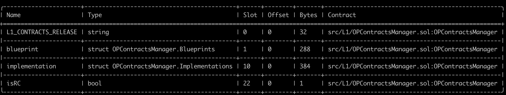

# Validation

This document can be used to validate the inputs and result of the execution of the upgrade transaction which you are
signing.

The steps are:

1. [Validate the Domain and Message Hashes](#expected-domain-and-message-hashes)
2. [Verifying the transaction input](#understanding-task-calldata)
3. [Verifying the state changes](#state-changes)

## Expected Domain and Message Hashes

First, we need to validate the domain and message hashes. These values should match both the values on your ledger and
the values printed to the terminal when you run the task.

> [!CAUTION]
>
> Before signing, ensure the below hashes match what is on your ledger.
>
> ### Security Council
>
> - Domain Hash: `0x260bd5f92cfcb40d079b1c6f6a7ff07df436553ba65d01934e15aabe1b88657f`
> - Message Hash: `0x6eab7597e461f93ce6c178d148fb58772991005fd84b7d7cbc8b6eb78807d207`
>
> ### Optimism Foundation
>
> - Domain Hash: `37e1f5dd3b92a004a23589b741196c8a214629d4ea3a690ec8e41ae45c689cbb`
> - Message Hash: `382f09a0cc05fcbd4fb57b9c4972cb9ec4ce02609e5d3c8f5c3ff728639c0b6a`


## Understanding Task Calldata

This document provides a detailed analysis of the final calldata executed on-chain for the OPCM upgrade to v2.0.0.

By examining each component of the calldata, we can confirm that the execution precisely implements the approved upgrade plan with no unexpected modifications or side effects.

```bash
# Final calldata
0x82ad56cb0000000000000000000000000000000000000000000000000000000000000020000000000000000000000000000000000000000000000000000000000000000100000000000000000000000000000000000000000000000000000000000000200000000000000000000000001b25f566336f47bc5e0036d66e142237dcf4640b000000000000000000000000000000000000000000000000000000000000000000000000000000000000000000000000000000000000000000000000000000600000000000000000000000000000000000000000000000000000000000000104ff2dd5a100000000000000000000000000000000000000000000000000000000000000200000000000000000000000000000000000000000000000000000000000000002000000000000000000000000c75d8c4e995fb29a4bd6ccef7db3a35e069ccf07000000000000000000000000e323c57b8966dd6ed845715303ddded832b2672c03f206f043bb34f9e931a49716754b303e635e931b7f1294ff8ca45c969fc62700000000000000000000000095b1425f3f2b6c741949dba20563368f7dbe38160000000000000000000000006d283c3ff5b2140032bf1a9c2fa20e4c7348466603f206f043bb34f9e931a49716754b303e635e931b7f1294ff8ca45c969fc62700000000000000000000000000000000000000000000000000000000
```

### Decode Multicall3DelegateCall calldata:
```bash
cast calldata-decode 'aggregate3((address,bool,bytes)[])' <0x82ad56cb...>

[
  (
    0x1B25F566336F47BC5E0036D66E142237DcF4640b,
    false,
    0xff2dd5a100000000000000000000000000000000000000000000000000000000000000200000000000000000000000000000000000000000000000000000000000000002000000000000000000000000c75d8c4e995fb29a4bd6ccef7db3a35e069ccf07000000000000000000000000e323c57b8966dd6ed845715303ddded832b2672c03f206f043bb34f9e931a49716754b303e635e931b7f1294ff8ca45c969fc62700000000000000000000000095b1425f3f2b6c741949dba20563368f7dbe38160000000000000000000000006d283c3ff5b2140032bf1a9c2fa20e4c7348466603f206f043bb34f9e931a49716754b303e635e931b7f1294ff8ca45c969fc627
  )
]
```

### Decode upgrade calldata

```bash
cast calldata-decode 'upgrade((address,address,bytes32)[])' 0xff2dd5a100000000000000000000000000000000000000000000000000000000000000200000000000000000000000000000000000000000000000000000000000000002000000000000000000000000c75d8c4e995fb29a4bd6ccef7db3a35e069ccf07000000000000000000000000e323c57b8966dd6ed845715303ddded832b2672c03f206f043bb34f9e931a49716754b303e635e931b7f1294ff8ca45c969fc62700000000000000000000000095b1425f3f2b6c741949dba20563368f7dbe38160000000000000000000000006d283c3ff5b2140032bf1a9c2fa20e4c7348466603f206f043bb34f9e931a49716754b303e635e931b7f1294ff8ca45c969fc627

[
  (
    0xC75d8c4e995fb29a4Bd6CcEF7DB3a35e069cCf07,
    0xE323c57b8966dd6eD845715303DDDED832B2672c,
    0x03f206f043bb34f9e931a49716754b303e635e931b7f1294ff8ca45c969fc627
  ),
  (
    0x95B1425f3F2b6c741949DbA20563368f7dBE3816,
    0x6d283c3Ff5B2140032BF1A9C2fa20e4c73484666,
    0x03f206f043bb34f9e931a49716754b303e635e931b7f1294ff8ca45c969fc627
  )
]

```
1. First tuple (Aegir-0):
    - SystemConfigProxy: [0xC75d8c4e995fb29a4Bd6CcEF7DB3a35e069cCf07](https://github.com/ethereum-optimism/superchain-registry/blob/f9851fcf12009a8f67d6c99b67ff6f843ae7e897/superchain/configs/sepolia/aegir-0.toml#L64)
    - ProxyAdmin: [0xE323c57b8966dd6eD845715303DDDED832B2672c](https://github.com/ethereum-optimism/superchain-registry/blob/f9851fcf12009a8f67d6c99b67ff6f843ae7e897/superchain/configs/sepolia/aegir-0.toml#L65)
    - AbsolutePrestate: [0x03f206f043bb34f9e931a49716754b303e635e931b7f1294ff8ca45c969fc627](https://github.com/ethereum-optimism/devnets/blob/115c8157d4dace0de62b6490a80c65ddf22e3f3f/betanets/aegir/aegir-0/chain.yaml#L2)

2. Second tuple (Aegir-1):
    - SystemConfigProxy: [0x95B1425f3F2b6c741949DbA20563368f7dBE3816](https://github.com/ethereum-optimism/superchain-registry/blob/f9851fcf12009a8f67d6c99b67ff6f843ae7e897/superchain/configs/sepolia/aegir-1.toml#L64)
    - ProxyAdmin: [0x6d283c3Ff5B2140032BF1A9C2fa20e4c73484666](https://github.com/ethereum-optimism/superchain-registry/blob/f9851fcf12009a8f67d6c99b67ff6f843ae7e897/superchain/configs/sepolia/aegir-1.toml#L65)
    - AbsolutePrestate: [0x03f206f043bb34f9e931a49716754b303e635e931b7f1294ff8ca45c969fc627](https://github.com/ethereum-optimism/devnets/blob/115c8157d4dace0de62b6490a80c65ddf22e3f3f/betanets/aegir/aegir-0/chain.yaml#L2)

## Encoding the calldata

- Command to encode:
  ```bash
  cast calldata 'upgrade((address,address,bytes32)[])' "[(0xC75d8c4e995fb29a4Bd6CcEF7DB3a35e069cCf07,0xE323c57b8966dd6eD845715303DDDED832B2672c,0x03f206f043bb34f9e931a49716754b303e635e931b7f1294ff8ca45c969fc627),(0x95B1425f3F2b6c741949DbA20563368f7dBE3816,0x6d283c3Ff5B2140032BF1A9C2fa20e4c73484666,0x03f206f043bb34f9e931a49716754b303e635e931b7f1294ff8ca45c969fc627)]"
  ```

1. First tuple (Call3 struct for Multicall3DelegateCall)
    - `target`: [0x1B25F566336F47BC5E0036D66E142237DcF4640b](https://github.com/ethereum-optimism/superchain-registry/blob/d4bb112dc979fd43ac92252c549d3ed7c4d0eb57/validation/standard/standard-versions-sepolia.toml#L21) - Sepolia OPContractsManager v2.0.0
    - `allowFailure`: false
    - `callData`: `0xff2dd5a1...`

- Command to encode:
```bash
cast calldata 'aggregate3((address,bool,bytes)[])' "[(0x1B25F566336F47BC5E0036D66E142237DcF4640b,false,0xff2dd5a100000000000000000000000000000000000000000000000000000000000000200000000000000000000000000000000000000000000000000000000000000002000000000000000000000000c75d8c4e995fb29a4bd6ccef7db3a35e069ccf07000000000000000000000000e323c57b8966dd6ed845715303ddded832b2672c03f206f043bb34f9e931a49716754b303e635e931b7f1294ff8ca45c969fc62700000000000000000000000095b1425f3f2b6c741949dba20563368f7dbe38160000000000000000000000006d283c3ff5b2140032bf1a9c2fa20e4c7348466603f206f043bb34f9e931a49716754b303e635e931b7f1294ff8ca45c969fc627)]"
```

# State Changes

For each contract listed in the state diff, please verify that no contracts or state changes shown in the Tenderly diff are missing from this document. Additionally, please verify that for each contract:

- The following state changes (and none others) are made to that contract. This validates that no unexpected state
  changes occur.
- All addresses (in section headers and storage values) match the provided name, using the Etherscan and Superchain
  Registry links provided. This validates the bytecode deployed at the addresses contains the correct logic.
- All key values match the semantic meaning provided, which can be validated using the storage layout links provided.

### Tenderly State Changes
[Link](https://dashboard.tenderly.co/oplabs/sepolia/simulator/ba323cb0-771a-4b03-81f9-e99b87345b9e)

### Task State Changes

<pre>
 <code>
----------------- Task State Changes -------------------

----- DecodedStateDiff[0] -----
  Who:               0x04D4B775Cc4b9f0D61Db2009bE37052FC2FA7615
  Contract:          DisputeGameFactory
  Chain ID:          420110004
  Raw Slot:          0x360894a13ba1a3210667c828492db98dca3e2076cc3735a920a3ca505d382bbc
  Raw Old Value:     0x000000000000000000000000a51bea7e4d34206c0bcb04a776292f2f19f0beec
  Raw New Value:     0x0000000000000000000000004bba758f006ef09402ef31724203f316ab74e4a0
  Decoded Kind:      address
  Decoded Old Value: 0xA51bea7E4d34206c0bCB04a776292F2f19F0BeEc
  Decoded New Value: 0x4bbA758F006Ef09402eF31724203F316ab74e4a0
  Summary:           ERC-1967 implementation slot
  Detail:            Standard slot for storing the implementation address in a proxy contract that follows the ERC-1967 standard.

----- DecodedStateDiff[1] -----
  Who:               0x04D4B775Cc4b9f0D61Db2009bE37052FC2FA7615
  Contract:          DisputeGameFactory
  Chain ID:          420110004
  Raw Slot:          0x4d5a9bd2e41301728d41c8e705190becb4e74abe869f75bdb405b63716a35f9e
  Raw Old Value:     0x000000000000000000000000fb7e65eb85caf8eb0af876972d3a9ba899cc97a1
  Raw New Value:     0x00000000000000000000000092a97b81023260bd2f42751faa4a057aa99a4ccd
  [WARN] Slot was not decoded

----- DecodedStateDiff[2] -----
  Who:               0x1B25F566336F47BC5E0036D66E142237DcF4640b
  Contract:          OPCM
  Chain ID:
  Raw Slot:          0x0000000000000000000000000000000000000000000000000000000000000016
  Raw Old Value:     0x0000000000000000000000000000000000000000000000000000000000000001
  Raw New Value:     0x0000000000000000000000000000000000000000000000000000000000000000
  Decoded Kind:      bool
  Decoded Old Value: true
  Decoded New Value: false
  Summary:           isRC

----- DecodedStateDiff[3] -----
  Who:               0x1dd21367755166CfE041e5d307A081A8411C8921
  Contract:          OptimismPortal2
  Chain ID:          420110005
  Raw Slot:          0x360894a13ba1a3210667c828492db98dca3e2076cc3735a920a3ca505d382bbc
  Raw Old Value:     0x00000000000000000000000035028bae87d71cbc192d545d38f960ba30b4b233
  Raw New Value:     0x0000000000000000000000002d7e764a0d9919e16983a46595cfa81fc34fa7cd
  Decoded Kind:      address
  Decoded Old Value: 0x35028bAe87D71cbC192d545d38F960BA30B4B233
  Decoded New Value: 0x2D7e764a0D9919e16983a46595CfA81fc34fa7Cd
  Summary:           ERC-1967 implementation slot
  Detail:            Standard slot for storing the implementation address in a proxy contract that follows the ERC-1967 standard.

----- DecodedStateDiff[4] -----
  Who:               0x1Eb2fFc903729a0F03966B917003800b145F56E2
  Contract:          ProxyAdminOwner (GnosisSafe)
  Chain ID:          11155420
  Raw Slot:          0x0000000000000000000000000000000000000000000000000000000000000005
  Raw Old Value:     0x0000000000000000000000000000000000000000000000000000000000000016
  Raw New Value:     0x0000000000000000000000000000000000000000000000000000000000000017
  Decoded Kind:      uint256
  Decoded Old Value: 22
  Decoded New Value: 23
  Summary:           nonce

----- DecodedStateDiff[5] -----
  Who:               0x2a066133E68067bb925e98CD9369FA812a7d6C02
  Contract:          L1ERC721Bridge
  Chain ID:          420110005
  Raw Slot:          0x360894a13ba1a3210667c828492db98dca3e2076cc3735a920a3ca505d382bbc
  Raw Old Value:     0x000000000000000000000000ae2af01232a6c4a4d3012c5ec5b1b35059caf10d
  Raw New Value:     0x000000000000000000000000276d3730f219f7ec22274f7263180b8452b46d47
  Decoded Kind:      address
  Decoded Old Value: 0xAE2AF01232a6c4a4d3012C5eC5b1b35059caF10d
  Decoded New Value: 0x276d3730f219f7ec22274f7263180b8452B46d47
  Summary:           ERC-1967 implementation slot
  Detail:            Standard slot for storing the implementation address in a proxy contract that follows the ERC-1967 standard.

----- DecodedStateDiff[6] -----
  Who:               0x4cA08286430274E959337Ff12dD79BA517c13cCF
  Contract:          L1ERC721Bridge
  Chain ID:          420110004
  Raw Slot:          0x360894a13ba1a3210667c828492db98dca3e2076cc3735a920a3ca505d382bbc
  Raw Old Value:     0x000000000000000000000000ae2af01232a6c4a4d3012c5ec5b1b35059caf10d
  Raw New Value:     0x000000000000000000000000276d3730f219f7ec22274f7263180b8452b46d47
  Decoded Kind:      address
  Decoded Old Value: 0xAE2AF01232a6c4a4d3012C5eC5b1b35059caF10d
  Decoded New Value: 0x276d3730f219f7ec22274f7263180b8452B46d47
  Summary:           ERC-1967 implementation slot
  Detail:            Standard slot for storing the implementation address in a proxy contract that follows the ERC-1967 standard.

----- DecodedStateDiff[7] -----
  Who:               0x5c06aDb8f7e30A6b30Ef6C91612719E8061b3Ff5
  Contract:          AEGIR-1_DisputeGameFactoryProxy
  Chain ID:          420110005
  Raw Slot:          0x360894a13ba1a3210667c828492db98dca3e2076cc3735a920a3ca505d382bbc
  Raw Old Value:     0x000000000000000000000000a51bea7e4d34206c0bcb04a776292f2f19f0beec
  Raw New Value:     0x0000000000000000000000004bba758f006ef09402ef31724203f316ab74e4a0
  Decoded Kind:      address
  Decoded Old Value: 0xA51bea7E4d34206c0bCB04a776292F2f19F0BeEc
  Decoded New Value: 0x4bbA758F006Ef09402eF31724203F316ab74e4a0
  Summary:           ERC-1967 implementation slot
  Detail:            Standard slot for storing the implementation address in a proxy contract that follows the ERC-1967 standard.

----- DecodedStateDiff[8] -----
  Who:               0x5c06aDb8f7e30A6b30Ef6C91612719E8061b3Ff5
  Contract:          AEGIR-1_DisputeGameFactoryProxy
  Chain ID:          420110005
  Raw Slot:          0x4d5a9bd2e41301728d41c8e705190becb4e74abe869f75bdb405b63716a35f9e
  Raw Old Value:     0x0000000000000000000000009ac63d00d8410d16d20b281ff4a262318391212a
  Raw New Value:     0x00000000000000000000000072d9bbfdd2e137fbc7a3643a716f01b3548d5147
  [WARN] Slot was not decoded

----- DecodedStateDiff[9] -----
  Who:               0x5c06aDb8f7e30A6b30Ef6C91612719E8061b3Ff5
  Contract:          AEGIR-1_DisputeGameFactoryProxy
  Chain ID:          420110005
  Raw Slot:          0xffdfc1249c027f9191656349feb0761381bb32c9f557e01f419fd08754bf5a1b
  Raw Old Value:     0x000000000000000000000000e226983df7ac26224bdb3b46c5636270348e60d5
  Raw New Value:     0x0000000000000000000000007d281a7a165b61ca310c963986288383302744f5
  [WARN] Slot was not decoded

----- DecodedStateDiff[10] -----
  Who:               0x692a1aB70A03A99d09ac2b90349Be3244030bABc
  Contract:          New AnchorStateRegistry
  Chain ID:          420110005
  Raw Slot:          0xb53127684a568b3173ae13b9f8a6016e243e63b6e8ee1178d6a717850b5d6103
  Raw Old Value:     0x0000000000000000000000000000000000000000000000000000000000000000
  Raw New Value:     0x0000000000000000000000006d283c3ff5b2140032bf1a9c2fa20e4c73484666
  Decoded Kind:      address
  Decoded Old Value: 0x0000000000000000000000000000000000000000
  Decoded New Value: 0x6d283c3Ff5B2140032BF1A9C2fa20e4c73484666
  Summary:           Proxy owner address
  Detail:            Standard slot for storing the owner address in a Proxy contract.

----- DecodedStateDiff[11] -----
  Who:               0x692a1aB70A03A99d09ac2b90349Be3244030bABc
  Contract:          New AnchorStateRegistry
  Chain ID:          420110005
  Raw Slot:          0x360894a13ba1a3210667c828492db98dca3e2076cc3735a920a3ca505d382bbc
  Raw Old Value:     0x0000000000000000000000000000000000000000000000000000000000000000
  Raw New Value:     0x0000000000000000000000007b465370bb7a333f99edd19599eb7fb1c2d3f8d2
  Decoded Kind:      address
  Decoded Old Value: 0x0000000000000000000000000000000000000000
  Decoded New Value: 0x7b465370BB7A333f99edd19599EB7Fb1c2D3F8D2
  Summary:           ERC-1967 implementation slot
  Detail:            Standard slot for storing the implementation address in a proxy contract that follows the ERC-1967 standard.

----- DecodedStateDiff[12] -----
  Who:               0x692a1aB70A03A99d09ac2b90349Be3244030bABc
  Contract:          New AnchorStateRegistry
  Chain ID:          420110005
  Raw Slot:          0x0000000000000000000000000000000000000000000000000000000000000000
  Raw Old Value:     0x0000000000000000000000000000000000000000000000000000000000000000
  Raw New Value:     0x00000000000000000000c2be75506d5724086deb7245bd260cc9753911be0001
  [WARN] Slot was not decoded

----- DecodedStateDiff[13] -----
  Who:               0x692a1aB70A03A99d09ac2b90349Be3244030bABc
  Contract:          New AnchorStateRegistry
  Chain ID:          420110005
  Raw Slot:          0x0000000000000000000000000000000000000000000000000000000000000001
  Raw Old Value:     0x0000000000000000000000000000000000000000000000000000000000000000
  Raw New Value:     0x0000000000000000000000005c06adb8f7e30a6b30ef6c91612719e8061b3ff5
  [WARN] Slot was not decoded

----- DecodedStateDiff[14] -----
  Who:               0x692a1aB70A03A99d09ac2b90349Be3244030bABc
  Contract:          New AnchorStateRegistry
  Chain ID:          420110005
  Raw Slot:          0x0000000000000000000000000000000000000000000000000000000000000002
  Raw Old Value:     0x0000000000000000000000000000000000000000000000000000000000000000
  Raw New Value:     0x0000000000000000000000001dd21367755166cfe041e5d307a081a8411c8921
  [WARN] Slot was not decoded

----- DecodedStateDiff[15] -----
  Who:               0x692a1aB70A03A99d09ac2b90349Be3244030bABc
  Contract:          New AnchorStateRegistry
  Chain ID:          420110005
  Raw Slot:          0x0000000000000000000000000000000000000000000000000000000000000004
  Raw Old Value:     0x0000000000000000000000000000000000000000000000000000000000000000
  Raw New Value:     0x14283bda64279eb2d8dcc47717c3674389a32336494a833f46c897ff69b10280
  [WARN] Slot was not decoded

----- DecodedStateDiff[16] -----
  Who:               0x692a1aB70A03A99d09ac2b90349Be3244030bABc
  Contract:          New AnchorStateRegistry
  Chain ID:          420110005
  Raw Slot:          0x0000000000000000000000000000000000000000000000000000000000000005
  Raw Old Value:     0x0000000000000000000000000000000000000000000000000000000000000000
  Raw New Value:     0x000000000000000000000000000000000000000000000000000000000003a8ab
  [WARN] Slot was not decoded

----- DecodedStateDiff[17] -----
  Who:               0x79ADD5713B383DAa0a138d3C4780C7A1804a8090
  Contract:          ProtocolVersions
  Chain ID:
  Raw Slot:          0x360894a13ba1a3210667c828492db98dca3e2076cc3735a920a3ca505d382bbc
  Raw Old Value:     0x00000000000000000000000042f0bd8313ad456a38061308857b2383fe2c72a0
  Raw New Value:     0x00000000000000000000000037e15e4d6dffa9e5e320ee1ec036922e563cb76c
  Decoded Kind:      address
  Decoded Old Value: 0x42F0bD8313ad456A38061308857b2383fe2c72a0
  Decoded New Value: 0x37E15e4d6DFFa9e5E320Ee1eC036922E563CB76C
  Summary:           ERC-1967 implementation slot
  Detail:            Standard slot for storing the implementation address in a proxy contract that follows the ERC-1967 standard.

----- DecodedStateDiff[18] -----
  Who:               0x84B0766C8D9aD527EDe43f24fF630e4c9bB2635f
  Contract:          OptimismMintableERC20Factory
  Chain ID:          420110004
  Raw Slot:          0x360894a13ba1a3210667c828492db98dca3e2076cc3735a920a3ca505d382bbc
  Raw Old Value:     0x000000000000000000000000e01efbeb1089d1d1db9c6c8b135c934c0734c846
  Raw New Value:     0x0000000000000000000000005493f4677a186f64805fe7317d6993ba4863988f
  Decoded Kind:      address
  Decoded Old Value: 0xE01efbeb1089D1d1dB9c6c8b135C934C0734c846
  Decoded New Value: 0x5493f4677A186f64805fe7317D6993ba4863988F
  Summary:           ERC-1967 implementation slot
  Detail:            Standard slot for storing the implementation address in a proxy contract that follows the ERC-1967 standard.

----- DecodedStateDiff[19] -----
  Who:               0x9488504fF191cE4Bb58023eB6FAEc224a729fE0F
  Contract:          L1StandardBridge
  Chain ID:          420110004
  Raw Slot:          0x360894a13ba1a3210667c828492db98dca3e2076cc3735a920a3ca505d382bbc
  Raw Old Value:     0x00000000000000000000000064b5a5ed26dcb17370ff4d33a8d503f0fbd06cff
  Raw New Value:     0x00000000000000000000000078972e88ab8bbb517a36caea23b931bab58ad3c6
  Decoded Kind:      address
  Decoded Old Value: 0x64B5a5Ed26DCb17370Ff4d33a8D503f0fbD06CfF
  Decoded New Value: 0x78972E88Ab8BBB517a36cAea23b931BAB58AD3c6
  Summary:           ERC-1967 implementation slot
  Detail:            Standard slot for storing the implementation address in a proxy contract that follows the ERC-1967 standard.

----- DecodedStateDiff[20] -----
  Who:               0x95B1425f3F2b6c741949DbA20563368f7dBE3816
  Contract:          SystemConfig
  Chain ID:          420110005
  Raw Slot:          0x360894a13ba1a3210667c828492db98dca3e2076cc3735a920a3ca505d382bbc
  Raw Old Value:     0x00000000000000000000000033b83e4c305c908b2fc181dda36e230213058d7d
  Raw New Value:     0x000000000000000000000000760c48c62a85045a6b69f07f4a9f22868659cbcc
  Decoded Kind:      address
  Decoded Old Value: 0x33b83E4C305c908B2Fc181dDa36e230213058d7d
  Decoded New Value: 0x760C48C62A85045A6B69f07F4a9f22868659CbCc
  Summary:           ERC-1967 implementation slot
  Detail:            Standard slot for storing the implementation address in a proxy contract that follows the ERC-1967 standard.

----- DecodedStateDiff[21] -----
  Who:               0x966EE15265C77F98584EEc1F784103e0BbcD305C
  Contract:          OptimismPortal2
  Chain ID:          420110004
  Raw Slot:          0x360894a13ba1a3210667c828492db98dca3e2076cc3735a920a3ca505d382bbc
  Raw Old Value:     0x00000000000000000000000035028bae87d71cbc192d545d38f960ba30b4b233
  Raw New Value:     0x0000000000000000000000002d7e764a0d9919e16983a46595cfa81fc34fa7cd
  Decoded Kind:      address
  Decoded Old Value: 0x35028bAe87D71cbC192d545d38F960BA30B4B233
  Decoded New Value: 0x2D7e764a0D9919e16983a46595CfA81fc34fa7Cd
  Summary:           ERC-1967 implementation slot
  Detail:            Standard slot for storing the implementation address in a proxy contract that follows the ERC-1967 standard.

----- DecodedStateDiff[22] -----
  Who:               0x97cDe4E3B78a983C97934363026E942e75598D00
  Contract:          AddressManager
  Chain ID:          420110004
  Raw Slot:          0x515216935740e67dfdda5cf8e248ea32b3277787818ab59153061ac875c9385e
  Raw Old Value:     0x000000000000000000000000d3494713a5cfad3f5359379dfa074e2ac8c6fd65
  Raw New Value:     0x0000000000000000000000003ea6084748ed1b2a9b5d4426181f1ad8c93f6231
  [WARN] Slot was not decoded

----- DecodedStateDiff[23] -----
  Who:               0xA90B1056A78dc72300c73D9eD24b5ec5DB98a56C
  Contract:          DelayedWETH
  Chain ID:          420110005
  Raw Slot:          0x360894a13ba1a3210667c828492db98dca3e2076cc3735a920a3ca505d382bbc
  Raw Old Value:     0x00000000000000000000000007f69b19532476c6cd03056d6bc3f1b110ab7538
  Raw New Value:     0x0000000000000000000000005e40b9231b86984b5150507046e354dbfbed3d9e
  Decoded Kind:      address
  Decoded Old Value: 0x07F69b19532476c6Cd03056D6BC3F1b110Ab7538
  Decoded New Value: 0x5e40B9231B86984b5150507046e354dbFbeD3d9e
  Summary:           ERC-1967 implementation slot
  Detail:            Standard slot for storing the implementation address in a proxy contract that follows the ERC-1967 standard.

----- DecodedStateDiff[24] -----
  Who:               0xBc212Bbf2Eb1fd49BD3c1e2795A141724d9c0A79
  Contract:          L1StandardBridge
  Chain ID:          420110005
  Raw Slot:          0x360894a13ba1a3210667c828492db98dca3e2076cc3735a920a3ca505d382bbc
  Raw Old Value:     0x00000000000000000000000064b5a5ed26dcb17370ff4d33a8d503f0fbd06cff
  Raw New Value:     0x00000000000000000000000078972e88ab8bbb517a36caea23b931bab58ad3c6
  Decoded Kind:      address
  Decoded Old Value: 0x64B5a5Ed26DCb17370Ff4d33a8D503f0fbD06CfF
  Decoded New Value: 0x78972E88Ab8BBB517a36cAea23b931BAB58AD3c6
  Summary:           ERC-1967 implementation slot
  Detail:            Standard slot for storing the implementation address in a proxy contract that follows the ERC-1967 standard.

----- DecodedStateDiff[25] -----
  Who:               0xbe5441E13eB70576970c784A152B245Ea1701c4a
  Contract:          DelayedWETH
  Chain ID:          420110004
  Raw Slot:          0x360894a13ba1a3210667c828492db98dca3e2076cc3735a920a3ca505d382bbc
  Raw Old Value:     0x00000000000000000000000007f69b19532476c6cd03056d6bc3f1b110ab7538
  Raw New Value:     0x0000000000000000000000005e40b9231b86984b5150507046e354dbfbed3d9e
  Decoded Kind:      address
  Decoded Old Value: 0x07F69b19532476c6Cd03056D6BC3F1b110Ab7538
  Decoded New Value: 0x5e40B9231B86984b5150507046e354dbFbeD3d9e
  Summary:           ERC-1967 implementation slot
  Detail:            Standard slot for storing the implementation address in a proxy contract that follows the ERC-1967 standard.

----- DecodedStateDiff[26] -----
  Who:               0xC2Be75506d5724086DEB7245bd260Cc9753911Be
  Contract:          SuperchainConfig
  Chain ID:          1946
  Raw Slot:          0x360894a13ba1a3210667c828492db98dca3e2076cc3735a920a3ca505d382bbc
  Raw Old Value:     0x00000000000000000000000044674af65d36b9d4ac6ba4717369af794c75d9ba
  Raw New Value:     0x0000000000000000000000004da82a327773965b8d4d85fa3db8249b387458e7
  Decoded Kind:      address
  Decoded Old Value: 0x44674AF65D36b9d4AC6ba4717369AF794c75d9BA
  Decoded New Value: 0x4da82a327773965b8d4D85Fa3dB8249b387458E7
  Summary:           ERC-1967 implementation slot
  Detail:            Standard slot for storing the implementation address in a proxy contract that follows the ERC-1967 standard.

----- DecodedStateDiff[27] -----
  Who:               0xC75d8c4e995fb29a4Bd6CcEF7DB3a35e069cCf07
  Contract:          SystemConfig
  Chain ID:          420110004
  Raw Slot:          0x360894a13ba1a3210667c828492db98dca3e2076cc3735a920a3ca505d382bbc
  Raw Old Value:     0x00000000000000000000000033b83e4c305c908b2fc181dda36e230213058d7d
  Raw New Value:     0x000000000000000000000000760c48c62a85045a6b69f07f4a9f22868659cbcc
  Decoded Kind:      address
  Decoded Old Value: 0x33b83E4C305c908B2Fc181dDa36e230213058d7d
  Decoded New Value: 0x760C48C62A85045A6B69f07F4a9f22868659CbCc
  Summary:           ERC-1967 implementation slot
  Detail:            Standard slot for storing the implementation address in a proxy contract that follows the ERC-1967 standard.

----- DecodedStateDiff[28] -----
  Who:               0xD135748CF0B8123dd382b0574be441b8af15D504
  Contract:          AddressManager
  Chain ID:          420110005
  Raw Slot:          0x515216935740e67dfdda5cf8e248ea32b3277787818ab59153061ac875c9385e
  Raw Old Value:     0x000000000000000000000000d3494713a5cfad3f5359379dfa074e2ac8c6fd65
  Raw New Value:     0x0000000000000000000000003ea6084748ed1b2a9b5d4426181f1ad8c93f6231
  [WARN] Slot was not decoded

----- DecodedStateDiff[29] -----
  Who:               0xD3af1cd701556160c47c9e9ffB6e89E44c00957F
  Contract:          OptimismMintableERC20Factory
  Chain ID:          420110005
  Raw Slot:          0x360894a13ba1a3210667c828492db98dca3e2076cc3735a920a3ca505d382bbc
  Raw Old Value:     0x000000000000000000000000e01efbeb1089d1d1db9c6c8b135c934c0734c846
  Raw New Value:     0x0000000000000000000000005493f4677a186f64805fe7317d6993ba4863988f
  Decoded Kind:      address
  Decoded Old Value: 0xE01efbeb1089D1d1dB9c6c8b135C934C0734c846
  Decoded New Value: 0x5493f4677A186f64805fe7317D6993ba4863988F
  Summary:           ERC-1967 implementation slot
  Detail:            Standard slot for storing the implementation address in a proxy contract that follows the ERC-1967 standard.

----- DecodedStateDiff[30] -----
  Who:               0xEBD2464F5B7C44164982AE5DA07f666082fd727C
  Contract:          New AnchorStateRegistry
  Chain ID:          420110004
  Raw Slot:          0xb53127684a568b3173ae13b9f8a6016e243e63b6e8ee1178d6a717850b5d6103
  Raw Old Value:     0x0000000000000000000000000000000000000000000000000000000000000000
  Raw New Value:     0x000000000000000000000000e323c57b8966dd6ed845715303ddded832b2672c
  Decoded Kind:      address
  Decoded Old Value: 0x0000000000000000000000000000000000000000
  Decoded New Value: 0xE323c57b8966dd6eD845715303DDDED832B2672c
  Summary:           Proxy owner address
  Detail:            Standard slot for storing the owner address in a Proxy contract.

----- DecodedStateDiff[31] -----
  Who:               0xEBD2464F5B7C44164982AE5DA07f666082fd727C
  Contract:          New AnchorStateRegistry
  Chain ID:          420110004
  Raw Slot:          0x360894a13ba1a3210667c828492db98dca3e2076cc3735a920a3ca505d382bbc
  Raw Old Value:     0x0000000000000000000000000000000000000000000000000000000000000000
  Raw New Value:     0x0000000000000000000000007b465370bb7a333f99edd19599eb7fb1c2d3f8d2
  Decoded Kind:      address
  Decoded Old Value: 0x0000000000000000000000000000000000000000
  Decoded New Value: 0x7b465370BB7A333f99edd19599EB7Fb1c2D3F8D2
  Summary:           ERC-1967 implementation slot
  Detail:            Standard slot for storing the implementation address in a proxy contract that follows the ERC-1967 standard.

----- DecodedStateDiff[32] -----
  Who:               0xEBD2464F5B7C44164982AE5DA07f666082fd727C
  Contract:          New AnchorStateRegistry
  Chain ID:          420110004
  Raw Slot:          0x0000000000000000000000000000000000000000000000000000000000000000
  Raw Old Value:     0x0000000000000000000000000000000000000000000000000000000000000000
  Raw New Value:     0x00000000000000000000c2be75506d5724086deb7245bd260cc9753911be0001
  [WARN] Slot was not decoded

----- DecodedStateDiff[33] -----
  Who:               0xEBD2464F5B7C44164982AE5DA07f666082fd727C
  Contract:          New AnchorStateRegistry
  Chain ID:          420110004
  Raw Slot:          0x0000000000000000000000000000000000000000000000000000000000000001
  Raw Old Value:     0x0000000000000000000000000000000000000000000000000000000000000000
  Raw New Value:     0x00000000000000000000000004d4b775cc4b9f0d61db2009be37052fc2fa7615
  [WARN] Slot was not decoded

----- DecodedStateDiff[34] -----
  Who:               0xEBD2464F5B7C44164982AE5DA07f666082fd727C
  Contract:          New AnchorStateRegistry
  Chain ID:          420110004
  Raw Slot:          0x0000000000000000000000000000000000000000000000000000000000000002
  Raw Old Value:     0x0000000000000000000000000000000000000000000000000000000000000000
  Raw New Value:     0x000000000000000000000000966ee15265c77f98584eec1f784103e0bbcd305c
  [WARN] Slot was not decoded

----- DecodedStateDiff[35] -----
  Who:               0xEBD2464F5B7C44164982AE5DA07f666082fd727C
  Contract:          New AnchorStateRegistry
  Chain ID:          420110004
  Raw Slot:          0x0000000000000000000000000000000000000000000000000000000000000004
  Raw Old Value:     0x0000000000000000000000000000000000000000000000000000000000000000
  Raw New Value:     0x20e6001ba6e6ea12559e47ed30ead8930eeac8af710bf9be937ea1610958caf2
  [WARN] Slot was not decoded

----- DecodedStateDiff[36] -----
  Who:               0xEBD2464F5B7C44164982AE5DA07f666082fd727C
  Contract:          New AnchorStateRegistry
  Chain ID:          420110004
  Raw Slot:          0x0000000000000000000000000000000000000000000000000000000000000005
  Raw Old Value:     0x0000000000000000000000000000000000000000000000000000000000000000
  Raw New Value:     0x000000000000000000000000000000000000000000000000000000000004c0e2
  [WARN] Slot was not decoded
```

# Supplementary Material

## Figure 0.1: Storage Layout of OPContractsManager


