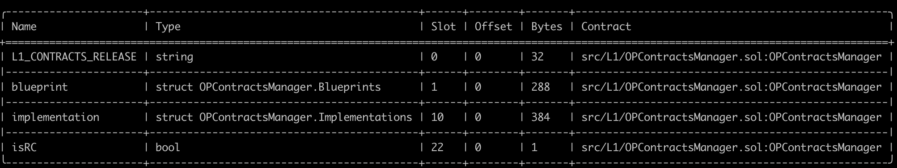

# Validation

This document can be used to validate the inputs and result of the execution of the upgrade transaction which you are
signing.

The steps are:

1. [Validate the Domain and Message Hashes](#expected-domain-and-message-hashes)
2. [Verifying the transaction input](#understanding-task-calldata)
3. [Verifying the state changes](#state-changes)

## Expected Domain and Message Hashes

First, we need to validate the domain and message hashes. These values should match both the values on your ledger and
the values printed to the terminal when you run the task.

> [!CAUTION]
>
> Before signing, ensure the below hashes match what is on your ledger.
>
> ### Security Council
>
> - Domain Hash: `0xbe081970e9fc104bd1ea27e375cd21ec7bb1eec56bfe43347c3e36c5d27b8533`
> - Message Hash: `0xcac3a791b4b20b7253bb689e577742d70d3a12e36bce4ef472beee34eddb323f`
>
> ### Optimism Foundation
>
> - Domain Hash: `0x37e1f5dd3b92a004a23589b741196c8a214629d4ea3a690ec8e41ae45c689cbb`
> - Message Hash: `0x36477217cdf193cfa0791b50b4b08339df0b40ff9935fdfbb3380c033e9cafef`

## Understanding Task Calldata

This document provides a detailed analysis of the final calldata executed on-chain for the OPCM upgrade to v3.0.0.

By reconstructing the calldata, we can confirm that the execution precisely implements the approved upgrade plan with no unexpected modifications or side effects.

### Inputs to `opcm.upgrade()`

For each chain being upgrade, the `opcm.upgrade()` function is called with a tuple of three elements:

1. OP Sepolia Testnet:
  - SystemConfigProxy: [0x034edD2A225f7f429A63E0f1D2084B9E0A93b538](https://github.com/ethereum-optimism/superchain-registry/blob/d4bb112dc979fd43ac92252c549d3ed7c4d0eb57/superchain/configs/sepolia/op.toml#L58)
  - ProxyAdmin: [0x189aBAAaa82DfC015A588A7dbaD6F13b1D3485Bc](https://github.com/ethereum-optimism/superchain-registry/blob/d4bb112dc979fd43ac92252c549d3ed7c4d0eb57/superchain/configs/sepolia/op.toml#L59)
  - AbsolutePrestate: [0x03ee2917da962ec266b091f4b62121dc9682bb0db534633707325339f99ee405](https://github.com/ethereum-optimism/superchain-registry/blob/1ab48707d705ef7100f3ffa549e048f699cb886d/validation/standard/standard-prestates.toml#L10)

2. Soneium Testnet Minato:
  - SystemConfigProxy: [0x4Ca9608Fef202216bc21D543798ec854539bAAd3](https://github.com/ethereum-optimism/superchain-registry/blob/d4bb112dc979fd43ac92252c549d3ed7c4d0eb57/superchain/configs/sepolia/soneium-minato.toml#L59)
  - ProxyAdmin: [0xff9d236641962Cebf9DBFb54E7b8e91F99f10Db0](https://github.com/ethereum-optimism/superchain-registry/blob/d4bb112dc979fd43ac92252c549d3ed7c4d0eb57/superchain/configs/sepolia/soneium-minato.toml#L60)
  - AbsolutePrestate: [0x03ee2917da962ec266b091f4b62121dc9682bb0db534633707325339f99ee405](https://github.com/ethereum-optimism/superchain-registry/blob/1ab48707d705ef7100f3ffa549e048f699cb886d/validation/standard/standard-prestates.toml#L10)

3. Ink Sepolia:
  - SystemConfigProxy: [0x05C993e60179f28bF649a2Bb5b00b5F4283bD525](https://github.com/ethereum-optimism/superchain-registry/blob/d4bb112dc979fd43ac92252c549d3ed7c4d0eb57/superchain/configs/sepolia/ink.toml#L58)
  - ProxyAdmin: [0xd7dB319a49362b2328cf417a934300cCcB442C8d](https://github.com/ethereum-optimism/superchain-registry/blob/d4bb112dc979fd43ac92252c549d3ed7c4d0eb57/superchain/configs/sepolia/ink.toml#L59)
  - AbsolutePrestate: [0x03ee2917da962ec266b091f4b62121dc9682bb0db534633707325339f99ee405](https://github.com/ethereum-optimism/superchain-registry/blob/1ab48707d705ef7100f3ffa549e048f699cb886d/validation/standard/standard-prestates.toml#L10)


Thus, the command to encode the calldata is:


```bash
cast calldata 'upgrade((address,address,bytes32)[])' "[(0x034edD2A225f7f429A63E0f1D2084B9E0A93b538,0x189aBAAaa82DfC015A588A7dbaD6F13b1D3485Bc,0x03ee2917da962ec266b091f4b62121dc9682bb0db534633707325339f99ee405),(0x4Ca9608Fef202216bc21D543798ec854539bAAd3,0xff9d236641962Cebf9DBFb54E7b8e91F99f10Db0,0x03ee2917da962ec266b091f4b62121dc9682bb0db534633707325339f99ee405),(0x05C993e60179f28bF649a2Bb5b00b5F4283bD525,0xd7dB319a49362b2328cf417a934300cCcB442C8d,0x03ee2917da962ec266b091f4b62121dc9682bb0db534633707325339f99ee405)]"
```

### Inputs to `Multicall3DelegateCall`

The output from the previous section becomes the `data` in the argument to the `Multicall3DelegateCall.aggregate3()` function.

This function is called with a tuple of three elements:


Call3 struct for Multicall3DelegateCall:
- `target`: [0xfbceed4de885645fbded164910e10f52febfab35](https://github.com/ethereum-optimism/superchain-registry/blob/1a5d7a208cea9b0ea175df1fe71bdc4da7f4c04c/validation/standard/standard-versions-sepolia.toml#L22) - Sepolia OPContractsManager v3.0.0
- `allowFailure`: false
- `callData`: `0xff2dd5a1...` (output from the previous section)

Command to encode:
```bash
cast calldata 'aggregate3((address,bool,bytes)[])' "[(0xfbceed4de885645fbded164910e10f52febfab35,false,0xff2dd5a100000000000000000000000000000000000000000000000000000000000000200000000000000000000000000000000000000000000000000000000000000003000000000000000000000000034edd2a225f7f429a63e0f1d2084b9e0a93b538000000000000000000000000189abaaaa82dfc015a588a7dbad6f13b1d3485bc03ee2917da962ec266b091f4b62121dc9682bb0db534633707325339f99ee4050000000000000000000000004ca9608fef202216bc21d543798ec854539baad3000000000000000000000000ff9d236641962cebf9dbfb54e7b8e91f99f10db003ee2917da962ec266b091f4b62121dc9682bb0db534633707325339f99ee40500000000000000000000000005c993e60179f28bf649a2bb5b00b5f4283bd525000000000000000000000000d7db319a49362b2328cf417a934300cccb442c8d03ee2917da962ec266b091f4b62121dc9682bb0db534633707325339f99ee405)]"
```

The resulting calldata sent from the ProxyAdminOwner safe is thus:

```
0x82ad56cb000000000000000000000000000000000000000000000000000000000000002000000000000000000000000000000000000000000000000000000000000000010000000000000000000000000000000000000000000000000000000000000020000000000000000000000000fbceed4de885645fbded164910e10f52febfab35000000000000000000000000000000000000000000000000000000000000000000000000000000000000000000000000000000000000000000000000000000600000000000000000000000000000000000000000000000000000000000000164ff2dd5a100000000000000000000000000000000000000000000000000000000000000200000000000000000000000000000000000000000000000000000000000000003000000000000000000000000034edd2a225f7f429a63e0f1d2084b9e0a93b538000000000000000000000000189abaaaa82dfc015a588a7dbad6f13b1d3485bc03ee2917da962ec266b091f4b62121dc9682bb0db534633707325339f99ee4050000000000000000000000004ca9608fef202216bc21d543798ec854539baad3000000000000000000000000ff9d236641962cebf9dbfb54e7b8e91f99f10db003ee2917da962ec266b091f4b62121dc9682bb0db534633707325339f99ee40500000000000000000000000005c993e60179f28bf649a2bb5b00b5f4283bd525000000000000000000000000d7db319a49362b2328cf417a934300cccb442c8d03ee2917da962ec266b091f4b62121dc9682bb0db534633707325339f99ee40500000000000000000000000000000000000000000000000000000000
```

In mainnet runbooks, this calldata should appear in [Action Plan](https://gov.optimism.io/t/upgrade-proposal-14-isthmus-l1-contracts-mt-cannon/9796#p-43948-action-plan-9) section of the Governance proposal.

# State Validations

For each contract listed in the state diff, please verify that no contracts or state changes shown in the Tenderly diff are missing from this document. Additionally, please verify that for each contract:

- The following state changes (and none others) are made to that contract. This validates that no unexpected state
  changes occur.
- All addresses (in section headers and storage values) match the provided name, using the Etherscan and Superchain
  Registry links provided. This validates the bytecode deployed at the addresses contains the correct logic.
- All key values match the semantic meaning provided, which can be validated using the storage layout links provided.

### State Overrides

Note: The changes listed below do not include threshold, nonce and owner mapping overrides. These changes are listed and explained in the [NESTED-VALIDATION.md](../../../../../NESTED-VALIDATION.md) file.

### Task State Changes

### [`0x034edd2a225f7f429a63e0f1d2084b9e0a93b538`](https://github.com/ethereum-optimism/superchain-registry/blob/1a5d7a208cea9b0ea175df1fe71bdc4da7f4c04c/superchain/configs/sepolia/op.toml#L59) (SystemConfig) Chain ID: 11155420

- **Key:**          `0x360894a13ba1a3210667c828492db98dca3e2076cc3735a920a3ca505d382bbc`
  - **Decoded Kind:**      `address`
  - **Before:** `0x760C48C62A85045A6B69f07F4a9f22868659CbCc`
  - **After:** [`0x340f923E5c7cbB2171146f64169EC9d5a9FfE647`](https://github.com/ethereum-optimism/superchain-registry/blob/00208555c3c356d6596feedb619da989de478ed7/validation/standard/standard-versions-sepolia.toml#L9)
  - **Summary:**           ERC-1967 implementation slot
  - **Detail:**            Standard slot for storing the implementation address in a proxy contract that follows the ERC-1967 standard. SystemConfig contract for `op-contracts/v3.0.0-rc.2`.

  ---

### [`0x05c993e60179f28bf649a2bb5b00b5f4283bd525`](https://github.com/ethereum-optimism/superchain-registry/blob/00208555c3c356d6596feedb619da989de478ed7/superchain/configs/sepolia/ink.toml#L59-L59) (SystemConfig) - Chain ID: 763373

- **Key:**          `0x360894a13ba1a3210667c828492db98dca3e2076cc3735a920a3ca505d382bbc`
  - **Decoded Kind:**      `address`
  - **Before:** `0x760C48C62A85045A6B69f07F4a9f22868659CbCc`
  - **After:** [`0x340f923E5c7cbB2171146f64169EC9d5a9FfE647`](https://github.com/ethereum-optimism/superchain-registry/blob/00208555c3c356d6596feedb619da989de478ed7/validation/standard/standard-versions-sepolia.toml#L9-L9)`
  - **Summary:**           ERC-1967 implementation slot
  - **Detail:**            Standard slot for storing the implementation address in a proxy contract that follows the ERC-1967 standard. SystemConfig contract for `op-contracts/v3.0.0-rc.2`.
  - **After:** [`0x340f923E5c7cbB2171146f64169EC9d5a9FfE647`](https://github.com/ethereum-optimism/superchain-registry/blob/00208555c3c356d6596feedb619da989de478ed7/validation/standard/standard-versions-sepolia.toml#L9-L9)
  ---

### [`0x05f9613adb30026ffd634f38e5c4dfd30a197fa1`]((https://github.com/ethereum-optimism/superchain-registry/blob/00208555c3c356d6596feedb619da989de478ed7/superchain/configs/sepolia/op.toml#L63-L63)) (DisputeGameFactory) - Chain ID: 11155420

- **Key:**          `0x4d5a9bd2e41301728d41c8e705190becb4e74abe869f75bdb405b63716a35f9e`
  - **Before:**     `0x0000000000000000000000007717296cac5d39d362eb77a94c95483bebae214e`
  - **After:**     `0x000000000000000000000000845e5382d60ec16e538051e1876a985c5339cc62`
  - **Summary:**     Updates the implementation for game type 1.
  - **Detail:**    This is `gameImpls[1]` -> `0x845e5382d60ec16E538051E1876A985c5339CC62`. The [`gameImpls` mapping](https://github.com/ethereum-optimism/optimism/blob/op-contracts/v3.0.0-rc.2/packages/contracts-bedrock/src/dispute/DisputeGameFactory.sol#L57) is at [storage slot 101](https://github.com/ethereum-optimism/optimism/blob/op-contracts/v3.0.0-rc.2/packages/contracts-bedrock/snapshots/storageLayout/DisputeGameFactory.json#L41) and is keyed by [`GameType` (`uint32`)](https://github.com/ethereum-optimism/optimism/blob/op-contracts/v3.0.0-rc.2/packages/contracts-bedrock/src/dispute/lib/LibUDT.sol#L224).
    - Confirm the expected key slot with the following:
      ```shell
      cast index uint32 1 101
      0x4d5a9bd2e41301728d41c8e705190becb4e74abe869f75bdb405b63716a35f9e
      ```

- **Key:**          `0xffdfc1249c027f9191656349feb0761381bb32c9f557e01f419fd08754bf5a1b`
  - **Before:**     `0x0000000000000000000000001851253ad7214f7b39e541befb6626669cb2446f`
  - **After:**     `0x000000000000000000000000d46b939123d5fb1b48ee3f90caebc9d5498ed542`
  - **Summary:**  Updates the implementation for game type 0.
  - **Detail:**  This is `gameImpls[0]` -> `0xd46b939123D5FB1b48ee3f90caEbC9D5498ED542`. The [`gameImpls` mapping](https://github.com/ethereum-optimism/optimism/blob/op-contracts/v3.0.0-rc.2/packages/contracts-bedrock/src/dispute/DisputeGameFactory.sol#L57) is at [storage slot 101](https://github.com/ethereum-optimism/optimism/blob/op-contracts/v3.0.0-rc.2/packages/contracts-bedrock/snapshots/storageLayout/DisputeGameFactory.json#L41) and is keyed by [`GameType` (`uint32`)](https://github.com/ethereum-optimism/optimism/blob/op-contracts/v3.0.0-rc.2/packages/contracts-bedrock/src/dispute/lib/LibUDT.sol#L224).
    - Confirm the expected key slot with the following:
      ```shell
      cast index uint32 0 101
      0xffdfc1249c027f9191656349feb0761381bb32c9f557e01f419fd08754bf5a1b
      ```

  ---

### [`0x16fc5058f25648194471939df75cf27a2fdc48bc`](https://github.com/ethereum-optimism/superchain-registry/blob/08e3fe429c776a532c2b6dc09571fc13e6dba5d4/superchain/configs/sepolia/op.toml#L58) (OptimismPortal2) - Chain ID: 11155420

- **Key:**          `0x360894a13ba1a3210667c828492db98dca3e2076cc3735a920a3ca505d382bbc`
  - **Decoded Kind:**      `address`
  - **Before:** `0x2D7e764a0D9919e16983a46595CfA81fc34fa7Cd`
  - **After:** [`0xB443Da3e07052204A02d630a8933dAc05a0d6fB4`](https://github.com/ethereum-optimism/superchain-registry/blob/00208555c3c356d6596feedb619da989de478ed7/validation/standard/standard-versions-sepolia.toml#L13-L13)`
  - **Summary:**           ERC-1967 implementation slot
  - **Detail:**            Standard slot for storing the implementation address in a proxy contract that follows the ERC-1967 standard. OptimismPortal2 contract for `op-contracts/v3.0.0-rc.2`.

  ---

### [`0x1eb2ffc903729a0f03966b917003800b145f56e2`](https://github.com/ethereum-optimism/superchain-registry/blob/b40cf4289c58e28eb1c791f9ad5724380b7516a7/validation/standard/standard-config-roles-sepolia.toml#L3) (ProxyAdminOwner (GnosisSafe)) - Chain ID: 11155420

- **Account Nonce in State:**
  - **Before:** 18
  - **After:** 23
  - **Detail:** Five new dispute games were deployed by the ProxyAdminOwner during execution, resulting in the account nonce in state being incremented five times.

- **Nonce:**
  - **Decoded Kind:**      `uint256`
  - **Before:** `26`
  - **After:** `27`
  - **Summary:** Nonce update
  - **Detail:** Nonce update for the parent multisig. You can verify manually with the following:
    - Before: `cast --to-dec 0x1a` = 26
    - After: `cast --to-dec 0x1b` = 27

If signer is on safe: `0xDEe57160aAfCF04c34C887B5962D0a69676d3C8B`:

- **Key:**      `0xb064d60ee12298c5e9b3f0203d8e7790e3af9a42763d3205a483d5688a981c3b`
  - **Before:** `0x0000000000000000000000000000000000000000000000000000000000000000`
  - **After:** `0x0000000000000000000000000000000000000000000000000000000000000001`
  - **Summary:**  `approveHash(bytes32)` called on ProxyAdminOwner by child multisig.
  - **Detail:** **THIS WAS CAREFULLY VERIFIED BY RUNBOOK REVIEWERS AND NEED NOT BE CHECKED BY SIGNERS.** As part of the Tenderly simulation, we want to illustrate the <i>approveHash</i> invocation. This step isn't shown in the local simulation because the parent multisig is invoked directly, bypassing the <i>approveHash</i> calls. This slot change reflects an update to the approvedHashes mapping.
    Specifically, this simulation was ran as the nested safe ``. To verify the slot yourself, run:
    - `res=$(cast index address 0xDEe57160aAfCF04c34C887B5962D0a69676d3C8B 8)`
    - `cast index bytes32 0x7950440f66fbaed05a9227cf7d093e33e3f90757f053c3457509ebc5f745b5a9 $res`
    - Please note: the `0x7950440f66fbaed05a9227cf7d093e33e3f90757f053c3457509ebc5f745b5a9` value is taken from the Tenderly simulation and this is the transaction hash of the `approveHash` call.

OR if signer is on safe: `0xf64bc17485f0B4Ea5F06A96514182FC4cB561977`:

- **Key:**      `0xdb0777102de60d23cfce4b19d05c3cb2050b905fdb3259301d5a4ebc6b99b605`
  - **Before:** `0x0000000000000000000000000000000000000000000000000000000000000000`
  - **After:** `0x0000000000000000000000000000000000000000000000000000000000000001`
  - **Summary:**  `approveHash(bytes32)` called on ProxyAdminOwner by child multisig.
  - **Detail:** **THIS WAS CAREFULLY VERIFIED BY RUNBOOK REVIEWERS AND NEED NOT BE CHECKED BY SIGNERS.** As part of the Tenderly simulation, we want to illustrate the <i>approveHash</i> invocation. This step isn't shown in the local simulation because the parent multisig is invoked directly, bypassing the <i>approveHash</i> calls. This slot change reflects an update to the approvedHashes mapping.
    Specifically, this simulation was ran as the nested safe ``. To verify the slot yourself, run:
    - `res=$(cast index address 0xf64bc17485f0B4Ea5F06A96514182FC4cB561977 8)`
    - `cast index bytes32 0x7950440f66fbaed05a9227cf7d093e33e3f90757f053c3457509ebc5f745b5a9 $res`
    - Please note: the `0x7950440f66fbaed05a9227cf7d093e33e3f90757f053c3457509ebc5f745b5a9` value is taken from the Tenderly simulation and this is the transaction hash of the `approveHash` call.

  ---

### [`0x2bfb22cd534a462028771a1ca9d6240166e450c4`](https://github.com/ethereum-optimism/superchain-registry/blob/00208555c3c356d6596feedb619da989de478ed7/superchain/configs/sepolia/soneium-minato.toml#L55) (L1ERC721Bridge) - Chain ID: 1946

- **Key:**          `0x360894a13ba1a3210667c828492db98dca3e2076cc3735a920a3ca505d382bbc`
  - **Decoded Kind:**      `address`
  - **Before:** `0x276d3730f219f7ec22274f7263180b8452B46d47`
  - **After:** [`0x7aE1d3BD877a4C5CA257404ce26BE93A02C98013`](https://github.com/ethereum-optimism/superchain-registry/blob/00208555c3c356d6596feedb619da989de478ed7/validation/standard/standard-versions-sepolia.toml#L19-L19)
  - **Summary:**           ERC-1967 implementation slot
  - **Detail:**            Standard slot for storing the implementation address in a proxy contract that follows the ERC-1967 standard. L1ERC721Bridge contract for `op-contracts/v3.0.0-rc.2`.

  ---

### [`0x33f60714bbd74d62b66d79213c348614de51901c`](https://github.com/ethereum-optimism/superchain-registry/blob/00208555c3c356d6596feedb619da989de478ed7/superchain/configs/sepolia/ink.toml#L56) (L1StandardBridge) - Chain ID: 763373

- **Key:**          `0x360894a13ba1a3210667c828492db98dca3e2076cc3735a920a3ca505d382bbc`
  - **Decoded Kind:**      `address`
  - **Before:** `0x78972E88Ab8BBB517a36cAea23b931BAB58AD3c6`
  - **After:** [`0x0b09ba359A106C9ea3b181CBc5F394570c7d2a7A`](https://github.com/ethereum-optimism/superchain-registry/blob/00208555c3c356d6596feedb619da989de478ed7/validation/standard/standard-versions-sepolia.toml#L20)
  - **Summary:**           ERC-1967 implementation slot
  - **Detail:**            Standard slot for storing the implementation address in a proxy contract that follows the ERC-1967 standard. L1StandardBridge contract for `op-contracts/v3.0.0-rc.2`.

  ---

### [`0x3454f9df5e750f1383e58c1cb001401e7a4f3197`](https://github.com/ethereum-optimism/superchain-registry/blob/00208555c3c356d6596feedb619da989de478ed7/superchain/configs/sepolia/ink.toml#L53) (AddressManager) - Chain ID: 763373

- **Key:**          `0x515216935740e67dfdda5cf8e248ea32b3277787818ab59153061ac875c9385e`
  - **Before:**     `0x0000000000000000000000003ea6084748ed1b2a9b5d4426181f1ad8c93f6231`
  - **After:**     `0x0000000000000000000000005d5a095665886119693f0b41d8dfee78da033e8b`
  - **Summary:**  The name `OVM_L1CrossDomainMessenger` is set to the address of the new 'op-contracts/v3.0.0-rc.2' L1CrossDomainMessenger at [0x5d5a095665886119693f0b41d8dfee78da033e8b](https://github.com/ethereum-optimism/superchain-registry/blob/1a5d7a208cea9b0ea175df1fe71bdc4da7f4c04c/validation/standard/standard-versions-sepolia.toml#L18).
  - **Detail:** **THIS WAS CAREFULLY VERIFIED BY RUNBOOK REVIEWERS AND NEED NOT BE CHECKED BY SIGNERS.**
    This key is complicated to compute, so instead we attest to correctness of the key by
    verifying that the "Before" value currently exists in that slot, as explained below.
    **Before** address matches the following cast call to `AddressManager.getAddress()`:
      - `cast call 0x3454F9df5E750F1383e58c1CB001401e7A4f3197 'getAddress(string)(address)' 'OVM_L1CrossDomainMessenger' --rpc-url sepolia`
      - returns: `0x3eA6084748ED1b2A9B5D4426181F1ad8C93F6231`

  ---

### [`0x4ca9608fef202216bc21d543798ec854539baad3`](https://github.com/ethereum-optimism/superchain-registry/blob/00208555c3c356d6596feedb619da989de478ed7/superchain/configs/sepolia/soneium-minato.toml#L60) (SystemConfig) - Chain ID: 1946

- **Key:**          `0x360894a13ba1a3210667c828492db98dca3e2076cc3735a920a3ca505d382bbc`
  - **Decoded Kind:**      `address`
  - **Before:** `0x760C48C62A85045A6B69f07F4a9f22868659CbCc`
  - **After:** [`0x340f923E5c7cbB2171146f64169EC9d5a9FfE647`](https://github.com/ethereum-optimism/superchain-registry/blob/00208555c3c356d6596feedb619da989de478ed7/validation/standard/standard-versions-sepolia.toml#L9)
  - **Summary:**           ERC-1967 implementation slot
  - **Detail:**            Standard slot for storing the implementation address in a proxy contract that follows the ERC-1967 standard. SystemConfig contract for `op-contracts/v3.0.0-rc.2`.

  ---

### [`0x5c1d29c6c9c8b0800692acc95d700bcb4966a1d7`](https://github.com/ethereum-optimism/superchain-registry/blob/00208555c3c356d6596feedb619da989de478ed7/superchain/configs/sepolia/ink.toml#L58)  (OptimismPortal2) - Chain ID: 763373

- **Key:**          `0x360894a13ba1a3210667c828492db98dca3e2076cc3735a920a3ca505d382bbc`
  - **Decoded Kind:**      `address`
  - **Before:** `0x2D7e764a0D9919e16983a46595CfA81fc34fa7Cd`
  - **After:** [`0xB443Da3e07052204A02d630a8933dAc05a0d6fB4`](https://github.com/ethereum-optimism/superchain-registry/blob/00208555c3c356d6596feedb619da989de478ed7/validation/standard/standard-versions-sepolia.toml#L13)
  - **Summary:**           ERC-1967 implementation slot
  - **Detail:**            Standard slot for storing the implementation address in a proxy contract that follows the ERC-1967 standard. OptimismPortal2 contract for `op-contracts/v3.0.0-rc.2`.

  ---

### [`0x5f5a404a5edabcdd80db05e8e54a78c9ebf000c2`](https://github.com/ethereum-optimism/superchain-registry/blob/00208555c3c356d6596feedb619da989de478ed7/superchain/configs/sepolia/soneium-minato.toml#L56) (L1StandardBridge) - Chain ID: 1946

- **Key:**          `0x360894a13ba1a3210667c828492db98dca3e2076cc3735a920a3ca505d382bbc`
  - **Decoded Kind:**      `address`
  - **Before:** `0x78972E88Ab8BBB517a36cAea23b931BAB58AD3c6`
  - **After:** [`0x0b09ba359A106C9ea3b181CBc5F394570c7d2a7A`](https://github.com/ethereum-optimism/superchain-registry/blob/00208555c3c356d6596feedb619da989de478ed7/validation/standard/standard-versions-sepolia.toml#L20)
  - **Summary:**           ERC-1967 implementation slot
  - **Detail:**            Standard slot for storing the implementation address in a proxy contract that follows the ERC-1967 standard. L1StandardBridge contract for `op-contracts/v3.0.0-rc.2`.

  ---

### [`0x65ea1489741a5d72ffdd8e6485b216bbdcc15af3`](https://github.com/ethereum-optimism/superchain-registry/blob/00208555c3c356d6596feedb619da989de478ed7/superchain/configs/sepolia/soneium-minato.toml#L59)  (OptimismPortal2) - Chain ID: 1946

- **Key:**          `0x360894a13ba1a3210667c828492db98dca3e2076cc3735a920a3ca505d382bbc`
  - **Decoded Kind:**      `address`
  - **Before:** `0x2D7e764a0D9919e16983a46595CfA81fc34fa7Cd`
  - **After:** [`0xB443Da3e07052204A02d630a8933dAc05a0d6fB4`](https://github.com/ethereum-optimism/superchain-registry/blob/00208555c3c356d6596feedb619da989de478ed7/validation/standard/standard-versions-sepolia.toml#L13)
  - **Summary:**           ERC-1967 implementation slot
  - **Detail:**            Standard slot for storing the implementation address in a proxy contract that follows the ERC-1967 standard. OptimismPortal2 contract for `op-contracts/v3.0.0-rc.2`.

  ---

### [`0x6e8a77673109783001150dfa770e6c662f473da9`](https://github.com/ethereum-optimism/superchain-registry/blob/00208555c3c356d6596feedb619da989de478ed7/superchain/configs/sepolia/soneium-minato.toml#L53) (AddressManager) - Chain ID: 1946

- **Key:**          `0x515216935740e67dfdda5cf8e248ea32b3277787818ab59153061ac875c9385e`
  - **Before:**     `0x0000000000000000000000003ea6084748ed1b2a9b5d4426181f1ad8c93f6231`
  - **After:**     `0x0000000000000000000000005d5a095665886119693f0b41d8dfee78da033e8b`
  - **Summary:**  The name `OVM_L1CrossDomainMessenger` is set to the address of the new 'op-contracts/v3.0.0-rc.2' L1CrossDomainMessenger at [0x5d5a095665886119693f0b41d8dfee78da033e8b](https://github.com/ethereum-optimism/superchain-registry/blob/1a5d7a208cea9b0ea175df1fe71bdc4da7f4c04c/validation/standard/standard-versions-sepolia.toml#L18).
  - **Detail:** **THIS WAS CAREFULLY VERIFIED BY RUNBOOK REVIEWERS AND NEED NOT BE CHECKED BY SIGNERS.**
    This key is complicated to compute, so instead we attest to correctness of the key by
    verifying that the "Before" value currently exists in that slot, as explained below.
    **Before** address matches the following cast call to `AddressManager.getAddress()`:
      - `cast call 0x6e8a77673109783001150dfa770e6c662f473da9 'getAddress(string)(address)' 'OVM_L1CrossDomainMessenger' --rpc-url sepolia`
      - returns: `0x3eA6084748ED1b2A9B5D4426181F1ad8C93F6231`

  ---

### [`0x860e626c700af381133d9f4af31412a2d1db3d5d`](https://github.com/ethereum-optimism/superchain-registry/blob/08e3fe429c776a532c2b6dc09571fc13e6dba5d4/superchain/configs/sepolia/ink.toml#L64) (DisputeGameFactory) - Chain ID: 763373

- **Key:**          `0x4d5a9bd2e41301728d41c8e705190becb4e74abe869f75bdb405b63716a35f9e`
  - **Before:**     `0x00000000000000000000000065e5ec10f922cf7e61ead974525a2795bd4fda9a`
  - **After:**     `0x000000000000000000000000de2b69153c42191eb4863a36024d80a1d426d0c8`
  - **Summary:**     Updates the implementation for game type 1.
  - **Detail:**    This is `gameImpls[1]` -> `0xde2B69153c42191EB4863A36024D80a1d426d0C8`. The [`gameImpls` mapping](https://github.com/ethereum-optimism/optimism/blob/op-contracts/v3.0.0-rc.2/packages/contracts-bedrock/src/dispute/DisputeGameFactory.sol#L57) is at [storage slot 101](https://github.com/ethereum-optimism/optimism/blob/op-contracts/v3.0.0-rc.2/packages/contracts-bedrock/snapshots/storageLayout/DisputeGameFactory.json#L41) and is keyed by [`GameType` (`uint32`)](https://github.com/ethereum-optimism/optimism/blob/op-contracts/v3.0.0-rc.2/packages/contracts-bedrock/src/dispute/lib/LibUDT.sol#L224).
    - Confirm the expected key slot with the following:
      ```shell
      cast index uint32 1 101
      0x4d5a9bd2e41301728d41c8e705190becb4e74abe869f75bdb405b63716a35f9e
      ```

- **Key:**          `0xffdfc1249c027f9191656349feb0761381bb32c9f557e01f419fd08754bf5a1b`
  - **Before:**     `0x00000000000000000000000043736de4bd35482d828b79ea673b76ab1699626f`
  - **After:**     `0x0000000000000000000000000c356f533eb009deb302bc96522e80dea6a16276`
  - **Summary:**  Updates the implementation for game type 0.
  - **Detail:**  This is `gameImpls[0]` -> `0x0C356F533eb009dEb302bC96522e80dea6A16276`. The [`gameImpls` mapping](https://github.com/ethereum-optimism/optimism/blob/op-contracts/v3.0.0-rc.2/packages/contracts-bedrock/src/dispute/DisputeGameFactory.sol#L57) is at [storage slot 101](https://github.com/ethereum-optimism/optimism/blob/op-contracts/v3.0.0-rc.2/packages/contracts-bedrock/snapshots/storageLayout/DisputeGameFactory.json#L41) and is keyed by [`GameType` (`uint32`)](https://github.com/ethereum-optimism/optimism/blob/op-contracts/v3.0.0-rc.2/packages/contracts-bedrock/src/dispute/lib/LibUDT.sol#L224).
    - Confirm the expected key slot with the following:
      ```shell
      cast index uint32 0 101
      0xffdfc1249c027f9191656349feb0761381bb32c9f557e01f419fd08754bf5a1b
      ```

  ---

### [`0x9bfe9c5609311df1c011c47642253b78a4f33f4b`](https://github.com/ethereum-optimism/superchain-registry/blob/00208555c3c356d6596feedb619da989de478ed7/superchain/configs/sepolia/op.toml#L53)  (AddressManager) - Chain ID: 11155420

- **Key:**          `0x515216935740e67dfdda5cf8e248ea32b3277787818ab59153061ac875c9385e`
  - **Before:**     `0x0000000000000000000000003ea6084748ed1b2a9b5d4426181f1ad8c93f6231`
  - **After:**     `0x0000000000000000000000005d5a095665886119693f0b41d8dfee78da033e8b`
  - **Summary:**  The name `OVM_L1CrossDomainMessenger` is set to the address of the new 'op-contracts/v3.0.0-rc.2' L1CrossDomainMessenger at [0x5d5a095665886119693f0b41d8dfee78da033e8b](https://github.com/ethereum-optimism/superchain-registry/blob/1a5d7a208cea9b0ea175df1fe71bdc4da7f4c04c/validation/standard/standard-versions-sepolia.toml#L18).
  - **Detail:** **THIS WAS CAREFULLY VERIFIED BY RUNBOOK REVIEWERS AND NEED NOT BE CHECKED BY SIGNERS.**
    This key is complicated to compute, so instead we attest to correctness of the key by
    verifying that the "Before" value currently exists in that slot, as explained below.
    **Before** address matches the following cast call to `AddressManager.getAddress()`:
      - `cast call 0x9bfe9c5609311df1c011c47642253b78a4f33f4b 'getAddress(string)(address)' 'OVM_L1CrossDomainMessenger' --rpc-url sepolia`
      - returns: `0x3eA6084748ED1b2A9B5D4426181F1ad8C93F6231`

  ---

### [`0xb3ad2c38e6e0640d7ce6aa952ab3a60e81bf7a01`](https://github.com/ethereum-optimism/superchain-registry/blob/00208555c3c356d6596feedb619da989de478ed7/superchain/configs/sepolia/soneium-minato.toml#L64) (DisputeGameFactory) - Chain ID: 1946

- **Key:**          `0x4d5a9bd2e41301728d41c8e705190becb4e74abe869f75bdb405b63716a35f9e`
  - **Before:**     `0x0000000000000000000000002087cbc6ec893a31405d56025cd1ae648da3982c`
  - **After:**     `0x000000000000000000000000697a4684576d8a76d4b11e83e9b6f3b61bf04755`
  - **Summary:**     Updates the implementation for game type 1.
  - **Detail:**    This is `gameImpls[1]` -> `0x697a4684576d8a76d4B11E83E9B6F3b61Bf04755`. The [`gameImpls` mapping](https://github.com/ethereum-optimism/optimism/blob/op-contracts/v3.0.0-rc.2/packages/contracts-bedrock/src/dispute/DisputeGameFactory.sol#L57) is at [storage slot 101](https://github.com/ethereum-optimism/optimism/blob/op-contracts/v3.0.0-rc.2/packages/contracts-bedrock/snapshots/storageLayout/DisputeGameFactory.json#L41) and is keyed by [`GameType` (`uint32`)](https://github.com/ethereum-optimism/optimism/blob/op-contracts/v3.0.0-rc.2/packages/contracts-bedrock/src/dispute/lib/LibUDT.sol#L224).
    - Confirm the expected key slot with the following:
      ```shell
      cast index uint32 1 101
      0x4d5a9bd2e41301728d41c8e705190becb4e74abe869f75bdb405b63716a35f9e
      ```

  ---

### [`0xc26977310bC89DAee5823C2e2a73195E85382cC7`](https://github.com/ethereum-optimism/superchain-ops/blob/35fee17422ed6fe9dae225362c6704a0baca6fda/tasks/sep/013-fp-granite-prestate/NestedSignFromJson.s.sol#L27) (LivenessGuard)
**THIS STATE DIFF ONLY APPEARS WHEN SIGNING FOR THE COUNCIL AND DOES NOT NEED TO BE CHECKED BY SIGNERS.**

- **Key:**          `0xee4378be6a15d4c71cb07a5a47d8ddc4aba235142e05cb828bb7141206657e27`
  - **Before:**     `0x0000000000000000000000000000000000000000000000000000000000000000`
  - **After:**     `0x0000000000000000000000000000000000000000000000000000000067f7ef19`
  - **Summary:**   LivenessGuard timestamp update.
  - **Detail:**    - **Detail:** **THIS STATE DIFF ONLY APPEARS WHEN SIGNING FOR THE COUNCIL AND DOES NOT NEED TO BE CHECKED BY SIGNERS.**
                   When the security council safe executes a transaction, the liveness timestamps are updated.
                   This is updating at the moment when the  transaction is submitted (`block.timestamp`) into the [`lastLive`](https://github.com/ethereum-optimism/optimism/blob/e84868c27776fd04dc77e95176d55c8f6b1cc9a3/packages/contracts-bedrock/src/safe/LivenessGuard.sol#L41) mapping located at the slot 0.

  ---

### [`0xd1c901bbd7796546a7ba2492e0e199911fae68c7`](https://github.com/ethereum-optimism/superchain-registry/blob/00208555c3c356d6596feedb619da989de478ed7/superchain/configs/sepolia/ink.toml#L55)  (L1ERC721Bridge) - Chain ID: 763373

- **Key:**          `0x360894a13ba1a3210667c828492db98dca3e2076cc3735a920a3ca505d382bbc`
  - **Decoded Kind:**      `address`
  - **Before:** `0x276d3730f219f7ec22274f7263180b8452B46d47`
  - **After:** [`0x7aE1d3BD877a4C5CA257404ce26BE93A02C98013`](https://github.com/ethereum-optimism/superchain-registry/blob/00208555c3c356d6596feedb619da989de478ed7/validation/standard/standard-versions-sepolia.toml#L19-L19)
  - **Summary:**           ERC-1967 implementation slot
  - **Detail:**            Standard slot for storing the implementation address in a proxy contract that follows the ERC-1967 standard. L1ERC721Bridge contract for `op-contracts/v3.0.0-rc.2`.

  ---

### [`0xd83e03d576d23c9aeab8cc44fa98d058d2176d1f`](https://github.com/ethereum-optimism/superchain-registry/blob/08e3fe429c776a532c2b6dc09571fc13e6dba5d4/superchain/configs/sepolia/op.toml#L55)  (L1ERC721Bridge) - Chain ID: 11155420

- **Key:**          `0x360894a13ba1a3210667c828492db98dca3e2076cc3735a920a3ca505d382bbc`
  - **Decoded Kind:**      `address`
  - **Before:** `0x276d3730f219f7ec22274f7263180b8452B46d47`
  - **After:** [`0x7aE1d3BD877a4C5CA257404ce26BE93A02C98013`](https://github.com/ethereum-optimism/superchain-registry/blob/00208555c3c356d6596feedb619da989de478ed7/validation/standard/standard-versions-sepolia.toml#L19)
  - **Summary:**           ERC-1967 implementation slot
  - **Detail:**            Standard slot for storing the implementation address in a proxy contract that follows the ERC-1967 standard. L1ERC721Bridge contract for `op-contracts/v3.0.0-rc.2`.

  ---

### `0xDEe57160aAfCF04c34C887B5962D0a69676d3C8B` (GnosisSafe) - Sepolia Foundation Safe

**Note: You'll only see this state diff if signer is on foundation safe: `0xDEe57160aAfCF04c34C887B5962D0a69676d3C8B`. Ignore if you're signing for the council safe: `0xf64bc17485f0B4Ea5F06A96514182FC4cB561977`.**

- **Key:**          `0x0000000000000000000000000000000000000000000000000000000000000005`
  - **Before:** `40`
  - **After:** `41`
  - **Summary:**  Nonce update
  - **Detail:**  Nonce update for the child safe `0xDEe57160aAfCF04c34C887B5962D0a69676d3C8B`. You can verify manually with the following:
    - Before: `cast --to-dec 0x28` = 40
    - After: `cast --to-dec 0x29` = 41

  ---

### `0xf64bc17485f0B4Ea5F06A96514182FC4cB561977` (GnosisSafe) - Sepolia Council Safe

**Note: You'll only see this state diff if signer is on council safe: `0xf64bc17485f0B4Ea5F06A96514182FC4cB561977`. Ignore if you're signing for the foundation safe: `0xDEe57160aAfCF04c34C887B5962D0a69676d3C8B`.**

- **Key:**          `0x0000000000000000000000000000000000000000000000000000000000000005`
  - **Before:** `35`
  - **After:** `36`
  - **Summary:**  Nonce update
  - **Detail:**  Nonce update for the child safe `0xf64bc17485f0B4Ea5F06A96514182FC4cB561977`. You can verify manually with the following:
    - Before: `cast --to-dec 0x23` = 35
    - After: `cast --to-dec 0x24` = 36

  ---

### [`0xfbb0621e0b23b5478b630bd55a5f21f67730b0f1`](https://github.com/ethereum-optimism/superchain-registry/blob/00208555c3c356d6596feedb619da989de478ed7/superchain/configs/sepolia/op.toml#L56)  (L1StandardBridge) - Chain ID: 11155420

- **Key:**          `0x360894a13ba1a3210667c828492db98dca3e2076cc3735a920a3ca505d382bbc`
  - **Decoded Kind:**      `address`
  - **Before:** `0x78972E88Ab8BBB517a36cAea23b931BAB58AD3c6`
  - **After:** [`0x0b09ba359A106C9ea3b181CBc5F394570c7d2a7A`](https://github.com/ethereum-optimism/superchain-registry/blob/00208555c3c356d6596feedb619da989de478ed7/validation/standard/standard-versions-sepolia.toml#L20)
  - **Summary:**           ERC-1967 implementation slot
  - **Detail:**            Standard slot for storing the implementation address in a proxy contract that follows the ERC-1967 standard. L1StandardBridge contract for `op-contracts/v3.0.0-rc.2`.

  ---

### [`0xfbceed4de885645fbded164910e10f52febfab35`](https://github.com/ethereum-optimism/superchain-registry/blob/00208555c3c356d6596feedb619da989de478ed7/validation/standard/standard-versions-sepolia.toml#L22-L22) (OPCM) - Chain ID: 11155420

- **Key:**          `0x0000000000000000000000000000000000000000000000000000000000000001`
  - **Before:**     `0x0000000000000000000000000000000000000000000000000000000000000001`
  - **After:**     `0x0000000000000000000000000000000000000000000000000000000000000000`
  - **Summary:**  `isRC` storage slot updated to 0.
    - **Detail:**  Once OPContractsManager is upgraded, the `isRC` flag is set to false.
                   This happens in the first invocation of the `upgrade` function. Slot 22 is the `isRC` flag: `cast --to-hex 22` -> `0x16`. Please refer to `'Figure 0.1'` at the end of this report for the storage layout of OPContractsManager.
  ---

### Nonce increments

The only other state change are the nonce increments as follows:

- `0x0C356F533eb009dEb302bC96522e80dea6A16276` - Permissionless GameType Implementation as per [EIP-161](https://eip.tools/eip/eip-161.md)
- `0x697a4684576d8a76d4B11E83E9B6F3b61Bf04755` - Permissioned GameType Implementation as per [EIP-161](https://eip.tools/eip/eip-161.md)
- `0x845e5382d60ec16E538051E1876A985c5339CC62` - Permissioned GameType Implementation as per [EIP-161](https://eip.tools/eip/eip-161.md)
- `<sender-address> e.g. 0xA03DaFadE71F1544f4b0120145eEC9b89105951f or 0x1084092Ac2f04c866806CF3d4a385Afa4F6A6C97` - Sender address of the Tenderly transaction (Your ledger or first owner on the nested safe).
- `0xd46b939123D5FB1b48ee3f90caEbC9D5498ED542` - Permissionless GameType Implementation as per [EIP-161](https://eip.tools/eip/eip-161.md)
- `0xde2B69153c42191EB4863A36024D80a1d426d0C8` - Permissioned GameType Implementation as per [EIP-161](https://eip.tools/eip/eip-161.md)
  
# Supplementary Material

## Figure 0.1: Storage Layout of OPContractsManager


