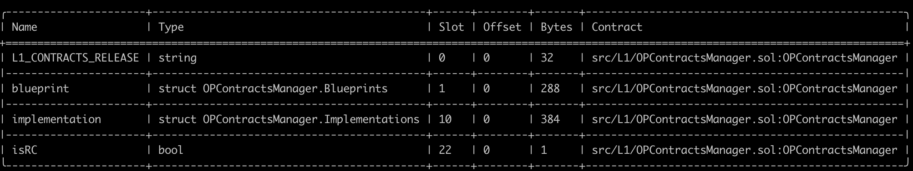
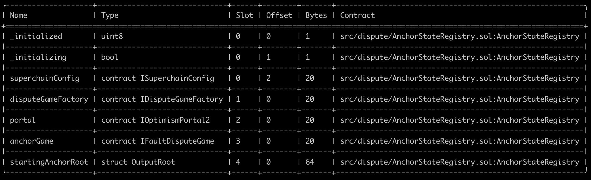

# Validation

This document can be used to validate the inputs and result of the execution of the upgrade transaction which you are
signing.

The steps are:

1. [Validate the Domain and Message Hashes](#expected-domain-and-message-hashes)
2. [Verifying the transaction input](#understanding-task-calldata)
3. [Verifying the state changes](#state-changes)

## Expected Domain and Message Hashes

First, we need to validate the domain and message hashes. These values should match both the values on your ledger and
the values printed to the terminal when you run the task.

> [!CAUTION]
>
> Before signing, ensure the below hashes match what is on your ledger.
>
> ### Child Safe 1: `0xb0c4C487C5cf6d67807Bc2008c66fa7e2cE744EC` (Unichain)
>
> - Domain Hash: `0x4f0b6efb6c01fa7e127a0ff87beefbeb53e056d30d3216c5ac70371b909ca66d`
> - Message Hash: `0x73a11487da1a8b8e840d4540403a34cedecf821ba4a0291efdf2cff6b081bf39`
>
> ### Child Safe 2: `0x847B5c174615B1B7fDF770882256e2D3E95b9D92` (Optimism Foundation)
>
> - Domain Hash: `0xa4a9c312badf3fcaa05eafe5dc9bee8bd9316c78ee8b0bebe3115bb21b732672`
> - Message Hash: `0x501e6580b47e5208c14734ecd591ec0e4e5400469f1d61dc16e42a7c93a1fdeb`
>
> ### Child Safe 3: `0xc2819DC788505Aac350142A7A707BF9D03E3Bd03` (Security Council)
>
> - Domain Hash: `0xdf53d510b56e539b90b369ef08fce3631020fbf921e3136ea5f8747c20bce967`
> - Message Hash: `0x83b0f4356d9af6917ed0ef821b7ccbb4ed4b05f1d066b8926f46fb303bdf7d48`


## Understanding Task Calldata

This document provides a detailed analysis of the final calldata executed on-chain for the OPCM upgrade to v2.0.0.

By reconstructing the calldata, we can confirm that the execution precisely implements the approved upgrade plan with no unexpected modifications or side effects.

### Inputs to `opcm.upgrade()`

For each chain being upgrade, the `opcm.upgrade()` function is called with a tuple of three elements:

1. Unichain Mainnet:
    - SystemConfigProxy: [0xc407398d063f942feBbcC6F80a156b47F3f1BDA6](https://github.com/ethereum-optimism/superchain-registry/blob/d4bb112dc979fd43ac92252c549d3ed7c4d0eb57/superchain/configs/mainnet/unichain.toml#L58)
    - ProxyAdmin: [0x3B73Fa8d82f511A3caE17B5a26E4E1a2d5E2f2A4](https://github.com/ethereum-optimism/superchain-registry/blob/d4bb112dc979fd43ac92252c549d3ed7c4d0eb57/superchain/configs/mainnet/unichain.toml#L59)
    - AbsolutePrestate: [0x039facea52b20c605c05efb0a33560a92de7074218998f75bcdf61e8989cb5d9](https://github.com/ethereum-optimism/superchain-registry/blob/934ea2dd22d160e076ebbecb310582049eec071d/validation/standard/standard-prestates.toml#L22)


Thus, the command to encode the calldata is:

```bash
cast calldata 'upgrade((address,address,bytes32)[])' "[(0xc407398d063f942feBbcC6F80a156b47F3f1BDA6, 0x3B73Fa8d82f511A3caE17B5a26E4E1a2d5E2f2A4, 0x039facea52b20c605c05efb0a33560a92de7074218998f75bcdf61e8989cb5d9)]"
```

### Inputs to `Multicall3DelegateCall`

The output from the previous section becomes the `data` in the argument to the `Multicall3DelegateCall.aggregate3()` function.

This function is called with a tuple of three elements:


Call3 struct for Multicall3DelegateCall:
- `target`: [0x026b2F158255Beac46c1E7c6b8BbF29A4b6A7B76](https://github.com/ethereum-optimism/superchain-registry/blob/1a5d7a208cea9b0ea175df1fe71bdc4da7f4c04c/validation/standard/standard-versions-mainnet.toml#L60) - Mainnet OPContractsManager v2.0.0
- `allowFailure`: false
- `callData`: `0xff2dd5a1...` (output from the previous section)

Command to encode:
```bash
cast calldata 'aggregate3((address,bool,bytes)[])' "[(0x026b2F158255Beac46c1E7c6b8BbF29A4b6A7B76,false,0xff2dd5a100000000000000000000000000000000000000000000000000000000000000200000000000000000000000000000000000000000000000000000000000000001000000000000000000000000c407398d063f942febbcc6f80a156b47f3f1bda60000000000000000000000003b73fa8d82f511a3cae17b5a26e4e1a2d5e2f2a4039facea52b20c605c05efb0a33560a92de7074218998f75bcdf61e8989cb5d9)]"
```

The resulting calldata sent from the ProxyAdminOwner safe is thus:

```
0x82ad56cb000000000000000000000000000000000000000000000000000000000000002000000000000000000000000000000000000000000000000000000000000000010000000000000000000000000000000000000000000000000000000000000020000000000000000000000000026b2f158255beac46c1e7c6b8bbf29a4b6a7b760000000000000000000000000000000000000000000000000000000000000000000000000000000000000000000000000000000000000000000000000000006000000000000000000000000000000000000000000000000000000000000000a4ff2dd5a100000000000000000000000000000000000000000000000000000000000000200000000000000000000000000000000000000000000000000000000000000001000000000000000000000000c407398d063f942febbcc6f80a156b47f3f1bda60000000000000000000000003b73fa8d82f511a3cae17b5a26e4e1a2d5e2f2a4039facea52b20c605c05efb0a33560a92de7074218998f75bcdf61e8989cb5d900000000000000000000000000000000000000000000000000000000
```

In mainnet runbooks, this calldata should appear in [Action Plan](https://gov.optimism.io/t/upgrade-proposal-13-opcm-and-incident-response-improvements/9739#p-43725-action-plan-15) section of the Governance proposal.

# State Validations

For each contract listed in the state diff, please verify that no contracts or state changes shown in the Tenderly diff are missing from this document. Additionally, please verify that for each contract:

- The following state changes (and none others) are made to that contract. This validates that no unexpected state
  changes occur.
- All addresses (in section headers and storage values) match the provided name, using the Etherscan and Superchain
  Registry links provided. This validates the bytecode deployed at the addresses contains the correct logic.
- All key values match the semantic meaning provided, which can be validated using the storage layout links provided.

### State Overrides

Note: The changes listed below do not include threshold, nonce and owner mapping overrides. These changes are listed and explained in the [NESTED-VALIDATION.md](../../../../../NESTED-VALIDATION.md) file.

### Task State Changes

<pre>
<code>
----- DecodedStateDiff[0] -----
  Who:               <a href="https://github.com/ethereum-optimism/superchain-registry/blob/1a5d7a208cea9b0ea175df1fe71bdc4da7f4c04c/superchain/configs/mainnet/unichain.toml#L57">0x0bd48f6B86a26D3a217d0Fa6FfE2B491B956A7a2</a>
  Contract:          OptimismPortal2 - Unichain Mainnet
  Chain ID:          130

  Raw Slot:          0x360894a13ba1a3210667c828492db98dca3e2076cc3735a920a3ca505d382bbc
  Raw Old Value:     0x000000000000000000000000e2f826324b2faf99e513d16d266c3f80ae87832b
  Raw New Value:     0x0000000000000000000000002d7e764a0d9919e16983a46595cfa81fc34fa7cd

  Decoded Kind:      address
  Decoded Old Value: <a href="https://github.com/ethereum-optimism/superchain-registry/blob/1a5d7a208cea9b0ea175df1fe71bdc4da7f4c04c/validation/standard/standard-versions-mainnet.toml#L72">0xe2F826324b2faf99E513D16D266c3F80aE87832B</a>
  Decoded New Value: <a href="https://github.com/ethereum-optimism/superchain-registry/blob/1a5d7a208cea9b0ea175df1fe71bdc4da7f4c04c/validation/standard/standard-versions-mainnet.toml#L51">0x2D7e764a0D9919e16983a46595CfA81fc34fa7Cd</a>
  Summary:           ERC-1967 implementation slot
  Detail:            Standard slot for storing the implementation address in a proxy contract that follows the ERC-1967 standard.
                     OptimismPortal contract for 'op-contracts/v2.0.0-rc.1'.

----- DecodedStateDiff[1] -----
  Who:               <a href="https://github.com/ethereum-optimism/superchain-registry/blob/1a5d7a208cea9b0ea175df1fe71bdc4da7f4c04c/superchain/configs/mainnet/unichain.toml#L63">0x2F12d621a16e2d3285929C9996f478508951dFe4</a>
  Contract:          DisputeGameFactory - Unichain Mainnet
  Chain ID:          130

  Raw Slot:          0x360894a13ba1a3210667c828492db98dca3e2076cc3735a920a3ca505d382bbc
  Raw Old Value:     0x000000000000000000000000c641a33cab81c559f2bd4b21ea34c290e2440c2b
  Raw New Value:     0x0000000000000000000000004bba758f006ef09402ef31724203f316ab74e4a0

  Decoded Kind:      address
  Decoded Old Value: <a href="https://github.com/ethereum-optimism/superchain-registry/blob/1a5d7a208cea9b0ea175df1fe71bdc4da7f4c04c/validation/standard/standard-versions-mainnet.toml#L75">0xc641A33cab81C559F2bd4b21EA34C290E2440C2B</a>
  Decoded New Value: <a href="https://github.com/ethereum-optimism/superchain-registry/blob/1a5d7a208cea9b0ea175df1fe71bdc4da7f4c04c/validation/standard/standard-versions-mainnet.toml#L54">0x4bbA758F006Ef09402eF31724203F316ab74e4a0</a>
  Summary:           ERC-1967 implementation slot
  Detail:            Standard slot for storing the implementation address in a proxy contract that follows the ERC-1967 standard.
                     DisputeGameFactory contract for 'op-contracts/v2.0.0-rc.1'.

----- DecodedStateDiff[2] -----
  Who:               <a href="https://github.com/ethereum-optimism/superchain-registry/blob/1a5d7a208cea9b0ea175df1fe71bdc4da7f4c04c/superchain/configs/mainnet/unichain.toml#L63">0x2F12d621a16e2d3285929C9996f478508951dFe4</a>
  Contract:          DisputeGameFactory - Unichain Mainnet
  Chain ID:          130

  Raw Slot:          0x4d5a9bd2e41301728d41c8e705190becb4e74abe869f75bdb405b63716a35f9e
  Raw Old Value:     0x000000000000000000000000c457172937ffa9306099ec4f2317903254bf7223
  Raw New Value:     0x0000000000000000000000005fe2becc3dec340d3df04351db8e728cbe4c7450
  [WARN] Slot was not decoded

  Summary:           Update Permissioned GameType implementation.
  Detail:            This is gameImpls[1] -> 0x5FE2BECc3dec340d3df04351DB8E728CbE4c7450
                       Verify that the old implementation is set in this slot using:
                        - <i>cast call 0x2F12d621a16e2d3285929C9996f478508951dFe4 "gameImpls(uint32)(address)" 1 --rpc-url mainnet</i>
                        - <i>cast storage 0x2F12d621a16e2d3285929C9996f478508951dFe4 0x4d5a9bd2e41301728d41c8e705190becb4e74abe869f75bdb405b63716a35f9e --rpc-url mainnet</i>
                       The Raw Slot can be derived from:
                        - <i>cast index uint32 1 101</i>

----- DecodedStateDiff[3] -----
  Who:               <a href="https://github.com/ethereum-optimism/superchain-registry/blob/1a5d7a208cea9b0ea175df1fe71bdc4da7f4c04c/superchain/configs/mainnet/unichain.toml#L63">0x2F12d621a16e2d3285929C9996f478508951dFe4</a>
  Contract:          DisputeGameFactory
  Chain ID:          130
  Raw Slot:          0xffdfc1249c027f9191656349feb0761381bb32c9f557e01f419fd08754bf5a1b
  Raw Old Value:     0x00000000000000000000000008f0f8f4e792d21e16289db7a80759323c446f61
  Raw New Value:     0x000000000000000000000000d2c3c6f4a4c5aa777bd6c476aea58439db0dd844

  Summary:           Updated CANNON GameType implementation.
  Detail:            This is gameImpls[0] -> 0xd2C3C6f4A4c5AA777bD6c476AEa58439Db0dD844 where '0' is the <a href="https://github.com/ethereum-optimism/optimism/blob/op-contracts/v1.4.0/packages/contracts-bedrock/src/dispute/lib/Types.sol#L28">CANNON game type</a>.
                     Verify that the old implementation is set in this slot using:
                      - <i>cast call 0x2F12d621a16e2d3285929C9996f478508951dFe4 "gameImpls(uint32)(address)" 0 --rpc-url mainnet</i>
                      - <i>cast storage 0x2F12d621a16e2d3285929C9996f478508951dFe4 0xffdfc1249c027f9191656349feb0761381bb32c9f557e01f419fd08754bf5a1b --rpc-url mainnet</i>
                     The Raw Slot can be derived from:
                      - <i>cast index uint32 0 101</i>

----- DecodedStateDiff[4] -----
  Who:               <a href="https://github.com/ethereum-optimism/superchain-registry/blob/1a5d7a208cea9b0ea175df1fe71bdc4da7f4c04c/superchain/configs/mainnet/unichain.toml#L44">0x6d5B183F538ABB8572F5cD17109c617b994D5833</a>
  Contract:          ProxyAdminOwner (GnosisSafe) - Unichain Mainnet
  Chain ID:          130

  Raw Slot:          0x0000000000000000000000000000000000000000000000000000000000000005
  Raw Old Value:     0x0000000000000000000000000000000000000000000000000000000000000002
  Raw New Value:     0x0000000000000000000000000000000000000000000000000000000000000003

  Decoded Kind:      uint256
  Decoded Old Value: 2
  Decoded New Value: 3

  Summary:           nonce
  Detail:            The nonce of the ProxyAdminOwner contract is updated.
                     Additionally, you may observe another state change here that (e.g. 'Nonce 1 -> 4').
                     This is a state nonce increment, similar to the accounts listed at the bottom of the Tenderly State Diff page. We believe it results from an error in how Tenderly implements CREATE2, this nonce change does not occur in testing against an anvil node.
                     We have raised this as an issue with the Tenderly team.

----- TENDERLY ONLY STATE DIFF -----
  Who:               <a href="https://github.com/ethereum-optimism/superchain-registry/blob/1a5d7a208cea9b0ea175df1fe71bdc4da7f4c04c/superchain/configs/mainnet/unichain.toml#L44">0x6d5B183F538ABB8572F5cD17109c617b994D5833</a>
  Contract:          ProxyAdminOwner (GnosisSafe) - Unichain Testnet
  Chain ID:          130

  Raw Slot:          0xce6141c40dff5106ebf1cf7732087b8dca92b1aed8c1f44a3cb0d1dc62024977
  Raw Old Value:     0x0000000000000000000000000000000000000000000000000000000000000000
  Raw New Value:     0x0000000000000000000000000000000000000000000000000000000000000001

  Summary:           <i>approveHash(bytes32)</i> called on ProxyAdminOwner by child multisig.
  Detail:            As part of the Tenderly simulation, we want to illustrate the <i>approveHash</i> invocation.
                     This step isn't shown in the local simulation because the parent multisig is invoked directly,
                     bypassing the <i>approveHash</i> calls.
                     This slot change reflects an update to the approvedHashes mapping.
                     Specifically, this simulation was ran as the nested safe <i>0xb0c4c487c5cf6d67807bc2008c66fa7e2ce744ec</i>.
                      - <i>res=$(cast index address 0xb0c4c487c5cf6d67807bc2008c66fa7e2ce744ec 8)</i>
                      - <i>cast index bytes32 0xbc83ab0dad212b9ca5faa0ba5658e9f8a7523f575dba8e0c0486c2d06af033db $res</i>
                     Alternatively, the 'Raw Slot' value can be different if we run as <i>0x847B5c174615B1B7fDF770882256e2D3E95b9D92</i>:
                      - <i>res=$(cast index address 0x847B5c174615B1B7fDF770882256e2D3E95b9D92 8)</i>
                      - <i>cast index bytes32 0xbc83ab0dad212b9ca5faa0ba5658e9f8a7523f575dba8e0c0486c2d06af033db $res</i>
                      - Alternative 'Raw Slot': <i>0x62ca13b93a2c45b3219cfcdbbdb5b550d27b358eab61e476b375540c1c92c949</i>
                     Or if we run as <i>0xc2819DC788505Aac350142A7A707BF9D03E3Bd03</i>.
                      - <i>res=$(cast index address 0xc2819DC788505Aac350142A7A707BF9D03E3Bd03 8)</i>
                      - <i>cast index bytes32 0xbc83ab0dad212b9ca5faa0ba5658e9f8a7523f575dba8e0c0486c2d06af033db $res</i>
                      - Alternative 'Raw Slot': <i>0x52ae8914197b131df3798d231a9ba1ab02adf66da792b6f3a826e88e5c54ecd5</i>

----- DecodedStateDiff[5] -----
  Who:               <a href="https://github.com/ethereum-optimism/superchain-registry/blob/1a5d7a208cea9b0ea175df1fe71bdc4da7f4c04c/superchain/configs/mainnet/unichain.toml#L52">0x8098F676033A377b9Defe302e9fE6877cD63D575</a>
  Contract:          AddressManager - Unichain Mainnet
  Chain ID:          130

  Raw Slot:          0x515216935740e67dfdda5cf8e248ea32b3277787818ab59153061ac875c9385e
  Raw Old Value:     0x000000000000000000000000d3494713a5cfad3f5359379dfa074e2ac8c6fd65
  Raw New Value:     0x0000000000000000000000003ea6084748ed1b2a9b5d4426181f1ad8c93f6231

  Summary:           The name `OVM_L1CrossDomainMessenger` is set to the address of the new 'op-contracts/v2.0.0-rc.1' L1CrossDomainMessenger at <a href="https://github.com/ethereum-optimism/superchain-registry/blob/1a5d7a208cea9b0ea175df1fe71bdc4da7f4c04c/validation/standard/standard-versions-mainnet.toml#L56">0x3eA6084748ED1b2A9B5D4426181F1ad8C93F6231</a>.
  Detail:            This key is complicated to compute, so instead we attest to correctness of the key by
                     verifying that the "Before" value currently exists in that slot, as explained below.
                     <b>Before</b> address matches both of the following cast calls:
                      1. What is returned by calling `AddressManager.getAddress()`:
                       - <i>cast call 0x8098F676033A377b9Defe302e9fE6877cD63D575 'getAddress(string)(address)' 'OVM_L1CrossDomainMessenger' --rpc-url mainnet</i>
                      2. What is currently stored at the key:
                       - <i>cast storage 0x8098F676033A377b9Defe302e9fE6877cD63D575 0x515216935740e67dfdda5cf8e248ea32b3277787818ab59153061ac875c9385e --rpc-url mainnet</i>

----- DecodedStateDiff[6] -----
  Who:               <a href="https://github.com/ethereum-optimism/superchain-registry/blob/1a5d7a208cea9b0ea175df1fe71bdc4da7f4c04c/superchain/configs/mainnet/unichain.toml#L55">0x81014F44b0a345033bB2b3B21C7a1A308B35fEeA</a>
  Contract:          L1StandardBridge - Unichain Mainnet
  Chain ID:          130

  Raw Slot:          0x360894a13ba1a3210667c828492db98dca3e2076cc3735a920a3ca505d382bbc
  Raw Old Value:     0x00000000000000000000000064b5a5ed26dcb17370ff4d33a8d503f0fbd06cff
  Raw New Value:     0x00000000000000000000000078972e88ab8bbb517a36caea23b931bab58ad3c6

  Decoded Kind:      address
  Decoded Old Value: <a href="https://github.com/ethereum-optimism/superchain-registry/blob/1a5d7a208cea9b0ea175df1fe71bdc4da7f4c04c/validation/standard/standard-versions-mainnet.toml#L79">0x64B5a5Ed26DCb17370Ff4d33a8D503f0fbD06CfF</a>
  Decoded New Value: <a href="https://github.com/ethereum-optimism/superchain-registry/blob/1a5d7a208cea9b0ea175df1fe71bdc4da7f4c04c/validation/standard/standard-versions-mainnet.toml#L58">0x78972E88Ab8BBB517a36cAea23b931BAB58AD3c6</a>

  Summary:           ERC-1967 implementation slot
  Detail:            Standard slot for storing the implementation address in a proxy contract that follows the ERC-1967 standard.
                     L1StandardBridge contract for 'op-contracts/v2.0.0-rc.1'.

----- DecodedStateDiff[7] -----
  Who:               0x84B268A4101A8c8e3CcB33004F81eD08202bA124
  Contract:          DelayedWETH - Unichain Mainnet (Permissioned)
  Chain ID:          130

  Raw Slot:          0x360894a13ba1a3210667c828492db98dca3e2076cc3735a920a3ca505d382bbc
  Raw Old Value:     0x00000000000000000000000071e966ae981d1ce531a7b6d23dc0f27b38409087
  Raw New Value:     0x0000000000000000000000005e40b9231b86984b5150507046e354dbfbed3d9e

  Decoded Kind:      address
  Decoded Old Value: 0x71e966Ae981d1ce531a7b6d23DC0f27B38409087
  Decoded New Value: 0x5e40B9231B86984b5150507046e354dbFbeD3d9e

  Summary:           ERC-1967 implementation slot
  Detail:            Standard slot for storing the implementation address in a proxy contract that follows the ERC-1967 standard.
                     Using Unichain Mainnet's <a href="https://github.com/ethereum-optimism/superchain-registry/blob/1a5d7a208cea9b0ea175df1fe71bdc4da7f4c04c/superchain/configs/mainnet/unichain.toml#L63">DisputeGameFactory</a>, we can find this DelayedWETH address:
                      - <i>cast call 0x2F12d621a16e2d3285929C9996f478508951dFe4 "gameImpls(uint32)(address)" 0 --rpc-url mainnet</i>
                      - <i>cast call 0xC457172937fFa9306099ec4F2317903254Bf7223 "weth()(address)" --rpc-url mainnet</i>
                        returns <b>0x84B268A4101A8c8e3CcB33004F81eD08202bA124</b>

----- TENDERLY ONLY STATE DIFF -----
  Who:              0x9343c452dec3251fe99D9Fd29b74c5b9CD1751a6
  Contract:         LivenessGuard
  Chain ID:          130

  Summary:          LivenessGuard timestamp update.
  Detail:           When a Unichain Operation Safe executes a transaction, the liveness timestamps are updated for each owner that signed the task.
                    This is updating at the moment when the transaction is submitted (`block.timestamp`) into the [`lastLive`](https://github.com/ethereum-optimism/optimism/blob/e84868c27776fd04dc77e95176d55c8f6b1cc9a3/packages/contracts-bedrock/src/safe/LivenessGuard.sol#L41) mapping located at the slot 0.
                    Liveness Guard Address:
                     - Liveness Unichain Operation Safe <a href="https://etherscan.io/address/0x9343c452dec3251fe99D9Fd29b74c5b9CD1751a6">0x9343c452dec3251fe99D9Fd29b74c5b9CD1751a6</a>

----- DecodedStateDiff[8] -----
  Who:               <a href="https://github.com/ethereum-optimism/superchain-registry/blob/1a5d7a208cea9b0ea175df1fe71bdc4da7f4c04c/superchain/configs/mainnet/unichain.toml#L56">0xA2B597EaeAcb6F627e088cbEaD319e934ED5edad</a>
  Contract:          OptimismMintableERC20Factory - Unichain Mainnet
  Chain ID:          130

  Raw Slot:          0x360894a13ba1a3210667c828492db98dca3e2076cc3735a920a3ca505d382bbc
  Raw Old Value:     0x000000000000000000000000e01efbeb1089d1d1db9c6c8b135c934c0734c846
  Raw New Value:     0x0000000000000000000000005493f4677a186f64805fe7317d6993ba4863988f

  Decoded Kind:      address
  Decoded Old Value: <a href="https://github.com/ethereum-optimism/superchain-registry/blob/1a5d7a208cea9b0ea175df1fe71bdc4da7f4c04c/validation/standard/standard-versions-mainnet.toml#L81">0xE01efbeb1089D1d1dB9c6c8b135C934C0734c846</a>
  Decoded New Value: <a href="https://github.com/ethereum-optimism/superchain-registry/blob/1a5d7a208cea9b0ea175df1fe71bdc4da7f4c04c/validation/standard/standard-versions-mainnet.toml#L59">0x5493f4677A186f64805fe7317D6993ba4863988F</a>

  Summary:           ERC-1967 implementation slot
  Detail:            Standard slot for storing the implementation address in a proxy contract that follows the ERC-1967 standard.
                     OptimismMintableERC20Factory contract for 'op-contracts/v2.0.0-rc.1'.

----- TENDERLY ONLY STATE DIFF -----
  Who:               0xb0c4C487C5cf6d67807Bc2008c66fa7e2cE744EC
  Contract:          Child Safe 1 - Unichain Mainnet
  Chain ID:          130

  Raw Slot:          0x0000000000000000000000000000000000000000000000000000000000000005
  Raw Old Value:     0x0000000000000000000000000000000000000000000000000000000000000008
  Raw New Value:     0x0000000000000000000000000000000000000000000000000000000000000009

  Decoded Kind:      uint256
  Decoded Old Value: 8
  Decoded New Value: 9

  Summary:           nonce
  Detail:            The nonce of the Child Safe 1 contract is updated.
                     Alternatively, the 'Who' address can be different if we run as <i>0x847B5c174615B1B7fDF770882256e2D3E95b9D92</i> or <i>0xc2819DC788505Aac350142A7A707BF9D03E3Bd03</i>.

----- DecodedStateDiff[9] -----
  Who:               <a href="https://github.com/ethereum-optimism/superchain-registry/blob/1a5d7a208cea9b0ea175df1fe71bdc4da7f4c04c/superchain/configs/mainnet/unichain.toml#L58">0xc407398d063f942feBbcC6F80a156b47F3f1BDA6</a>
  Contract:          SystemConfig - Unichain Mainnet
  Chain ID:          130

  Raw Slot:          0x360894a13ba1a3210667c828492db98dca3e2076cc3735a920a3ca505d382bbc
  Raw Old Value:     0x000000000000000000000000ab9d6cb7a427c0765163a7f45bb91cafe5f2d375
  Raw New Value:     0x000000000000000000000000760c48c62a85045a6b69f07f4a9f22868659cbcc

  Decoded Kind:      address
  Decoded Old Value: <a href="https://github.com/ethereum-optimism/superchain-registry/blob/1a5d7a208cea9b0ea175df1fe71bdc4da7f4c04c/validation/standard/standard-versions-mainnet.toml#L67">0xAB9d6cB7A427c0765163A7f45BB91cAfe5f2D375</a>
  Decoded New Value: <a href="https://github.com/ethereum-optimism/superchain-registry/blob/1a5d7a208cea9b0ea175df1fe71bdc4da7f4c04c/validation/standard/standard-versions-mainnet.toml#L47">0x760C48C62A85045A6B69f07F4a9f22868659CbCc</a>

  Summary:           ERC-1967 implementation slot
  Detail:            Standard slot for storing the implementation address in a proxy contract that follows the ERC-1967 standard.
                     SystemConfig contract for 'op-contracts/v2.0.0-rc.1'.

----- DecodedStateDiff[10] -----
  Who:               0xc9edb4E340f4E9683B4557bD9db8f9d932177C86
  Contract:          DelayedWETH - Unichain Mainnet (Permissionless)
  Chain ID:          130

  Raw Slot:          0x360894a13ba1a3210667c828492db98dca3e2076cc3735a920a3ca505d382bbc
  Raw Old Value:     0x00000000000000000000000071e966ae981d1ce531a7b6d23dc0f27b38409087
  Raw New Value:     0x0000000000000000000000005e40b9231b86984b5150507046e354dbfbed3d9e

  Decoded Kind:      address
  Decoded Old Value: <a href="https://github.com/ethereum-optimism/superchain-registry/blob/1a5d7a208cea9b0ea175df1fe71bdc4da7f4c04c/validation/standard/standard-versions-mainnet.toml#L74">0x71e966Ae981d1ce531a7b6d23DC0f27B38409087</a>
  Decoded New Value: <a href="https://github.com/ethereum-optimism/superchain-registry/blob/c1bcf3601dfdf72f0fd4f5bade180b9c0f94d93b/validation/standard/standard-versions-mainnet.toml#L33">0x5e40B9231B86984b5150507046e354dbFbeD3d9e</a>

  Summary:           ERC-1967 implementation slot
  Detail:            Standard slot for storing the implementation address in a proxy contract that follows the ERC-1967 standard.
                     Using Unichain Mainnet's <a href="https://github.com/ethereum-optimism/superchain-registry/blob/1a5d7a208cea9b0ea175df1fe71bdc4da7f4c04c/superchain/configs/mainnet/unichain.toml#L63">DisputeGameFactory</a>, we can find this DelayedWETH address:
                      - <i>cast call 0x2F12d621a16e2d3285929C9996f478508951dFe4 "gameImpls(uint32)(address)" 0 --rpc-url mainnet</i>
                      - <i>cast call 0x08f0F8F4E792d21E16289dB7a80759323C446F61 "weth()(address)" --rpc-url mainnet</i>
                        returns <b>0xc9edb4E340f4E9683B4557bD9db8f9d932177C86</b>

----- DecodedStateDiff[11] -----
  Who:               <a href="https://github.com/ethereum-optimism/superchain-registry/blob/1a5d7a208cea9b0ea175df1fe71bdc4da7f4c04c/superchain/configs/mainnet/unichain.toml#L54">0xD04D0D87E0bd4D2E50286760a3EF323FeA6849Cf</a>
  Contract:          L1ERC721Bridge - Unichain Mainnet
  Chain ID:          130

  Raw Slot:          0x360894a13ba1a3210667c828492db98dca3e2076cc3735a920a3ca505d382bbc
  Raw Old Value:     0x000000000000000000000000ae2af01232a6c4a4d3012c5ec5b1b35059caf10d
  Raw New Value:     0x000000000000000000000000276d3730f219f7ec22274f7263180b8452b46d47

  Decoded Kind:      address
  Decoded Old Value: <a href="https://github.com/ethereum-optimism/superchain-registry/blob/1a5d7a208cea9b0ea175df1fe71bdc4da7f4c04c/validation/standard/standard-versions-mainnet.toml#L78">0xAE2AF01232a6c4a4d3012C5eC5b1b35059caF10d</a>
  Decoded New Value: <a href="https://github.com/ethereum-optimism/superchain-registry/blob/1a5d7a208cea9b0ea175df1fe71bdc4da7f4c04c/validation/standard/standard-versions-mainnet.toml#L57">0x276d3730f219f7ec22274f7263180b8452B46d47</a>

  Summary:           ERC-1967 implementation slot
  Detail:            Standard slot for storing the implementation address in a proxy contract that follows the ERC-1967 standard.
                     L1ERC721Bridge contract for 'op-contracts/v2.0.0-rc.1'.

----- DecodedStateDiff[12] -----
  Who:               0xD5D0e176be44E61eaB3Cf1FA8153758dF603376f
  Contract:          AnchorStateRegistryProxy - Unichain Mainnet
  Chain ID:          130

  Raw Slot:          0x0000000000000000000000000000000000000000000000000000000000000000
  Raw Old Value:     0x0000000000000000000000000000000000000000000000000000000000000000
  Raw New Value:     0x0000000000000000000095703e0982140d16f8eba6d158fccede42f04a4c0001

  Summary:           Slot 0 is updated to set AnchorStateRegistryProxy address
  Detail:            Please refer to <i>'Figure 0.2'</i> at the end of this report for the storage layout of AnchorStateRegistry.
                     Reading 'Raw New Value' from Right to Left, we have:
                      1. <i>0x01</i> - <i>_initialized</i> flag set to 'true'
                      2. <i>0x00</i> - <i>_initializing</i> flag set to 'false'
                      3. <a href="https://github.com/ethereum-optimism/superchain-registry/blob/1a5d7a208cea9b0ea175df1fe71bdc4da7f4c04c/superchain/configs/mainnet/superchain.toml#L3"><i>0x95703e0982140D16f8ebA6d158FccEde42f04a4C</i><a> - Mainnet SuperchainConfig

----- DecodedStateDiff[13] -----
  Who:               0xD5D0e176be44E61eaB3Cf1FA8153758dF603376f
  Contract:          AnchorStateRegistryProxy - Unichain Mainnet
  Chain ID:          130

  Raw Slot:          0x0000000000000000000000000000000000000000000000000000000000000001
  Raw Old Value:     0x0000000000000000000000000000000000000000000000000000000000000000
  Raw New Value:     0x0000000000000000000000002f12d621a16e2d3285929c9996f478508951dfe4

  Summary:           Slot 1 is updated to set DisputeGameFactoryProxy address
  Detail:            Please refer to <i>'Figure 0.2'</i> at the end of this report for the storage layout of AnchorStateRegistry.
                     <a href="https://github.com/ethereum-optimism/superchain-registry/blob/1a5d7a208cea9b0ea175df1fe71bdc4da7f4c04c/superchain/configs/mainnet/unichain.toml#L63">0x2F12d621a16e2d3285929C9996f478508951dFe4</a> is the DisputeGameFactoryProxy address on Unichain Mainnet.

----- DecodedStateDiff[14] -----
  Who:               0xD5D0e176be44E61eaB3Cf1FA8153758dF603376f
  Contract:          AnchorStateRegistryProxy - Unichain Mainnet
  Chain ID:          130

  Raw Slot:          0x0000000000000000000000000000000000000000000000000000000000000002
  Raw Old Value:     0x0000000000000000000000000000000000000000000000000000000000000000
  Raw New Value:     0x0000000000000000000000000bd48f6b86a26d3a217d0fa6ffe2b491b956a7a2

  Summary:           Slot 2 is updated to set OptimismPortalProxy address
  Detail:            Please refer to <i>'Figure 0.2'</i> at the end of this report for the storage layout of AnchorStateRegistry.
                     <a href="https://github.com/ethereum-optimism/superchain-registry/blob/1a5d7a208cea9b0ea175df1fe71bdc4da7f4c04c/superchain/configs/mainnet/unichain.toml#L57">0x0bd48f6B86a26D3a217d0Fa6FfE2B491B956A7a2</a> is the OptimismPortalProxy address on Unichain Mainnet.

----- DecodedStateDiff[15] -----
  Who:               0xD5D0e176be44E61eaB3Cf1FA8153758dF603376f
  Contract:          AnchorStateRegistryProxy - Unichain Mainnet
  Chain ID:          130

  Raw Slot:          0x0000000000000000000000000000000000000000000000000000000000000004
  Raw Old Value:     0x0000000000000000000000000000000000000000000000000000000000000000
  Raw New Value:     0x8fb2a78d2c1dd020b69ad1ceddea9013c48baca38e03f359cd5786a1fc9c1c4a

  Summary:           Slot 4 updates the <a href="https://github.com/ethereum-optimism/optimism/blob/op-contracts/v2.0.0-rc.1/packages/contracts-bedrock/src/dispute/lib/Types.sol#L44">'root'</a> for the <a href="https://github.com/ethereum-optimism/optimism/blob/op-contracts/v2.0.0-rc.1/packages/contracts-bedrock/src/dispute/AnchorStateRegistry.sol#L42">startingAnchorRoot</a>
  Detail:            Please refer to <i>'Figure 0.2'</i> at the end of this report for the storage layout of AnchorStateRegistry.
                     The 'Raw New Value' for this entry might be different than what is seen in the Tenderly state diff.
                     This is expected because the AnchorStateRegistry is being continually updated.
                     Anyone can call <a href="https://github.com/ethereum-optimism/optimism/blob/op-contracts/v2.0.0-rc.1/packages/contracts-bedrock/src/dispute/AnchorStateRegistry.sol#L239"><i>'setAnchorState(IDisputeGame _game)'</i></a> so it can be updated often if the conditions are right.
                     ATTENTION TASK REVIEWER: It is safe to continue if this state diff is different than what is seen in the Tenderly state diff.

----- DecodedStateDiff[16] -----
  Who:               0xD5D0e176be44E61eaB3Cf1FA8153758dF603376f
  Contract:          AnchorStateRegistryProxy - Unichain Mainnet
  Chain ID:          130

  Raw Slot:          0x0000000000000000000000000000000000000000000000000000000000000005
  Raw Old Value:     0x0000000000000000000000000000000000000000000000000000000000000000
  Raw New Value:     0x0000000000000000000000000000000000000000000000000000000000b56082

  Summary:           Slot 5 updates the <a href="https://github.com/ethereum-optimism/optimism/blob/op-contracts/v2.0.0-rc.1/packages/contracts-bedrock/src/dispute/lib/Types.sol#L44">'l2BlockNumber'</a> for the <a href="https://github.com/ethereum-optimism/optimism/blob/op-contracts/v2.0.0-rc.1/packages/contracts-bedrock/src/dispute/AnchorStateRegistry.sol#L42">startingAnchorRoot</a>
  Detail:            Please refer to <i>'Figure 0.2'</i> at the end of this report for the storage layout of AnchorStateRegistry.
                     The 'Raw New Value' for this entry might be different than what is seen in the Tenderly state diff.
                     This is expected because the AnchorStateRegistry is being continually updated.
                      - <i>cast --to-dec 0x8baa6f</i> -> <i>15684501</i>
                     Anyone can call <a href="https://github.com/ethereum-optimism/optimism/blob/op-contracts/v2.0.0-rc.1/packages/contracts-bedrock/src/dispute/AnchorStateRegistry.sol#L239"><i>'setAnchorState(IDisputeGame _game)'</i></a> so it can be updated often if the conditions are right.
                     ATTENTION TASK REVIEWER: It is safe to continue if this state diff is different than what is seen in the Tenderly state diff.

----- DecodedStateDiff[17] -----
  Who:               0xD5D0e176be44E61eaB3Cf1FA8153758dF603376f
  Contract:          AnchorStateRegistryProxy - Unichain Mainnet
  Chain ID:          130

  Raw Slot:          0x360894a13ba1a3210667c828492db98dca3e2076cc3735a920a3ca505d382bbc
  Raw Old Value:     0x0000000000000000000000000000000000000000000000000000000000000000
  Raw New Value:     0x0000000000000000000000007b465370bb7a333f99edd19599eb7fb1c2d3f8d2

  Decoded Kind:      address
  Decoded Old Value: 0x0000000000000000000000000000000000000000
  Decoded New Value: <a href="https://github.com/ethereum-optimism/superchain-registry/blob/1a5d7a208cea9b0ea175df1fe71bdc4da7f4c04c/validation/standard/standard-versions-mainnet.toml#L52">0x7b465370BB7A333f99edd19599EB7Fb1c2D3F8D2</a>

  Summary:           ERC-1967 implementation slot
  Detail:            Standard slot for storing the implementation address in a proxy contract that follows the ERC-1967 standard.
                     AnchorStateRegistry contract for 'op-contracts/v2.0.0-rc.1'.

----- DecodedStateDiff[18] -----
  Who:               0xD5D0e176be44E61eaB3Cf1FA8153758dF603376f
  Contract:          AnchorStateRegistryProxy - Unichain Mainnet
  Chain ID:          130

  Raw Slot:          0xb53127684a568b3173ae13b9f8a6016e243e63b6e8ee1178d6a717850b5d6103
  Raw Old Value:     0x0000000000000000000000000000000000000000000000000000000000000000
  Raw New Value:     0x0000000000000000000000003b73fa8d82f511a3cae17b5a26e4e1a2d5e2f2a4

  Decoded Kind:      address
  Decoded Old Value: 0x0000000000000000000000000000000000000000
  Decoded New Value: <a href="https://github.com/ethereum-optimism/superchain-registry/blob/1a5d7a208cea9b0ea175df1fe71bdc4da7f4c04c/superchain/configs/mainnet/unichain.toml#L59">0x3B73Fa8d82f511A3caE17B5a26E4E1a2d5E2f2A4</a>

  Summary:           Proxy owner address
  Detail:            Standard slot for storing the owner address in a Proxy contract.
                     The owner in this case is the <a href="https://github.com/ethereum-optimism/superchain-registry/blob/1a5d7a208cea9b0ea175df1fe71bdc4da7f4c04c/superchain/configs/mainnet/unichain.toml#L59">ProxyAdmin</a> of Unichain Mainnet.

----- Additional Nonce Changes -----
  Who:               0x34154426ab842AAAeFda28F3f5d103Dd0b0FE37A, 0x5FE2BECc3dec340d3df04351DB8E728CbE4c7450, 0xd2C3C6f4A4c5AA777bD6c476AEa58439Db0dD844

  Details:           Nonce Updates for all addresses listed above.
  Summary:           All nonces go from 0 to 1.
                      - 0x34154426ab842AAAeFda28F3f5d103Dd0b0FE37A is address(uint160(uint256(keccak256('foundry default caller'))))
                      - 0x5FE2BECc3dec340d3df04351DB8E728CbE4c7450 is Permissioned GameType Implementation as per <a href="https://eip.tools/eip/eip-161.md">EIP-161</a>.
                      - 0xd2C3C6f4A4c5AA777bD6c476AEa58439Db0dD844 is Permissionless GameType Implementation as per <a href="https://eip.tools/eip/eip-161.md">EIP-161</a>.
</pre>

# Supplementary Material

## Figure 0.1: Storage Layout of OPContractsManager



## Figure 0.2: Storage Layout of AnchorStateRegistryProxy


