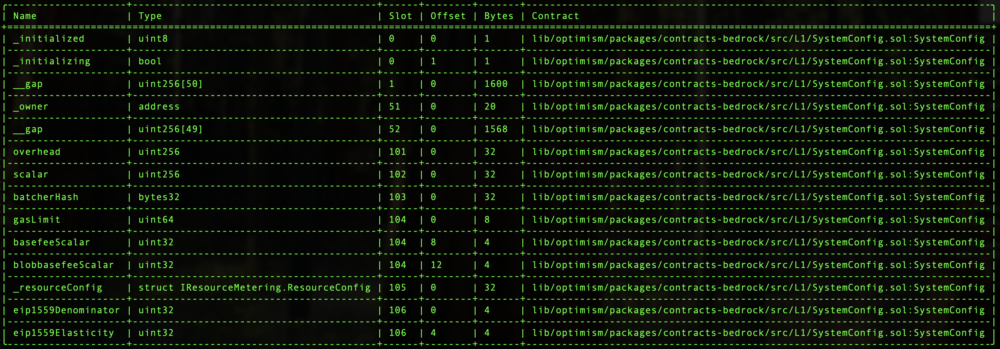

# Validation

This document can be used to validate the inputs and result of the execution of the SystemConfig gas param transactions you are signing.

The steps are:

1. [Validate the Domain and Message Hashes](#expected-domain-and-message-hashes)
2. [Verifying the transaction input](#understanding-task-calldata)
3. [Verifying the state changes](#task-state-changes)

> [!IMPORTANT]
> This is the **P0 contingency** task. It assumes `055-gas-params-op-p0` has already
> executed (onchain gasLimit 80M, eip1559_elasticity 4). The `config.toml` reproduces
> that post-055 state via `SystemConfig` storage overrides so the simulated diff shows
> the only real change (elasticity 4 → 2, doubling the gas target). The Safe nonce
> override (`58`) and hashes reflect that assumption and should be refreshed at signing
> time.

## Expected Domain and Message Hashes

First, we need to validate the domain and message hashes. These values should match both the values on your ledger and
the values printed to the terminal when you run the task.

> [!CAUTION]
>
> Before signing, ensure the below hashes match what is on your ledger.
>
> ### FoundationUpgradeSafe: `0x847B5c174615B1B7fDF770882256e2D3E95b9D92`
>
> - Safe Transaction Hash: `0x79d006154b88901ab70bf90f451dc10a624bb49bbb3fbc70215b3cd461e98d8d`
> - Domain Hash: `0xa4a9c312badf3fcaa05eafe5dc9bee8bd9316c78ee8b0bebe3115bb21b732672`
> - Message Hash: `0x654797816ef0cea3d7b0a7ec3d6c436dcc445edffdf63c48942f74b3aef1de42`

## Understanding Task Calldata

This document provides a detailed analysis of the final calldata executed on-chain for the gas params update for OP Mainnet.

By reconstructing the calldata, we can confirm that the execution precisely implements the approved upgrade plan with no unexpected modifications or side effects.

### Inputs to `SystemConfig.setGasLimit(uint64 _gasLimit)`

This function is called with the following inputs:

- `_gasLimit`: 80_000_000

The onchain gasLimit is already 80M (set by `055-gas-params-op-p0`), so this call is a no-op and produces no state diff on slot `0x68`. We must still provide it because the `SystemConfigGasParams` template always issues both calls.

Command to encode:

```bash
cast calldata "setGasLimit(uint64)" 80000000
```

Resulting calldata:
```
0xb40a817c0000000000000000000000000000000000000000000000000000000004c4b400
```

### Inputs to `SystemConfig.setEIP1559Params(uint32 _denominator, uint32 _elasticity)`

This function is called with the following inputs:

- `_denominator`: 250
- `_elasticity`: 2

We lower `eip1559_elasticity` from 4 back to 2 (denominator 250 is unchanged). With the gasLimit held at 80M, this doubles the gasTarget from 20Mgas/block (10Mgas/s) to 40Mgas/block (20Mgas/s).

Command to encode:

```bash
cast calldata "setEIP1559Params(uint32,uint32)" 250 2
```

Resulting calldata:
```
0xc0fd4b4100000000000000000000000000000000000000000000000000000000000000fa0000000000000000000000000000000000000000000000000000000000000002
```

### Inputs to `Multicall3DelegateCall`

The output from the previous section becomes the `data` in the argument to the `Multicall3DelegateCall.aggregate3Value()` function.

This function is called with a tuple of three elements:

Call3 struct for Multicall3DelegateCall SystemConfig tx_1:

- `target`: [0x229047fed2591dbec1ef1118d64f7af3db9eb290](https://github.com/ethereum-optimism/superchain-registry/blob/main/superchain/configs/mainnet/op.toml#L59) - op-mainnet SystemConfig
- `allowFailure`: false
- `value`: 0
- `callData`: `0xb40a817c0000000000000000000000000000000000000000000000000000000004c4b400` (output from the previous section)

Call3 struct for Multicall3DelegateCall SystemConfig tx_2:

- `target`: [0x229047fed2591dbec1ef1118d64f7af3db9eb290](https://github.com/ethereum-optimism/superchain-registry/blob/main/superchain/configs/mainnet/op.toml#L59) - op-mainnet SystemConfig
- `allowFailure`: false
- `value`: 0
- `callData`: `0xc0fd4b4100000000000000000000000000000000000000000000000000000000000000fa0000000000000000000000000000000000000000000000000000000000000002` (output from the previous section)

Command to encode:

```bash
cast calldata 'aggregate3Value((address,bool,uint256,bytes)[])' "[(0x229047fed2591dbec1ef1118d64f7af3db9eb290,false,0,0xb40a817c0000000000000000000000000000000000000000000000000000000004c4b400),(0x229047fed2591dbec1ef1118d64f7af3db9eb290,false,0,0xc0fd4b4100000000000000000000000000000000000000000000000000000000000000fa0000000000000000000000000000000000000000000000000000000000000002)]"
```

The resulting calldata sent from the `FoundationUpgradesSafe` is thus:
```
0x174dea710000000000000000000000000000000000000000000000000000000000000020000000000000000000000000000000000000000000000000000000000000000200000000000000000000000000000000000000000000000000000000000000400000000000000000000000000000000000000000000000000000000000000120000000000000000000000000229047fed2591dbec1ef1118d64f7af3db9eb2900000000000000000000000000000000000000000000000000000000000000000000000000000000000000000000000000000000000000000000000000000000000000000000000000000000000000000000000000000000000000000000000800000000000000000000000000000000000000000000000000000000000000024b40a817c0000000000000000000000000000000000000000000000000000000004c4b40000000000000000000000000000000000000000000000000000000000000000000000000000000000229047fed2591dbec1ef1118d64f7af3db9eb2900000000000000000000000000000000000000000000000000000000000000000000000000000000000000000000000000000000000000000000000000000000000000000000000000000000000000000000000000000000000000000000000800000000000000000000000000000000000000000000000000000000000000044c0fd4b4100000000000000000000000000000000000000000000000000000000000000fa000000000000000000000000000000000000000000000000000000000000000200000000000000000000000000000000000000000000000000000000
```

# State Validations

## Single Safe State Overrides and Changes

This task is executed by the `FoundationUpgradesSafe`. Refer to the [generic single Safe execution validation document](../../../../../docs/SINGLE-VALIDATION.md)
for the expected state overrides and changes.

Additionally, Safe-related nonces [will increment by one](../../../../../docs/SINGLE-VALIDATION.md#nonce-increments).

### Pre-state overrides (modelling post-055 execution)

In addition to the standard single-Safe overrides, this task's `config.toml` applies the
following `SystemConfig` (`0x229047fed2591dbec1ef1118d64f7af3db9eb290`) overrides so that
simulation reflects the on-chain state after `055-gas-params-op-p0` has executed. At
signing time, if 055 has already executed on-chain these overrides are no-ops; if it has
not, do not sign this task.

- **Key:** `0x...0068` → `0x00000000000000000000000000000000000f79c50000146b0000000004c4b400` (gasLimit 80M, post-055)
- **Key:** `0x...006a` → `0x00000000000000000000000000000000000000000000000000000004000000fa` (eip1559Elasticity 4, denominator 250, post-055)

### Task State Changes

For each contract listed in the state diff, please verify that no contracts or state changes shown in the Tenderly diff are missing from this document. Additionally, please verify that for each contract:

- The following state changes (and none others) are made to that contract. This validates that no unexpected state
  changes occur.
- All addresses (in section headers and storage values) match the provided name, using the Etherscan and Superchain
  Registry links provided. This validates the bytecode deployed at the addresses contains the correct logic.
- All key values match the semantic meaning provided, which can be validated using the storage layout links provided.

  ---

### `0x229047fed2591dbec1ef1118d64f7af3db9eb290`  ([SystemConfig](https://github.com/ethereum-optimism/superchain-registry/blob/main/superchain/configs/mainnet/op.toml#L59)) - Chain ID: 10

- **Key:** `0x000000000000000000000000000000000000000000000000000000000000006a`
  - **Before:** `0x00000000000000000000000000000000000000000000000000000004000000fa`
  - **After:** `0x00000000000000000000000000000000000000000000000000000002000000fa`
  - **Summary:** (`uint32`) eip1559Elasticity change from 4 to 2
  - **Detail:** eip1559Denominator and eip1559Elasticity share this same storage slot
      * Changes eip1559Elasticity from `4` (`0x00000004`) to `2` (`0x00000002`)
      * eip1559Denominator (`0xfa` = 250) is unchanged

Note: slot `0x68` (gasLimit / basefeeScalar / blobbasefeeScalar) is **not** changed by this task. `setGasLimit(80000000)` writes the value already present onchain after 055 (80M), so it produces no state diff on slot `0x68`.

  ---

### `0x847b5c174615b1b7fdf770882256e2d3e95b9d92`  ([SystemConfigOwner](https://github.com/ethereum-optimism/superchain-registry/blob/main/superchain/configs/mainnet/op.toml#L44) (GnosisSafe)) - Chain ID: 10

- **Key:** `0x0000000000000000000000000000000000000000000000000000000000000005`
  - **Decoded Kind:** `uint256`
  - **Before:** `58`
  - **After:** `59`
  - **Summary:** nonce increments from 58 to 59
  - **Detail:** Increments the SystemConfigOwner (FoundationUpgradesSafe) nonce

### Nonce increments

The only other state change are the nonce increments as follows:

- sender-address - Sender address of the Tenderly transaction (Your ledger address).

# Supplementary Material
Figure 1: SystemConfig storage layout

