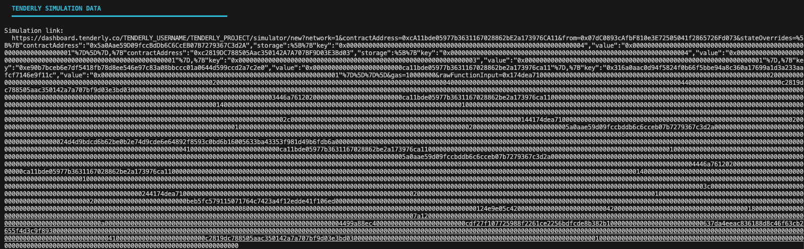
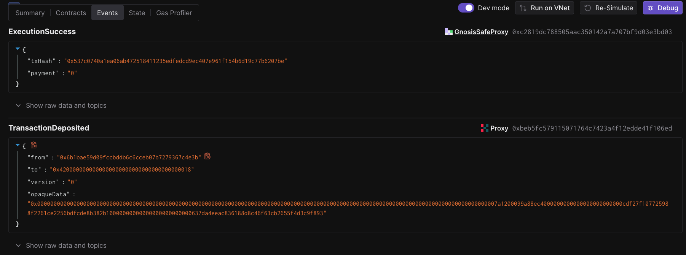
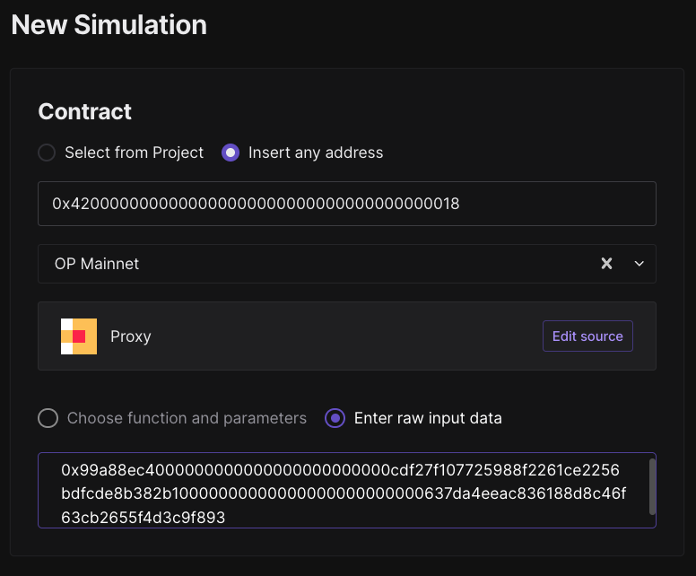
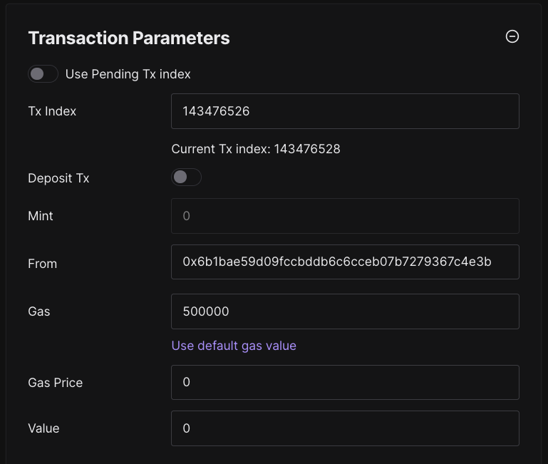
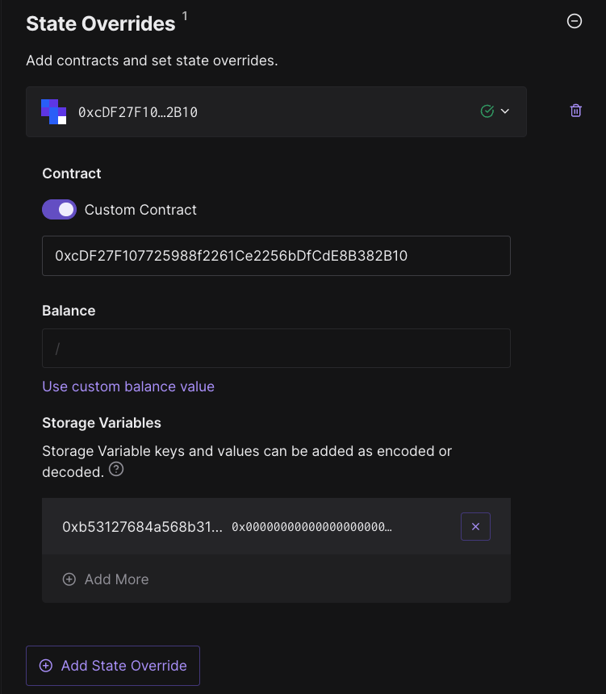
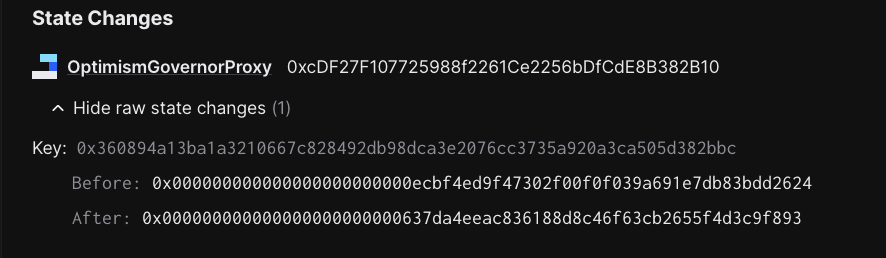

# Simulating a Governor Implementation Upgrade

The following steps describe how to simulate a governor implementation upgrade that originates from an L1 deposit transaction and executes on L2. This guide demonstrates how to manually simulate the upgrade and verify that the implementation changes as expected on L2.

## Prerequisites

- Environment variables set:
  - `ETH_RPC_URL`: Ethereum mainnet RPC endpoint
  - `OP_MAINNET_RPC_URL`: OP Mainnet RPC endpoint

## Steps

1. Simulate the task that executes the governor upgrade via L1 deposit transaction:

   ```bash
   cd src/tasks/eth/rehearsals/2025-11-07-R4-governor-upgrade

   SIMULATE_WITHOUT_LEDGER=1 just --dotenv-path $(pwd)/.env simulate council
   ```

2. In the terminal output, copy the Tenderly link and open it in your browser.
   
3. In Tenderly, open the `Events` tab and look for the `TransactionDeposited` event.
   

   ```json
   {
     "from": "0x6b1bae59d09fccbddb6c6cceb07b7279367c4e3b",
     "to": "0x4200000000000000000000000000000000000018",
     "version": "0",
     "opaqueData": "0x00000000000000000000000000000000000000000000000000000000000000000000000000000000000000000000000000000000000000000000000000000000000000000007a1200099a88ec4000000000000000000000000cdf27f107725988f2261ce2256bdfcde8b382b10000000000000000000000000637da4eeac836188d8c46f63cb2655f4d3c9f893"
   }
   ```

4. Using the data in the `TransactionDeposited` event, create a new Tenderly simulation via this [link](https://dashboard.tenderly.co/TENDERLY_USERNAME/TENDERLY_PROJECT/simulator/new?block=&blockIndex=0&from=0x0000000000000000000000000000000000000000&gas=8000000&gasPrice=0&value=0&contractAddress=&headerBlockNumber=&headerTimestamp=).
5. Insert the `to` address (`0x4200000000000000000000000000000000000018`) as the destination address and select the correct L2 network (OP Mainnet).
6. Next, we need to create the calldata from the `opaqueData` field in the `TransactionDeposited` event. This is going to go into the `Enter raw input data` field. We know this particular transaction is an `upgrade` call to the `L2ProxyAdmin` contract. We can identify the start of the relevant calldata by extracting the function selector:

   ```bash
   cast sig "upgrade(address,address)"
   # returns: 0x99a88ec4
   ```

   Now that we know the function selector, we can extract the calldata from the `opaqueData` field and run the following cast command:

   ```bash
   cast calldata-decode "upgrade(address,address)" 0x99a88ec4000000000000000000000000cdf27f107725988f2261ce2256bdfcde8b382b10000000000000000000000000637da4eeac836188d8c46f63cb2655f4d3c9f893
   # returns: 0xcDF27F107725988f2261Ce2256bDfCdE8B382B10 0x637DA4Eeac836188D8C46F63Cb2655f4d3C9F893
   ```

   We must put

   `0x99a88ec4000000000000000000000000cdf27f107725988f2261ce2256bdfcde8b382b10000000000000000000000000637da4eeac836188d8c46f63cb2655f4d3c9f893`

   in the `Enter raw input data` field.

   

7. Next we need to fill out the `Transaction Parameters` section on the right of the UI. Specifically, fill out the `From` address and `Gas` fields. The `From` address should be the aliased L1 ProxyAdmin owner address (i.e. `0x6b1bae59d09fccbddb6c6cceb07b7279367c4e3b`). The `Gas` field should be set to `500000`. You can get this number by further parsing the opaque data and extracting the gas limit.

   ```bash
   cast --to-dec 0x7a120
   # returns: 500000
   ```

   

8. **CRITICAL STEP - State Overrides**: Before running the simulation, you must add state overrides to simulate the governor proxy admin ownership transfer. Without this, the simulation will fail because the L2 ProxyAdmin won't have permission to upgrade the governor proxy.

   In Tenderly's "State override" section, add the following override:

   - **Custom Contract**: `0xcDF27F107725988f2261Ce2256bDfCdE8B382B10` (Governor Proxy)
   - **Storage Variables**:
     - **Key**: `0xb53127684a568b3173ae13b9f8a6016e243e63b6e8ee1178d6a717850b5d6103` (ERC1967 admin slot)
     - **Value**: `0x0000000000000000000000004200000000000000000000000000000000000018` (L2 ProxyAdmin address)

   

   This override simulates the ownership transfer that must occur before the upgrade, allowing the L2 ProxyAdmin to execute the upgrade transaction.

9. Click `Simulate Transaction` and you should see the transaction succeed.
   
10. Check the `Events` tab to verify that the Governor Proxy emitted an `Upgraded` event with the new implementation address:
    
    Finally, check the `State` tab and ensure the state changes are as expected. Specifically, confirm that:

    The Governor Proxy implementation slot (`0x360894a13ba1a3210667c828492db98dca3e2076cc3735a920a3ca505d382bbc`) now points to the new implementation address (`0x637DA4Eeac836188D8C46F63Cb2655f4d3C9F893`)
    
