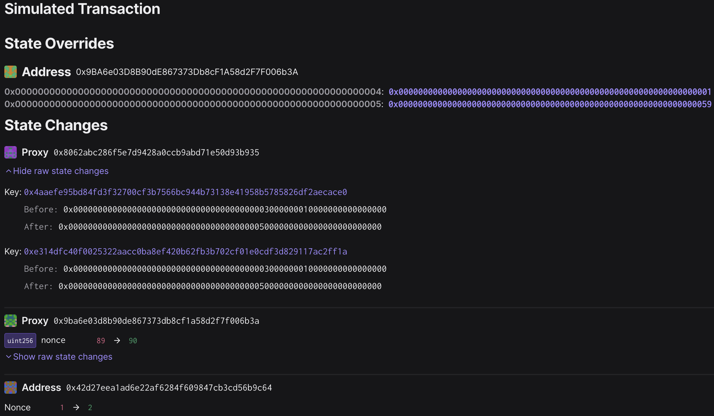

# Mainnet Protocol Versions Update - 5.0.0 (Delta)

Status: READY_TO_SIGN

## Objective

This is the playbook for executing

The proposal was:
- [X] approved by Token House voting here: https://vote.optimism.io/proposals/64861580915106728278960188313654044018229192803489945934331754023009986585740
- [X] not vetoed by the Citizens' house here: https://snapshot.org/#/citizenshouse.eth/proposal/0x6efd678a37dd547f40956fb613047ffc077c234b7723298419ca54f40b8531de


## Objective

This is the playbook for updating the protocol versions of the `ProtocolVersions` contract on Ethereum mainnet to 5.0.0 (Delta final).

Both versions are currently set to 3.1.0 (Regolith), which are the versions set at deployment.

Both are set at the same time in a batch because the time window has passed in which it makes sense to set the recommended
version earlier. This isn't an issue, as both are informative signals.

## Signing and execution

Please see the signing and execution instructions in [SINGLE.md](../../../SINGLE.md).

## Validations

On the "Events" tab, you can verify that two `ConfigUpdate` events were emitted from the `ProtocolVersions` proxy,
as well as an `ExecutionSuccess` event by the multisig.



You can verify the correctness of the storage slots with `chisel`.
Just start it up and enter the slot definitions as found in the contract source code.
```
➜ bytes32(uint256(keccak256("protocolversion.required")) - 1)
Type: bytes32
└ Data: 0x4aaefe95bd84fd3f32700cf3b7566bc944b73138e41958b5785826df2aecace0
➜ bytes32(uint256(keccak256("protocolversion.recommended")) - 1)
Type: bytes32
└ Data: 0xe314dfc40f0025322aacc0ba8ef420b62fb3b702cf01e0cdf3d829117ac2ff1a
```

Alternatively, `cast keccak` can be used.
Call it with the storage slot string identifier, and subtract `1` form the result:
```
cast keccak protocolversion.required
# 0x4aaefe95bd84fd3f32700cf3b7566bc944b73138e41958b5785826df2aecace1

cast keccak protocolversion.recommended
# 0xe314dfc40f0025322aacc0ba8ef420b62fb3b702cf01e0cdf3d829117ac2ff1b
```
