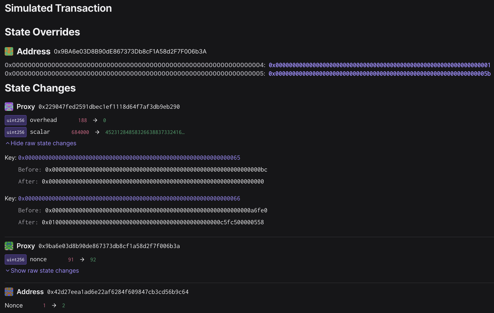

# Mainnet - Ecotone Blobs Gas Configuration

Status: [EXECUTED](https://etherscan.io/tx/0xac827d7a1238dfd6f3cc81dba09f0a3e1d9dc685bcc6b22466d76bb2335db38b)

## Objective

This is the playbook for updating the gas config of the `SystemConfig` to be ready to send
blob batch transactions.

The proposal was:
- [ ] approved by Token House voting here: https://vote.optimism.io/proposals/95119698597711750186734377984697814101707190887694311194110013874163880701970
- [ ] not vetoed by the Citizens' house here: TODO

### New blob fee scalars

The basefee and blob basefee scalars are updated to
* `L1BaseFeeScalar: 1368`
* `BlobBaseFeeScalar: 810949`

These values are optimized for sending 6 blobs per transactions on OP Mainnet
and are the result of running [this chain scalar calculator](https://docs.google.com/spreadsheets/d/12VIiXHaVECG2RUunDSVJpn67IQp9NHFJqUsma2PndpE/edit#gid=186414307)
with the following parameters:
* Transactions per day: 330,000
* Transaction Type : OP Mainnet
* op-batcher Max Channel Duration (hours): 5
* Target Data Margin: 5%

### Timing

The transaction is scheduled for execution a few minutes after Ecotone activates at
`Mar 14 00:00:01 UTC`.
This gas configuration change is necessary to switch the batcher to blob transactions.

## Transaction creation

The [`ecotone-scalar`](https://github.com/ethereum-optimism/optimism/tree/develop/op-chain-ops/cmd/ecotone-scalar)
encoding tool was used to determine the correct transaction input (execute in monorepo):
```
go run ./op-chain-ops/cmd/ecotone-scalar --scalar=1368 --blob-scalar=810949
# base fee scalar     : 1368
# blob base fee scalar: 810949
# v1 hex encoding  : 0x010000000000000000000000000000000000000000000000000c5fc500000558
# uint value for the 'scalar' parameter in SystemConfigProxy.setGasConfig():
452312848583266388373324160190187140051835877600158453279134670530344387928
```
Note the *hex encoding* `0x010000000000000000000000000000000000000000000000000c5fc500000558`.

This encoding follows the [spec change for Ecotone fee scalars](https://github.com/ethereum-optimism/specs/blob/11099e9908bb7bfa640d73b2a3a2349bef9ab7a1/specs/protocol/system_config.md#scalars).
Notably, in version 1 of the scalar encoding format, the `overhead` is set to 0 and the old `scalar` field
now encodes the _base fee scalar_ as well as the _blob base fee scalar_ in a packed format.
The first byte of the `scalar` field denotes the version `0x01`.

The transaction was created in the root directory with

```
just add-transaction tasks/eth/005-2-ecotone-set-gas-config/input.json 0x229047fed2591dbec1eF1118d64F7aF3dB9EB290 'setGasConfig(uint256,uint256)' 0 0x010000000000000000000000000000000000000000000000000c5fc500000558
```

## Signing and execution

Please see the signing and execution instructions in [SINGLE.md](../../../SINGLE.md).

## Validations

### State

On the "State" tab, you can verify that the following two state changes occured on the `SystemConfigProxy` at `0x229047fed2591dbec1ef1118d64f7af3db9eb290`:

* `overhead` (key `0x65`) changed from `0xbc = 188` to `0`
* `scalar` (key `0x66`) changed
  * from `0x00000000000000000000000000000000000000000000000000000000000a6fe0 = 684000`
  * to `0x010000000000000000000000000000000000000000000000000c5fc500000558`

The validity of the scalar hex value can be verified by running the `ecotone-scalar` command with the desired values,
as shown above in section [Transaction creation](#transaction-creation).

The other two state changes are nonce increases by the multisig Proxy at `0x9ba6e03d8b90de867373db8cf1a58d2f7f006b3a`
and the sender account.



### Events

On the "Events" tab, you can verify that one `ConfigUpdate` event was emitted from the `SystemConfigProxy`,
of `updateType = 1` and `data` containing the packed `overhead` and `scalar` values.
The multisig proxy emits an `ExecutionSuccess` event.
