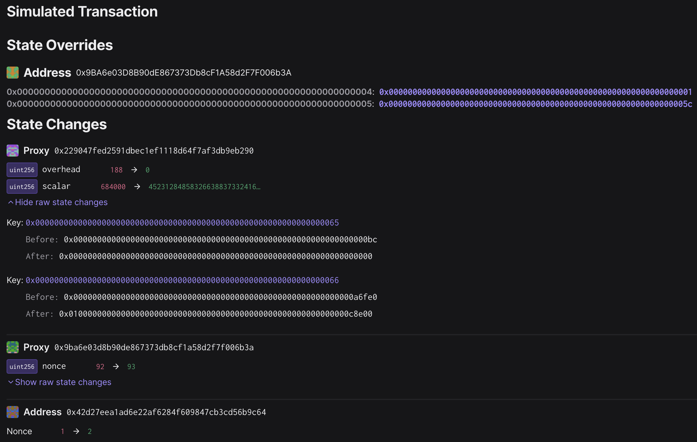

# Mainnet - Ecotone Calldata Gas Configuration - Contingency

Status: CANCELLED

## Objective

This is the playbook for an emergency update of the gas config of the `SystemConfig` to go back to calldata values
after the gas scalar config got configured for blob batch transactions (task `005-2`).
This will only be executed in the highly unlikely emergency that we need to quickly switch batch sending
back to calldata.
For this reason, the nonce in `.env` is also one higher (92) than for task `005-2` (91).

The proposal was:
- [x] approved by Token House voting here: https://vote.optimism.io/proposals/95119698597711750186734377984697814101707190887694311194110013874163880701970
- [ ] not vetoed by the Citizens' house here: TODO

### Calldata fee scalars

The basefee and blob basefee scalars are updated to
* `L1BaseFeeScalar: 822784`
* `BlobBaseFeeScalar: 0`

These values are optimized for sending calldata-only batches on OP Mainnet
and are the result of running [this chain scalar calculator](https://docs.google.com/spreadsheets/d/12VIiXHaVECG2RUunDSVJpn67IQp9NHFJqUsma2PndpE/edit#gid=186414307)
with the following parameters:
* Transactions per day: 330,000
* Transaction Type : OP Mainnet
* op-batcher Max Channel Duration (hours): 5
* Target Data Margin: 5%

and then looking at the "Calldata" case in the "Detailed Results by Construction" section.

### Timing

The transaction would only be executed in an emergency situation after `005-2` got executed and we switched to
blob batches, but realize that we need to go back to calldata batches.
Ecotone mainnet activation is scheduled for `Mar 14 00:00:01 UTC`, so this transaction needs to be ready for potential execution in the hour following the activation.

## Transaction creation

The [`ecotone-scalar`](https://github.com/ethereum-optimism/optimism/tree/develop/op-chain-ops/cmd/ecotone-scalar)
encoding tool was used to determine the correct transaction input (execute in monorepo):
```
go run ./op-chain-ops/cmd/ecotone-scalar --scalar=822784 --blob-scalar=0
# base fee scalar     : 822784
# blob base fee scalar: 0
# v1 hex encoding  : 0x01000000000000000000000000000000000000000000000000000000000c8e00
# uint value for the 'scalar' parameter in SystemConfigProxy.setGasConfig():
452312848583266388373324160190187140051835877600158453279131187530911485440
```
Note the *hex encoding* `0x01000000000000000000000000000000000000000000000000000000000c8e00`.

This encoding follows the [spec change for Ecotone fee scalars](https://github.com/ethereum-optimism/specs/blob/11099e9908bb7bfa640d73b2a3a2349bef9ab7a1/specs/protocol/system_config.md#scalars).
Notably, in version 1 of the scalar encoding format, the `overhead` is set to 0 and the old `scalar` field
now encodes the _base fee scalar_ as well as the _blob base fee scalar_ in a packed format.
The first byte of the `scalar` field denotes the version `0x01`.

The transaction was created in the root directory with

```
just add-transaction tasks/eth/005-3-ecotone-calldata-gas-config/input.json 0x229047fed2591dbec1eF1118d64F7aF3dB9EB290 'setGasConfig(uint256,uint256)' 0 0x01000000000000000000000000000000000000000000000000000000000c8e00
```

## Signing and execution

Please see the signing and execution instructions in [SINGLE.md](../../../SINGLE.md).

## Validations

### State

On the "State" tab, you can verify that the following two state changes occured on the `SystemConfigProxy` at `0x229047fed2591dbec1ef1118d64f7af3db9eb290`:

* `overhead` (key `0x65`) changed from `0xbc = 188` to `0`.
  This state diff will only be there before execution of task `005-2`, which itself sets this to `0` already.
* `scalar` (key `0x66`) changed
  * from `0x00000000000000000000000000000000000000000000000000000000000a6fe0 = 684000` (before execution of task `005-2`)
  * from `0x010000000000000000000000000000000000000000000000000c5fc500000558` (after execution of task `005-2`)
  * to `0x01000000000000000000000000000000000000000000000000000000000c8e00`

The validity of the scalar hex value can be verified by running the `ecotone-scalar` command with the desired values,
as shown above in section [Transaction creation](#transaction-creation).

The other two state changes are nonce increases by the multisig Proxy at `0x9ba6e03d8b90de867373db8cf1a58d2f7f006b3a`
and the sender account.



Note that this transaction needs to be signed before task 005-2 can be executed, but it will run on top of task 005-2,
so the diff at execution time will be different.

### Events

On the "Events" tab, you can verify that one `ConfigUpdate` event was emitted from the `SystemConfigProxy`,
of `updateType = 1` and `data` containing the packed `overhead` and `scalar` values.
The multisig proxy emits an `ExecutionSuccess` event.
