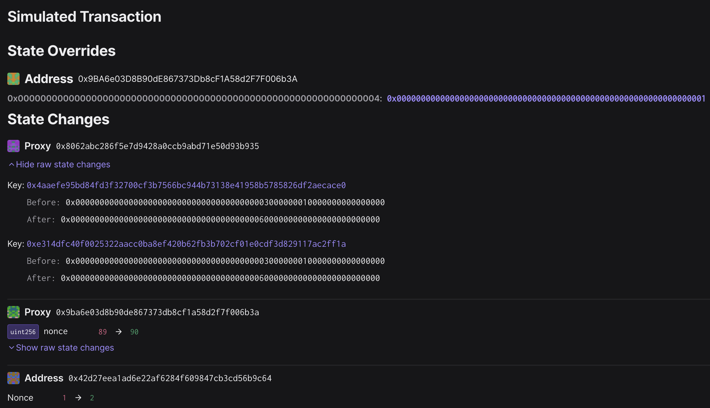

# Mainnet Protocol Versions Update - 6.0.0 (Ecotone)

Status: [EXECUTED](https://etherscan.io/tx/0x29bb617fac8f49f5c934cc776b22d47e187ab482e86f21e4502a23ba1c9ad0da)

## Objective

This is the playbook for updating the required and recommended protocol versions of the `ProtocolVersions` contract on Ethereum mainnet to 6.0.0 (Ecotone).

This transaction should be sent on **Mar 11, 2024**, two and a half days prior to the Ecotone Mainnet activation on `Mar 14 00:00:01 UTC`.

## Signing and execution

Please see the signing and execution instructions in [SINGLE.md](../../../SINGLE.md).

## State Validations

Now click on the "State" tab. Verify that:

* For the `ProtocolVersions` Proxy at `0x8062AbC286f5e7D9428a0Ccb9AbD71e50d93b935` both the
  recommended and required storage slots are updated from the encoded form of `5.0.0` to `6.0.0`.
  * key `0x4aaefe95bd84fd3f32700cf3b7566bc944b73138e41958b5785826df2aecace0`
    * before: `0x0000000000000000000000000000000000000005000000000000000000000000`
    * after : `0x0000000000000000000000000000000000000006000000000000000000000000`
  * key `0xe314dfc40f0025322aacc0ba8ef420b62fb3b702cf01e0cdf3d829117ac2ff1a`
    * before: `0x0000000000000000000000000000000000000005000000000000000000000000`
    * after : `0x0000000000000000000000000000000000000006000000000000000000000000`
* All other state changes (2) are a nonce change of the sender account and the multisig.

On the "Events" tab, you can verify that two `ConfigUpdate` events were emitted from the `ProtocolVersions` proxy,
as well as an `ExecutionSuccess` event by the multisig.



You can verify the correctness of the storage slots with `chisel --use 0.8.15  --evm-version london`.
Just start it up and enter the slot definitions as found in the contract source code.
```
➜ bytes32(uint256(keccak256("protocolversion.required")) - 1)
Type: bytes32
└ Data: 0x4aaefe95bd84fd3f32700cf3b7566bc944b73138e41958b5785826df2aecace0
➜ bytes32(uint256(keccak256("protocolversion.recommended")) - 1)
Type: bytes32
└ Data: 0xe314dfc40f0025322aacc0ba8ef420b62fb3b702cf01e0cdf3d829117ac2ff1a
```

Alternatively, `cast keccak` can be used.
Call it with the storage slot string identifier, and subtract `1` form the result:
```
cast keccak protocolversion.required
# 0x4aaefe95bd84fd3f32700cf3b7566bc944b73138e41958b5785826df2aecace1

cast keccak protocolversion.recommended
# 0xe314dfc40f0025322aacc0ba8ef420b62fb3b702cf01e0cdf3d829117ac2ff1b
```

## Continue signing

At this point you may resume following the signing and execution instructions in section 3.3 of [SINGLE.md](../../../SINGLE.md).
