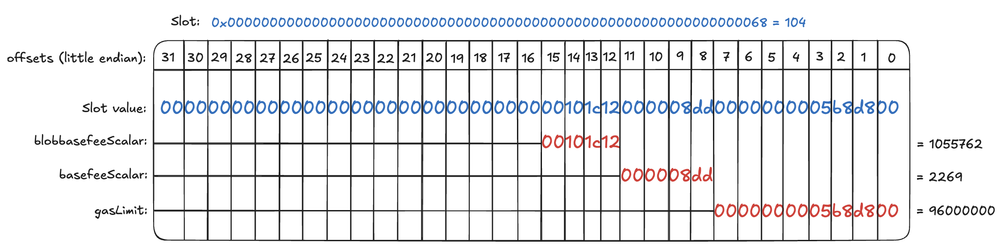

# Validation

This document can be used to validate the state diff resulting from the execution of the upgrade
transaction.

For each contract listed in the state diff, please verify that no contracts or state changes shown in the Tenderly diff are missing from this document. Additionally, please verify that for each contract:

- The following state changes (and none others) are made to that contract. This validates that no unexpected state changes occur.
- All addresses (in section headers and storage values) match the provided name, using the Etherscan and Superchain Registry links provided. This validates the bytecode deployed at the addresses contains the correct logic.
- All key values match the semantic meaning provided, which can be validated using the storage layout links provided.

## Nested Safe State Overrides and Changes

This task is executed by the nested 2/2 `ProxyAdminOwner` Safe. Refer to the
[generic nested Safe execution validation document](../../../NESTED-VALIDATION.md)
for the expected state overrides and changes.

The `approvedHashes` mapping **key** of the `ProxyAdminOwner` that should change during the simulation is
- Council simulation: `0x153f429da83bae700c7df104e0445d1b1c2b59ab0544c355447505dc4bcfae87`
- Foundation simulation: `0x7b5a6309044bc8d0ac2af15d93c04026f790b0c6f2084a00bdbb481eda8fb63c`

calculated as explained in the nested validation doc:
```sh
SAFE_HASH=0xf53895eb78a389580654b2a69fc82a45d6231812f925ccc06be50a36e70af64e # "Nested hash"

SAFE_ROLE=0x9855054731540A48b28990B63DcF4f33d8AE46A1 # Council
cast index bytes32 $SAFE_HASH $(cast index address $SAFE_ROLE 8)
# 0x153f429da83bae700c7df104e0445d1b1c2b59ab0544c355447505dc4bcfae87

SAFE_ROLE=0x9BA6e03D8B90dE867373Db8cF1A58d2F7F006b3A # Foundation
cast index bytes32 $SAFE_HASH $(cast index address $SAFE_ROLE 8)
# 0x7b5a6309044bc8d0ac2af15d93c04026f790b0c6f2084a00bdbb481eda8fb63c
```

## State Changes

### `0x7bB41C3008B3f03FE483B28b8DB90e19Cf07595c` (`ProxyAdminOwner`)

- **Key**: `0x0000000000000000000000000000000000000000000000000000000000000005`<br>
  **Before**: `0x0000000000000000000000000000000000000000000000000000000000000005`<br>
  **After**: `0x0000000000000000000000000000000000000000000000000000000000000006`<br>
  **Meaning**: Increments the `ProxyAdminOwner`'s `nonce`.

- **Key**: In the [`approvedHashes` section](#nested-safe-state-overrides-and-changes)<br>
  **Before**: `0x0000000000000000000000000000000000000000000000000000000000000000`<br>
  **After**: `0x0000000000000000000000000000000000000000000000000000000000000001`<br>
  **Meaning**: approvedHashes update. See above.

### `0x73a79Fab69143498Ed3712e519A88a918e1f4072` (`SystemConfigProxy`)

- **Key**: `0x360894a13ba1a3210667c828492db98dca3e2076cc3735a920a3ca505d382bbc`<br>
  **Before**: `0x00000000000000000000000045c4e267ae21e90f72c8abf43ddb5941c953482f`<br>
  **After**:  `0x000000000000000000000000ab9d6cb7a427c0765163a7f45bb91cafe5f2d375`<br>
  **Meaning**: Updates the `SystemConfig`'s implementation to [version 2.3.0](https://github.com/ethereum-optimism/superchain-registry/blob/53a83256dfc147710999c76e5565329f6ef0de4e/validation/standard/standard-versions-mainnet.toml#L9) at `0xAB9d6cB7A427c0765163A7f45BB91cAfe5f2D375`.

- **Key**: `0x0000000000000000000000000000000000000000000000000000000000000068`<br>
  **Before**: `0x000000000000000000000000000000000000000000000000000000000fbc5200`<br>
  **After**: `0x0000000000000000000000000000000000101c12000008dd0000000005b8d800`<br>
  **Meaning**: Sets the new `SystemConfig`'s variables `blobbasefeeScalar` to `1055762` (`cast td 0x00101c12`) and `basefeeScalar` to `2269` (`cast td 0x000008dd`). Sets the `gasLimit` to `96000000` (`cast td 0x0000000005b8d800`). See storage layout snapshot [here](https://github.com/ethereum-optimism/optimism/blob/3c75cd94849b265ff9d2ed424f9d35be124b0b4e/packages/contracts-bedrock/snapshots/storageLayout/SystemConfig.json#L58-L78). These values are checked in the `_postCheck` function in `NestedSignFromJson.s.sol`. The visual representation of the storage layout below should help you validate the state changes:
  

- **Key**: `0x000000000000000000000000000000000000000000000000000000000000006a`<br>
  **Before**: `0x0000000000000000000000000000000000000000000000000000000000000000`<br>
  **After**: `0x00000000000000000000000000000000000000000000000000000002000000fa`<br>
  **Meaning**: Sets the new `SystemConfig`'s variables `eip1559Denominator` to `250` (`cast td 0x000000fa`) and `eip1559Elasticity` to `2` (`cast td 0x00000002`).

### Other nonce changes
* **If you are signing for the Security Council** Security Council (`0x9855054731540A48b28990B63DcF4f33d8AE46A1`): `17` -> `18`.
* **If you are signing for the Foundation** Foundation Upgrade Safe (`0x9BA6e03D8B90dE867373Db8cF1A58d2F7F006b3A`): `100` -> `101`.