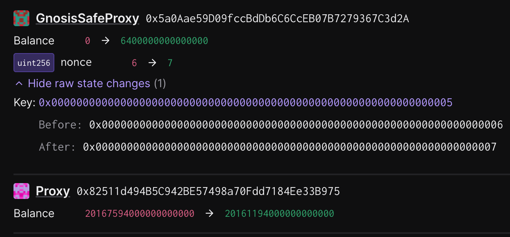

# Recover Bonds

Status: CONTINGENCY TASK, SIGN AS NEEDED

## Objective

This task executes a `recover` operation of bonds in the `DelayedWETHProxy` on behalf of the owner. This facilitates the recovery of bonds locked in bricked dispute games so they may be redistributed to its participants. Bond recovery should only be used to recover _unclaimed credits_ of fault dispute games that cannot be reclaimed by players during a superchain pause.

### Tx: Recover Locked WETH

Executes the `recover` call to the `DelayedWETHProxy` contract.

**Function Signature:** `recover(uint256)`

**To:** `<user-input>`

**Value:** `0 WEI`

**Raw Input Data:** `0x0ca35682<-----------------------------wad-value------------------------>`

#### Inputs

- `_wad`: a `uint256` of the amount of funds to recover (generated by running `just generate-input <delayed-weth-address>`)

## Preparing the Operation

1. Locate the address of the `DelayedWETHProxy` contract that the owner wishes to recover funds from.

2. In the optimism monorepo, run the [`unclaimed-credits`](https://github.com/ethereum-optimism/optimism/blob/develop/op-chain-ops/cmd/unclaimed-credits/main.go) script to generate a `meta.json` containing the bond distribution:
    ```sh
    go run ./op-chain-ops/cmd/unclaimed-credits \
        --l1-eth-rpc $L1_ETH_RPC \
        --game-factory-address $GAME_FACTORY_ADDRESS > ./meta.json
    ```

3. Generate the batch with `just generate-input <delayed-weth-address>`.

4. Set the `OWNER_SAFE`, `DELAYED_WETH_PROXY`, and `WAD_VALUE` variables in `.env`.

5. Collect signatures for the action.

6. Execute the action.

## Signing and execution

Please see the signing and execution instructions in [SINGLE.md](../../../../SINGLE.md).

### State Validation

The three state modifications that are made by this action are:

1. An update to the nonce of the owner Gnosis safe of the `DelayedWETHProxy` contract.
2. An increase to the balance of the owner Gnosis safe.
3. A decrease to the balance of the `DelayedWETHProxy` contract by the same amount.

The state changes should look something like this:



The total sum of ETH credits can be computed from the bond distribution using `jq`:
```sh
jq add ./meta.json
```

## Bond Redistribution

After bonds have been recovered from the `DelayedWETHProxy` contract, it can be redistributed.
The `meta.json` file, generated by the `unclaimed-credits` script, contains the bonds awarded to players of Fault Dispute Games. It can be used as the basis of the bond redistribution.

