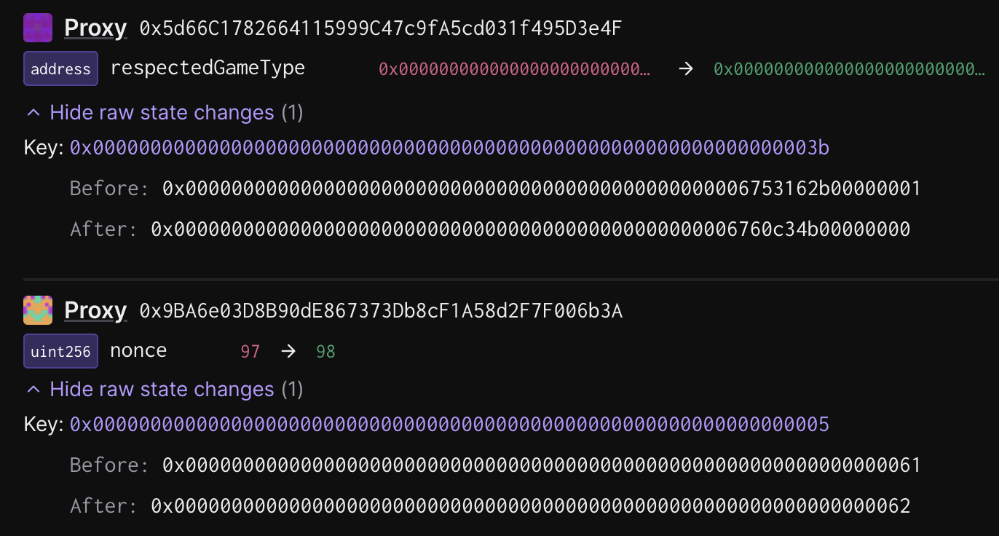

# Deputy Guardian - Enable Permissioness Dispute Game

Status: READY TO SIGN

## Objective

> [!WARNING]
> The first task, `ink-001-permissionless-proofs`, needs to be executed first to set the game implementations. 
> This task should only be executed after the permissionless fault proofs have been tested in the cold path and the chain operator is ready to enable permissionless proofs.

This task updates the `respectedGameType` in the `OptimismPortalProxy` to `CANNON`, enabling users to permissionlessly propose outputs as well as for anyone to participate in the dispute of these proposals. This action requires all in-progress withdrawals to be re-proven against a new `FaultDisputeGame` that was created after this update occurs. To execute, collect signatures and execute the action according to the instructions in [SINGLE.md](../../../../SINGLE.md).


### State Validations

The two state modifications that are made by this action are:

1. An update to the nonce (increment of `1`) of the `DeputyGuardianModule` safe.
2. An update to the shared slot between the `respectedGameType` and `respectedGameTypeUpdatedAt` variables.

The state changes should look something like this:



Slot [`0x000000000000000000000000000000000000000000000000000000000000003b`](https://github.com/ethereum-optimism/optimism/blob/op-contracts/v1.6.0/packages/contracts-bedrock/snapshots/storageLayout/OptimismPortal2.json#L100-L113) in the `OptimismPortalProxy` has the following packed layout:

| Offset     | Description                                                  |
| ---------- | ------------------------------------------------------------ |
| `[0, 20)`  | Unused; Should be zero'd out.                                |
| `[20, 28)` | `respectedGameTypeUpdatedAt` timestamp (64 bits, big-endian) |
| `[28, 32)` | `respectedGameType` (32 bits, big-endian)                    |

Note that the offsets in the above table refer to the slot value's big-endian representation. You can compute the offset values with chisel:
```
➜ uint256 x = 0x000000000000000000000000000000000000000000000000669faf8900000000
➜ uint64 respectedGameTypeUpdatedAt = uint64(x >> 32)
➜ respectedGameTypeUpdatedAt
Type: uint64
├ Hex: 0x
├ Hex (full word): 0x669faf89
└ Decimal: 1721741193
➜ uint32 respectedGameType = uint32(x & 0xFFFFFFFF)
➜ respectedGameType
Type: uint32
├ Hex: 0x
├ Hex (full word): 0x0
└ Decimal: 0
```

To verify the diff:

1. Check that the only modification to state belongs to the `OptimismPortalProxy` at slot [`0x000000000000000000000000000000000000000000000000000000000000003b`](https://github.com/ethereum-optimism/optimism/blob/op-contracts/v1.6.0/packages/contracts-bedrock/snapshots/storageLayout/OptimismPortal2.json#L100-L113).
2. Check that the lower 4 bytes equal `0` (`CANNON`) when read as a big-endian 32-bit uint.
3. Check that bytes `[20, 28]` equal the timestamp of the transaction's submission when read as a big-endian 64-bit uint.
