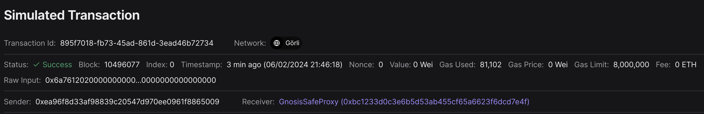
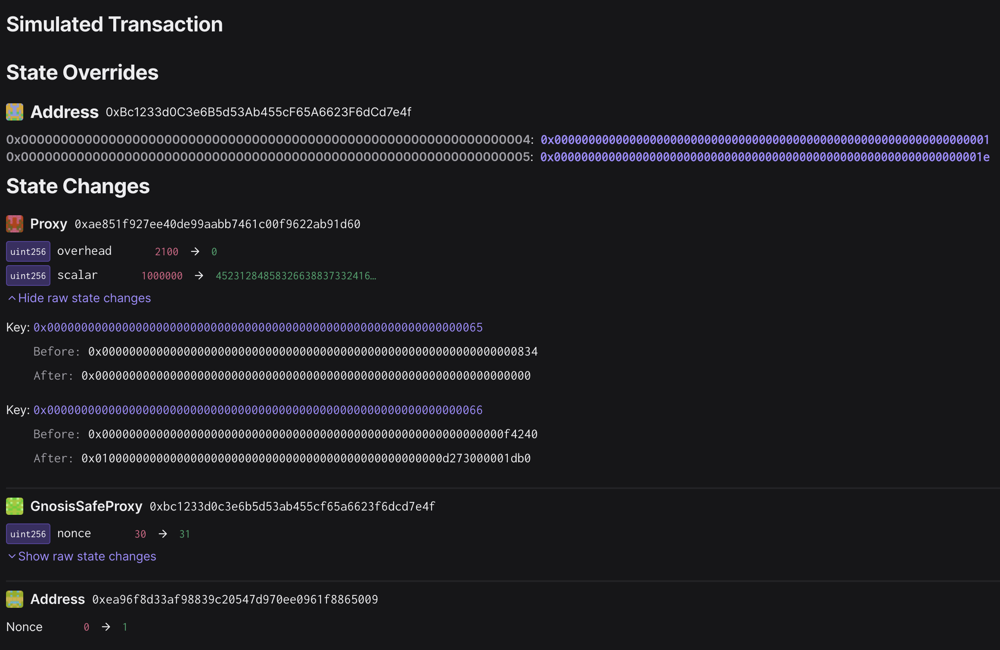
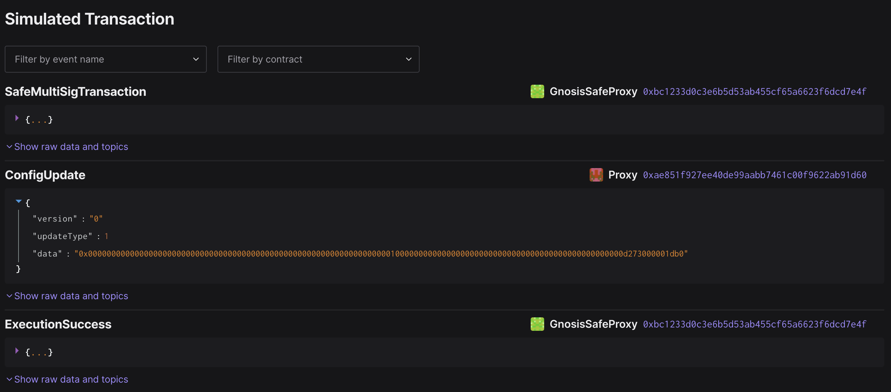
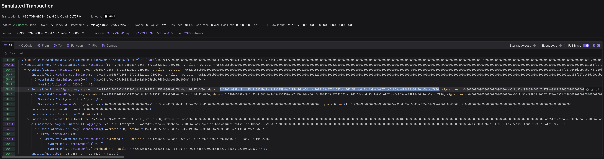

# OP Goerli Ecotone gas config update

## Objective

This is the playbook for setting the gas config on OP Goerli.

The Ecotone gas config is set as calculated in [this internal doc](https://www.notion.so/4844-L1-fee-scalars-5461ee49075d4658bc165e89c44faed2).
The new gas config has the two values
* `l1BaseFeeScalar = 7600`
* `l1BlobBaseFeeScalar = 862000`

Using the [`ecotone-scalar`](https://github.com/ethereum-optimism/optimism/tree/develop/op-chain-ops/cmd/ecotone-scalar) encoding tool:
```
go run ./op-chain-ops/cmd/ecotone-scalar --scalar=7600 --blob-scalar=862000
# base fee scalar     : 7600
# blob base fee scalar: 862000
# v1 hex encoding  : 0x010000000000000000000000000000000000000000000000000d273000001db0
# uint value for the 'scalar' parameter in SystemConfig.setGasConfig():
452312848583266388373324160190187140051835877600158453279134889792719822256
```

Note: the transaction `data` field of the `input.json` was `null` from the Safe tx builder,
so it was manually set to the output of
```
cast calldata 'setGasConfig(uint256,uint256)' 0 0x010000000000000000000000000000000000000000000000000d273000001db0
```

## Approving the transaction

### 1. Update repo and move to the appropriate folder for this rehearsal task:

```
cd superchain-ops
git pull
just install
cd gor/01-ecotone-gasconfig
```

### 2. Setup Ledger

Your Ledger needs to be connected and unlocked. The Ethereum
application needs to be opened on Ledger with the message "Application
is ready".

### 3. Simulate and validate the transaction

Make sure your ledger is still unlocked and run the following.

Remember that by default `just` is running with the address derived from
`/0` (first nonce). If you wish to use a different account, run `just
simulate [X]`, where X is the derivation path of the address
that you want to use.

You will see a "Simulation link" from the output.

Paste this URL in your browser. A prompt may ask you to choose a
project, any project will do. You can create one if necessary.

Click "Simulate Transaction".

We will be performing 3 validations and extract the domain hash and
message hash to approve on your Ledger:

1. Validate integrity of the simulation.
2. Validate correctness of the state diff.
3. Validate and extract domain hash and message hash to approve.

#### 3.1. Validate integrity of the simulation.

Make sure you are on the "Overview" tab of the tenderly simulation, to
validate integrity of the simulation, we need to check the following:

1. "Network": Check the network is Goerli (5).
2. "Timestamp": Check the simulation is performed on a block with a
   recent timestamp (i.e. close to when you run the script).
3. "Sender": Check the address shown is your signer account. If not,
   you will need to determine which “number” it is in the list of
   addresses on your ledger. By default the script will assume the
   derivation path is m/44'/60'/0'/0/0. By calling the script with
   `just simulate 1` it will derive the address using
   m/44'/60'/1'/0/0 instead.



#### 3.2. Validate correctness of the state diff and events.

Now click on the "State" tab. Verify that:

* The Proxy at `0xAe851f927Ee40dE99aaBb7461C00f9622ab91d60` has two state changes
  * `overhead` changes from `2100` to `0`
  * `scalar` changes from `1000000` to `452312848583266388373324160190187140051835877600158453279134889792719822256`, or `0x010000000000000000000000000000000000000000000000000d273000001db0`,
    which is the Ecotone-encoded gas config.
* Remaining changes are two nonce changes,
  * one for the `GnosisSafeProxy` at `0xbc1233d0c3e6b5d53ab455cf65a6623f6dcd7e4f` and
  * one for the sender account.



Now click on the "Events" tab. Verify that:

* The first and third event are `SafeMultiSigTransaction` & `ExecutionSuccess` by the `GnosisSafeProxy`
* The second event is `ConfigUpdate` by the `Proxy` (`0xae851f927ee40de99aabb7461c00f9622ab91d60`) with
  * `version`: `0`
  * `updateType`: `1`
  * `data`: `0x0000000000000000000000000000000000000000000000000000000000000000010000000000000000000000000000000000000000000000000d273000001db0`

This even will be picked up by L2 nodes to change the gas config.



#### 3.3. Extract the domain hash and the message hash to approve.

Now that we have verified the transaction performs the right
operation, we need to extract the domain hash and the message hash to
approve.

Go back to the "Overview" tab, and find the
`GnosisSafe.checkSignatures` call. This call's `data` parameter
contains both the domain hash and the message hash that will show up
in your Ledger.

Here is an example screenshot. Note that the hash value may be
different:



Seb's sig data: `0x1901d0038af9d1425c8c3831ba8a43a136259ebe7d15ecb0ce60bd3b90f4189487641527ccc2d6f5fcacdd23c4a9a6fef57bcc6c969aa4f4819a86c2e4a5e14b7f26`

It will be a concatenation of `0x1901`, the domain hash, and the
message hash: `0x1901[domain hash][message hash]`.

Note down this value. You will need to compare it with the ones
displayed on the Ledger screen at signing.

### 4. Approve the signature on your ledger

Once the validations are done, it's time to actually sign the
transaction. Make sure your ledger is still unlocked and run the
following:

``` shell
just sign # or just sign <hdPath>
```

> [!IMPORTANT] This is the most security critical part of the
> playbook: make sure the domain hash and message hash in the
> following two places match:

1. on your Ledger screen.
2. in the Tenderly simulation. You should use the same Tenderly
   simulation as the one you used to verify the state diffs, instead
   of opening the new one printed in the console.

There is no need to verify anything printed in the console. There is
no need to open the new Tenderly simulation link either.

After verification, sign the transaction. You will see the `Data`,
`Signer` and `Signature` printed in the console. Format should be
something like this:

```
Data:  <DATA>
Signer: <ADDRESS>
Signature: <SIGNATURE>
```

Double check the signer address is the right one.

### 5. Send the output to Facilitator(s)

Nothing has occurred onchain - these are offchain signatures which
will be collected by Facilitators for execution. Execution can occur
by anyone once a threshold of signatures are collected, so a
Facilitator will do the final execution for convenience.

Share the `Data`, `Signer` and `Signature` with the Facilitator, and
congrats, you are done!

## [For Facilitator ONLY] How to execute the rehearsal

### [After the rehearsal] Execute the output

1. Collect outputs from all participating signers.
2. Concatenate all signatures and export it as the `SIGNATURES`
   environment variable, i.e. `export
   SIGNATURES="0x[SIGNATURE1][SIGNATURE2]..."`.
3. Run `just execute 0 # or 1 or ...` to execute the transaction onchain.

For example, if the quorum is 2 and you get the following outputs:

``` shell
Data:  0xDEADBEEF
Signer: 0xC0FFEE01
Signature: AAAA
```

``` shell
Data:  0xDEADBEEF
Signer: 0xC0FFEE02
Signature: BBBB
```

Then you should run

``` shell
export SIGNATURES="0xAAAABBBB"
just execute 0 # or 1 or ...
```
