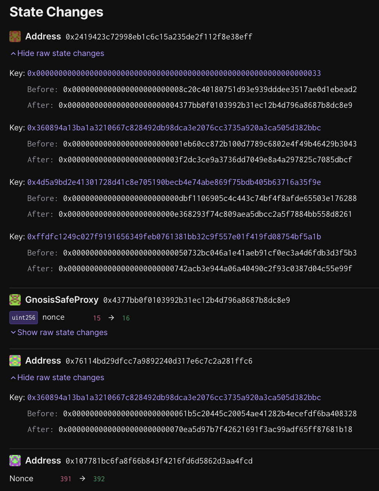

# Devnet FP Upgrade - `op-contracts/v1.4.0-rc.2`

Status: [EXECUTED](https://sepolia.etherscan.io/tx/0xeb2196e96d453c8cb77c10822b71f15c1fbf963e1ce8bee17255c8de1937aa3e)

## Objective

Upgrades the deployed system on `sepolia-devnet-0` to the latest version of the deployed contracts, `op-contracts/v1.4.0-rc.2`.

The batch will be executed on chain ID `11155111`, and contains `5` transactions.

## Tx #1: Clear `initialized` slot in `DisputeGameFactory`

Upgrades the `DisputeGameFactory` proxy to the `StorageSetter` contract and clears the `initialized` slot, allowing us to transfer ownership of the factory to the owner multisig.

**Function Signature:** `upgradeAndCall(address,address,bytes)`

**To:** `0x18d890A46A3556e7F36f28C79F6157BC7a59f867`

**Value:** `0 WEI`

**Raw Input Data:** `0x9623609d0000000000000000000000002419423c72998eb1c6c15a235de2f112f8e38eff00000000000000000000000054f8076f4027e21a010b4b3900c86211dd2c2deb00000000000000000000000000000000000000000000000000000000000000600000000000000000000000000000000000000000000000000000000000000060e2a4853a0000000000000000000000000000000000000000000000000000000000000000000000000000000000000000000000000000000000000000000000000000000000000000000000000000000000000000000000000000000000000000`

### Inputs

**\_implementation:** `0x54F8076f4027e21A010b4B3900C86211Dd2C2DEB`

**\_data:** `0xe2a4853a0000000000000000000000000000000000000000000000000000000000000000000000000000000000000000000000000000000000000000000000000000000000000000000000000000000000000000000000000000000000000000`

**\_proxy:** `0x2419423c72998eb1c6c15a235de2f112f8e38eff`

## Tx #2: Change owner of `DisputeGameFactory` proxy to the owner safe

Upgrades the `DisputeGameFactory` proxy implementation to the newest version and re-initializes it with the owner safe as the owner of the `DisputeGameFactory`.

**Function Signature:** `upgradeAndCall(address,address,bytes)`

**To:** `0x18d890A46A3556e7F36f28C79F6157BC7a59f867`

**Value:** `0 WEI`

**Raw Input Data:** `0x9623609d0000000000000000000000002419423c72998eb1c6c15a235de2f112f8e38eff0000000000000000000000003f2dc3ce9a3736dd7049e8a4a297825c7085dbcf00000000000000000000000000000000000000000000000000000000000000600000000000000000000000000000000000000000000000000000000000000024c4d66de80000000000000000000000004377bb0f0103992b31ec12b4d796a8687b8dc8e900000000000000000000000000000000000000000000000000000000`

### Inputs

**\_data:** `0xc4d66de80000000000000000000000004377bb0f0103992b31ec12b4d796a8687b8dc8e9`

**\_implementation:** `0x3F2Dc3ce9A3736Dd7049E8A4A297825C7085DBcf`

**\_proxy:** `0x2419423c72998eb1c6c15a235de2f112f8e38eff`

## Tx #3: Upgrade `GameType.CANNON` implementation in the `DisputeGameFactory` proxy

Upgrades the implementation of the `CANNON` game type in the `DisputeGameFactory` to the new deployment of the `FaultDisputeGame`

**Function Signature:** `setImplementation(uint32,address)`

**To:** `0x2419423C72998eb1c6c15A235de2f112f8E38efF`

**Value:** `0 WEI`

**Raw Input Data:** `0x14f6b1a30000000000000000000000000000000000000000000000000000000000000000000000000000000000000000742acb3e944a06a40490c2f93c0387d04c55e99f`

### Inputs

**\_gameType:** `0`

**\_impl:** `0x742acb3e944a06a40490c2F93C0387d04c55E99F`

## Tx #4: Upgrade `GameType.PERMISSIONED_CANNON` implementation in the `DisputeGameFactory` proxy

Upgrades the implementation of the `PERMISSIONED_CANNON` game type in the `DisputeGameFactory` to the new deployment of the `PermissionedDisputeGame`

**Function Signature:** `setImplementation(uint32,address)`

**To:** `0x2419423C72998eb1c6c15A235de2f112f8E38efF`

**Value:** `0 WEI`

**Raw Input Data:** `0x14f6b1a30000000000000000000000000000000000000000000000000000000000000001000000000000000000000000e368293f74c809aea5dbcc2a5f7884bb558d8261`

### Inputs

**\_impl:** `0xe368293F74C809AeA5dBcC2a5f7884bb558D8261`

**\_gameType:** `1`

## Tx #5: Upgrade `OptimismPortal` proxy

Upgrades the `OptimismPortal` proxy implementation to the latest version. Does not re-initialize, as the references to other contracts have not changed.

**Function Signature:** `upgrade(address,address)`

**To:** `0x18d890A46A3556e7F36f28C79F6157BC7a59f867`

**Value:** `0 WEI`

**Raw Input Data:** `0x99a88ec400000000000000000000000076114bd29dfcc7a9892240d317e6c7c2a281ffc600000000000000000000000070ea5d97b7f42621691f3ac99adf65ff87681b18`

### Inputs

**\_proxy:** `0x76114bd29dFcC7a9892240D317E6c7C2A281Ffc6`

**\_implementation:** `0x70Ea5D97b7F42621691f3aC99AdF65Ff87681B18`

## Signing and execution

Please see the signing and execution instructions in [SINGLE.md](../../../SINGLE.md).

### State Validations

The following state changes should be seen:

**[`0x2419423c72998eb1c6c15a235de2f112f8e38eff`][dgf-prox-etherscan] (The `DisputeGameFactory` proxy contract)**

- Key `0x0000000000000000000000000000000000000000000000000000000000000033`
  - Before: `0x0000000000000000000000008c20c40180751d93e939dddee3517ae0d1ebead2`
  - After: `0x0000000000000000000000004377bb0f0103992b31ec12b4d796a8687b8dc8e9`
  - Meaning: The `DisputeGameFactory` owner has been updated to the Sepolia devnet owner safe (`0x4377bb0f0103992b31ec12b4d796a8687b8dc8e9`).
- Key `0x360894a13ba1a3210667c828492db98dca3e2076cc3735a920a3ca505d382bbc`
  - Before: `0x0000000000000000000000001eb60cc872b100d7789c6802e4f49b46429b3043`
  - After: `0x0000000000000000000000003f2dc3ce9a3736dd7049e8a4a297825c7085dbcf`
  - Meaning: The implementation of the `DisputeGameFactory` proxy has been upgraded to `0x3f2dc3ce9a3736dd7049e8a4a297825c7085dbcf`
- Key `0x4d5a9bd2e41301728d41c8e705190becb4e74abe869f75bdb405b63716a35f9e`
  - Before: `0x000000000000000000000000dbf1106905c4c443c74bf4f8afde65503e176288`
  - After: `0x000000000000000000000000e368293f74c809aea5dbcc2a5f7884bb558d8261`
  - Meaning: The implementation of the `PermissionedDisputeGame` has been upgraded to `0xe368293f74c809aea5dbcc2a5f7884bb558d8261`
- Key `0xffdfc1249c027f9191656349feb0761381bb32c9f557e01f419fd08754bf5a1b`
  - Before: `0x00000000000000000000000050732bc046a1e41aeb91cf0ec3a4d6fdb3d3f5b3`
  - After: `0x000000000000000000000000742acb3e944a06a40490c2f93c0387d04c55e99f`
  - Meaning: The implementation of the `FaultDisputeGame` has been upgraded to `0x742acb3e944a06a40490c2f93c0387d04c55e99f`

**[`0x76114bd29dfcc7a9892240d317e6c7c2a281ffc6`][portal-prox-etherscan] (The `OptimismPortal` proxy contract)**

The transaction should only result in one changed storage slot in the `OptimismPortal` proxy contract:

- Key `0x360894a13ba1a3210667c828492db98dca3e2076cc3735a920a3ca505d382bbc`
  - Before: `0x00000000000000000000000061b5c20445c20054ae41282b4ecefdf6ba408328`
  - After: `0x00000000000000000000000070ea5d97b7f42621691f3ac99adf65ff87681b18`
  - Meaning: EIP-1967 Implementation slot, updated to the new `OptimismPortal2` implementation address.

[dgf-prox-etherscan]: https://sepolia.etherscan.io/address/0x2419423c72998eb1c6c15a235de2f112f8e38eff
[portal-prox-etherscan]: https://sepolia.etherscan.io/address/0x76114bd29dfcc7a9892240d317e6c7c2a281ffc6
