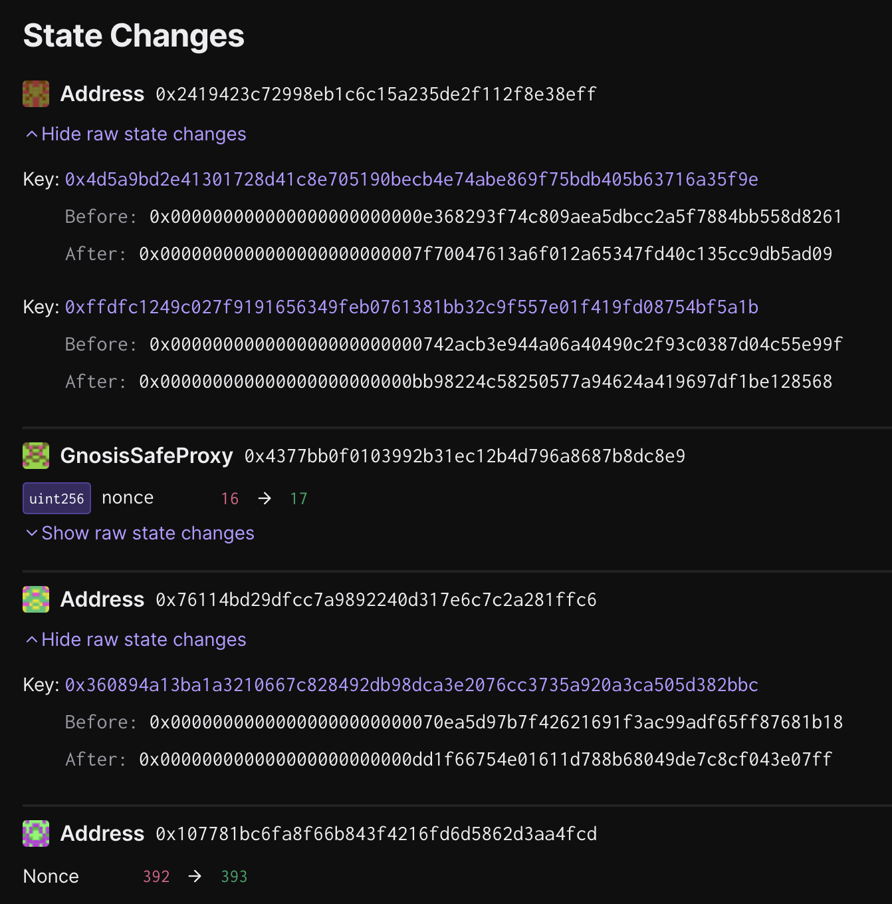

# Devnet FP Upgrade - `op-contracts/v1.4.0-rc.3`

Status: [EXECUTED](https://sepolia.etherscan.io/tx/0x4859f2fda193b9c76d5e96c7e586f1c4fac91e9b1eedcbe6c1ab65adf3850532)

## Objective

Upgrades the deployed system on `sepolia-devnet-0` to the latest version of the deployed contracts, `op-contracts/1.4.0-rc.3`.

The batch will be executed on chain ID `11155111`, and contains `3` transactions.

## Tx #1: Upgrade `OptimismPortal` proxy implementation

Upgrades the `OptimismPortal` proxy implementation to the latest version of the `OptimismPortal2` contract, `3.10.0`

**Function Signature:** `upgrade(address,address)`

**To:** `0x18d890A46A3556e7F36f28C79F6157BC7a59f867`

**Value:** `0 WEI`

**Raw Input Data:** `0x99a88ec400000000000000000000000076114bd29dfcc7a9892240d317e6c7c2a281ffc6000000000000000000000000dd1f66754e01611d788b68049de7c8cf043e07ff`

### Inputs

**\_proxy:** `0x76114bd29dFcC7a9892240D317E6c7C2A281Ffc6`

**\_implementation:** `0xDD1f66754E01611D788b68049dE7c8CF043E07fF`

## Tx #2: Upgrade `FaultDisputeGame` proxy implementation

Upgrades the `FaultDisputeGame` proxy implementation to the latest version of the `FaultDisputeGame` contract, `1.2.0`

**Function Signature:** `setImplementation(uint32,address)`

**To:** `0x2419423C72998eb1c6c15A235de2f112f8E38efF`

**Value:** `0 WEI`

**Raw Input Data:** `0x14f6b1a30000000000000000000000000000000000000000000000000000000000000000000000000000000000000000bb98224c58250577a94624a419697df1be128568`

### Inputs

**\_gameType:** `0`

**\_implementation:** `0xbB98224C58250577a94624A419697df1Be128568`

## Tx #3: Upgrade `PermissionedDisputeGame` proxy implementation

Upgrades the `PermissionedDisputeGame` proxy implementation to the latest version of the `PermissionedDisputeGame` contract, `1.2.0`

**Function Signature:** `setImplementation(uint32,address)`

**To:** `0x2419423C72998eb1c6c15A235de2f112f8E38efF`

**Value:** `0 WEI`

**Raw Input Data:** `0x14f6b1a300000000000000000000000000000000000000000000000000000000000000010000000000000000000000007f70047613a6f012a65347fd40c135cc9db5ad09`

### Inputs

**\_gameType:** `1`

**\_implementation:** `0x7f70047613a6F012a65347fd40c135cC9Db5aD09`

## Signing and execution

Please see the signing and execution instructions in [SINGLE.md](../../../SINGLE.md).

### State Validations

The following state changes should be seen:

**[`0x2419423c72998eb1c6c15a235de2f112f8e38eff`][dgf-prox-etherscan] (The `DisputeGameFactory` proxy contract)**

- Key `0x4d5a9bd2e41301728d41c8e705190becb4e74abe869f75bdb405b63716a35f9e`
  - Before: `0x000000000000000000000000e368293f74c809aea5dbcc2a5f7884bb558d8261`
  - After: `0x0000000000000000000000007f70047613a6f012a65347fd40c135cc9db5ad09`
  - Meaning: The implementation of the `PermissionedDisputeGame` has been upgraded to `0x7f70047613a6F012a65347fd40c135cC9Db5aD09`
- Key `0xffdfc1249c027f9191656349feb0761381bb32c9f557e01f419fd08754bf5a1b`
  - Before: `0x000000000000000000000000742acb3e944a06a40490c2f93c0387d04c55e99f`
  - After: `0x000000000000000000000000bb98224c58250577a94624a419697df1be128568`
  - Meaning: The implementation of the `FaultDisputeGame` has been upgraded to `0xbB98224C58250577a94624A419697df1Be128568`

**[`0x76114bd29dfcc7a9892240d317e6c7c2a281ffc6`][portal-prox-etherscan] (The `OptimismPortal` proxy contract)**

The transaction should only result in one changed storage slot in the `OptimismPortal` proxy contract:

- Key `0x360894a13ba1a3210667c828492db98dca3e2076cc3735a920a3ca505d382bbc`
  - Before: `0x00000000000000000000000070ea5d97b7f42621691f3ac99adf65ff87681b18`
  - After: `0x000000000000000000000000dd1f66754e01611d788b68049de7c8cf043e07ff`
  - Meaning: EIP-1967 Implementation slot, updated to the new `OptimismPortal2` implementation address.

[dgf-prox-etherscan]: https://sepolia.etherscan.io/address/0x2419423c72998eb1c6c15a235de2f112f8e38eff
[portal-prox-etherscan]: https://sepolia.etherscan.io/address/0x76114bd29dfcc7a9892240d317e6c7c2a281ffc6
