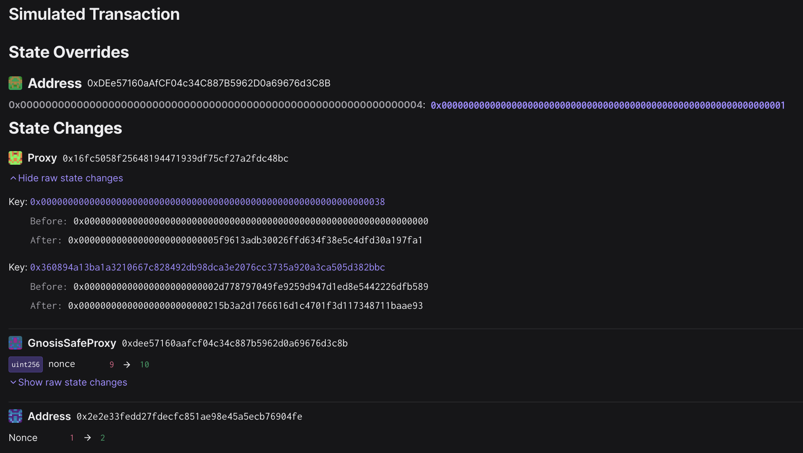

# Sepolia Testnet FPAC Upgrade - Mk. 2

## Objective

This is the playbook for executing the second FPAC upgrade on Sepolia testnet.

The Fault Proof Alpha Chad upgrade:

1. Deploys upgrades to implementation contracts in the FPAC system
   - [`MIPS.sol`][mips-sol]
   - [`PreimageOracle.sol`][preimage-sol]
   - [`FaultDisputeGame.sol`][fdg-sol]
   - [`PermissionedDisputeGame.sol`][soy-fdg-sol]
   - [`DisputeGameFactory.sol`][dgf-sol]
   - [`DelayedWeth.sol`][delayed-weth-sol]
   - [`AnchorStateRegistry.sol`][anchor-state-reg-sol]
1. Upgrades the `OptimismPortal` proxy implementation
1. Upgrades the `DisputeGameFactory` proxy implementation.

[mips-sol]: https://github.com/ethereum-optimism/optimism/blob/develop/packages/contracts-bedrock/src/cannon/MIPS.sol
[preimage-sol]: https://github.com/ethereum-optimism/optimism/blob/develop/packages/contracts-bedrock/src/cannon/PreimageOracle.sol
[fdg-sol]: https://github.com/ethereum-optimism/optimism/blob/develop/packages/contracts-bedrock/src/dispute/FaultDisputeGame.sol
[soy-fdg-sol]: https://github.com/ethereum-optimism/optimism/blob/develop/packages/contracts-bedrock/src/dispute/PermissionedDisputeGame.sol
[dgf-sol]: https://github.com/ethereum-optimism/optimism/blob/develop/packages/contracts-bedrock/src/dispute/DisputeGameFactory.sol
[delayed-weth-sol]: https://github.com/ethereum-optimism/optimism/blob/develop/packages/contracts-bedrock/src/dispute/weth/DelayedWETH.sol
[portal-2]: https://github.com/ethereum-optimism/optimism/blob/develop/packages/contracts-bedrock/src/L1/OptimismPortal2.sol
[anchor-state-reg-sol]: https://github.com/ethereum-optimism/optimism/blob/develop/packages/contracts-bedrock/src/dispute/AnchorStateRegistry.sol

## Preparing the Upgrade

1. Fill out `meta.json` with the deployed `OptimismPortal2` and `DisputeGameFactoryProxy` contracts from step 3.

2. Generate the `input.json` with `just generate-input`

3. Prepare the periphery infrastructure.

   - Point the `op-challenger` and `dispute-mon` towards the new `DisputeGameFactory` contract proxy, deployed in step 3.
   - Point the `op-proposer` towards the new `DisputeGameFactory` contract proxy, deployed in step 3.

4. Collect signatures for the upgrade.

5. Execute the upgrade.

## Signing and execution

Please see the signing and execution instructions in [SINGLE.md](../../../SINGLE.md).

### State Validations

The following state overrides should be seen:

**[`0xDEe57160aAfCF04c34C887B5962D0a69676d3C8B`][safe-etherscan] (The 2/9 `ProxyAdmin` owner Safe)**:

Enables the simulation by reducing the threshold to 1:

- Key: `0x0000000000000000000000000000000000000000000000000000000000000004`
- Value: `0x0000000000000000000000000000000000000000000000000000000000000001`

The following state diff should be seen:

**[`0x16Fc5058F25648194471939df75CF27A2fdC48BC`][portal-prox-etherscan] (The `OptimismPortal` proxy contract)**

The transaction should only result in two changed storage slots in the `OptimismPortal` proxy contract:

- Key `0x0000000000000000000000000000000000000000000000000000000000000038`
  - Before: `0x0000000000000000000000000000000000000000000000000000000000000000`
  - After: `0x00000000000000000000000005f9613adb30026ffd634f38e5c4dfd30a197fa1`
  - Meaning: The `DisputeGameFactory` proxy address, new storage slot.
- Key `0x360894a13ba1a3210667c828492db98dca3e2076cc3735a920a3ca505d382bbc`
  - Before: `0x0000000000000000000000002d778797049fe9259d947d1ed8e5442226dfb589`
  - After: `0x000000000000000000000000215b3a2d1766616d1c4701f3d117348711baae93`
  - Meaning: EIP-1967 Implementation slot, updated to the `OptimismPortal2` implementation address.

[safe-etherscan]: https://sepolia.etherscan.io/address/0xDEe57160aAfCF04c34C887B5962D0a69676d3C8B
[portal-prox-etherscan]: https://sepolia.etherscan.io/address/0x16Fc5058F25648194471939df75CF27A2fdC48BC
