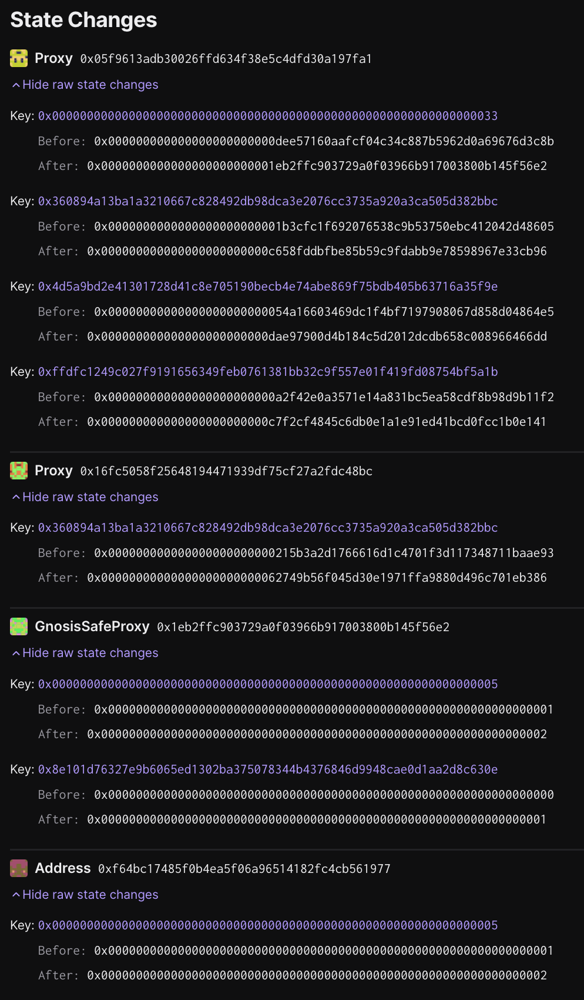

# Sepolia Testnet FPAC Upgrade - Mk. 2

## Objective

This is the playbook for executing the second FPAC upgrade on Sepolia testnet.

1. Deploys upgrades to implementation contracts in the FPAC system
   - [`MIPS.sol`][mips-sol]
   - [`PreimageOracle.sol`][preimage-sol]
   - [`FaultDisputeGame.sol`][fdg-sol]
   - [`PermissionedDisputeGame.sol`][soy-fdg-sol]
   - [`DisputeGameFactory.sol`][dgf-sol]
   - [`DelayedWeth.sol`][delayed-weth-sol]
   - [`AnchorStateRegistry.sol`][anchor-state-reg-sol]
1. Upgrades the `OptimismPortal` proxy implementation
1. Upgrades the `DisputeGameFactory` proxy implementation.

[mips-sol]: https://github.com/ethereum-optimism/optimism/blob/develop/packages/contracts-bedrock/src/cannon/MIPS.sol
[preimage-sol]: https://github.com/ethereum-optimism/optimism/blob/develop/packages/contracts-bedrock/src/cannon/PreimageOracle.sol
[fdg-sol]: https://github.com/ethereum-optimism/optimism/blob/develop/packages/contracts-bedrock/src/dispute/FaultDisputeGame.sol
[soy-fdg-sol]: https://github.com/ethereum-optimism/optimism/blob/develop/packages/contracts-bedrock/src/dispute/PermissionedDisputeGame.sol
[dgf-sol]: https://github.com/ethereum-optimism/optimism/blob/develop/packages/contracts-bedrock/src/dispute/DisputeGameFactory.sol
[delayed-weth-sol]: https://github.com/ethereum-optimism/optimism/blob/develop/packages/contracts-bedrock/src/dispute/weth/DelayedWETH.sol
[portal-2]: https://github.com/ethereum-optimism/optimism/blob/develop/packages/contracts-bedrock/src/L1/OptimismPortal2.sol
[anchor-state-reg-sol]: https://github.com/ethereum-optimism/optimism/blob/develop/packages/contracts-bedrock/src/dispute/AnchorStateRegistry.sol

## Preparing the Upgrade

1. Deploy new EIP-1967 proxies for the following contracts:

   - [`DelayedWeth.sol`][delayed-weth-sol]
   - [`AnchorStateRegistry.sol`][anchor-state-reg-sol]

1. Deploy new implementations for the following contracts:

   - [`MIPS.sol`][mips-sol]
   - [`PreimageOracle.sol`][preimage-sol]
   - [`FaultDisputeGame.sol`][fdg-sol]
   - [`PermissionedDisputeGame.sol`][soy-fdg-sol]
   - [`DisputeGameFactory.sol`][dgf-sol]
   - [`DelayedWeth.sol`][delayed-weth-sol]
   - [`AnchorStateRegistry.sol`][anchor-state-reg-sol]
   - [`OptimismPortal2.sol`][portal-2]

1. Fill out `meta.json` with the deployed contracts from step 2.

1. Generate the `input.json` with `just generate-input`

1. Collect signatures for the upgrade.

1. Execute the upgrade.

## Signing and execution

Please see the signing and execution instructions in [NESTED.md](../../../NESTED.md).

### State Validations

The following state changes should be seen:

**[`0x05f9613adb30026ffd634f38e5c4dfd30a197fa1`][dgf-prox-etherscan] (The `DisputeGameFactory` proxy contract)**

- Key `0x0000000000000000000000000000000000000000000000000000000000000033`
  - Before: `0x000000000000000000000000dee57160aafcf04c34c887b5962d0a69676d3c8b`
  - After: `0x0000000000000000000000001eb2ffc903729a0f03966b917003800b145f56e2`
  - Meaning: The `DisputeGameFactory` owner has been updated to the new Sepolia safe (`0x1Eb2fFc903729a0F03966B917003800b145F56E2`).
- Key `0x360894a13ba1a3210667c828492db98dca3e2076cc3735a920a3ca505d382bbc`
  - Before: `0x0000000000000000000000001b3cfc1f692076538c9b53750ebc412042d48605`
  - After: `0x000000000000000000000000c658fddbfbe85b59c9fdabb9e78598967e33cb96`
  - Meaning: The implementation of the `DisputeGameFactory` proxy has been upgraded to `0xc658fddbfbe85b59c9fdabb9e78598967e33cb96`
- Key `0x4d5a9bd2e41301728d41c8e705190becb4e74abe869f75bdb405b63716a35f9e`
  - Before: `0x00000000000000000000000054a16603469dc1f4bf7197908067d858d04864e5`
  - After: `0x000000000000000000000000FDcA34EDa4cf5944E9fa0D5DBE2A515a88650FB7`
  - Meaning: The implementation of the `PermissionedDisputeGame` has been upgraded to `0xFDcA34EDa4cf5944E9fa0D5DBE2A515a88650FB7`
- Key `0xffdfc1249c027f9191656349feb0761381bb32c9f557e01f419fd08754bf5a1b`
  - Before: `0x000000000000000000000000a2f42e0a3571e14a831bc5ea58cdf8b98d9b11f2`
  - After: `0x000000000000000000000000200b7F3259E1c2F5be6d801339d4E8C3d4534f15`
  - Meaning: The implementation of the `FaultDisputeGame` has been upgraded to `0x200b7F3259E1c2F5be6d801339d4E8C3d4534f15`

**[`0x16Fc5058F25648194471939df75CF27A2fdC48BC`][portal-prox-etherscan] (The `OptimismPortal` proxy contract)**

The transaction should only result in one changed storage slot in the `OptimismPortal` proxy contract:

- Key `0x360894a13ba1a3210667c828492db98dca3e2076cc3735a920a3ca505d382bbc`
  - Before: `0x000000000000000000000000215b3a2d1766616d1c4701f3d117348711baae93`
  - After: `0x00000000000000000000000062749b56f045d30e1971ffa9880d496c701eb386`
  - Meaning: EIP-1967 Implementation slot, updated to the new `OptimismPortal2` implementation address.

**[`0xf64bc17485f0b4ea5f06a96514182fc4cb561977`][mock-council-safe-etherscan] (The mock Council Gnosis Safe)**

- Key `0x0000000000000000000000000000000000000000000000000000000000000005`
  - Before: `0x0000000000000000000000000000000000000000000000000000000000000001`
  - After: `0x0000000000000000000000000000000000000000000000000000000000000002`
  - Meaning: The nonce of the safe has been bumped by `1`.

**[`0x1eb2ffc903729a0f03966b917003800b145f56e2`][upgrade-safe-etherscan] (The upgrade Gnosis safe)**

- Key `0x0000000000000000000000000000000000000000000000000000000000000005`
  - Before: `0x0000000000000000000000000000000000000000000000000000000000000001`
  - After: `0x0000000000000000000000000000000000000000000000000000000000000002`
  - Meaning: The nonce of the safe has been bumped by `1`.
- Key `0x8e101d76327e9b6065ed1302ba375078344b4376846d9948cae0d1aa2d8c630e`
  - Before: `0x0000000000000000000000000000000000000000000000000000000000000000`
  - After: `0x0000000000000000000000000000000000000000000000000000000000000001`
  - Meaning: ????

[safe-etherscan]: https://sepolia.etherscan.io/address/0xDEe57160aAfCF04c34C887B5962D0a69676d3C8B
[dgf-prox-etherscan]: https://sepolia.etherscan.io/address/0x05f9613adb30026ffd634f38e5c4dfd30a197fa1
[portal-prox-etherscan]: https://sepolia.etherscan.io/address/0x16Fc5058F25648194471939df75CF27A2fdC48BC
[upgrade-safe-etherscan]: https://sepolia.etherscan.io/address/0x1Eb2fFc903729a0F03966B917003800b145F56E2
[mock-council-safe-etherscan]: https://sepolia.etherscan.io/address/0xf64bc17485f0B4Ea5F06A96514182FC4cB561977
[mock-fnd-safe-etherscan]: https://sepolia.etherscan.io/address/0xDEe57160aAfCF04c34C887B5962D0a69676d3C8B
