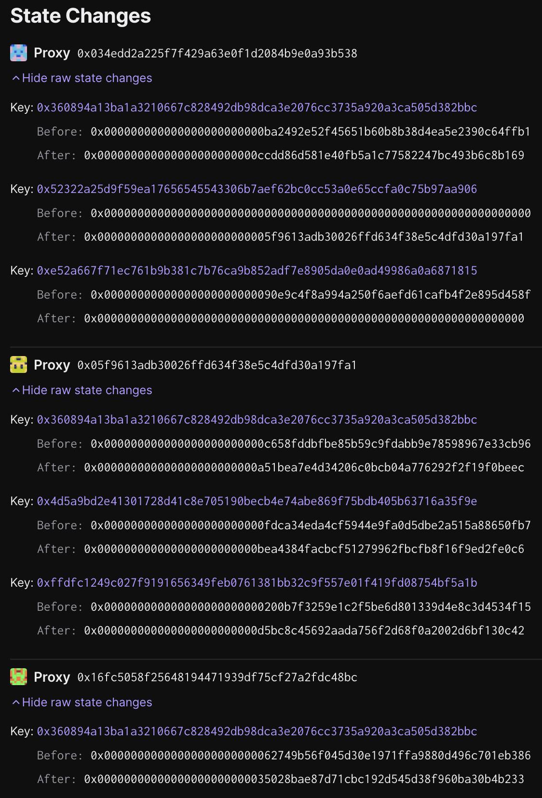

# OP Sepolia - `op-contracts/v1.4.0-rc.3` upgrade

Status: [EXECUTED](https://sepolia.etherscan.io/tx/0x13d97b5d7ad34fc6284bd75a023c9b12ac377ad94007d9870bce6815e0947da5)

## Objective

This upgrade updates the implementation of the `OptimismPortal`, `SystemConfig`, and `DisputeGameFactory` contracts with the latest versions, as well as the dispute games and their dependencies.

The batch will be executed on chain ID `11155111`, and contains `7` transactions.

## Tx #1: Upgrade `SystemConfig` to `StorageSetter` and clear legacy `L2OutputOracle` slot

Upgrades the `SystemConfig` proxy to the `StorageSetter` contract, and clears the legacy `L2OutputOracle` slot @ `keccak256("systemconfig.l2outputoracle")) - 1`.

**Function Signature:** `upgradeAndCall(address,address,bytes)`

**To:** `0x189aBAAaa82DfC015A588A7dbaD6F13b1D3485Bc`

**Value:** `0 WEI`

**Raw Input Data:** `0x9623609d000000000000000000000000034edd2a225f7f429a63e0f1d2084b9e0a93b53800000000000000000000000054f8076f4027e21a010b4b3900c86211dd2c2deb000000000000000000000000000000000000000000000000000000000000006000000000000000000000000000000000000000000000000000000000000000604e91db08e52a667f71ec761b9b381c7b76ca9b852adf7e8905da0e0ad49986a0a6871815000000000000000000000000000000000000000000000000000000000000000000000000000000000000000000000000000000000000000000000000`

### Inputs

**\_implementation:** `0x54F8076f4027e21A010b4B3900C86211Dd2C2DEB`

**\_data:** `0x4e91db08e52a667f71ec761b9b381c7b76ca9b852adf7e8905da0e0ad49986a0a6871815000000000000000000000000000000000000000000000000000000000000000000000000000000000000000000000000000000000000000000000000`

**\_proxy:** `0x034edD2A225f7f429A63E0f1D2084B9E0A93b538`

## Tx #2: Set `SystemConfig` `DISPUTE_GAME_FACTORY_SLOT`

Manually sets the `SystemConfig`'s `DISPUTE_GAME_FACTORY_SLOT` to the address of the `DisputeGameFactory` proxy.

**Function Signature:** `setAddress(bytes32,address)`

**To:** `0x034edD2A225f7f429A63E0f1D2084B9E0A93b538`

**Value:** `0 WEI`

**Raw Input Data:** `0xca446dd952322a25d9f59ea17656545543306b7aef62bc0cc53a0e65ccfa0c75b97aa90600000000000000000000000005f9613adb30026ffd634f38e5c4dfd30a197fa1`

### Inputs

**\_slot:** `0x52322a25d9f59ea17656545543306b7aef62bc0cc53a0e65ccfa0c75b97aa906`

**\_addr:** `0x05F9613aDB30026FFd634f38e5C4dFd30a197Fa1`

## Tx #3: Set final `SystemConfig` implementation

Upgrades the `SystemConfig` proxy to the final implementation, after the storage has been manually altered.

**Function Signature:** `upgrade(address,address)`

**To:** `0x189aBAAaa82DfC015A588A7dbaD6F13b1D3485Bc`

**Value:** `0 WEI`

**Raw Input Data:** `0x99a88ec4000000000000000000000000034edd2a225f7f429a63e0f1d2084b9e0a93b538000000000000000000000000ccdd86d581e40fb5a1c77582247bc493b6c8b169`

### Inputs

**\_implementation:** `0xCcdd86d581e40fb5a1C77582247BC493b6c8B169`

**\_proxy:** `0x034edD2A225f7f429A63E0f1D2084B9E0A93b538`

## Tx #4: Upgrade `OptimismPortal` proxy implementation

Upgrades the `OptimismPortal` proxy implementation to the latest version of the `OptimismPortal2` contract.

**Function Signature:** `upgrade(address,address)`

**To:** `0x189aBAAaa82DfC015A588A7dbaD6F13b1D3485Bc`

**Value:** `0 WEI`

**Raw Input Data:** `0x99a88ec400000000000000000000000016fc5058f25648194471939df75cf27a2fdc48bc00000000000000000000000035028bae87d71cbc192d545d38f960ba30b4b233`

### Inputs

**\_implementation:** `0x35028bAe87D71cbC192d545d38F960BA30B4B233`

**\_proxy:** `0x16Fc5058F25648194471939df75CF27A2fdC48BC`

## Tx #5: Upgrade `DisputeGameFactory` proxy implementation

Upgrades the `DisputeGameFactory` proxy implementation to the latest version of the `DisputeGameFactory` contract.

**Function Signature:** `upgrade(address,address)`

**To:** `0x189aBAAaa82DfC015A588A7dbaD6F13b1D3485Bc`

**Value:** `0 WEI`

**Raw Input Data:** `0x99a88ec400000000000000000000000005f9613adb30026ffd634f38e5c4dfd30a197fa1000000000000000000000000a51bea7e4d34206c0bcb04a776292f2f19f0beec`

### Inputs

**\_implementation:** `0xA51bea7E4d34206c0bCB04a776292F2f19F0BeEc`

**\_proxy:** `0x05F9613aDB30026FFd634f38e5C4dFd30a197Fa1`

## Tx #6: Upgrade `CANNON` game type implementation in `DisputeGameFactory`

Upgrades the `CANNON` gametype implementation in the `DisputeGameFactory` to the latest version of the `FaultDisputeGame`

**Function Signature:** `setImplementation(uint32,address)`

**To:** `0x05F9613aDB30026FFd634f38e5C4dFd30a197Fa1`

**Value:** `0 WEI`

**Raw Input Data:** `0x14f6b1a30000000000000000000000000000000000000000000000000000000000000000000000000000000000000000d5bc8c45692aada756f2d68f0a2002d6bf130c42`

### Inputs

**\_proxy:** `0xD5Bc8c45692aada756f2d68f0a2002d6Bf130C42`

**\_gameType:** `0`

## Tx #7: Upgrade `PERMISSIONED_CANNON` game type implementation in `DisputeGameFactory`

Upgrades the `PERMISSIONED_CANNON` gametype implementation in the `DisputeGameFactory` to the latest version of the `PermissionedDisputeGame`

**Function Signature:** `setImplementation(uint32,address)`

**To:** `0x05F9613aDB30026FFd634f38e5C4dFd30a197Fa1`

**Value:** `0 WEI`

**Raw Input Data:** `0x14f6b1a30000000000000000000000000000000000000000000000000000000000000001000000000000000000000000bea4384facbcf51279962fbcfb8f16f9ed2fe0c6`

### Inputs

**\_gameType:** `1`

**\_proxy:** `0xBEA4384faCBcf51279962fbCFb8f16F9eD2fe0C6`

## Signing and execution

Please see the signing and execution instructions in [NESTED.md](../../../NESTED.md).

### State Validations

The following state changes should be seen:

**[`0x05f9613adb30026ffd634f38e5c4dfd30a197fa1`][dgf-prox-etherscan] (The `DisputeGameFactory` proxy contract)**

- Key `0x360894a13ba1a3210667c828492db98dca3e2076cc3735a920a3ca505d382bbc`
  - Before: `0x000000000000000000000000c658fddbfbe85b59c9fdabb9e78598967e33cb96`
  - After: `0x000000000000000000000000a51bea7e4d34206c0bcb04a776292f2f19f0beec`
  - Meaning: The implementation of the `DisputeGameFactory` proxy has been upgraded to `0xA51bea7E4d34206c0bCB04a776292F2f19F0BeEc`
- Key `0x4d5a9bd2e41301728d41c8e705190becb4e74abe869f75bdb405b63716a35f9e`
  - Before: `0x000000000000000000000000fdca34eda4cf5944e9fa0d5dbe2a515a88650fb7`
  - After: `0x000000000000000000000000bea4384facbcf51279962fbcfb8f16f9ed2fe0c6`
  - Meaning: The implementation of the `PermissionedDisputeGame` has been upgraded to `0xBEA4384faCBcf51279962fbCFb8f16F9eD2fe0C6`
- Key `0xffdfc1249c027f9191656349feb0761381bb32c9f557e01f419fd08754bf5a1b`
  - Before: `0x000000000000000000000000200b7f3259e1c2f5be6d801339d4e8c3d4534f15`
  - After: `0x000000000000000000000000d5bc8c45692aada756f2d68f0a2002d6bf130c42`
  - Meaning: The implementation of the `FaultDisputeGame` has been upgraded to `0xD5Bc8c45692aada756f2d68f0a2002d6Bf130C42`

**[`0x034edd2a225f7f429a63e0f1d2084b9e0a93b538`][sys-cfg-prox-etherscan] (The `SystemConfig` proxy contract)**

- Key `0x360894a13ba1a3210667c828492db98dca3e2076cc3735a920a3ca505d382bbc`
  - Before: `0x000000000000000000000000ba2492e52f45651b60b8b38d4ea5e2390c64ffb1`
  - After: `0x000000000000000000000000ccdd86d581e40fb5a1c77582247bc493b6c8b169`
  - Meaning: The implementation of the `SystemConfig` proxy has been upgraded to `0xCcdd86d581e40fb5a1C77582247BC493b6c8B169`
- Key `0x52322a25d9f59ea17656545543306b7aef62bc0cc53a0e65ccfa0c75b97aa906`
  - Before: `0x0000000000000000000000000000000000000000000000000000000000000000`
  - After: `0x00000000000000000000000005f9613adb30026ffd634f38e5c4dfd30a197fa1`
  - Meaning: The `DISPUTE_GAME_FACTORY_SLOT` has been set to the address of the `DisputeGameFactory` proxy.
- Key `0xe52a667f71ec761b9b381c7b76ca9b852adf7e8905da0e0ad49986a0a6871815`
  - Before: `0x00000000000000000000000090e9c4f8a994a250f6aefd61cafb4f2e895d458f`
  - After: `0x0000000000000000000000000000000000000000000000000000000000000000`
  - Meaning: The `L2_OUTPUT_ORACLE_SLOT` has been cleared, as the getter has been deleted.

**[`0x16Fc5058F25648194471939df75CF27A2fdC48BC`][portal-prox-etherscan] (The `OptimismPortal` proxy contract)**

The transaction should only result in one changed storage slot in the `OptimismPortal` proxy contract:

- Key `0x360894a13ba1a3210667c828492db98dca3e2076cc3735a920a3ca505d382bbc`
  - Before: `0x00000000000000000000000062749b56f045d30e1971ffa9880d496c701eb386`
  - After: `0x00000000000000000000000035028bae87d71cbc192d545d38f960ba30b4b233`
  - Meaning: EIP-1967 Implementation slot, updated to the new `OptimismPortal2` implementation address.

[safe-etherscan]: https://sepolia.etherscan.io/address/0xDEe57160aAfCF04c34C887B5962D0a69676d3C8B
[dgf-prox-etherscan]: https://sepolia.etherscan.io/address/0x05f9613adb30026ffd634f38e5c4dfd30a197fa1
[sys-cfg-prox-etherscan]: https://sepolia.etherscan.io/address/0x034edD2A225f7f429A63E0f1D2084B9E0A93b538
[portal-prox-etherscan]: https://sepolia.etherscan.io/address/0x16Fc5058F25648194471939df75CF27A2fdC48BC
[upgrade-safe-etherscan]: https://sepolia.etherscan.io/address/0x1Eb2fFc903729a0F03966B917003800b145F56E2
[mock-council-safe-etherscan]: https://sepolia.etherscan.io/address/0xf64bc17485f0B4Ea5F06A96514182FC4cB561977
[mock-fnd-safe-etherscan]: https://sepolia.etherscan.io/address/0xDEe57160aAfCF04c34C887B5962D0a69676d3C8B
