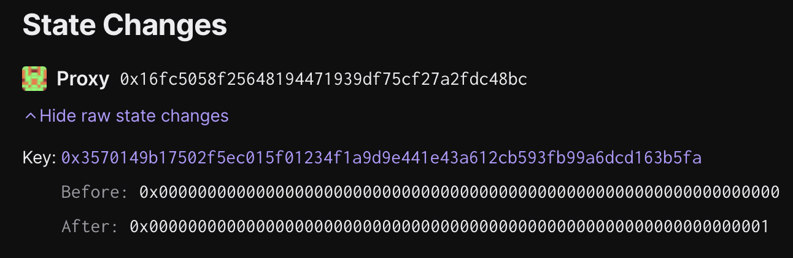

# Deputy Guardian - Blacklist Dispute Game

## Objective

This task executes a `blacklistDisputeGame` operation in the `OptimismPortal` on behalf of the `Guardian` role. Blacklisting the dispute game prevents any withdrawals proven to be contained within the game's proposed output root from being finalized.

The batch will be executed on chain ID `11155111`, and contains `1` transactions.

## Tx #1: Blacklist Dispute Game

Executes the `blacklistDisputeGame` call to the `OptimismPortal` proxy

**Function Signature:** `blacklistDisputeGame(address,address)`

**To:** `0x4220C5deD9dC2C8a8366e684B098094790C72d3c`

**Value:** `0 WEI`

**Raw Input Data:** `0x629cdd4900000000000000000000000016fc5058f25648194471939df75cf27a2fdc48bc000000000000000000000000<blacklisted----game>`

### Inputs

**\_portal:** `0x16Fc5058F25648194471939df75CF27A2fdC48BC`

**\_game:** `<user-input>`

## Preparing the Operation

1. Locate the address of the dispute game that the `Guardian` wishes to blacklist.

1. Generate the batch with `just generate-input <address>`.

1. Collect signatures for the action.

1. Execute the action.

## Signing and execution

Please see the signing and execution instructions in [SINGLE.md](../../../../SINGLE.md).

### State Validations

The only state modification that is made by this action is an update to a storage slot within the `disputeGameBlacklist`
mapping in the `OptimismPortal2` proxy. It should look something like this:



To check the validity of the slot that was changed, the `cast index` utility can be used to compute the storage slot
that will be used for the address being blacklisted in the `disputeGameBlacklist` mapping:

```sh
export PORTAL_BLACKLIST_MAP_SLOT="58"
export BLACKLISTED_ADDRESS="<blacklisted-address>"
cast index \
    address \
    $BLACKLISTED_ADDRESS \
    $PORTAL_BLACKLIST_MAP_SLOT
```
