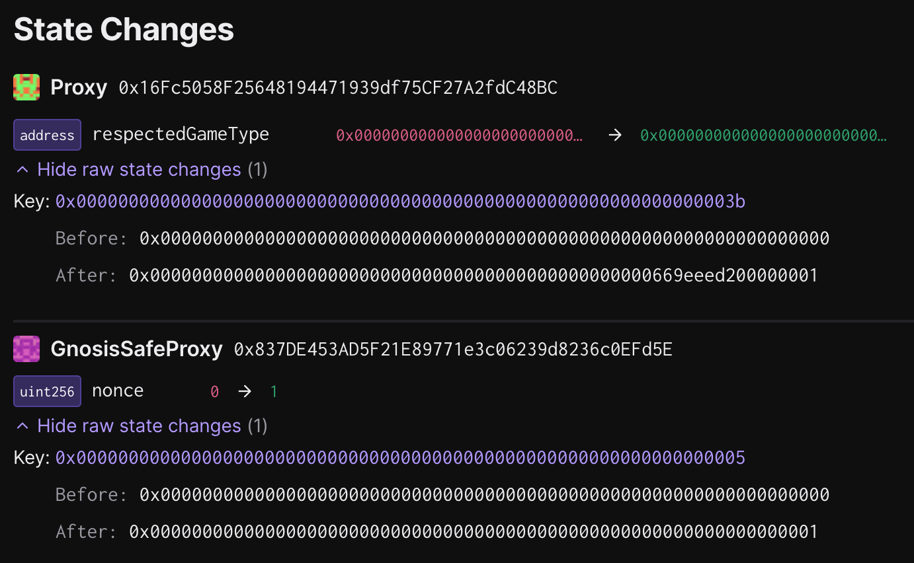

# Deputy Guardian - Fall back to `PermissionedDisputeGame`

This batch udates the `respectedGameType` to `PERMISSIONED_CANNON` in the `OptimismPortal`. This action requires all in-progress withdrawals to be re-proven against a new `PermissionedDisputeGame` that was created after this update occurs.

The batch will be executed on chain ID `11155111`, and contains `1` transactions.

## Tx #1: Update `respectedGameType` in the `OptimismPortal`

Updates the `respectedGameType` to `PERMISSIONED_CANNON` in the `OptimismPortal`, enabling permissioned proposals and challenging.

**Function Signature:** `setRespectedGameType(address,uint32)`

**To:** `0x4220C5deD9dC2C8a8366e684B098094790C72d3c`

**Value:** `0 WEI`

**Raw Input Data:** `0xa1155ed900000000000000000000000016fc5058f25648194471939df75cf27a2fdc48bc0000000000000000000000000000000000000000000000000000000000000001`

### Inputs

**\_gameType:** `1` (`PERMISSIONED_CANNON`)

**\_portal:** `0x16Fc5058F25648194471939df75CF27A2fdC48BC`

## Preparing the Operation

1. Collect signatures and execute the action according to the instructions in [SINGLE.md](../../../../SINGLE.md).

### State Validations

The only state modification that is made by this action is an update to the shared slot between the `respectedGameType`
and `respectedGameTypeUpdatedAt` variables:



Slot [`0x000000000000000000000000000000000000000000000000000000000000003b`](https://github.com/ethereum-optimism/optimism/blob/op-contracts/v1.4.0-rc.4/packages/contracts-bedrock/snapshots/storageLayout/OptimismPortal2.json#L100C3-L113C5) in the `OptimismPortal` proxy has the following packed layout:

| Offset     | Description                                                  |
| ---------- | ------------------------------------------------------------ |
| `[0, 20)`  | Unused; Should be zero'd out.                                |
| `[20, 28)` | `respectedGameTypeUpdatedAt` timestamp (64 bits, big-endian) |
| `[28, 32)` | `respectedGameType` (32 bits, big-endian)                    |

Note that the offsets in the above table refer to the slot value's big-endian representation. You can compute the offset values with chisel:
```
➜ uint256 x = 0x00000000000000000000000000000000000000000000000066302da900000001
➜ uint64 respectedGameTypeUpdatedAt = uint64(x >> 32)
➜ respectedGameTypeUpdatedAt
Type: uint64
├ Hex: 0x0000000066302da9
├ Hex (full word): 0x0000000000000000000000000000000000000000000000000000000066302da9
└ Decimal: 1714433449
➜ uint32 respectedGameType = uint32(x & 0xFFFFFFFF)
➜ respectedGameType
Type: uint32
├ Hex: 0x00000001
├ Hex (full word): 0x0000000000000000000000000000000000000000000000000000000000000001
└ Decimal: 1
```

To verify the diff:

1. Check that the only modification to state belongs to the `OptimismPortal` proxy at slot `0x000000000000000000000000000000000000000000000000000000000000003b`
1. Check that the lower 4 bytes equal `1` (`PERMISSIONED_CANNON`) when read as a big-endian 32-bit uint.
1. Check that bytes `[20, 28]` equal the timestamp of the transaction's submission when read as a big-endian 64-bit uint.
