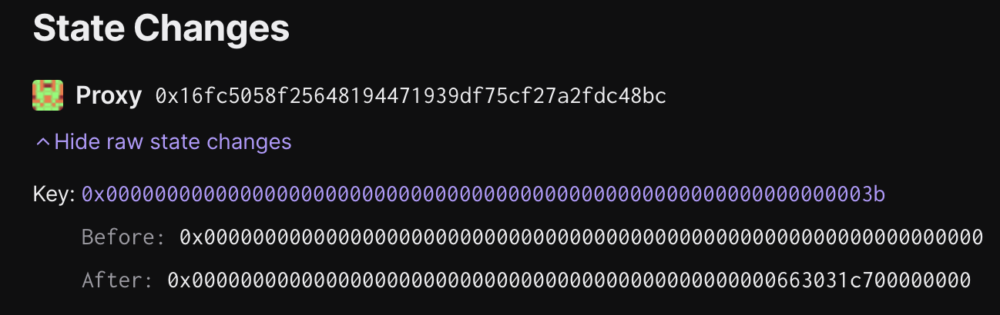

# Guardian - Enable Permissioness Dispute Game task

## Objective

This task updates the `respectedGameType` in the `OptimismPortal` to `CANNON`, enabling users to permissionlessly propose outputs as well as for anyone to participate in the dispute of these proposals. This action requires all in-progress withdrawals to be re-proven against a new `FaultDisputeGame` that was created after this update occurs.

The batch will be executed on chain ID `11155111`, and contains `1` transactions.

### Tx #1: Update `respectedGameType` in the `OptimismPortal`

Updates the `respectedGameType` to `CANNON` in the `OptimismPortal`, enabling permissionless proposals and challenging.

**Function Signature:** `setRespectedGameType(uint32)`

**To:** `0x16Fc5058F25648194471939df75CF27A2fdC48BC`

**Value:** `0 WEI`

**Raw Input Data:** `0x7fc485040000000000000000000000000000000000000000000000000000000000000000`

#### Inputs

`_gameType`: `0`

## Preparing the Operation

1. Collect signatures for the action.

1. Execute the action.

## Signing and execution

Please see the signing and execution instructions in [SINGLE.md](../../../../SINGLE.md).

### State Validations

The only state modification that is made by this action is an update to the shared slot between the `respectedGameType`
and `respectedGameTypeUpdatedAt` variables:

Slot `0x000000000000000000000000000000000000000000000000000000000000003b` in the `OptimismPortal` proxy has the following packed layout:

| Offset     | Description                                                  |
| ---------- | ------------------------------------------------------------ |
| `[0, 20)`  | Unused; Should be zero'd out.                                |
| `[20, 28)` | `respectedGameTypeUpdatedAt` timestamp (64 bits, big-endian) |
| `[28, 32)` | `respectedGameType` (32 bits, big-endian)                    |

To verify the diff:

1. Check that the only modification to state belongs to the `OptimismPortal` proxy at slot `0x000000000000000000000000000000000000000000000000000000000000003b`
1. Check that the lower 4 bytes equal `0` (`CANNON`) when read as a big-endian 32-bit uint.
1. Check that bytes `[20, 28]` equal the timestamp of the transaction's submission when read as a big-endian 64-bit uint.
